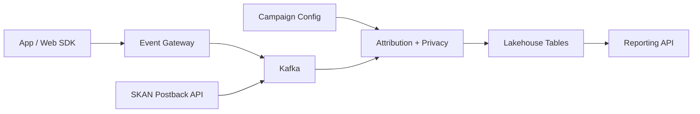

```markdown
---
title: "Attribution Measurement System"
category: "Strategic Problems"
difficulty: "Hard"
tags: ["ads", "attribution", "privacy", "skadnetwork", "data-pipeline", "analytics"]
---

## Overview

This system measures ad performance by correlating clicks with conversions while respecting platform privacy constraints modeled after Apple’s SKAdNetwork (delayed, lossy, and explicitly anti-user-level attribution). The elegant move is to stop fighting that constraint: we treat *aggregate truth* as the product, and we build a pipeline whose “unit of work” is a privacy-safe cohort (campaign × time bucket × coarse geo × placement), not a user.

The architecture is a boring event pipeline (Kafka → stream processing → lakehouse → SQL) wrapped in a strict “privacy firewall”: raw events are ingested for debugging and model calibration, but only thresholded/noised aggregates ever become queryable metrics. This keeps the system operable by a small team and makes privacy guarantees enforceable in code, not policy docs.

## What Makes This Hard

Naive implementations try to reconstruct per-user journeys (click-id joins, device graphs, fingerprinting). That fails under SKAdNetwork-like constraints because the signal is delayed, sparse, and intentionally ambiguous—and attempts to “fill in the gaps” reliably drift into privacy violations.

The real trap is metric volatility: late postbacks and changing campaign metadata produce retroactive attribution shifts. Teams ship dashboards that rewrite history hourly, lose trust, and then bolt on more complexity. The correct approach is to design *time semantics* (event time vs processing time), *immutability*, and *controlled recomputation* from day one.

## Requirements

### Functional Requirements
- Ingest three immutable streams: `click`, `conversion`, and `platform_postback` (SKAN-like).
- Attribute conversions to campaigns at cohort granularity; no user-level reporting.
- Support dimensions that don’t enable fingerprinting: campaign/adset/creative, day, coarse geo, placement, device class.
- Enforce privacy constraints in the reporting path: k-anonymity thresholds, suppression, and calibrated noise.
- Handle late and duplicated postbacks deterministically; support reproducible backfills.
- Provide advertiser-facing metrics with stable revision semantics (explicit “data finalized” markers).

### Scale Targets
- **Ingest:** 1B clicks/day (~12k/s avg, 120k/s peak), 50M conversions/day, 30M postbacks/day.
- **Freshness:** preliminary aggregates in <15 minutes; daily “final” aggregates within 24–48 hours to absorb platform delays.
- **Cardinality:** up to 5M active campaigns/month; reporting granularity capped to keep cohorts large (privacy) and queries fast (cost).
- **Queries:** 200 QPS peak on reporting API, 1–5s p95 for common dashboards.

## Key Design Decisions

- **We chose:** Cohort-based attribution as the primary product (aggregate metrics only).
  - **We rejected:** User-level joins with click IDs as the “source of truth”.
  - **Why:** It aligns with SKAN-like constraints, makes privacy enforceable, and avoids a permanent whack-a-mole with fingerprinting vectors.

- **We chose:** An immutable log + recomputation model (append-only raw, derived aggregates rebuilt by version).
  - **We rejected:** Mutable “running totals” updated in place.
  - **Why:** Late postbacks are normal; recomputation gives correctness and auditability without corrupting state.

- **We chose:** A hard “privacy firewall” service that is the only path from raw data to queryable metrics.
  - **We rejected:** Letting every analyst/job “remember to apply” thresholds/noise.
  - **Why:** Privacy guarantees must be centralized, testable, and reviewable like any other critical business logic.

## Architecture



### Components

- **App / Web SDK**: Emits clicks and conversions where allowed; strictly avoids stable device identifiers in privacy-restricted contexts.
- **Event Gateway**: Authenticates sources, enforces schemas, assigns event-time, and writes to Kafka; this is the “front door” for data quality.
- **SKAN Postback API**: Receives platform postbacks (signed payloads), validates signatures, deduplicates by postback ID, and normalizes into the same event model.
- **Kafka**: Buffering and backpressure so ingestion survives spikes and downstream deploys.
- **Campaign Config**: Postgres for campaign metadata and time-versioned mappings (campaign ↔ adset ↔ creative ↔ placements), because attribution depends on *what was true at the time*.
- **Attribution + Privacy**: A Flink job (or equivalent) that performs cohort attribution, applies k-anonymity + noise, and emits versioned aggregates.
- **Lakehouse Tables**: Object storage + Iceberg/Parquet for immutable raw + derived datasets; supports cheap backfills and consistent query behavior.
- **Reporting API**: Serves only privacy-cleared aggregates, with explicit dataset versioning and “finalized through date” watermarks.

## Deep Dive: Privacy-Preserving Attribution Under SKAN-Like Constraints

The hardest part is turning delayed, lossy postbacks into stable metrics *without reintroducing user identity*. The system treats every incoming signal as an update to a cohort-level ledger.

1) **Time semantics and stabilization**
- Every record carries `event_time` (when it happened) and `ingest_time` (when we learned about it).
- Aggregates are computed in event-time windows (e.g., per UTC day) and published as *versioned snapshots*.
- The Reporting API exposes two states: `preliminary` (fast, may change) and `final` (frozen after the postback delay horizon). This prevents “rewriting history” from looking like bugs.

2) **Attribution logic that matches the privacy model**
- For SKAN-like postbacks, attribution is already platform-decided (campaign ID + coarse metadata + conversion value). We do not attempt to “improve” it.
- For non-SKAN clicks/conversions, we still collapse into the same cohort keys and apply the same privacy rules, so the product behaves consistently across channels.

3) **Privacy firewall: k-anonymity + noise**
- The firewall defines the maximum reporting granularity (e.g., `campaign_id, day, country, placement`) and rejects queries/exports outside it.
- Before publishing an aggregate row, we enforce `k` (e.g., 50 conversions) per cohort. Below `k`, we suppress and roll up to a coarser cohort (e.g., remove placement, then geo).
- After thresholding, we add calibrated noise (Laplace/Gaussian) to counts and value metrics at publish time, tracked by a privacy ledger per dimension set. This blocks differencing attacks across repeated pulls.

4) **Deduplication and idempotency**
- SKAN-like postbacks are deduped using platform-provided unique IDs + signature validation; duplicates become no-ops.
- All derived tables are written with deterministic keys (`cohort_key`, `day`, `metric`, `version`) so backfills are repeatable and safe.

This approach teaches a non-obvious lesson: under strong privacy constraints, the “correctness” you can deliver is mostly about *time/version semantics and attack-resistant aggregation*, not about clever matching.

## Trade-offs

| Optimized For | Sacrificed |
|--------------|------------|
| Enforceable privacy guarantees | User-level attribution and path analysis |
| Stable, auditable metrics | Real-time “perfect” numbers |
| Simple, operable pipeline | Maximum granularity in reporting |
| Deterministic recomputation | Some additional storage/compute cost |

## Failure Modes

- **Late postback surge**
  - **What happens:** Yesterday’s numbers jump; dashboards look inconsistent.
  - **Detect:** Monitor “delta to prior publish” per cohort/day and the share of late-arriving postbacks.
  - **Recover:** Keep preliminary vs final separation, publish daily finalized snapshots, and expose “finalized through” watermark.

- **Config drift (campaign mapping changed retroactively)**
  - **What happens:** Attribution appears to move between campaigns/adsets after edits.
  - **Detect:** Validate config changes as time-versioned; alert on retroactive edits beyond an allowed window.
  - **Recover:** Treat config as immutable by effective date; rebuild aggregates for impacted windows with a new version and keep prior versions for audit.

- **Privacy leakage via small cohorts**
  - **What happens:** An advertiser infers user actions by slicing thinly or differencing pulls.
  - **Detect:** Enforce query shape limits; log and rate-limit repeated near-identical queries; track privacy budget consumption.
  - **Recover:** Force roll-ups, increase `k`, add more noise, and freeze cohorts that repeatedly hit the threshold boundary.

## What I’d Do Differently At...

- **10x scale:** Move more aggregation upstream (stream-only for daily cohorts), keep raw in cheaper storage tiers, and partition Iceberg tables aggressively by day and campaign hash to control query cost.
- **100x scale:** Split ingestion domains (SKAN vs non-SKAN), introduce dedicated “metrics serving” storage (precomputed cubes keyed by allowed dimensions), and formalize a privacy budget service with automated enforcement and reviewer workflows.

## Operational Notes

- The only supported metric source for external consumers is the privacy-cleared aggregate tables; raw is restricted to a break-glass path with audit logging.
- Expect postback delays to dominate correctness; publish explicit SLAs: “preliminary updates every 15 min, final after 48h”.
- Backfills are normal: run them as versioned rebuilds, never in-place edits; the Reporting API must allow selecting “latest” or a pinned version for reproducibility.
- Monitor schema drift and event loss at the gateway (drop rates, invalid signatures, unexpected nulls) before they become “mystery revenue drops” in dashboards.
```