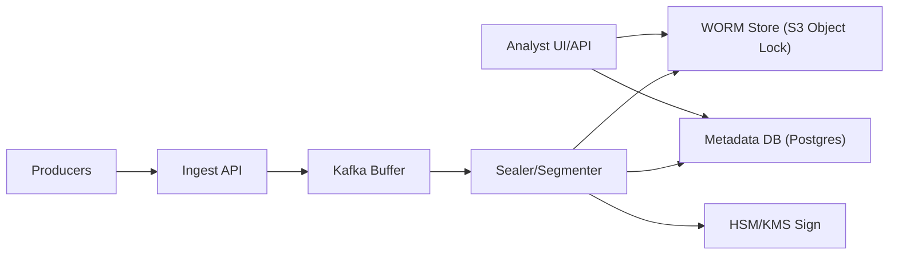

```markdown
---
title: "Audit Trail System"
category: "Security & Access Control"
difficulty: "Hard"
tags: [security, compliance, audit, worm, tamper-evident, merkle-tree, hsm, s3-object-lock, kafka]
---

## Overview

This system produces a tamper-evident audit trail for compliance and forensics: once an event is accepted, it becomes practically impossible to delete or rewrite without leaving cryptographic evidence. The key insight is to separate the **authoritative record** (immutable WORM segments + signed checkpoints) from the **convenience layer** (query index) and make the latter fully rebuildable.

Elegance comes from solving the real problem—**insider and administrative tampering**—with two simple primitives: (1) WORM object storage for immutability and (2) chained, signed checkpoints for integrity and ordering. Everything else (ingestion, buffering, indexing) uses boring components sized for normal traffic, not peak.

## What Makes This Hard

Naive designs assume “append-only database table” equals immutability. It doesn’t: a privileged operator can backfill, update, or delete rows; backups can be manipulated; clocks can be skewed; and “audit logs” often log themselves inconsistently (missing causal ordering across services).

The trap is focusing on storage durability instead of **tamper evidence** and **independent verifiability**. Compliance reviewers care less that logs exist and more that you can prove they weren’t altered—even by your own admins—months later.

## Requirements

### Functional Requirements
- **Tamper-evidence with verifiable ordering:** prove no deletions, no rewrites, and no undetected inserts within a time window.
- **WORM retention enforcement:** records must be non-deletable/non-overwritable for a fixed retention period (e.g., 7 years).
- **Queryable for investigations:** fast lookup by actor/resource/time, but query index is not authoritative.
- **Multi-tenant and scoped access:** investigators can only query permitted tenants/cases; producers can only append.
- **Cryptographic verification toolchain:** auditors can verify integrity offline from exported segments + checkpoints.

### Scale Targets
- **Ingest:** 5k events/sec average, 20k events/sec peak (burst absorption matters more than steady-state).
- **Event size:** ~0.5–2 KB typical (structured JSON + context).
- **Retention:** 7 years → at 5k/sec * 1 KB ≈ 432 GB/day raw; compression + segmenting reduces storage cost, but retention lock makes mistakes expensive.
- **Query:** investigations are spiky; optimize for “hours of logs in seconds,” not global full-text search.

## Key Design Decisions

- **We chose: WORM object storage (S3 Object Lock in Compliance mode) as the source of truth**
  - Rejected: “append-only” tables in Postgres/ClickHouse as authoritative storage
  - Why: databases are administrable; WORM retention lock creates a different class of guarantee that survives operator error and malice.

- **We chose: segmented log + chained, signed checkpoints (Merkle root + prev-hash)**
  - Rejected: signing each event individually
  - Why: per-event signatures are expensive and operationally noisy; segment-level sealing gives strong guarantees with predictable cost and easy verification.

- **We chose: query index as a rebuildable derivative**
  - Rejected: coupling ingestion and investigation queries to the same datastore
  - Why: the index will be reindexed, migrated, or corrupted; the audit record must remain simple, immutable, and independently verifiable.

## Architecture



### Components

- **Producers (SDK/agent)**: signs requests and attaches required context (tenant, actor, request-id). Keeps producers simple; the server provides the tamper-evidence.
- **Ingest API**: authenticates producers, normalizes schema, enforces required fields, and applies backpressure. It never serves reads (reduces blast radius).
- **Kafka Buffer**: absorbs spikes and partitions by tenant (or tenant+day) to preserve ordering where it matters and keep sealers horizontally scalable.
- **Sealer/Segmenter**: the “truth machine.” It batches events into segments, computes Merkle roots, chains checkpoints, and writes immutable artifacts.
- **HSM/KMS Sign**: holds signing keys with strict access controls and audit separation; sealers can request signatures but operators cannot exfiltrate keys.
- **WORM Store (S3 Object Lock)**: stores segments and checkpoint manifests under retention lock; this is the authoritative record.
- **Metadata DB (Postgres)**: stores pointers (segment ids, time ranges, tenants, checkpoint ids) to enable fast discovery; it is not trusted for integrity.
- **Analyst UI/API**: queries by time/actor/resource, fetches segments from WORM, and verifies proofs on demand (and in scheduled jobs).

## Deep Dive: Tamper Evidence That Survives Admins

**Goal:** make any modification detectable, even if someone has production credentials to databases and services.

**1) Segmenting and Merkle construction**
- Events are appended to an in-memory batch by partition (e.g., tenant + 5-minute window).
- When a segment closes (size threshold like 128 MB compressed or time threshold like 1 minute), compute:
  - `leaf_i = SHA256(canonical_json(event_i))`
  - `merkle_root = Merkle(leaf_1..leaf_n)`
- Store the segment payload (compressed events) plus a small **manifest** containing:
  - segment id, tenant, start/end timestamps, event count
  - `merkle_root`
  - `prev_checkpoint_hash` (hash chain to previous sealed segment for that partition)
  - content hash of the segment blob (guards against storage-layer corruption)

**2) Signed checkpoints (the real integrity guarantee)**
- Compute `checkpoint_hash = SHA256(manifest_bytes)`
- Ask **HSM/KMS** to sign `checkpoint_hash` (e.g., ECDSA P-256).
- Optionally (recommended for high-assurance compliance): obtain an **RFC 3161 timestamp** for `checkpoint_hash` from a TSA in a different trust domain. This prevents “rewriting history” by backdating.

**3) Write path to WORM**
- Write the segment blob and manifest to S3 with Object Lock retention (Compliance mode).
- The retention policy is enforced at the storage layer; overwrites are impossible, deletions are blocked until expiry.

**4) Verification model**
To verify a time range for a tenant:
- Fetch manifests (by time pointer from Postgres, but treat it as a hint).
- Validate: signature with public key, hash chain continuity (`prev_checkpoint_hash`), and TSA timestamp monotonicity.
- For a specific event claim, compute its leaf and verify inclusion via a Merkle proof (either stored per segment or recomputed from the segment payload).

**Why this works:** an attacker must now break (a) WORM retention controls and (b) HSM-protected signing history (and ideally (c) TSA anchoring). That’s a qualitatively harder problem than “db admin ran DELETE.”

## Trade-offs

| Optimized For | Sacrificed |
|--------------|------------|
| Strong tamper evidence with simple primitives | Real-time query flexibility on the authoritative store |
| Independence from mutable databases | Slightly higher read latency (fetch segments from object storage) |
| Operational clarity (few moving parts) | More work in verification tooling and procedures |
| Burst tolerance via queue | Eventual availability of segments (seconds to minutes) |

## Failure Modes

- **Kafka backlog / sealer lag**
  - Happens: segments seal late; investigations see delayed completeness.
  - Detect: consumer lag alarms per partition; “checkpoint gap” SLO (expected checkpoint cadence).
  - Recover: autoscale sealers; temporarily increase segment duration; preserve ordering per tenant partition.

- **Misconfigured retention / lock not actually enforced**
  - Happens: you think it’s WORM, but deletes/overwrites are possible.
  - Detect: continuous control checks (API verifies bucket has Compliance mode + retention; attempt-delete canary objects).
  - Recover: stop ingestion, fix policy, rotate bucket/account if needed; document exposure window (this is an incident).

- **Signing key compromise / misuse**
  - Happens: attacker can sign forged checkpoints (worst case).
  - Detect: HSM audit logs + alerting on unusual signing rates/clients; periodic key-attestation checks.
  - Recover: revoke key, rotate to new key id, publish key-rotation checkpoint, and require dual-control to enable signing.

## What I'd Do Differently At...

- **10x scale:** increase Kafka partitions, run multiple sealers per tenant shard, and write larger segments (reduce S3 PUT cost); keep the same integrity model.
- **100x scale:** split hot investigation workloads into a dedicated analytics store (e.g., ClickHouse) fed from sealed segments; treat it as disposable and rebuildable, keep WORM + checkpoints unchanged.

## Operational Notes

- **Object Lock is one-way:** treat retention config as a production change with approvals; you can extend retention easily, shortening it is effectively impossible.
- **Run continuous verification:** scheduled jobs re-verify signatures and chain continuity; alert on missing checkpoints, not just service health.
- **Separate duties:** operators who deploy services should not control retention policies and signing keys; use separate cloud accounts and strong SCP/organizational controls.
- **Index is not evidence:** any investigation export should include the relevant manifests + verification output so results stand without trusting Postgres.
```