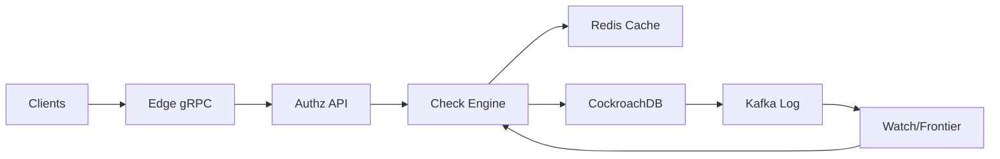

```markdown
---
title: "Authorization Service (Zanzibar-style)"
category: "Security & Access Control"
difficulty: "Hard"
tags: ["authorization", "rebac", "zanzibar", "global", "low-latency", "consistency"]
---

## Overview

This system is a global relationship-based access control (ReBAC) service in the Zanzibar family: you write relationship tuples (e.g., `doc:123#viewer@user:7`) and query whether a principal has a permission on an object. The elegance comes from treating authorization like a *versioned database query problem*, not a distributed caching problem: every check runs against a well-defined **authorization revision** (a consistent snapshot), and caches become safe because they’re keyed by revision.

The key insight is a simple contract: **writes mint a new revision token; reads declare the minimum revision they require**. That single mechanism solves the two traps that make most authz services fail in production—stale decisions after writes, and cache invalidation chaos—without requiring global locks, custom consensus, or “best effort” semantics that leak into product behavior.

Everything else is deliberately boring: a small stateless API tier, a query engine with aggressive memoization, a tuple store with MVCC, and an append-only change stream to drive invalidation and replication observability.

## What Makes This Hard

Naive implementations optimize the wrong thing: they build fast graph traversal, then bolt on caching, then discover that *correct invalidation* is harder than authorization itself. The trap is subtle: permission checks are read-heavy and latency-sensitive, so you cache; but writes must take effect quickly and globally, so caches must invalidate; and once you add multi-region, you’ve built a distributed consistency system by accident.

The second trap is that ReBAC graphs amplify worst cases. A single permission can expand into many edges through groups/roles/nesting. Without strict query limits, cycle handling, and memoization, one pathological object turns into a thundering herd on storage and takes down your authz service—which then takes down every downstream service that depends on it.

## Requirements

### Functional Requirements
- **Tuple writes**: create/delete relationships with idempotency.
- **Schema (model) management**: define types/relations/permissions (computed usersets, unions, intersections, exclusions) with safe rollout.
- **Permission checks**: `Check(subject, permission, object)` returns allow/deny at low latency.
- **Bulk checks**: evaluate many `(subject, object)` pairs efficiently (critical for listing pages).
- **Lookup**:
  - `LookupResources(subject, permission, resourceType)` (e.g., “docs I can view”).
  - `LookupSubjects(object, permission, subjectType)` (e.g., “who can edit this doc”).
- **Watch**: stream tuple changes by revision for cache invalidation, replication verification, and debugging.
- **Consistency controls**:
  - Default: low-latency reads at a stable “safe” revision.
  - Optional: client supplies a minimum revision for read-your-writes and monotonic reads.

### Scale Targets
- **Tuples**: 100M active tuples (enough to force real indexing and storage decisions).
- **Read QPS**: 50k checks/s globally, p95 ≤ 15ms at region-local edge.
- **Write QPS**: 2k tuple writes/s globally with p99 commit ≤ 100ms.
- **Fanout**: typical check touches 10–200 tuples; worst-case bounded by hard limits.
- **Tenancy**: 10k tenants, with isolation for noisy neighbors (quotas + shard routing).

These numbers matter because they force: (1) cache correctness under high read load, (2) strict evaluation limits to prevent graph explosions, and (3) multi-region latency strategy that doesn’t depend on “invalidate everything fast enough”.

## Key Design Decisions

- **Decision 1: MVCC tuple store + revision tokens**
  - **Chose:** CockroachDB as the tuple store (serializable transactions, MVCC, multi-region, operationally proven).
  - **Rejected:** DynamoDB-only + global tables (latency is fine; correctness under multi-region read-your-writes becomes policy leakage), and “custom KV + consensus” (complexity theater).
  - **Why:** Zanzibar-style authz needs a first-class notion of *consistent snapshot*. MVCC gives revisions almost for free; tokens make consistency explicit and debuggable.

- **Decision 2: Revision-keyed caching (not invalidation-by-guessing)**
  - **Chose:** in-process memoization + Redis for shared cache, both keyed by `(tenant, revision, subproblem)`.
  - **Rejected:** time-based TTL-only caching and “invalidate on write” as the primary correctness mechanism.
  - **Why:** TTLs turn correctness into luck. Revision keys make stale answers impossible by construction; invalidation becomes a cost optimization, not a correctness requirement.

- **Decision 3: Default reads at a “stable” revision frontier**
  - **Chose:** serve checks by default at the latest **stable revision** per region (a bounded-lag snapshot), with opt-in minimum revision for strictness.
  - **Rejected:** “always read latest committed globally” (multi-region tail latency tax) and “eventual by default with no token” (debugging nightmare).
  - **Why:** most product flows tolerate sub-second propagation, but some flows (post-share confirmation) need read-your-writes. One API supports both without punishing every request.

## Architecture



### Components

- **Edge gRPC**
  - Terminates TLS, enforces authn, rate limits by tenant, and attaches caller identity and requested consistency mode.
  - Keeps the authz API stateless and horizontally scalable.

- **Authz API**
  - Implements `WriteTuples`, `Check`, `BulkCheck`, `Lookup*`, `ReadSchema`, `WriteSchema`, `Watch`.
  - Owns request shaping: max depth, max expansions, time budgets, and per-tenant quotas.

- **Check Engine**
  - Compiles schema to an executable plan and evaluates requests as a graph query.
  - Uses aggressive memoization and batched storage reads; it never “walks edges one at a time” over the network.

- **Redis Cache**
  - Shared cache for common subproblems (e.g., group membership expansions) keyed by revision.
  - Treated as a performance layer; correctness does not depend on it.

- **CockroachDB (Tuple + Schema Store)**
  - Source of truth for tuples and schema versions.
  - MVCC timestamps act as authorization revisions; transactions mint new revisions on write.

- **Kafka Log**
  - Append-only stream of tuple mutations `(tenant, revision, changes...)`.
  - Powers watch, cache invalidation hints, replication observability, and forensic debugging.

- **Watch/Frontier**
  - Maintains per-tenant regional “stable revision” (a frontier that is known to be present and queryable locally).
  - Feeds the check engine the default revision to use for low-latency reads.

## Deep Dive: Consistent, Low-Latency Checks (Revisions + Frontier)

The hardest part is making checks fast *and* correct after writes across regions. The design hinges on three related mechanisms:

1) **Revision tokens are the contract.**  
Every tuple write transaction commits at a specific MVCC timestamp (the revision). The API returns that revision token to the caller. Reads accept `min_revision`; the service guarantees the snapshot it uses is `>= min_revision`. This makes “read-your-writes” explicit: the caller who just shared a document passes the token into the subsequent check/UI refresh.

2) **Default reads use a stable frontier, not “latest”.**  
If every check demanded the newest committed revision, multi-region reality shows up as tail latency: your local region might not have applied the newest writes or might need cross-region coordination. Instead, `Watch/Frontier` tracks a per-tenant stable revision that is safely queryable locally (bounded lag, e.g., hundreds of ms). Most reads use this frontier and get predictable low latency. Strict callers pass `min_revision` and accept the (rare) cost of waiting until the frontier advances or routing to the write region.

3) **Caches are safe because they’re revision-scoped.**  
The check engine decomposes evaluation into subproblems (e.g., “is user:7 in group:9?”) and memoizes results keyed by `(tenant, revision, node)`. If a tuple changes, the revision changes; old cached answers remain correct for old revisions and are never used for newer ones. The Kafka change stream is used to *evict* old revision keys to control memory, not to prevent incorrect decisions.

On the execution side, the check engine evaluates permissions as a DAG of userset expressions with strict limits:
- **Cycle safety**: track visited `(relation, object)` nodes per request; break cycles deterministically.
- **Batching**: fetch adjacency lists in sets (one round-trip per layer), not per edge.
- **Short-circuit**: unions return on first allow; intersections fail on first deny; exclusions evaluate deny-set early to avoid wasted work.
- **Budgets**: enforce max depth, max nodes expanded, and a wall-clock deadline—then fail closed with a typed error so callers can degrade gracefully.

This combination is what makes the system “Zanzibar-style” in practice: correctness comes from snapshot semantics, not heroic cache invalidation.

## Trade-offs

| Optimized For | Sacrificed |
|--------------|------------|
| Correctness you can reason about (snapshot checks) | “Always latest” reads everywhere |
| Predictable p95 latency via stable frontier | Extra complexity in consistency modes |
| Operational debuggability (revisions, watch) | Higher storage cost for MVCC/history |
| Simple stateless scaling at API tier | Heavier tuple store requirements |

## Failure Modes

- **Frontier stalls (writes succeed but reads look stale)**
  - **What happens:** default checks keep using an old stable revision; product appears “permissions didn’t apply”.
  - **Detect:** frontier lag metrics per tenant/region; watch consumer offsets; alarms on lag > threshold.
  - **Recover:** fail over watch consumers; throttle heavy tenants; if needed, route strict reads to the write region until frontier catches up.

- **Cache stampede on hot objects**
  - **What happens:** a popular resource triggers many identical subproblems after cache eviction; tuple store sees a spike.
  - **Detect:** elevated Redis miss rates + tuple-store read amplification per check.
  - **Recover:** singleflight/coalescing per `(tenant, revision, key)` in the check engine; serve stale-at-same-revision from in-process cache; add targeted prewarm for hot groups.

- **Pathological graph expansion (accidental or malicious)**
  - **What happens:** checks hit expansion limits, time out, or overload storage.
  - **Detect:** per-tenant expansion counters, top-N objects by expanded nodes, elevated “limit exceeded” errors.
  - **Recover:** enforce schema guardrails (cap nesting depth, cap group size for certain relations), quarantine tenants via quotas, provide tooling to explain/check “why denied/allowed” with bounded traces.

## What I'd Do Differently At...

- **10x scale:** add a dedicated “membership index” table/materialization for the hottest computed relationships (still revisioned), and introduce regional read pools tuned for the check engine’s access patterns.
- **100x scale:** move from general-purpose SQL to a purpose-built, sharded KV tuple store with MVCC-like revisions and locality controls; keep the revision/token API unchanged so callers and higher layers don’t notice the replatform.

## Operational Notes

- **Consistency is a product decision:** document which flows must pass `min_revision` (post-write confirmation, admin tooling) and keep everything else on default frontier reads for latency.
- **Always ship “explain” tooling:** a bounded “why allowed/denied” trace is the difference between an on-call fixing an incident in 10 minutes vs 2 hours.
- **Quotas are non-negotiable:** enforce per-tenant limits on tuple count, write rate, and max expansion per check; authz is an attack surface.
- **Schema rollout must be safe:** validate new schema versions offline against sampled tuples; gate activation per tenant; keep old versions queryable for rollback.
```