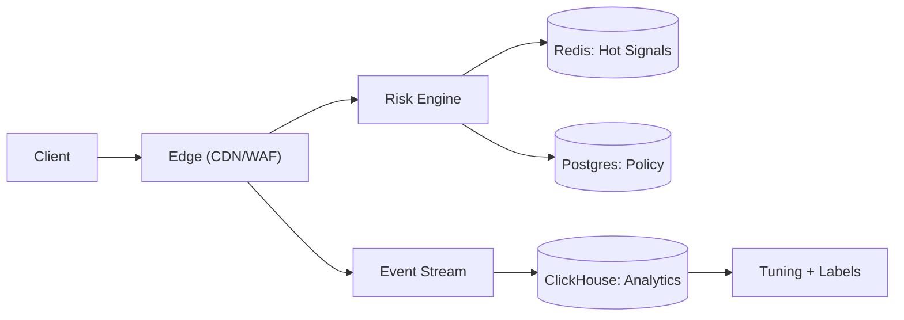

```markdown
---
title: "Bot Detection System"
category: "Security & Access Control"
difficulty: "Hard"
tags: ["bot-detection", "device-fingerprinting", "behavioral-analysis", "reputation", "waf", "edge-compute", "risk-scoring", "rate-limiting"]
---

## Overview

This system sits in front of a web/API surface and makes a per-request decision: **allow**, **add friction** (challenge/step-up), **rate-limit**, or **block**. It uses three signal classes—device fingerprinting, behavioral telemetry, and reputation—to make decisions that remain stable under retries, NAT/shared IPs, and attacker adaptation.

The key insight is to treat “bot detection” as **risk orchestration**, not classification. The system optimizes for a safe default (minimal false positives) by using a **graduated friction ladder** and by anchoring reputation to **entities that are hard to rotate quickly** (device + account), while using IP/ASN only as short-lived hints. That keeps the online path simple enough to run at the edge and makes the hard part—reputation under adversaries—explicit and testable.

## What Makes This Hard

Naive systems over-trust the easiest signal (IP address) and accidentally punish entire networks (mobile carriers, campuses, corporate NAT). They also use “one big score” without thinking about the action surface, so every tuning mistake becomes a site outage (login blocks, checkout drops).

Attackers adapt faster than rule deployments. If your online path depends on a heavy ML model or a slow data store, you either miss the attack (latency budgets) or take the site down (dependency blast radius). The trap is building a detection system that is sophisticated offline but brittle online.

## Requirements

### Functional Requirements
- Compute a deterministic action per request: `ALLOW`, `ALLOW_WITH_TELEMETRY`, `CHALLENGE`, `RATE_LIMIT`, `BLOCK`.
- Support both **browser** (JS available) and **API** (no JS) clients; degrade safely when client signals are missing.
- Maintain entity-level reputation across sessions while limiting tracking risk (bounded retention, rotating identifiers).
- Provide explainability for operators: “why was this request blocked/challenged?” with a small, auditable set of reasons.
- Support rapid response: rule/model rollout, kill-switch, and per-endpoint policies without redeploying the edge.

### Scale Targets
- **Traffic:** 50k rps sustained, 300k rps peak during attacks (bots amplify).
- **Latency budget:** p95 < 15ms added at the edge; p99 < 40ms (challenge issuance excluded).
- **State:** 500M distinct short-lived entities/day (IP prefixes, cookie IDs) with TTL-based decay; 50M long-lived entities (device/account) with capped retention.
- **Decision availability:** 99.99% for `ALLOW`/`RATE_LIMIT`/`BLOCK` decisions; safe degradation when state is partially unavailable.

## Key Design Decisions

- **Chose:** A friction ladder (`ALLOW → TELEMETRY → CHALLENGE → RATE_LIMIT → BLOCK`) driven by monotonic policy thresholds  
  **Rejected:** Binary “bot/not-bot” gating  
  **Why:** False positives are inevitable; the ladder turns uncertainty into controlled friction instead of outages.

- **Chose:** Entity reputation anchored to `device_id` and `account_id`, with IP/ASN as fast-decaying hints  
  **Rejected:** IP-based reputation as the primary control  
  **Why:** IP is shared and cheap to rotate; device/account are harder to rotate at scale and map better to abuse cost.

- **Chose:** Edge feature extraction + a thin Risk Engine with Redis TTL state and versioned policies in Postgres  
  **Rejected:** Online dependence on the analytics store or a heavy feature store  
  **Why:** The online path stays low-latency and resilient; offline analytics informs policy/model updates but never blocks traffic.

## Architecture



### Components

- **Edge (CDN/WAF)**
  - Terminates TLS, enforces cheap invariants (method/path allowlists, size limits), and extracts stable request features (IP prefix, ASN, TLS fingerprint, header shape).
  - Runs a small JS snippet for browser traffic that emits signed client telemetry and a device token; the edge verifies and forwards it.
  - Enforces the final action (challenge, block, rate-limit) to keep bypass surface small.

- **Risk Engine**
  - Pure function from `(request features, hot state, policy version)` → `action + reasons`.
  - Produces a compact “decision record” for audits and support, and emits verdict events for reputation updates.
  - Exposes a single low-latency API to the edge (batchable for HTTP/2 multiplexing).

- **Redis: Hot Signals**
  - TTL state for high-cardinality signals: rolling counters, recent challenge outcomes, short-lived reputation for IP prefixes/ASNs, and per-device rate limits.
  - Uses atomic primitives (INCR/EXPIRE, sliding-window buckets) so the Risk Engine stays stateless and horizontally scalable.

- **Postgres: Policy**
  - Versioned policies per route/tenant: thresholds, action ladder configuration, allow/deny lists, and rollout toggles.
  - Stores model metadata (weights, feature list, version) as immutable blobs referenced by policy versions.

- **Event Stream**
  - Firehose of request/decision events (sampled for low-risk traffic) and full-fidelity events for challenged/blocked traffic.
  - Provides replay for post-incident analysis and for rebuilding reputation after bugs.

- **ClickHouse: Analytics**
  - Queryable store for abuse investigations, cohort analysis, and offline feature evaluation.
  - Powers “top offenders”, false-positive review queues, and policy impact dashboards.

- **Tuning + Labels**
  - Human-in-the-loop labeling from support tickets, chargebacks, and verified abuse reports.
  - Produces new policy versions and (small) scoring models; rollouts are guarded with canaries and hard kill-switches.

## Deep Dive: Reputation That Survives NAT, Rotation, and Poisoning

The hardest part is assigning reputation to the “right” entity when attackers rotate IPs, share networks with real users, and try to poison your signals by generating noise.

**1) Model the world as entities with different stability**
- **High-stability:** `account_id` (after verified login), `device_id` (signed token), `payment_fingerprint` (for checkout flows).
- **Medium-stability:** `cookie_id`, `tls_fingerprint`, `user_agent_family`.
- **Low-stability:** `ip_prefix` (/24 or /56), `asn`, `geo`.

The Risk Engine computes a per-request entity set and keeps **separate reputation tracks** per entity type with different TTL/decay. IP reputation decays in minutes/hours; device/account reputation persists days/weeks with hard retention caps.

**2) Update reputation only from high-confidence verdicts**
Reputation is updated from explicit outcomes:
- **Positive:** passed challenge, successful login with normal behavior, completed purchase without dispute.
- **Negative:** failed challenge, credential stuffing confirmed (many accounts per device), chargeback/fraud confirmed, exploit signatures.

This avoids “model-as-truth” feedback loops. The online score influences friction, but only high-confidence outcomes change long-lived reputation.

**3) Aggregate via a conservative rule: bad overrides, good attenuates**
Final risk uses a monotonic aggregator:
- Start at baseline risk for the route.
- Increase risk by the worst long-lived entity (`account_id`/`device_id`) if present.
- Add short-lived surcharges for bursty low-stability entities (IP prefix/ASN) only when they exceed clear abuse thresholds.
- Reduce risk only with strong positive signals (recent passed challenge on same device + consistent behavior), never with “absence of evidence”.

This keeps attackers from laundering a bad IP through a good device, and it prevents “good traffic” from accidentally blessing an abused NAT.

**4) Make reputation explainable**
Every decision carries 2–5 reasons drawn from a bounded vocabulary, e.g.:
`BURST_IP_PREFIX`, `DEVICE_NEW_HIGH_RISK_ROUTE`, `CHALLENGE_FAILED_RECENT`, `ACCOUNT_STUFFING_PATTERN`, `KNOWN_BAD_ASN`.
Operators can tune thresholds and immediately understand the blast radius.

## Trade-offs

| Optimized For | Sacrificed |
|--------------|------------|
| Low false positives via friction ladder | Some bad traffic sees light friction instead of hard blocks |
| Resilience under attacks (edge-first, Redis TTL state) | Less “perfect” global intelligence in the online path |
| Fast operator iteration (versioned policies) | More discipline: policy/version management and rollbacks |
| Privacy-bounded identifiers (rotation + retention) | Less ability to track long-running low-and-slow bots |

## Failure Modes

- **Redis partial outage or latency spikes**
  - Behavior: Risk Engine falls back to policy-only decisions; IP/behavioral rate limits degrade first.
  - Detection: p95 Redis latency, error rate, and “fallback decision” counter.
  - Recovery: shed non-critical lookups (low-stability entities), then restore hot-signal reads; replay verdict events to rebuild state.

- **False positives from an over-aggressive rollout**
  - Behavior: spikes in challenge rate / block rate on sensitive routes (login/checkout), conversion drops.
  - Detection: per-route action distribution, challenge pass rate, and business KPIs tied to policy version.
  - Recovery: immediate kill-switch to previous policy version; require canary + holdback for future changes.

- **Attacker adapts (headless browser + stolen cookies)**
  - Behavior: behavior telemetry looks “human enough”, IPs rotate, cookie reuse increases.
  - Detection: rising account compromise signals, abnormal device-to-account fanout, and “challenge success but abuse outcome” lagging indicators.
  - Recovery: shift friction to higher-stability anchors (device token hardening, step-up on high-risk actions), increase weight of outcome-driven negatives.

## What I'd Do Differently At...

- **10x scale:** move more scoring to the edge (precomputed policy tables + local LRU caches), keep the Risk Engine for verdict updates and for high-risk routes only.
- **100x scale:** split the Risk Engine into a read-optimized “decision plane” with regional replication and a write-heavy “verdict plane” that updates reputation asynchronously; replace Redis hot keys with sharded keyspace + per-region isolation to bound blast radius.

## Operational Notes

- Treat policy changes like production deploys: canaries, holdbacks, and instant rollback keyed by policy version.
- Monitor action mix by route (`ALLOW/CHALLENGE/BLOCK`), challenge pass rate, and “fallback decisions” (state-store degradation).
- Keep a small, fixed taxonomy of reasons; uncontrolled reason growth becomes un-debuggable.
- Runbooks: “sudden spike in challenges”, “Redis degradation mode”, “false positive incident rollback”, “reputation poisoning suspicion”.
```

Saved in `solutions-v2/08-security-access-control/bot-detection-system.md`.