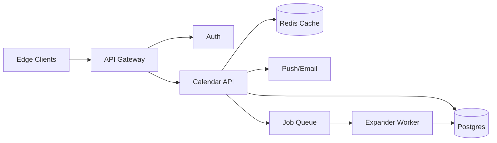

```markdown
---
title: "Calendar Scheduling System"
category: "IoT & Edge"
difficulty: "Hard"
tags: ["calendar", "recurrence", "rrule", "timezones", "conflict-detection", "postgres", "offline-sync"]
---

## Overview

This system stores calendar events (including recurring rules) and serves fast “what’s on my schedule?” queries while reliably detecting conflicts—even when users travel across time zones and daylight saving time (DST) shifts occur. The key insight is to **separate event intent from event instances**: store the canonical event definition (RRULE + timezone + exceptions) and **materialize occurrences only within a rolling window** where conflicts and UI views matter.

Naive designs either (a) expand every recurrence forever (explodes storage and backfills) or (b) compute everything on the fly (conflict checks become expensive and inconsistent across clients). This design keeps recurrence logic authoritative on the server, but bounds it: a background expander maintains a per-calendar occurrence index for, say, the next 18 months, making reads and conflict checks boring and fast.

Because this is “IoT & Edge”, the system treats clients as intermittently connected: offline edits are accepted as *proposals* and reconciled server-side using stable sync tokens. Clients can do optimistic local checks, but the server makes the final call.

## What Makes This Hard

Most teams underestimate two traps:

1. **“Same local time” is not “same instant.”** Recurring meetings defined as “9:00 AM America/Los_Angeles” must stay at 9:00 AM local time across DST transitions, which means the UTC timestamp changes. Storing only UTC loses the user’s intent; storing only local time loses ordering and conflict correctness.

2. **Conflicts + recurrence is a cross-product.** A “simple” conflict check becomes “does this rule generate any occurrences that overlap any other rule’s occurrences,” especially when exceptions, edits to a single instance, and shared calendars enter the picture.

## Requirements

### Functional Requirements
- Create/update/delete single and recurring events using iCalendar-style rules (RRULE), including exceptions (EXDATE) and modified instances (“this one occurrence moved”).
- Support per-event timezone (IANA tzid) and preserve “wall-clock intent” for recurring events.
- Conflict detection on create/update for a calendar (and optionally across selected calendars), with clear “why it conflicts” feedback.
- Efficient agenda view (day/week/month) and free/busy queries.
- Multi-device sync with offline capability: sync tokens, idempotent writes, and deterministic reconciliation.
- Shared calendars: read access at scale; writes serialized per calendar.

### Scale Targets
- 20M daily active users; average 3 calendars/user; average 500 events/calendar.
- 30% of events recurring; typical RRULE creates 1–52 occurrences/year.
- Peak reads: 200k agenda/free-busy QPS (driven by UI refresh + widgets).
- Peak writes: 10k QPS (creates/edits + sync replays).
- Latency: p95 agenda view < 150ms, p95 create/update with conflict check < 250ms.
- Materialization window: 18 months forward + 3 months back (covers UI, reminders, late edits; bounds storage).

## Key Design Decisions

- **Choose: “Definition + bounded materialization.”**
  - Rejected: infinite pre-expansion; pure on-demand expansion.
  - Why: bounded occurrences make conflict checks and queries fast without unbounded storage or unpredictable CPU.

- **Choose: Server-authoritative timezone semantics using IANA tzdb.**
  - Rejected: “store UTC only” or “client decides timezone math.”
  - Why: correctness depends on consistent tz rules; server authority prevents devices with stale tzdb from silently diverging.

- **Choose: Postgres range indexing + exclusion for conflicts (per calendar shard).**
  - Rejected: custom interval trees in a service; distributed locking.
  - Why: Postgres can enforce “no overlaps” with transactional guarantees; it’s simpler than inventing a new concurrency/control plane.

## Architecture



### Components

- **Edge Clients**
  - Maintain a local cache and sync token; can render agendas offline.
  - Submit edits with idempotency keys; show “tentative conflict” only as UX, not truth.

- **API Gateway**
  - Rate limits per user/device; collapses retries; enforces idempotency key presence on writes.

- **Auth**
  - Issues short-lived tokens; carries device-id for sync and dedupe.

- **Calendar API**
  - Owns event definitions, permissions, and the read model for agenda/free-busy.
  - For writes: validates RRULE, records definition changes, schedules (re)materialization jobs, and performs conflict checks.

- **Postgres**
  - Source of truth for: calendars, event definitions, exceptions, and materialized occurrences.
  - Partitioned/sharded by `calendar_id` to keep conflict checks local and hot data bounded.

- **Redis Cache**
  - Caches common agenda windows and free/busy responses keyed by `(calendar_id, window, tzid, version)`.

- **Job Queue + Expander Worker**
  - Materializes occurrences for the rolling window and maintains the conflict index.
  - Idempotent jobs keyed by `(calendar_id, event_id, definition_version)`.

- **Push/Email**
  - Notifies devices about calendar version bumps and sends reminders from materialized occurrences.

## Deep Dive: Conflict Detection for Recurring Events (Without Exploding)

**Hard part:** given a proposed change (new recurring event, edit to RRULE, or edit to a single instance), decide if it overlaps existing events—quickly, correctly, and transactionally.

### Data Model (core tables)
- `event_definition`
  - `event_id`, `calendar_id`
  - `dtstart_local` (wall-clock), `tzid` (IANA)
  - `rrule` (normalized), `duration_seconds`
  - `definition_version` (monotonic)
- `event_exception`
  - `event_id`, `original_occurrence_key`, `override_dtstart_local/tzid/duration` or `is_cancelled`
- `occurrence`
  - One row per expanded instance within the materialization window
  - `calendar_id`, `event_id`, `occurrence_start_utc`, `occurrence_end_utc`, `occurrence_key`
  - Postgres `tstzrange` generated from start/end
  - Indexed by `(calendar_id, occurrence_start_utc)` and GiST on the range

### The elegant trick: let the database enforce “no overlaps”
For calendars that require “no conflicts,” define an exclusion constraint on the materialized occurrences:

- Conceptually: `EXCLUDE USING gist (calendar_id WITH =, time_range WITH &&) WHERE (status = 'active')`

Now a write that inserts conflicting occurrences *cannot commit*. That gives you:
- Correctness under concurrency (two devices editing simultaneously).
- No separate locking system.
- A deterministic “which occurrence overlapped” error you can surface.

### Write path (new or edited recurring event)
1. **Persist definition change** in `event_definition` with a new `definition_version` (fast, always succeeds unless invalid).
2. **Materialize in a transaction** for the bounded window:
   - Expand RRULE for the window using tz-aware arithmetic: generate local occurrences, convert each to UTC using tzdb rules at that date.
   - Apply exceptions/overrides deterministically by `occurrence_key` (see below).
   - Upsert rows into `occurrence` for `(event_id, occurrence_key)`; delete stale rows for this event that no longer exist in-window.
3. **Conflict check is implicit:** if any inserted/updated `occurrence` overlaps existing ones for the same `calendar_id`, Postgres raises an exclusion violation; the API returns a 409 with the colliding occurrence ids/times.

### Stable occurrence identity (the part that prevents “exception drift”)
A recurring series needs a stable key for “the third Tuesday occurrence” even when tz offsets change. Use:
- `occurrence_key = (event_id, local_date, local_time, tzid)` derived from the recurrence rule’s *local* generation step, not from UTC.
- Exceptions store `original_occurrence_key` so “move just this one” stays attached even as tz offsets shift.

This is the non-obvious piece: **exceptions must bind to the recurrence in the same coordinate system the user thinks in (local time),** otherwise DST will make exceptions slide to the wrong instance.

## Trade-offs

| Optimized For | Sacrificed |
|--------------|------------|
| Correct timezone + DST semantics | Some extra write amplification (materialization) |
| Simple, transactional conflict guarantees | Conflicts limited to the materialized window |
| Fast agenda/free-busy reads | Background worker complexity and lag management |
| Edge-friendly sync | Server does more validation/merge work |

## Failure Modes

- **Materialization lag (worker backlog)**
  - What happens: agenda/free-busy misses newly edited future instances; reminders drift.
  - Detect: per-calendar “window covered until” metric; queue depth + job age SLOs.
  - Recover: prioritize calendars with upcoming occurrences; temporarily fall back to on-demand expansion for reads beyond covered horizon (read-only, no conflict promises).

- **Timezone database mismatch (clients vs server)**
  - What happens: clients render different times; offline edits generate surprising results.
  - Detect: include `tzdb_version` in sync metadata; log server/client mismatches.
  - Recover: server remains authoritative; force a “re-sync and re-render” on mismatch; ship tzdb updates aggressively.

- **Hot calendar shard (shared calendar, celebrity schedule)**
  - What happens: high contention on the same `calendar_id`, conflict checks slow.
  - Detect: per-calendar write latency + lock wait time; top-N hottest calendars.
  - Recover: isolate hot calendars onto dedicated Postgres shards; add per-calendar write queueing to serialize at the API layer for those specific ids.

## What I'd Do Differently At...

- **10x scale:** shard Postgres by `calendar_id`, add read replicas for agenda views, and push more agenda queries into cache with versioned keys.
- **100x scale:** move the occurrence store to a distributed SQL system (Spanner/Cockroach) or a purpose-built per-calendar storage service with the same “bounded materialization + exclusion-like guarantee” semantics; keep the rule expansion workers close to storage to reduce write amplification and contention.

## Operational Notes

- Treat RRULE parsing/normalization as an API contract: reject ambiguous rules and cap expansions (e.g., max occurrences per window) to prevent “infinite meeting” abuse.
- Backfills are routine: tzdb updates and rule-bug fixes require re-materializing affected calendars; build a throttled reindex pipeline from day one.
- Monitor “coverage horizon” per calendar, not just worker CPU—being *correct but late* is still a production incident for reminders.
- Idempotency is non-negotiable: mobile retries and offline sync replays must not duplicate definitions or occurrences.
```