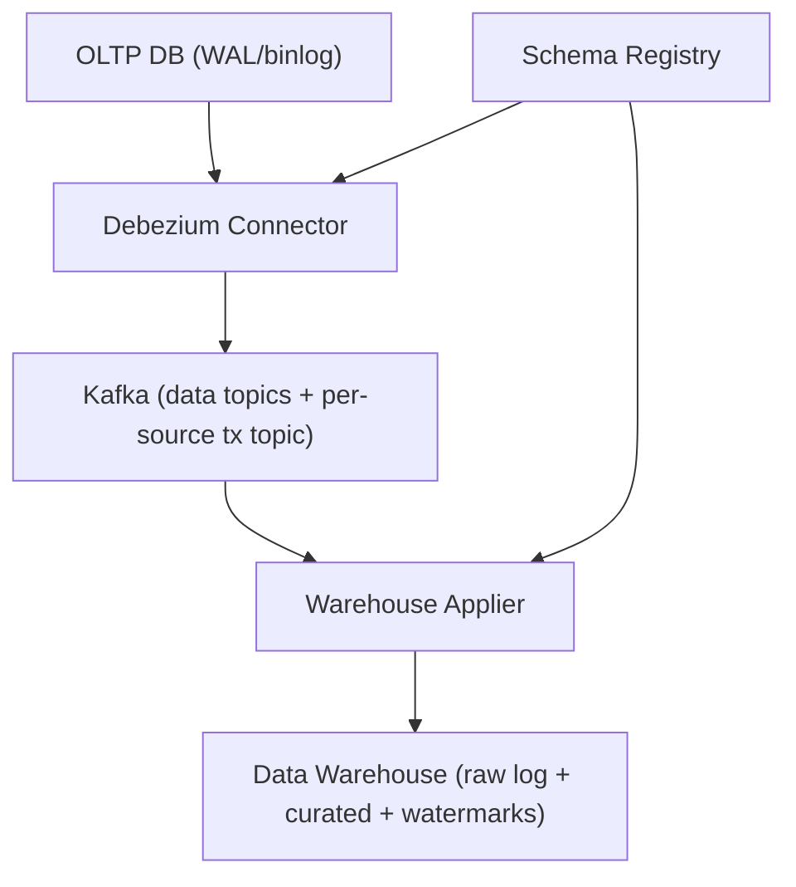

```markdown
---
title: "Change Data Capture (CDC) Platform"
category: "Storage & Data Platforms"
difficulty: "Hard"
tags: [cdc, debezium, kafka, data-warehouse, ordering, exactly-once, schema-evolution]
---

## Overview

This system streams row-level changes from OLTP databases into a data warehouse with one correctness rule: **the warehouse advances only in source commit order**.

Debezium produces (1) row-change events and (2) a **commit stream** (transaction metadata). Kafka is the replay boundary. The applier uses the commit stream as the only “clock”, but it does not buffer transactions in memory: it first writes row events into an append-only warehouse log, then applies commits by reading the corresponding events from that log and updating curated tables.

## What Makes This Hard

CDC breaks when “arrived in order” is mistaken for “committed in order”. Partitions, retries, connector restarts, and long transactions produce duplicates and out-of-order delivery.

Warehouses don’t behave like OLTP replicas. “Exactly once” is an end-to-end property: stable event identity, idempotent applies, and a persisted watermark that defines what “already applied” means.

## Requirements

### Functional Requirements
- Preserve **commit order per source DB** as observed in the source log.
- Preserve **atomic visibility per table per transaction** in the warehouse (all rows for a table within a transaction become visible together, in commit order).
- Support **replay** (from Kafka retention) without producing duplicates or corrupting warehouse state.
- Handle **schema evolution** (ADD column, type widening) without downtime; reject breaking changes loudly.
- Provide **initial snapshot + change tailing** with a clear cutover point.
- Multi-tenant operation: many source DBs, independently throttled and isolated.

### Scale Targets
- 50 source DBs, ~500 tables total.
- Peak ingest: 200k row changes/sec aggregate (fits comfortably in Kafka; the warehouse is the limiter).
- P99 end-to-end lag target: 60s during normal load; can degrade gracefully under warehouse pressure.
- Retention: 7 days of replay in Kafka (enough to recover from warehouse outages without resnapshot).

## Key Design Decisions

- **We chose:** Log-based CDC using Debezium + Kafka, with **transaction metadata** enabled.  
  **We rejected:** Query-based polling (“updated_at” scans).  
  **Why:** Polling cannot guarantee correctness under concurrent writes, clock skew, and deletes.

- **We chose:** One **transaction/commit topic per source DB with exactly one partition**, and the applier refuses to run if this invariant is violated.  
  **We rejected:** “Naturally ordered” assumptions.  
  **Why:** Ordering is a configuration invariant, not a hope.

- **We chose:** Put state where it’s used: `cdc_watermarks` in the **warehouse**, advanced only after a successful apply.  
  **We rejected:** A separate always-on metadata database for correctness state.  
  **Why:** Fewer moving parts; the warehouse is already required.

- **We chose:** Make the raw log mandatory: append row events into `cdc_raw_events`, then drive curated updates from the commit stream.  
  **We rejected:** Per-transaction local buffering/spill as the core design.  
  **Why:** The raw log is the simplest durable buffer and survives crashes and rebalances.

- **We chose:** Deterministic event identity from Debezium fields: `(source_id, txid, total_order)` (or engine equivalent).  
  **We rejected:** Ad-hoc `event_index`.  
  **Why:** Idempotency must be derivable from the payload and stable across replays.

**What We Removed**
- Metadata DB for watermarks and applier state (watermarks live in the warehouse).
- Required local buffering and local-disk spill logic (the raw log is the buffer).
- “Transaction topic is naturally ordered” as an unstated assumption (the topic invariant is explicit and enforced).

## Architecture



### Components

- **Debezium Connector**
  - Reads WAL/binlog and emits row-change events plus a transaction metadata stream.
  - Owns source offsets and snapshot cutover mechanics.
  - Justification: it’s the only credible way to get log positions + tx boundaries without app changes.

- **Kafka (data topics + per-source tx topic)**
  - Data topics carry row-level changes (partitioned for throughput).
  - Tx topic is one per source DB, single partition, carrying ordered commits `(txid, commit_lsn, event_count)`.
  - Justification: durable buffer for outages/replay, and the commit stream is the ordering proof.

- **Schema Registry**
  - Enforces compatible evolution; the applier fails loud on breaking changes.
  - Justification: prevents silent drift/coercion from poisoning warehouse tables.

- **Warehouse Applier**
  - Ingests row events into a warehouse raw log with a uniqueness constraint on event identity.
  - Applies commits in tx order by reading tx events from the raw log, running deterministic MERGEs/deletes, then advancing `cdc_watermarks`.
  - Justification: the only custom component; it makes end-to-end guarantees real.

- **Data Warehouse**
  - Stores `cdc_raw_events`, curated tables, and `cdc_watermarks`.
  - Justification: the destination, and the simplest durable place to store correctness state.

## Deep Dive: Transaction-Ordered, Replay-Safe Applies

The applier makes ordering and idempotency a property of the warehouse, not of in-memory buffering.

It runs two loops:
1. **Ingest loop (row events):** consume data topics and insert each event into `cdc_raw_events` keyed by a stable idempotency key (for example `(source_id, txid, total_order)`). Commit Kafka offsets only after the insert succeeds.
2. **Apply loop (commit stream):** consume the next commit record `(txid, commit_lsn, event_count)` from the per-source single-partition tx topic:
   - Wait until `cdc_raw_events` contains exactly `event_count` events for that `(source_id, txid)` (or time out and stop; missing events are a correctness incident).
   - In a warehouse transaction: stage the tx’s events, run deterministic MERGEs/deletes into curated tables, then upsert `cdc_watermarks(source_id, last_applied_commit_lsn = commit_lsn)`.
   - Commit the tx-topic offset only after the warehouse transaction commits.

If the applier crashes mid-apply, the watermark does not advance. On restart it replays the same txid; raw-log dedupe prevents duplicates, and MERGEs are deterministic.

Snapshot + streaming cutover uses the same rule: snapshots are tied to a log position, and the watermark advances only for commits strictly after the snapshot cut.

## Trade-offs

| Optimized For | Sacrificed |
|--------------|------------|
| Correct commit ordering with a clear proof | Extra warehouse storage (raw log) |
| Replay safety (idempotent effects) | Lowest possible end-to-end latency |
| Small-team operability (one custom service) | Peak parallelism (tx stream is serialized per source) |

## Failure Modes

- **Replication slot / binlog retention pressure**
  - What happens: connector falls behind; source DB retains WAL/binlog; disk grows; DB risk.
  - Detect: increasing `lsn_lag` / binlog lag, slot backlog bytes, connector throughput drop.
  - Recover: throttle tenants, pause low-priority tables, scale appliers, and only as a last resort resnapshot (after capturing the last safe LSN).

- **Warehouse overload (MERGE becomes the bottleneck)**
  - What happens: lag grows; end-to-end latency spikes.
  - Detect: apply time per tx; `last_applied_commit_lsn` falling behind source head with increasing slope.
  - Recover: keep ingesting into the raw log, slow or pause curated MERGEs, and scale the warehouse; do not advance the watermark past unapplied commits.

- **Schema breaking change**
  - What happens: applies fail or—worse—silently coerce types.
  - Detect: Schema Registry incompatibility, applier validation failures, DLQ growth.
  - Recover: stop affected tables, deploy an explicit warehouse migration, then resume from the last applied commit LSN.

- **Tx ordering invariant violated**
  - What happens: tx topic has >1 partition; commit order is no longer provable.
  - Detect: applier startup check fails; no watermark advancement.
  - Recover: fix topic config (1 partition), restart applier, replay from the last applied watermark.

- **Incomplete transaction (commit seen, row events missing)**
  - What happens: commit record arrives but the raw log never reaches `event_count` for that txid (retention gap, connector bug, or ingestion failure).
  - Detect: apply loop times out waiting for `event_count`; watermark stops.
  - Recover: treat as a correctness incident: fix the gap (extend retention / resnapshot the affected tables) and resume from the last applied watermark.

## What I'd Do Differently At...

- **10x scale:** Run more applier instances, each owning a fixed set of source DBs; apply in larger merge batches while still advancing watermarks strictly by commit stream.
- **100x scale:** Keep streaming as raw-log ingestion and move curated tables to compaction jobs; the commit stream still defines ordering, but not per-tx MERGEs.

## Operational Notes

- The only correctness metric that matters is `cdc_watermarks.last_applied_commit_lsn` vs source head; alert on lag slope, not just absolute lag.
- The applier refuses to run unless each source’s tx topic has exactly one partition.
- Every event must carry a stable idempotency key (Debezium tx metadata); events that can’t be keyed are quarantined.
- Enforce Schema Registry compatibility; ban type narrowing and “rename-as-drop/add” without an explicit migration.
- Never “fix” ordering with timestamps. Use commit LSN/GTID and tx boundaries; everything else eventually lies.
```
