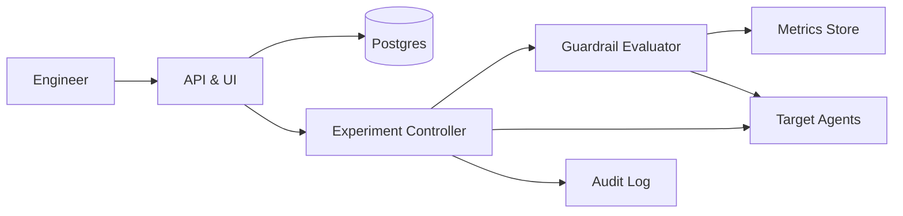

```markdown
---
title: "Chaos Engineering Platform"
category: "Observability & Reliability"
difficulty: "Hard"
tags: ["chaos-engineering", "reliability", "slo", "guardrails", "kubernetes", "prometheus", "safety"]
---

## Overview

This system is a controlled chaos engineering platform that runs fault-injection experiments with a deliberately small blast radius and an automatic, provable “stop” path when health degrades. The key insight is to treat *safety* as a separate product from *experimentation*: the system is designed to fail-closed, where loss of control-plane signals stops injection rather than letting it continue.

Most chaos platforms get bogged down in a zoo of fault types. This design stays boring: use proven injection mechanisms (service-mesh faults, `tc`/iptables, process kill) and invest engineering effort in the hard part—guardrails that are fast, conservative, and independent of the experiment runner.

The elegant simplification is a lease-based injection model: targets only inject while holding a short-lived, continuously renewed lease. If anything goes wrong (controller crash, network partition, guardrail alarm, metrics blackout), leases expire and injection stops automatically.

## What Makes This Hard

Naive implementations assume “stop” is just an API call. In reality, the dangerous failure mode is *losing the ability to stop*—controller overload during an incident, metrics delays, or a partially applied fault that doesn’t roll back cleanly.

The trap that catches most teams is coupling experiment execution and safety evaluation in the same service and on the same telemetry pipeline. When telemetry is degraded (exactly when you need it), the safety system becomes blind. The design must assume observability can be late, missing, or wrong, and still halt safely.

Finally, blast radius isn’t just “percentage of pods.” It’s also correlated dependencies (one hot shard, one AZ, one noisy customer) and shared infrastructure. A safe platform must encode *where* and *how fast* harm can spread.

## Requirements

### Functional Requirements
- Define experiments with explicit scope: environment, cluster, namespace/service, and a hard cap on impacted targets (count and percentage).
- Progressive rollout: faults ramp up in steps with mandatory health checks between steps.
- Guardrails: each experiment has stop conditions expressed as SLO-style signals (latency, error rate, saturation) with clear evaluation windows.
- Fail-closed safety: if guardrails cannot be evaluated (telemetry missing/late), experiments halt.
- One-click (and API) global kill switch that stops all injection within seconds.
- Strong auditability: who ran what, where, why, approvals, and exact injected parameters.
- Safe-by-default permissions: teams can only target what they own; production requires explicit approval policy.

### Scale Targets
- **Organizations:** 50–200 teams.
- **Targets:** up to 5,000 services across 10–50 clusters.
- **Experiment volume:** 200–1,000 experiments/day; **concurrency capped** at 10–30 per org (safety > throughput).
- **Stop latency:** p99 < 10s from guardrail breach to injection cessation (drives lease TTL + evaluation cadence).
- **Telemetry tolerance:** platform must handle 30–60s metrics delays and occasional gaps without unsafe continuation (drives conservative “unknown => stop” logic).

## Key Design Decisions

- **Decision 1: Lease-based injection (fail-closed)**
  - **Chose:** short-lived leases issued by the controller; agents inject only while lease is valid and renewed.
  - **Rejected:** “start injection and later send stop” without a hard expiration.
  - **Why:** it converts many scary failures (controller crash, network partition, guardrail outage) into a safe default: injection stops automatically when leases expire.

- **Decision 2: Safety evaluator as an independent control loop**
  - **Chose:** a separate Guardrail Evaluator service that can halt experiments even if the experiment controller is unhealthy.
  - **Rejected:** embedding guardrail checks inside the experiment controller workflow.
  - **Why:** safety must remain available during control-plane stress; independence also simplifies reasoning about failure modes and permissions.

- **Decision 3: Progressive ramp with mandatory checkpoints**
  - **Chose:** stepwise rollout (e.g., 1% → 5% → 20%) with health gating between steps.
  - **Rejected:** immediate full blast radius.
  - **Why:** most systems degrade non-linearly; ramping catches “cliff edge” behaviors early and limits correlated failures.

## Architecture



### Components

- **API & UI**
  - Owns experiment creation, templates, approvals, and visibility.
  - Earns its place by being the policy enforcement point (RBAC, prod rules, required guardrails).

- **Postgres**
  - Stores experiments, scopes, step plans, leases, and state transitions.
  - Boring and correct: transactional updates matter for idempotency and audit trails.

- **Experiment Controller**
  - Orchestrates experiments: preflight checks, step ramping, issuing/renewing leases, and coordinating rollback.
  - Intentionally *not* the only thing that can stop an experiment.

- **Guardrail Evaluator**
  - Continuously evaluates health signals for running experiments.
  - Can revoke/deny lease renewals and trigger an immediate halt.

- **Metrics Store**
  - Source of truth for health signals (Prometheus is the default choice).
  - The design assumes it can be delayed or partially unavailable.

- **Target Agents**
  - Data-plane executors on targets (Kubernetes daemonset/sidecar, or lightweight host agent for VMs).
  - Enforces safety locally: max duration, lease TTL, and rollback procedures.

- **Audit Log**
  - Append-only record (e.g., object storage + immutability / WORM policies).
  - Needed for incident reviews and to build trust with production owners.

## Deep Dive: Guardrails That Actually Halt Safely

The hardest part is guaranteeing “stop” under degraded conditions. The platform solves this with **two independent stop mechanisms**: *lease expiry* (automatic) and *explicit revocation* (active).

**1) Leases make injection self-terminating**  
When an experiment step starts, the controller issues a lease to each target agent with:
- `lease_id`, `experiment_id`, `fault_spec_hash`
- `expires_at` (short TTL, e.g., 10–15s)
- a monotonic `step_epoch` (prevents stale renewals)
Agents inject only while the lease is valid. They renew by calling back (or accepting renewals) frequently. If renewals stop for any reason—controller overload, network partition, agent unable to reach control plane—leases expire and the agent reverts the fault.

This is the core safety property: **the system doesn’t need to be able to send “stop” to become safe**.

**2) Guardrail Evaluator controls renewals, not just alerts**  
Guardrails are evaluated on a tight cadence (e.g., every 5s) over rolling windows (e.g., 1m error rate, 5m latency). Crucially, the evaluator’s output directly affects whether leases can be renewed:
- **Healthy:** allow renewals (within ramp policy).
- **Degraded:** deny renewals and issue revocations (fast path).
- **Unknown telemetry:** deny renewals (fail-closed), optionally after a short grace period to tolerate brief scrape gaps.

This avoids a common pitfall: “we alerted but the fault kept running.” Here, the evaluator is part of the control loop.

**3) Hysteresis and “budgeted” breach detection**  
To avoid flapping stops, guardrails use:
- **Consecutive breach counts** (e.g., 2/2 evaluations) rather than a single datapoint.
- **Burn-rate style thresholds** for SLO-derived metrics (e.g., fast burn for immediate halt; slow burn for warning).
- **A per-experiment blast budget**: the maximum allowed degradation before forcing stop (codifies how risky a test is allowed to be).

**4) Progressive ramp ties directly to guardrails**  
Each ramp step requires a “settle + observe” phase:
- Inject at step N for X seconds
- Observe guardrails for Y seconds (no step changes during this time)
- Only then proceed to step N+1  
This keeps causality interpretable and prevents “we ramped faster than metrics could tell us.”

## Trade-offs

| Optimized For | Sacrificed |
|--------------|------------|
| Safety (fail-closed stop) | Experiment continuity during telemetry outages |
| Simple, auditable control plane | Maximum injection throughput/concurrency |
| Fast stop latency | Some false-positive halts due to conservative guardrails |
| Proven primitives (leases, Prometheus, Postgres) | Exotic fault types and bespoke scenarios |

## Failure Modes

- **Telemetry blackout or high delay**
  - **What happens:** guardrails cannot be evaluated reliably.
  - **Detect:** missing scrape timestamps / stale series; evaluator “unknown” state.
  - **Recover:** fail-closed by denying renewals; platform marks experiment as halted due to telemetry; on-call investigates metrics pipeline separately.

- **Controller overload or crash mid-experiment**
  - **What happens:** renewals stop; agents may still be injecting.
  - **Detect:** heartbeat loss from controller; lease renewals stop; experiment state stuck.
  - **Recover:** leases expire and auto-rollback; controller restarts and reconciles state from Postgres, marking experiment as halted with reason “control-plane lost.”

- **Agent fails to rollback (stuck iptables/tc rule, sidecar bug)**
  - **What happens:** fault persists beyond intended window on a subset.
  - **Detect:** agent reports rollback failure; periodic “injection state” scrapes; synthetic checks for known fault signatures.
  - **Recover:** local watchdog attempts rollback; escalate to node-level remediation playbook (restart pod/network namespace, cordon/drain node); platform blocks further experiments on that target until cleared.

## What I'd Do Differently At...

- **10x scale:**
  - Partition by org/cluster and run multiple controller/evaluator pairs with independent kill switches.
  - Add a dedicated time-series query cache/aggregator for guardrail evaluation to reduce Prometheus load.

- **100x scale:**
  - Move from “query Prometheus” to a streamed health-signal pipeline (precomputed SLO burn rates) so evaluators don’t run expensive ad-hoc queries at high concurrency.
  - Introduce hierarchical blast budgeting across shared dependencies (per-cluster, per-AZ, per-critical-service) enforced centrally to prevent correlated experiments.

## Operational Notes

- Treat experiments like deployments: require an owner, a hypothesis, rollback verification, and a post-run report.
- Keep a small set of blessed guardrail templates per service tier (critical, important, best-effort); don’t let every team invent thresholds.
- Regularly game-day the platform itself: verify kill switch, lease expiry, and rollback on every supported fault type.
- On-call runbook should start with: “Is injection still active?” then “Why did leases renew?”—that’s the fastest path to diagnosing unsafe behavior.
```