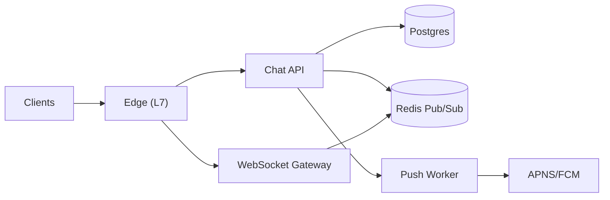

```markdown
---
title: "Chat System (1:1 & Group)"
category: "Real-Time & Media"
difficulty: "Hard"
tags: ["chat", "websocket", "offline-sync", "read-receipts", "fanout", "postgres", "redis"]
---

## Overview

This system is a messaging platform for 1:1 and group chat with offline sync, read receipts, typing indicators, and scalable fan-out. The core model is an **immutable message log per conversation** plus **per-user watermarks** (cursors). Everything else—WebSockets, typing, presence, push notifications—is treated as an optimization layered on top of that durable log.

The key insight is to **separate “durable truth” from “real-time UX”**. The durable truth is: messages are appended, and each user advances cursors (delivered/read) monotonically. The real-time layer is best-effort: it can drop events under load or during a Redis hiccup without correctness loss, because clients can always reconcile via sync using their cursors.

This keeps the design operable for a small team: **Postgres as the source of truth**, **Redis for ephemeral fan-out**, and **stateless gateways**. The hard problems (offline correctness and large-group fan-out) are solved with a small set of primitives rather than a fleet of specialized services.

## What Makes This Hard

Naive implementations try to “deliver” each message by writing N inbox rows for a group of size N. That works until the first large group, where a single message becomes thousands of writes, and the system collapses under write amplification and retry storms.

The second trap is treating WebSocket delivery as correctness. Mobile networks drop connections constantly; clients miss events; servers restart. If “real-time events” are the only way a device learns about messages or read state, you’ll ship a system that *looks* fast but loses state and becomes impossible to reason about.

## Requirements

### Functional Requirements
- **Offline sync**: a device that reconnects after hours must efficiently fetch exactly what it missed without scanning entire history.
- **Read receipts**: support “read up to here” semantics for 1:1 and groups without per-message, per-user explosion.
- **Typing indicators**: low latency, ephemeral, never blocks message delivery.
- **Fan-out for large groups**: real-time for active participants without per-message fan-out writes to all members.
- **Idempotent send**: retries must not create duplicate messages.

### Scale Targets
- **50M DAU**, **5M concurrent connections** (WebSockets); concurrency drives gateway and pub/sub design.
- **2B messages/day** (~23k/s avg, **200k/s peak**); peak drives write path and indexing choices.
- **Large groups up to 100k members**, but only a small fraction actively viewing at once; this is what enables “fan-out to active sessions” rather than “fan-out to all members”.
- **Offline sync**: fetch “since cursor” in **<300ms p95** for typical backlogs (hundreds of messages), which is mostly an index+pagination problem.

## Key Design Decisions

- **Chosen: Postgres as the durable source of truth (messages + receipts + membership)**
  - Rejected: Kafka/Cassandra-first architectures
  - Why: the correctness model is simpler, transactions are real, and a small team can operate it; we scale with partitioning + read replicas, and re-architect only when proven necessary.

- **Chosen: Cursor-based sync with monotonic watermarks**
  - Rejected: per-device state machines and “delivered event logs” as truth
  - Why: a single primitive (“give me messages after X”) makes offline, reconnects, and missed WebSocket events straightforward.

- **Chosen: Hybrid fan-out — durable append + best-effort real-time broadcast to active sessions**
  - Rejected: fan-out-on-write to every group member
  - Why: it eliminates write amplification while still delivering real-time UX to users who are actually present.

## Architecture



### Components

- `Chat API`: Authenticates, validates membership, persists messages/receipts, and publishes real-time events. Stateless; horizontally scaled.
- `Postgres`: Source of truth for messages, conversation membership, and receipt watermarks. Partitioned for message scale; read replicas for sync-heavy traffic.
- `WebSocket Gateway`: Maintains connections, room subscriptions, and pushes real-time events to active clients. Never the source of truth.
- `Redis Pub/Sub`: Low-latency broadcast channel from API to gateways. Best-effort by design; safe to drop because clients reconcile via sync.
- `Push Worker`: Turns “new message” events into mobile push notifications with rate-limits and user preferences.
- `Edge (L7)`: TLS termination, routing, and connection upgrades; protects gateways with sane limits.

## Deep Dive: Offline Sync + Large-Group Fan-out (The Hardest Part)

The system works because **every client maintains two cursors per conversation**:
- `last_delivered_id`: the newest message it has successfully synced locally
- `last_read_id`: the newest message the user has read (read receipt)

### Message identity and ordering
Use **server-generated ULIDs** (`message_id`) for each message. ULIDs are time-sortable and unique, giving:
- Efficient pagination (`WHERE message_id > :cursor ORDER BY message_id LIMIT :n`)
- Stable ordering within a conversation without a per-conversation counter (avoids hot rows for large groups)

Schema sketch (conceptual):
- `messages(conversation_id, message_id, sender_id, body, created_at, ...)`
  - Index: `(conversation_id, message_id)`
- `receipts(conversation_id, user_id, last_delivered_id, last_read_id, updated_at)`
  - PK: `(conversation_id, user_id)`

### Send path (idempotent)
Clients send with a `client_msg_id` (UUID) for retries.
1. API writes an idempotency record in Postgres keyed by `(sender_id, client_msg_id) -> message_id`.
2. If it already exists, return the existing `message_id` (no duplicate).
3. Insert the message row using that `message_id`.
4. Publish `message_created(conversation_id, message_id)` to Redis.

This makes retries safe even under timeouts, gateway restarts, or client flakiness.

### Sync path (correctness-first)
Client calls:
- `GET /conversations/:id/messages?after=:last_delivered_id&limit=...`

Server executes an index-backed query on `(conversation_id, message_id)` and returns new messages plus the newest `message_id` as the next cursor. The client advances `last_delivered_id` only after it has persisted the batch locally.

Because the durable log is the truth, this works even if:
- WebSocket events were missed
- Redis dropped a publish
- the client was offline for days

### Read receipts without per-message explosion
Read receipts are **watermarks**, not per-message acknowledgements:
- On read, client sends `POST /conversations/:id/read { last_read_id }`
- Server updates `receipts.last_read_id = GREATEST(existing, incoming)` (monotonic)

In 1:1, this exactly matches user expectations (“seen up to message X”). In groups, it scales: you can display per-user last-read when needed, and derive per-message read state by comparing to that user’s watermark.

### Fan-out that scales for large groups
Real-time “fan-out” is only to **active sessions subscribed to that conversation**:
- Gateways keep an in-memory map: `conversation_id -> connections on this node`
- API publishes one event to Redis per message
- Every gateway receives it and only forwards to local subscribers

Critically, we do **not** write N per-user inbox rows. Offline users learn about messages via:
- push notifications (policy-controlled), and/or
- the next sync when they open the conversation/app

This keeps writes proportional to messages, not group size.

## Trade-offs

| Optimized For | Sacrificed |
|--------------|------------|
| Operational simplicity (Postgres + Redis) | Unlimited horizontal write scaling without re-architecture |
| Correctness under flaky networks (cursor sync) | “Guaranteed real-time delivery” semantics |
| Large-group efficiency (no fan-out writes) | Instant notification to every member of huge groups |

## Failure Modes

- **Redis Pub/Sub outage or packet loss**
  - What happens: real-time updates/typing indicators stop; messages still persist.
  - Detect: gateway event lag metrics drop to zero; publish errors spike.
  - Recover: clients continue polling/sync; restore Redis; no data repair required.

- **Hot conversation (very large group) spikes write/read load**
  - What happens: Postgres index contention and IO pressure, sync latency increases.
  - Detect: p95 insert latency, buffer cache misses, slow queries on `messages`.
  - Recover: apply stricter per-conversation rate limits, increase partitioning/shard count, move heavy conversations to dedicated partitions; degrade push notifications.

- **WebSocket gateway overload (too many connections / slow clients)**
  - What happens: increased disconnects, backpressure, event queues grow.
  - Detect: connection churn, per-connection send backlog, CPU in event loop.
  - Recover: shed load (drop typing first), enforce per-connection rate limits, scale gateways horizontally; correctness unaffected due to sync.

## What I'd Do Differently At...

- **10x scale:** Partition `messages` by hash(conversation_id) into many partitions, add read replicas for sync, and introduce a lightweight streaming bus (still “boring”, e.g., Kafka) only if Redis broadcast becomes a bottleneck.
- **100x scale:** Move the message log to a horizontally scalable store (e.g., Cassandra/DynamoDB) and keep Postgres for metadata/receipts; introduce regionalization (users pinned to home region) and async cross-region replication for global groups.

## Operational Notes

- Keep real-time best-effort: drop typing/presence before dropping message-created events; clients always reconcile via `/messages?after=...`.
- Enforce strict limits: max message size, max typing frequency, per-conversation send rate (protects large groups).
- Use monotonic updates for receipts (`GREATEST`) to avoid clock skew issues.
- Gateways must implement backpressure: if a client can’t keep up, disconnect it; it will recover via sync.
```