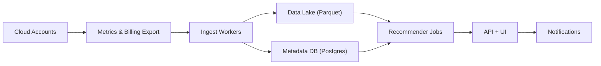

```markdown
---
title: "Cloud Cost Optimization Platform"
category: "Strategic Problems"
difficulty: "Medium"
tags: ["finops", "cloud", "cost-optimization", "analytics", "recommendations", "governance"]
---

## Overview

This system ingests cloud utilization metrics and billing data to produce actionable, explainable recommendations for (1) compute rightsizing and (2) spot instance adoption. The elegant idea is to treat “cost optimization” as a **decision system with guardrails**, not a dashboard: every recommendation comes with a confidence score, explicit risk assumptions, and a reversible rollout plan.

Most teams get stuck either overbuilding an ML platform or shipping a pile of charts that nobody trusts. This design stays boring: a small set of well-chosen data stores, a nightly batch recommender, and a thin API/UI. The “senior” part is the recommender logic: it is conservative where it must be (SLO risk) and aggressive where it can be (waste patterns), and it is always explainable.

## What Makes This Hard

Naive implementations optimize for average utilization and miss the real enemy: **tail risk** and **workload variability**. Rightsizing based on mean CPU leads to latency spikes, OOMs, and pager fatigue; after one bad incident, engineers ignore every recommendation.

Spot adoption fails for the same reason: teams see “70% savings” and then get burned by interruptions because the system didn’t model *tolerance* (statelessness, scaling, checkpointing, multi-instance diversification). The hard problem is producing recommendations that are both **safe enough to trust** and **simple enough to operationalize**.

## Requirements

### Functional Requirements
- Ingest utilization metrics (CPU, memory, network, disk) per resource with consistent identity across resizes/replacements.
- Ingest cost and usage (billing export) and allocate cost to owners via tags/accounts/projects.
- Generate rightsizing recommendations with explicit safety headroom and “why” explanations.
- Generate spot suitability recommendations with an interruption-risk model and migration playbook.
- Provide approval workflow (team ownership, snooze/ignore with reason, audit trail).
- Export recommendations to tools engineers already use (CSV/API, Jira/Slack, Terraform hints).

### Scale Targets
- **Resources:** 100k instances/containers across 1k accounts/projects.
- **Metrics:** 1–5 minute resolution, 30 days retained at high resolution (for tails), 12 months retained at daily aggregates (for trends).
  - At 100k resources × 288 points/day (5m) ≈ 28.8M points/day per metric; you do not want a bespoke real-time pipeline for this.
- **Recommendation latency:** nightly batch is acceptable; “freshness” matters more than realtime.
- **API:** 50–200 RPS (UI, exports, integrations), dominated by reads and filters.

## Key Design Decisions

- **Choose a batch-first recommender (nightly)**
  - **Rejected:** streaming “real-time optimization.”
  - **Why:** billing data is delayed and optimization decisions are slow-moving; batch makes backfills, explainability, and cost control easier.

- **Store long-lived time series in a columnar data lake (Parquet), not a TSDB**
  - **Rejected:** keeping months of high-cardinality metrics in Prometheus/Influx as the primary store.
  - **Why:** the workload is scan-heavy analytics (percentiles, windows, joins with cost); Parquet + partitioning is cheaper and simpler to operate.

- **Use explainable recommendation rules with conservative guardrails**
  - **Rejected:** black-box ML that “beats heuristics.”
  - **Why:** trust is the product; explainability + explicit risk thresholds get adoption, and adoption creates savings.

## Architecture



### Components

- **Metrics & Billing Export**
  - Pull from provider-native sources (e.g., CloudWatch/Azure Monitor/GCP Monitoring + billing exports). Provider systems already handle collection; this platform standardizes identity and storage.

- **Ingest Workers**
  - Stateless workers that normalize metric names/units, enforce schemas, and write partitioned Parquet (by day/provider/account/resource_type). They also populate canonical resource identity in metadata.

- **Data Lake (Parquet)**
  - Cheap, scalable store for scan-heavy analytics and backfills. Partitioning is the difference between “minutes” and “hours.”

- **Metadata DB (Postgres)**
  - Source of truth for resource identity, ownership (tags → team), recommendation state (new/approved/snoozed), and audit log. Postgres is sufficient and reliable.

- **Recommender Jobs**
  - Nightly compute that reads the last N days of metrics + billing context and emits recommendations with confidence, expected savings, and risk notes.

- **API + UI**
  - Read-heavy service: filters by team/account, shows “why,” allows approve/snooze, exports.

- **Notifications**
  - Pushes only high-confidence, high-savings items to Slack/Jira to avoid alert fatigue.

## Deep Dive: Conservative Rightsizing That Engineers Trust

The core insight: rightsizing is not “pick a smaller instance,” it’s **bound tail risk** while shrinking capacity. The recommender should behave like a cautious SRE who is willing to save money but refuses to trade it for incidents.

**1) Build a stable utilization signal**
- Use a 14–30 day window of 5-minute samples.
- Require data quality gates: minimum coverage (e.g., ≥90% samples present), and reject windows with major topology churn (frequent instance replacements) unless identity mapping is solid.
- Compute robust stats per resource: `p50`, `p95`, `p99` for CPU and memory, plus burstiness `p95/p50`.

**2) Translate utilization into a safe target size**
- Rightsize against **p99**, not average. For each candidate instance size, estimate headroom:
  - `headroom = capacity - p99_usage`
- Enforce explicit safety margins:
  - CPU: keep ≥30% headroom at p99
  - Memory: keep ≥40% headroom at p99 (OOM is brutal)
- If burstiness is high (e.g., `p95/p50 > 3`), only recommend one size-step down per cycle. This turns a risky big change into a safe iterative loop.

**3) Tie recommendations to dollars, not vibes**
- Compute expected monthly savings using billing rates and usage hours, net of reservation/commit discounts already applied. If savings < a threshold (e.g., $50/mo), suppress it; engineers won’t spend attention on pennies.

**4) Make “why” non-negotiable**
Every recommendation includes:
- The exact window used (e.g., last 21 days), data coverage, and the utilization percentiles.
- The guardrails that passed (p99 headroom, burstiness step-down).
- The rollback plan: “resize back” is a one-command reversal; the system stores the prior type.

This approach is intentionally not clever. It is *trustworthy*. Trust drives adoption; adoption drives savings.

## Trade-offs

| Optimized For | Sacrificed |
|--------------|------------|
| Engineer trust via conservative guardrails | Maximum theoretical savings |
| Simple, explainable batch recommendations | Real-time optimization |
| Low operational overhead (data lake + Postgres) | Fancy time-series features |
| Fast iteration on rules and thresholds | ML-driven “auto-discovery” |

## Failure Modes

- **Provider API throttling / export delays**
  - **What happens:** gaps in metrics or late billing files produce incomplete recommendations.
  - **Detect:** ingest lag dashboards + “coverage %” alarms per account/provider.
  - **Recover:** backfill jobs by partition; recommender skips low-coverage resources instead of guessing.

- **Bad ownership mapping (tags missing or wrong)**
  - **What happens:** recommendations route to the wrong team and get ignored.
  - **Detect:** high “unowned” rate, repeated snoozes with “not mine.”
  - **Recover:** enforce tag policies; maintain a manual override mapping in Postgres with audit trail.

- **Unsafe rightsizing due to workload shifts**
  - **What happens:** a new feature increases load after the analysis window; resize causes incidents.
  - **Detect:** post-change canary metrics (CPU/mem p95) and error budget burn alerts.
  - **Recover:** automated “recommend rollback” if headroom collapses; keep resizes reversible and incremental.

## What I'd Do Differently At...

- **10x scale:** move heavy analytics to a managed distributed engine (Spark/Trino) and invest in partition pruning + precomputed aggregates (daily p99 by resource).
- **100x scale:** shift from per-resource scans to a two-tier model: pre-aggregate per resource/day, then compute recommendations from aggregates; add stronger identity resolution (resource lineage) to survive massive churn.

## Operational Notes

- Billing data is not real-time; treat “yesterday complete” as normal and design UIs to show data freshness explicitly.
- The recommendation system needs an “attention budget”: cap notifications, prioritize by savings × confidence, and suppress noisy low-value items.
- Keep an audit trail of recommendations and actions; FinOps without provenance becomes political fast.
- Engineers trust reversibility: store prior sizes, generate one-click rollback, and recommend iterative step-down for bursty workloads.
```