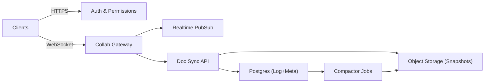

```markdown
---
title: "Collaborative Document Editing"
category: "Real-Time & Media"
difficulty: "Hard"
tags: ["crdt", "realtime", "websockets", "offline-first", "consistency", "presence"]
---

## Overview

This system is a Google Docs–style collaborative editor that supports concurrent edits, low-latency typing, and true offline work with later reconciliation. The core idea is to make *the client* authoritative for editing semantics (via a proven CRDT), while the backend focuses on three boring jobs: secure session/auth, efficient fanout, and durable persistence with compaction.

The elegant move is **separating “document truth” from “document storage.”** We don’t ask the server to understand rich-text operations or do transforms. Instead, clients exchange CRDT deltas; the server simply relays deltas to collaborators and persists them as an append-only log with periodic snapshots. Offline reconciliation becomes a sync problem (missing deltas), not a concurrency problem (transforms).

I’d implement this with a Yjs-style CRDT model: fast local edits, binary deltas, and state-vector based catch-up. Everything else—auth, permissions, audit/versioning, exports—can be layered without touching the concurrency core.

## What Makes This Hard

Naive designs centralize ordering: “send ops to server, serialize, broadcast.” That feels safe until you add offline edits, flaky mobile networks, and multi-tab sessions. Then you either lose edits, invent complex retry/transform logic, or accidentally introduce subtle divergence bugs.

The real trap is **unbounded growth and sync cost**. CRDTs are correct-but-not-free: if you just “store all updates forever,” documents become slower to load, reconnect storms hammer your database, and compacting incorrectly can silently corrupt state. The hardest part isn’t merging—it’s keeping the mergeable history *bounded* while preserving correctness and fast catch-up.

## Requirements

### Functional Requirements
- Real-time coauthoring with sub-150ms perceived latency for local edits (remote <300ms typical).
- Offline-first: edits made offline must reconcile without conflicts or manual merge.
- Multiple devices/tabs per user; must not duplicate or reorder a user’s own edits incorrectly.
- Presence (“who’s here”, cursors) must be real-time but not durable; it must not block editing.
- Access control (view/comment/edit) enforced on every connection and every persisted update.
- Version history and “restore” built from snapshots + update log (not from bespoke save states).

### Scale Targets
- 10M DAU, 1M peak concurrent editors.
- Median doc: 1–5 active editors; p95 doc: 20 editors; rare spikes: 200 (all-hands).
- Edit rate: ~2–5 logical ops/sec/editor while typing; bursty (paste/format creates spikes).
- Fanout: worst-case doc 200 editors → one update becomes 199 outbound messages.
- Storage: assume 50KB–5MB snapshot per doc (rich-text) + deltas between snapshots.
Why these numbers matter: fanout drives gateway CPU/network; snapshot+delta strategy drives database I/O and reconnect performance.

## Key Design Decisions

- **Choose CRDT deltas + state-vector sync (Yjs-like)**
  - Rejected: server-serialized OT as the primary truth.
  - Why: CRDT gives local-first latency and offline reconciliation without a central transform bottleneck; state vectors make catch-up efficient (send only what’s missing).

- **Persist an append-only update log + periodic snapshots**
  - Rejected: “store only latest doc JSON” or “store infinite op history without compaction.”
  - Why: append-only is easy to make correct and auditable; snapshots bound replay time and database reads; together they enable fast cold start and robust recovery.

- **Separate “editing channel” from “presence channel”**
  - Rejected: storing cursors/presence in the same durable stream as edits.
  - Why: presence is high-churn and ephemeral; coupling it to durability increases cost and makes outages user-visible in the worst way (“typing blocked because cursor service is down”).

## Architecture



### Components

- `Clients`
  - Run the CRDT engine, apply local edits instantly, buffer offline updates, and sync via state vectors.
  - This is where complexity belongs: it’s closest to user intent and easiest to test end-to-end.

- `Auth & Permissions`
  - Issues short-lived tokens scoped to a doc and role (view/comment/edit).
  - Keeps the gateway stateless and prevents “open websocket, then check later” security gaps.

- `Collab Gateway`
  - Terminates WebSockets, authenticates, rate-limits, and does fanout via pubsub.
  - Stateless so it scales horizontally; it does not interpret document operations.

- `Realtime PubSub` (Redis Cluster)
  - Provides low-latency fanout per document channel.
  - If it hiccups, editing still proceeds locally; users temporarily stop seeing others’ updates (degraded but safe).

- `Doc Sync API`
  - The durable edge: accepts CRDT updates for persistence, serves catch-up (missing updates), and manages snapshots.
  - This is where idempotency and correctness checks live.

- `Postgres (Log+Meta)`
  - Stores doc metadata (owner, ACL pointers, latest snapshot pointer) and an append-only updates table partitioned by doc.
  - Postgres is boring, consistent, and operationally straightforward for this access pattern.

- `Object Storage (Snapshots)`
  - Stores compressed CRDT snapshots (and optional exports like PDF) cheaply.
  - Snapshots are the fast-path for cold loads and compaction.

- `Compactor Jobs`
  - Periodically materialize a new snapshot and mark old deltas as compacted.
  - The job is the lever that keeps performance stable over time.

## Deep Dive: Offline Reconciliation Without Server Transforms

The winning trick is **state-vector synchronization**, which turns “offline merge” into “what updates am I missing?” Each client maintains a CRDT state and a compact “state vector” summarizing what it has seen (e.g., per-client logical clocks). When reconnecting, the client sends its state vector to `Doc Sync API`.

The server does not compute transforms. It responds with:
1) The latest snapshot pointer (if the client is far behind), and
2) Only the deltas the client lacks since that snapshot (computed by comparing the client state vector to stored updates).

A concrete flow:
- On connect, client fetches `snapshot_id` + snapshot bytes from `Object Storage`, loads into CRDT, then asks for deltas after `snapshot_id`.
- While online, client sends updates as binary deltas tagged with `(doc_id, author_device_id, monotonic_seq)`.
- Server persists updates idempotently (unique constraint on `(doc_id, author_device_id, monotonic_seq)`), then publishes them to the doc channel.
- Offline edits accumulate locally; on reconnect, client sends its state vector; server returns only missing deltas; client merges locally (CRDT guarantees convergence).

Bounding growth (the part teams get wrong):
- The updates table grows without limit unless compacted. Compaction produces a new snapshot that subsumes older deltas.
- Compaction must be careful: it can only prune deltas older than a “safe point” (e.g., once a snapshot includes them and you keep a tail window for late clients). Practically: keep deltas for N days or last K updates even after snapshotting.
- Clients that are *too* stale (older than retention) must be forced to reload from the latest snapshot, not replay missing deltas that no longer exist.

This yields a system that is correct under concurrency, resilient to offline, and operationally predictable because replay costs are bounded by snapshot interval and delta retention.

## Trade-offs

| Optimized For | Sacrificed |
|--------------|------------|
| Offline-first correctness | More client complexity |
| Low-latency local edits | Harder server-side “validation” of intent |
| Simple, stateless gateway | Reliance on robust client CRDT library |
| Bounded load via snapshots | Background compaction pipeline |

## Failure Modes

- **Redis/pubsub outage**
  - What happens: users can edit locally; remote edits stop appearing in real time.
  - Detect: gateway publish failures, doc channels with sudden drop in outbound messages.
  - Recover: gateway falls back to “persist-only” mode; clients poll `Doc Sync API` for deltas every few seconds until pubsub returns.

- **Postgres slow / write amplification (hot docs)**
  - What happens: updates queue up; increased end-to-end latency; risk of disconnects.
  - Detect: p95 insert latency, connection pool saturation, per-doc partition hotspots.
  - Recover: shed load with per-doc rate limits, prioritize “persist then broadcast,” increase snapshot frequency for hot docs, and partition updates table by `(doc_id hash)` to spread I/O.

- **Client duplication / out-of-order retries**
  - What happens: without idempotency, the log bloats and remote viewers see repeated updates.
  - Detect: rising conflict on unique constraints, repeated `(author_device_id, seq)` attempts.
  - Recover: enforce idempotent inserts; gateway can also dedupe in-memory per connection as a best-effort optimization.

## What I'd Do Differently At...

- **10x scale:**
  - Move from Redis PubSub to a sharded realtime layer with sticky routing per `doc_id` (still boring), so a single doc’s fanout stays on one shard and cross-node chatter drops.
  - Add regional read replicas for snapshot metadata and keep WebSockets region-local.

- **100x scale:**
  - Replace Postgres update-log with a purpose-built append log (Kafka/Pulsar) *per doc shard* and keep Postgres for metadata only.
  - Multi-region active-active becomes the hard problem: you’ll need region-local gateways with CRDT still safe, but you must design for cross-region pubsub and snapshot consistency (and accept higher inter-region latency).

## Operational Notes

- Snapshot interval is your main cost/perf knob; tune based on “time-to-open doc” and “reconnect storm” metrics.
- Keep presence separate and lossy; never page on “cursor desync.”
- Instrument per-doc hotness (edit rate, fanout) and apply doc-level rate limits before global ones.
- Enforce strict token scoping to `doc_id` and role on the WebSocket handshake; do not rely on client behavior for access control.
- Have a clear “stale client” policy: if state is older than delta retention, force snapshot reload rather than attempting partial recovery.
```