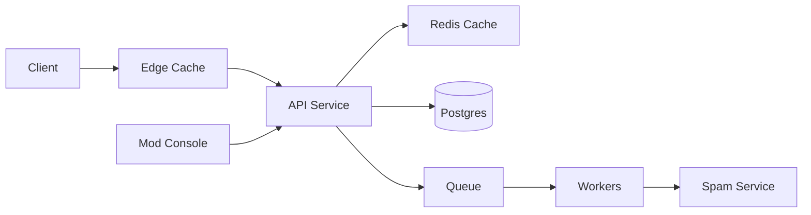

```markdown
---
title: "Comment System"
category: "Social & Discovery"
difficulty: "Medium–Hard"
tags: [comments, threading, moderation, spam, postgres, caching]
---

## Overview

This system is a threaded discussion platform with deep nesting, reliable pagination, and strong moderation/anti-spam controls. The key insight is to treat *writes* as simple (append a comment with `parent_id`) and make *reads* fast by serving the thread as a set of independently paginatable “reply lists” (top-level list, then children-per-parent lists), rather than trying to paginate an entire arbitrarily-deep tree as one continuous stream.

Naive designs reach for clever tree encodings (nested sets, materialized paths) to “make the tree easy,” then get trapped when moderation edits/deletes, spam quarantines, and high-fanout threads make the tree unstable and expensive to maintain. This design keeps Postgres as the source of truth, uses keyset pagination everywhere, and adds only two “earned” pieces of complexity: a caching strategy for hot threads and a state machine for moderation/spam that prevents toxic content from leaking while still keeping latency low.

## What Makes This Hard

The trap is believing “threaded + pagination” means “paginate the whole tree.” In practice, a global tree order is brittle: inserting a reply deep in the tree changes what “page 3” means, moderation can remove nodes and reflow the display, and any attempt to keep a precomputed traversal order consistent becomes a maintenance job you’ll hate at 3am.

The second trap is moderation/spam as an afterthought. If you accept writes and “fix it later,” spam becomes visible (screenshots happen), and the system trains users to distrust it. You need an explicit visibility model (published vs quarantined vs removed) and you must design reads so that hidden content doesn’t accidentally affect pagination, counts, or caching in confusing ways.

## Requirements

### Functional Requirements
- Threaded comments with arbitrary depth; reply-to any comment.
- Pagination that is stable under concurrent writes (no duplicates/missing items while paging).
- Moderation actions: remove, lock threads, user-level sanctions (mute/ban/shadow-ban), audit trail.
- Anti-spam filtering with quarantine and automated decisions; minimize false positives leaking publicly.
- Fast “thread view”: show top-level comments and a limited preview of replies, with “load more replies” per branch.

### Scale Targets
- 10M DAU reading comments; 1M DAU writing.
- Peak reads: 150k req/s (thread views + “load more replies”), driven by viral posts.
- Peak writes: 10k comments/s sustained during events.
- Data: 1B comments over a few years; median thread small, tail includes huge fanout (e.g., 1M comments on a single post).
Why these numbers matter: the tail dictates caching, hot-key behavior, and query patterns; the median dictates cost.

## Key Design Decisions

- **Decision 1: Paginate reply lists, not the whole tree**
  - Chose: keyset pagination per `(thread_id, parent_id)` reply list.
  - Rejected: single global traversal pagination for the entire thread.
  - Why: stable cursors, simpler queries, moderation doesn’t rewrite the world; UI can still render “deep nesting” by progressively expanding branches.

- **Decision 2: Explicit visibility state machine**
  - Chose: `visibility_state` on each comment (`PUBLISHED`, `QUARANTINED`, `REMOVED`, `SHADOW_HIDDEN`), plus per-user “can_view” rules.
  - Rejected: hard deletes and “best effort” filtering at read time.
  - Why: prevents leakage, produces deterministic behavior for pagination/counts, enables audit and appeals.

- **Decision 3: Postgres as source of truth, Redis as hot-thread accelerator**
  - Chose: Postgres for writes/consistency; Redis for caching first-page reply lists and metadata.
  - Rejected: introducing Kafka + bespoke materialized views as a starting point.
  - Why: small team operability; most complexity here is product semantics, not infrastructure.

## Architecture



### Components

- **API Service**: owns thread read/write semantics (pagination, visibility rules, reply previews). This is where “correctness” lives.
- **Postgres**: source of truth for comments, moderation actions, and user sanctions. Strong consistency simplifies “what is visible?” decisions.
- **Redis**: caches hot reply lists (especially top-level first page) and thread metadata (counts, lock state). Protects Postgres during viral spikes.
- **Queue + Workers**: asynchronous spam scoring, rate-limit enforcement signals, cache warming/invalidations, and moderation side effects (e.g., re-evaluations).
- **Spam Service**: ML/heuristic scoring; returns score + recommended action. API never blocks on it for long.
- **Edge Cache**: absorbs anonymous read traffic for popular threads; cache keys incorporate “viewer class” (e.g., logged-out vs logged-in).
- **Mod Console**: uses the same API paths with elevated auth to ensure one behavioral surface.

## Deep Dive: Serving Deep Threads With Stable Pagination

The hardest part is combining (a) deep nesting, (b) stable pagination, and (c) hidden content, without turning every thread view into a recursive query explosion.

### Data model (minimal but sufficient)
- `comments(id, thread_id, parent_id, author_id, created_at, body, visibility_state, spam_score, edited_at, deleted_at, ...)`
- `comment_meta(comment_id, direct_reply_count, last_reply_at, ...)` (optional denormalization)
- Indexes:
  - `comments(thread_id, parent_id, created_at, id)` for keyset pagination of children
  - `comments(thread_id, created_at, id)` for moderation sweeps / thread scans
  - `comments(author_id, created_at)` for rate limiting and abuse investigations

### Read pattern: “budgeted expansion”
A thread page returns:
1) **Top-level page**: `parent_id IS NULL` with keyset cursor `(created_at, id)`.
2) **Reply previews**: for each returned comment, fetch the first `k` children (e.g., 2–3) *in batch*.

The batching is the trick that keeps it elegant:
- Take the set of `parent_ids` from the top-level page.
- Query children with a window function (or equivalent) to get first `k` per parent in one round trip.
- Return `has_more_replies` based on `direct_reply_count > k` (or by fetching `k+1`).

When the client expands a branch, it calls:
- `GET /threads/{thread_id}/comments?parent_id={x}&cursor=...&limit=...`
This is the same operation at every depth: one parent, one paginated reply list.

### Visibility and pagination correctness
Pagination operates on the *visible subset* for the viewer:
- Default viewer sees only `PUBLISHED`.
- Moderators see all states.
- Shadow-banned users’ comments are visible to themselves but appear as `SHADOW_HIDDEN` to others.

To keep cursors stable:
- Use keyset pagination on `(created_at, id)` within `(thread_id, parent_id)` and filter by visibility in the WHERE clause.
- Do not mix “include hidden but collapse it” into the same list; that causes cursor drift and confusing “missing” items. Instead, return placeholders only when explicitly requested (e.g., moderators, or “show removed”).

### Spam flow that doesn’t leak
- On write: API does lightweight synchronous checks (rate limits, link heuristics). If obviously bad, mark `QUARANTINED` immediately.
- Otherwise: write as `PUBLISHED` only if the spam service responds quickly with “clean”; if not, write as `QUARANTINED` and let workers promote to `PUBLISHED` asynchronously.
This biases toward safety: you’d rather delay a small fraction of legit comments than publish spam.

## Trade-offs

| Optimized For | Sacrificed |
|--------------|------------|
| Operational simplicity (Postgres + Redis) | “Perfect” single-stream tree pagination |
| Safety (no spam leakage) | Occasional quarantine latency for legit users |
| Stable cursors under churn | Instant full-thread consistency across all caches |
| Fast hot-thread reads | More complex cache invalidation semantics |

## Failure Modes

- **Hot thread thundering herd**
  - Happens: viral post causes cache misses; Postgres gets hammered on the same `(thread_id, parent_id=NULL)` query.
  - Detect: Redis miss rate + elevated DB CPU/lock waits on the index.
  - Recover: cache first page aggressively with short TTL + request coalescing; optionally serve slightly stale cached pages during incident.

- **Spam service degradation**
  - Happens: spam scoring times out; writes pile up or spam leaks.
  - Detect: queue lag, timeouts, increased quarantine rate.
  - Recover: fail closed by defaulting to `QUARANTINED`, process backlog asynchronously; expose “pending” UI affordance.

- **Moderator actions not reflected immediately**
  - Happens: cache serves a removed comment for a short window.
  - Detect: audit mismatch reports, mod console “still visible” complaints.
  - Recover: targeted cache bust on moderation events (by thread + parent); keep TTLs short for hot keys; ensure API enforces visibility even on cached payloads (store only IDs in cache when necessary).

## What I'd Do Differently At...

- **10x scale:** Partition Postgres by `thread_id` hash (or by time + thread hotness), add read replicas for moderation tooling, and introduce cache warming for trending threads.
- **100x scale:** Move to an event log + read model for thread views (e.g., Kafka + materialized reply-list indices), because the long tail of huge threads and moderation churn will make “serve everything from Postgres” increasingly expensive.

## Operational Notes

- Treat `visibility_state` transitions as audited events; you need “who hid what, when, and why.”
- Cache keys must include viewer class (anonymous vs authenticated; moderator vs normal), or you will leak hidden content.
- Rate limits should be per user and per thread (spam often targets a single thread); store counters in Redis with short TTLs.
- Keep reply previews small and bounded; unbounded recursive expansion is how you DOS yourself with legitimate traffic.
```