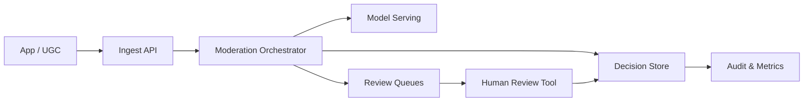

```markdown
---
title: "Content Moderation (AI + Human)"
category: "AI/ML Infrastructure"
difficulty: "hard"
tags: ["moderation", "ml-serving", "human-in-the-loop", "workflow", "calibration", "audit"]
---

## Overview

This system moderates user-generated content with a model-first pipeline that **abstains deliberately** and escalates uncertain or high-risk cases to human review. The key insight is to treat moderation as a **risk-routing problem**, not a classification problem: the output we care about is a *decision with a confidence bound, policy rationale, and audit trail*, not a label.

The elegant design is a **policy-aware cascade**: a fast, cheap model screens most content; only a small fraction reaches heavier models or humans. Humans are not a generic fallback—they are a **scarce, rate-limited resource** managed with explicit SLAs, priority queues, and sampling. The system is built around replayable events and immutable decisions so we can rejudge content when policies or models change without guessing what happened.

## What Makes This Hard

Naive implementations make one of two mistakes: they either (1) “pick a threshold” and discover months later that model confidence is not calibrated, creating silent policy violations, or (2) send “low confidence” to humans without queue discipline, causing backlog growth that destroys user experience and reviewer quality.

The trap is that the hardest failures are **systemic**: distribution shift, adversarial content, and queue saturation interact. When humans fall behind, teams raise thresholds to reduce escalations, which increases false negatives precisely when risk is highest. A good design makes this feedback loop explicit and controlled.

## Requirements

### Functional Requirements

- **Policy-aware decisions:** decisions must reference a policy/rule version (e.g., “Hate/Harassment v7”), not just a class label.
- **Abstention + escalation:** models must be allowed to say “I don’t know”; escalation rules depend on policy severity, user trust level, and content reach (views/followers).
- **Deterministic auditability:** every decision is reproducible: input pointers, model versions, features used, and reviewer actions are stored immutably.
- **Re-review and replay:** reprocess historical content when models/policies change, with safe idempotency and rate limits.
- **Human workflow integrity:** double-review for the highest-severity policies; disagreement handling; reviewer quality metrics and sampling for calibration checks.

### Scale Targets

- **Ingest:** 5k content items/sec peak (images/video posts + comments); bursty with product launches.
- **Decision latency:** P95 300ms for “allow/block with high confidence” (fast path); P95 10 minutes for human-reviewed items (SLA tiers).
- **Escalation rate:** target 0.5–3% of items to humans; bounded by reviewer capacity and policy risk appetite.
- **Storage:** immutable decision log for 400M decisions/year; must support replay queries and audits.

These numbers matter because they force (1) an asynchronous design for anything human-related, and (2) a calibrated routing strategy so the human queue remains stable under bursts.

## Key Design Decisions

- **We chose a policy-aware cascade with explicit abstention.**
  - Rejected: single “giant model” that handles everything.
  - Why: the cascade makes cost and latency predictable, and abstention prevents confident wrong decisions from becoming silent incidents.

- **We chose an event log as the system’s source of truth (Kafka), with an immutable decision store (Postgres).**
  - Rejected: request/response-only moderation with best-effort logging.
  - Why: moderation requires replay, audits, and “what did we decide then?” queries; an append-only log makes this cheap and reliable.

- **We chose queue discipline as a first-class product feature (priority + SLA + capacity controls).**
  - Rejected: “low confidence goes to humans” without prioritization.
  - Why: the human team is the limiting reagent; stability requires explicit throttles, aging, and high-severity preemption.

## Architecture



### Components

- **Ingest API:** validates payloads, assigns content IDs, stores raw blobs (image/video/text) in object storage, and emits a moderation event containing pointers and metadata.
- **Moderation Orchestrator:** the brain: applies policy routing, calls models, computes calibrated risk, writes decisions, and enqueues human tasks with priority/SLA.
- **Model Serving:** a managed inference tier (GPU/CPU pools) hosting the cascade (fast screeners + heavier models); returns scores plus model/version metadata.
- **Decision Store (Postgres):** immutable-ish records (append-only decision history per content ID), reviewer actions, and policy/model versions for audits and replay.
- **Review Queues:** priority queues partitioned by policy severity and SLA (e.g., “Critical 5m”, “Standard 4h”), with strict rate limiting and dead-lettering.
- **Human Review Tool:** shows minimal necessary context, policy guidance, and model rationale; supports double-review and disagreement workflows.
- **Audit & Metrics:** dashboards and alerting for calibration drift, queue health, false negative proxies, reviewer quality, and policy KPI reporting.

## Deep Dive: Confidence Calibration + Routing (The Hardest Part)

The orchestrator does not route on raw model “confidence.” It routes on a **calibrated probability of policy violation** and an explicit **cost model**. The key is to make the routing function stable under drift and load.

1) **Calibrated risk, per policy tier**  
We calibrate each model’s scores using temperature scaling (or isotonic regression when needed) on a continuously refreshed, human-labeled evaluation set. Calibration is tracked per policy family (e.g., harassment vs. self-harm) because score distributions differ. The orchestrator stores both raw scores and calibrated probabilities so we can detect when calibration breaks rather than hiding it.

2) **Cost-based decision bands, not one threshold**  
For each policy tier we define bands:
- **Auto-allow:** calibrated risk below `T_allow(policy, context)`
- **Auto-action:** calibrated risk above `T_action(policy, context)` (block, blur, age-gate, etc.)
- **Abstain:** the middle band routes to humans or heavier models

`context` includes reach (views/followers), user trust, and surface (comment vs. profile picture). This is the non-obvious move: we do not treat all items equally; we treat *potential harm* as multiplicative with uncertainty.

3) **Queue-aware routing without compromising safety**  
When queues saturate, the system does not “raise thresholds” globally. Instead:
- It preserves **Critical** policies with fixed SLAs (no degradation).
- It increases **model depth** for Standard policies (use heavier models to reduce abstains) before using humans.
- It applies **controlled deferral** for low-reach, low-severity items (temporary “limited visibility” state) to buy time without silently allowing harmful content.

This avoids the classic death spiral where human backlog causes threshold inflation and increased false negatives.

## Trade-offs

| Optimized For | Sacrificed |
|--------------|------------|
| Auditability and replay | Simplicity of a pure request/response flow |
| Stable human workload | Maximum automation rate in edge cases |
| Explicit safety posture | Lowest possible moderation latency for abstained items |

## Failure Modes

- **Human queue overload**
  - What happens: review tasks age out; SLAs fail; pressure to weaken routing.
  - Detect: queue depth/age alarms per priority tier; “abstain rate” spikes; backlog burn-down forecasts.
  - Recover: shed low-severity work via temporary limited-visibility, increase model depth, add reviewer capacity; never degrade Critical queues.

- **Model miscalibration / drift**
  - What happens: “high confidence” decisions become wrong; silent incident risk.
  - Detect: online canaries + shadow-labeled sampling; ECE/KS drift metrics; disagreement rate between humans and model for sampled items.
  - Recover: freeze thresholds, widen abstain band, roll back model version, fast-track recalibration using newest labeled slice.

- **Inference tier partial outage**
  - What happens: orchestrator can’t score content; throughput collapses.
  - Detect: elevated model RPC errors/latency; orchestrator fallback counters.
  - Recover: degrade to fast screener only, route uncertain to limited-visibility + queue, and replay missed events when serving recovers.

## What I'd Do Differently At...

- **10x scale:** split model serving into dedicated GPU pools per model class, add regional Kafka mirroring for locality, and introduce automated re-review pipelines for policy changes.
- **100x scale:** accept that humans cannot scale linearly; re-architect around tighter product policy (fewer ambiguous categories), invest in active learning loops, and move to multi-region decisioning with strict data residency controls.

## Operational Notes

- Treat **threshold changes as deployments**: version them, review them, and roll them back like code.
- Maintain a **golden, human-labeled slice** that is sampled across time, locale, and surface; it is your calibration anchor.
- Store **content pointers, not content** in the decision store; enforce strict retention and redaction in the review tool.
- Run **replay drills**: pick a day’s worth of events, reprocess with a new model, and verify idempotency, cost, and audit outputs before real rollouts.
```