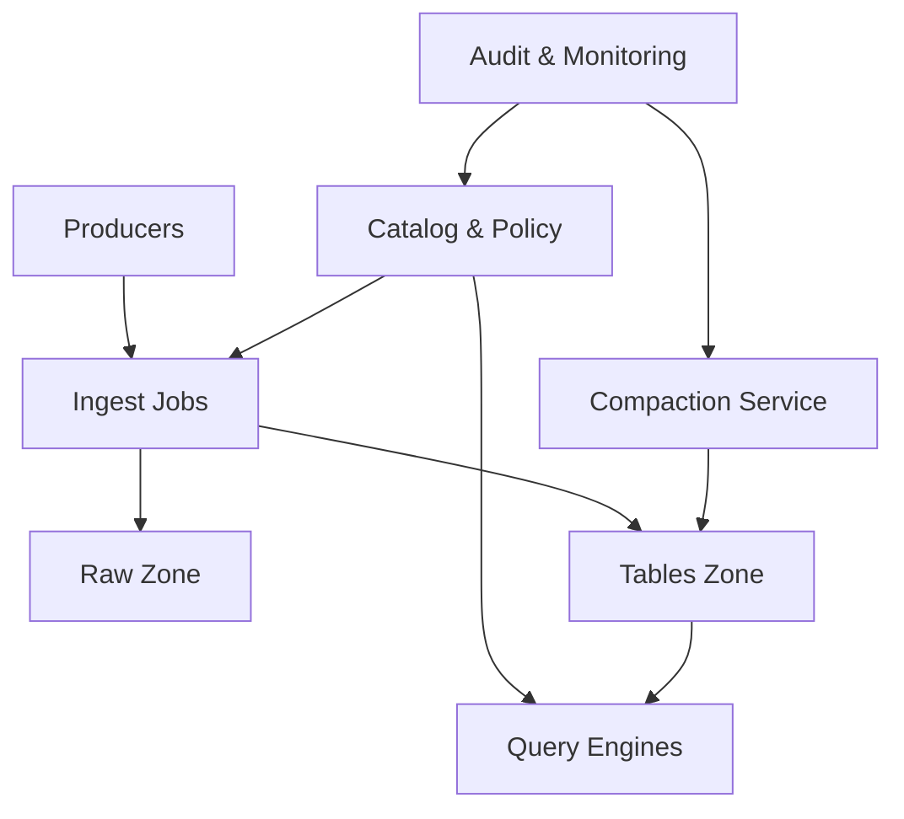

```markdown
---
title: "Data Lake Architecture"
category: "Storage & Data Platforms"
difficulty: "Hard"
tags: ["data-lake", "lakehouse", "iceberg", "hudi", "governance", "object-storage", "compaction"]
---

## Overview

This system is a governed “lakehouse on object storage” that supports modern table formats (Iceberg/Hudi) while treating raw object storage as an untrusted substrate. The key insight: **governance cannot be bolted on at the bucket level** once multiple engines (Spark, Trino, Flink, notebooks) touch the same data. Governance must be enforced through a **single control plane** (catalog + policy + credential vending) that all reads/writes traverse.

The elegant move is to separate concerns: use object storage for durability and cost, table formats for correctness (ACID-ish semantics, schema/partition evolution), and a compact, centralized governance layer for access and audit. Everything else—ingestion, compaction, querying—stays boring and replaceable.

## What Makes This Hard

Naive lakes fail in two predictable ways. First, they confuse “files in a bucket” with “tables”, so every engine re-implements discovery, schema, and transactional behavior differently. That yields inconsistent reads, broken backfills, and silent data corruption when jobs partially overwrite partitions.

Second, they try to enforce governance using only bucket/prefix permissions. That works until you need table-level grants, column masking, or to prevent analysts from bypassing the catalog and reading “raw” directly. Without a control plane that brokers access, you end up with compliance theater: policies exist, but cannot be proven or consistently enforced.

## Requirements

### Functional Requirements
- Support **Iceberg and Hudi** tables on the same object storage account, readable by common engines (Spark/Trino/Flink).
- Provide **ACID-like commit semantics** per table (no partial partition overwrites, snapshot-consistent reads).
- Run **partition compaction** (small-file consolidation) without breaking concurrent readers/writers.
- Enforce **table/column-level governance** and produce auditable access logs.
- Prevent **direct raw-object access** from becoming the de facto API (catalog must be the gate).

### Scale Targets
- Storage: **1–5 PB** total, object store as system of record.
- Tables: **1,000–5,000** tables, with **50k–200k partitions/day** across all tables (time-partitioned event data dominates).
- Ingest: **5–20 TB/day** sustained; bursts of **5–10×** during backfills.
- Query: **200–2,000 concurrent queries** in peak office hours, heavy fan-out on partition pruning.
- File shape target: **256MB–1GB data files**; anything smaller becomes compaction pressure and metadata bloat.

These numbers matter because they push you into a world where **metadata and small files** dominate costs and reliability, not raw throughput.

## Key Design Decisions

- **We chose:** A single, centralized **Catalog + Governance Control Plane** that issues short-lived credentials and is the only supported way to discover table locations.
  - **We rejected:** “Just use S3/GCS IAM on prefixes” as the main control mechanism.
  - **Why:** Prefix IAM can’t express table semantics (schemas, snapshots, column policies) and cannot stop catalog-bypass reads in practice.

- **We chose:** **Iceberg and Hudi as first-class formats**, but with a shared operational contract: all writes go through format-native commits; all engines must read via the catalog.
  - **We rejected:** Converting everything to one format up front.
  - **Why:** Real orgs already have Hudi/Iceberg, and forced migrations stall adoption. The control plane makes heterogeneous formats operable.

- **We chose:** A dedicated **Compaction Service** with explicit SLOs and backpressure, not “best effort” compaction embedded in ingestion jobs.
  - **We rejected:** Letting every pipeline decide its own file sizing.
  - **Why:** Compaction is a cross-cutting cost/risk lever; centralizing it prevents runaway spend and improves query stability.

## Architecture



### Components

- **Raw Zone (object storage):** Immutable landing area. Write-only for ingestion. Retention is short but non-zero (enables reprocessing and forensic investigation).
- **Tables Zone (object storage):** Managed table locations (Iceberg/Hudi). This is the durable, queryable layer. Direct human access is denied by default.
- **Catalog & Policy (control plane):** Source of truth for table metadata (schemas, partitions, snapshots) and the policy engine for grants/masking. Also vends short-lived credentials scoped to table locations.
- **Ingest Jobs (Spark/Flink):** Stateless compute that validates, normalizes, and commits to Iceberg/Hudi using native writers. No direct bucket browsing; it resolves locations via the catalog.
- **Query Engines (Trino/Spark SQL):** Read tables via the catalog. Engines get table-scoped, time-bound credentials; they never need broad bucket access.
- **Compaction Service:** Schedules and executes file rewrites (Iceberg rewriteDataFiles / Hudi clustering+compaction), and performs metadata hygiene (snapshot retention, manifest cleanup) under strict cost controls.
- **Audit & Monitoring:** Aggregates catalog decisions (who accessed what) plus format-level commit history into a tamper-evident audit stream; exposes operational health metrics.

## Deep Dive: Compaction Without Breaking Readers

Compaction is deceptively hard because it’s not “merge files”; it’s **rewrite data while preserving snapshot semantics** and avoiding write amplification spirals.

The core rule: **compaction must be a commit, not a side effect**. For Iceberg, the compactor reads a snapshot, plans rewrite groups (typically per partition), writes new data files, and atomically commits a new snapshot that swaps old file references for new ones. Readers stay correct because they read a consistent snapshot pointer; they either see the pre-compaction files or the post-compaction files—never a mix.

For Hudi, compaction depends on table type:
- **COW (Copy-on-Write):** clustering rewrites base files into larger ones; commits advance the timeline. Readers pick a consistent commit.
- **MOR (Merge-on-Read):** compaction merges log files into base files; schedule is critical because excessive logs degrade query latency. The compactor advances the timeline; readers choose a commit instant.

To keep this from becoming an unbounded cost center, the compaction service enforces three controls:
1. **SLO-based triggers:** compact when small-file count or log-file depth crosses thresholds that correlate with query pain (not on a cron alone).
2. **Rewrite budgeting:** cap rewritten bytes/day per dataset, and prioritize “hot” tables by query frequency and SLA impact.
3. **Conflict-aware planning:** avoid compacting partitions actively being overwritten/upserted. For Iceberg, respect isolation and retry on commit conflicts; for Hudi, avoid clustering/compaction overlapping heavy upsert windows.

The non-obvious win: once compaction is centralized and budgeted, you can size compute for steady-state and keep query engines stable even during backfills.

## Trade-offs

| Optimized For | Sacrificed |
|--------------|------------|
| Strong governance guarantees | Some friction for ad-hoc raw access |
| Operational simplicity via a single control plane | More responsibility placed on the catalog layer |
| Stable query performance (file shape, metadata hygiene) | Extra compute spend for compaction/cleanup |
| Multi-engine interoperability | Format-specific edge cases remain (Hudi MOR vs COW, Iceberg metadata growth) |

## Failure Modes

- **Catalog/policy outage**
  - **What happens:** writers can’t resolve table locations or commit; queries may fail or run with stale metadata.
  - **Detect:** elevated auth/catalog error rates, commit failures, query engine “table not found” spikes.
  - **Recover:** run the catalog HA (multi-AZ), cache read-only metadata in query engines with short TTL, and provide a break-glass read-only path for critical tables with tightly scoped, time-limited credentials.

- **Compaction runaway cost / write amplification**
  - **What happens:** compaction rewrites too much data (especially during backfills), driving object-store PUT costs and compute spend; ingestion falls behind.
  - **Detect:** rewritten-bytes/day vs ingested-bytes/day ratio, job queue growth, object-store request cost anomalies.
  - **Recover:** enforce per-table budgets, pause low-priority compaction, and tighten file-size targets at ingestion to prevent small-file creation at the source.

- **Governance bypass via direct object access**
  - **What happens:** analysts or rogue jobs read raw/tables paths directly, bypassing grants/masking and destroying auditability.
  - **Detect:** object-store access logs show reads from principals not minted by the control plane; mismatched audit vs storage logs.
  - **Recover:** deny broad bucket access; require credential vending; continuously reconcile storage logs against catalog-issued session IDs and alert on drift.

## What I'd Do Differently At...

- **10x scale:** split the catalog into read-optimized metadata serving and write/commit coordination, and introduce dedicated metadata caching for high-QPS query engines; invest in automated metadata cleanup (Iceberg snapshot expiration, manifest rewriting; Hudi timeline archiving).
- **100x scale:** treat metadata as the bottleneck: shard catalogs by domain, isolate “hot” tables onto dedicated prefixes/buckets for request-rate scaling, and move from batch compaction to continuous optimization for the top-tier datasets (especially Hudi MOR log management).

## Operational Notes

- Track and alert on **small-file counts**, **manifest/listing sizes**, and **Hudi log depth**; these are the leading indicators of future outages.
- Enforce **schema evolution policy** (who can add columns, how types change) in the catalog, not in individual pipelines.
- Run **retention and cleanup** as first-class jobs: snapshot expiration and orphan file deletion (Iceberg), timeline + archive management (Hudi). Without this, metadata grows until listing and planning dominate query time.
- Make “raw” explicitly **not for querying**: write-only + short retention + separate encryption keys. If raw is queryable, it will be used—and governance will lose.
- Audit must be **reconcilable**: catalog decision logs should be joinable with object-store access logs via session IDs to prove enforcement.
```