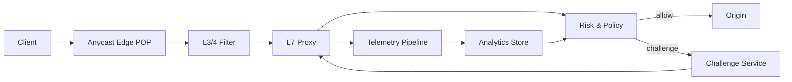

```markdown
---
title: "DDoS Protection System"
category: "Observability & Reliability"
difficulty: "Hard"
tags: ["ddos", "scrubbing", "rate-limiting", "bot-mitigation", "edge", "anycast"]
---

## Overview

This system is a DDoS “scrubbing pipeline” that sits in front of an origin and decides—at line rate—whether each request is allowed, throttled, challenged (CAPTCHA/PoW), or dropped. The elegant insight is to separate **fast, deterministic edge decisions** from **heavy analytics**: the edge runs a small set of proven mitigations plus a risk score, while deeper pattern discovery runs asynchronously and only feeds back coarse, stable policies.

Most teams fail here by treating DDoS as a single problem. It’s two: (1) absorb and shape traffic at extreme scale without falling over, and (2) selectively add user friction so you shed attackers faster than you shed legitimate users. This design makes challenges **stateless and verifiable at the edge**, so mitigation doesn’t depend on centralized databases during an attack.

## What Makes This Hard

Naive implementations assume “detect then block.” In real attacks, you must **mitigate while you’re still unsure**. If you wait for certainty, you melt; if you block aggressively, you self-DDoS your real customers. The trap is coupling the hot path (request handling) to the cold path (analytics, dashboards, ML, ticketing). Under attack, anything that requires a cross-region lookup, a database write, or a consistent global view becomes the bottleneck.

The second trap is challenges: CAPTCHAs break APIs and accessibility; PoW burns mobile batteries and can be GPU-mined by attackers. The hard part is making challenges **adaptive** (based on system stress and attacker behavior) while keeping them cheap to validate and hard to bypass at scale.

## Requirements

### Functional Requirements
- Detect and mitigate L3/4 floods, L7 floods, and low-and-slow attacks without requiring manual intervention.
- Apply **progressive friction**: allow → rate-limit → PoW → CAPTCHA → block, based on risk and system stress.
- Make challenge verification **stateless on the edge** (no per-request DB/cache dependency).
- Provide operator controls: emergency “lockdown,” allowlists, per-customer policies, and safe rollout (shadow mode).
- Produce explainable signals (why a client was challenged/blocked) for on-call debugging.

### Scale Targets
- **Peak ingress:** 1 Tbps and/or 50M packets/sec (volumetric floods are the common failure mode; design for bandwidth and PPS).
- **HTTP load:** 10M requests/sec sustained across POPs, with < 5ms added p95 edge processing (L7 floods are CPU-bound; latency budget forces simple hot-path logic).
- **Mitigation reaction time:** < 10 seconds from attack onset to stable policy (operators don’t have time; feedback must be automatic).
- **State tolerance:** edge continues to mitigate with control plane down for 30 minutes (attacks often coincide with upstream outages).

## Key Design Decisions

- **What we chose:** Anycast edge POPs with a two-stage datapath: **L3/4 fast filter** + **L7 proxy with risk scoring and challenges**.  
  **What we rejected:** a single regional scrubber or centralized “brain” making per-request decisions.  
  **Why:** anycast spreads blast radius and keeps mitigation close to the ingress point; centralized decisions create a single hot bottleneck exactly when traffic spikes.

- **What we chose:** Stateless, signed challenge tokens + progressive friction (PoW first for APIs, CAPTCHA only for interactive flows).  
  **What we rejected:** per-client server-side sessions or CAPTCHA everywhere.  
  **Why:** stateful challenges collapse when caches/DBs thrash; CAPTCHAs are unusable for APIs and destroy conversion.

- **What we chose:** Simple, robust detection features in the hot path; deeper pattern mining asynchronously feeding coarse policies.  
  **What we rejected:** ML-first real-time classification requiring feature stores and model services on the request path.  
  **Why:** the “perfect classifier” is irrelevant if it can’t run during an attack; boring features + fast control loops win.

## Architecture



### Components

- **Anycast Edge POP**: The scaling unit. Each POP is able to mitigate independently so attacks don’t create a global dependency.
- **L3/4 Filter**: Drops obvious garbage cheaply (spoofing patterns, SYN/ACK anomalies, UDP amplification signatures) and protects the L7 CPU budget.
- **L7 Proxy**: Terminates TLS/HTTP and normalizes requests so downstream logic operates on consistent signals (method, path, headers, fingerprint).
- **Risk & Policy**: The decision engine: per-identity rate limits, anomaly flags, and progressive friction selection. It is designed to work with local state only.
- **Challenge Service**: Issues signed tokens and challenge parameters (PoW difficulty, CAPTCHA mode) and validates responses without server-side sessions.
- **Telemetry Pipeline**: High-throughput event stream of sampled requests, counters, and decisions for offline analysis and for near-real-time aggregates.
- **Analytics Store**: OLAP storage for fast “what’s happening?” queries and pattern mining; outputs coarse rules (e.g., bad ASN, path hotspot, fingerprint surge).

## Deep Dive: Adaptive Challenges Without Stateful Dependencies

The hardest part is applying friction fast enough to save the system while avoiding broad false positives. The key is to treat challenges as a **control mechanism**, not a binary “human check.”

### 1) Identity and scoring that survives bot churn
At the edge, build a stable “client identity” from what you can trust under attack:
- Network: source IP + /24 (or /56 for IPv6) to tolerate NAT while still grouping bots.
- TLS/HTTP fingerprint: JA3/JA4, ALPN, header order, user-agent family.
- App signal when available: authenticated user/session, API key, device attestation.

Compute a risk score from cheap features that correlate with abuse:
- Burstiness (requests/sec delta), error ratio, cache-miss ratio, path entropy, unusual method mix.
- Reputation inputs from analytics (bad ASNs, known bot fingerprints) as *coarse multipliers*, not per-request lookups.

This is intentionally not “smart”; it is **predictable under load**.

### 2) Stateless challenge tokens (no cache required)
When the policy engine decides “challenge,” it mints a short-lived token:
- `token = HMAC(k_pop, client_id | policy_id | exp | nonce)`
- The token is returned as a cookie/header, and embedded into the PoW puzzle (or CAPTCHA transaction id).
- Verification is a pure computation at the edge: recompute HMAC, check expiry, and ensure the response binds to the token.

No Redis round-trip is required to validate challenges during an attack. Replay is controlled by short TTLs and binding to `client_id`; you accept that NAT sharing may cause occasional friction, and you mitigate that by binding to a prefix + fingerprint (not raw IP alone).

### 3) Adaptive difficulty as a feedback loop
Difficulty is not “how hard is the attacker,” it’s “how close are we to falling over.”
- Inputs: per-POP CPU saturation on L7, connection table pressure, upstream error rate, and challenge solve rate.
- Control: as saturation rises, shift more traffic from “rate-limit” to “PoW,” and increase PoW difficulty for higher-risk cohorts.
- Guardrails: never challenge authenticated, paid customers above a configured threshold without a manual toggle; fail open/closed per customer policy.

This turns DDoS into a resource allocation problem you can tune with SLOs, rather than an endless signature chase.

## Trade-offs

| Optimized For | Sacrificed |
|--------------|------------|
| Surviving unknown attacks with minimal dependencies | Perfect attribution of “who is bad” in real time |
| Cheap edge verification (stateless tokens) | Some friction for NAT/shared networks during spikes |
| Simple hot-path logic that holds under load | Rich per-request explainability without sampling |
| Fast operator control and safe rollout | Fine-grained global consistency across POPs |

## Failure Modes

- **Control plane outage during an attack**
  - *What happens:* POPs can’t fetch new policies.
  - *Detect:* policy fetch errors, stale version alarms.
  - *Recover:* POPs run on last-known-good policies; allow manual “lockdown profile” locally; replay policy updates once control plane returns.

- **False positives (flash crowd looks like a bot surge)**
  - *What happens:* real users get challenged/blocked, conversion drops.
  - *Detect:* spike in challenge rate + drop in authenticated sessions + origin 200s falling.
  - *Recover:* shift cohorts: exempt authenticated traffic, reduce difficulty, widen rate-limit buckets, enable shadow mode for new rules before enforcement.

- **Telemetry/analytics overload**
  - *What happens:* dashboards lag; analysts lose visibility, but mitigation must continue.
  - *Detect:* ingestion lag, dropped samples.
  - *Recover:* aggressive sampling + counter-only mode; keep hot-path independent; prioritize per-POP aggregates over raw logs.

## What I'd Do Differently At...

- **10x scale:** Add more POPs and push more logic into the L3/4 fast path (XDP/eBPF) to preserve L7 CPU; expand anycast capacity and upstream peering.
- **100x scale:** Split challenge issuance/verification into dedicated edge primitives (hardware offload where possible), and invest in automated customer-specific baselines to reduce false positives across diverse traffic profiles.

## Operational Notes

- Keep an audited “break glass” profile: block by country/ASN, force PoW site-wide, and bypass challenges for known-good authenticated cohorts.
- Roll out new rules in shadow mode and compare “would block” against real outcomes before enforcing.
- Store decision reasons as compact codes in edge logs; on-call needs fast answers, not post-hoc forensics.
- Treat challenge difficulty like a capacity lever: tie it to measured saturation, not gut feel.
```