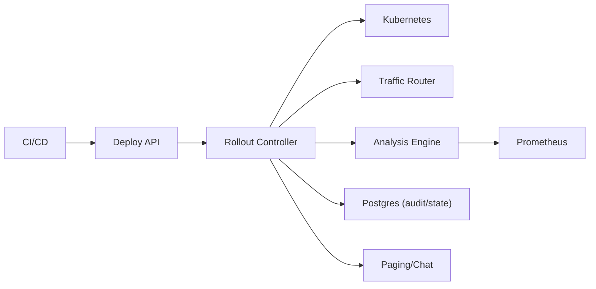

```markdown
---
title: "Deployment System (Blue/Green/Canary)"
category: "Observability & Reliability"
difficulty: "Advanced"
tags: ["progressive-delivery", "rollouts", "slo", "prometheus", "kubernetes", "reliability"]
---

## Overview

This system is an orchestration engine that turns “ship a new version” into a controlled experiment: shift traffic in small, reversible steps, continuously evaluate whether the new version is worse, and either promote or roll back automatically. The key insight is to treat deployments as **SLO-governed risk allocation** rather than a sequence of Kubernetes operations.

Most teams focus on mechanics (blue/green vs canary) and get surprised by the real enemy: **noisy, missing, and misleading signals**. This design is elegant because it separates concerns cleanly: Kubernetes executes *changes*, a traffic router executes *exposure*, and an analysis engine executes *decisions*—with a small, explicit state machine that is idempotent under failure.

## What Makes This Hard

Naive implementations roll back on the first scary metric spike and end up training engineers to disable automation. The trap is that production metrics are non-stationary (diurnal patterns), bursty (queueing), and often incomplete (scrapes fail, labels change). If you don’t control for baseline and sample size, your “automated analysis” becomes automated randomness.

The second trap is orchestration correctness: partial failures happen mid-rollout (router updates succeed but analysis job dies; controller restarts mid-step; cluster API is slow). Without a single source of truth and idempotent transitions, you get stuck rollouts, double promotions, or rollbacks that don’t actually remove traffic.

## Requirements

### Functional Requirements
- Support **blue/green** and **canary** with step-based traffic shifting (e.g., 1% → 5% → 25% → 50% → 100%).
- Automated analysis with **explicit guardrails** (SLO burn-rate, error rate, tail latency, saturation), including **baseline comparison**.
- Fast fail for obvious breakage (crash loops, 5xx spikes) and slower confidence building for subtle regressions (p95 latency creep).
- Automated rollback that is **safe and deterministic**: revert traffic first, then scale down new version, preserve debugability.
- Manual gates (one-click approve/abort) with full audit trail.
- Policy-as-code for per-service rollout strategy and metric gates.

### Scale Targets
- 2,000 services across 20 clusters.
- 10,000 deployments/day (CI-driven), peak 50 deployments/min during business hours.
- Per active rollout: ~30–80 Prometheus queries/min (multi-window, baseline+canary comparisons).
- Why these numbers matter: the analysis layer must be **cheap and cache-friendly**, and the control loop must be **edge-triggered** (react to state changes) rather than “poll everything constantly”.

## Key Design Decisions

- **Decision: Kubernetes-native control plane (CRDs + controller)**
  - Chose: A `Release` CRD with a reconciler that drives a small rollout state machine.
  - Rejected: A standalone orchestrator that imperatively calls `kubectl`/cluster APIs ad hoc.
  - Why: CRDs give idempotency “for free” (desired state + reconciliation), survive restarts, and integrate with existing RBAC/audit.

- **Decision: Comparative analysis over absolute thresholds**
  - Chose: Evaluate canary vs baseline (stable) using normalized metrics (e.g., error budget burn-rate and latency deltas).
  - Rejected: “Error rate < 1%” style fixed thresholds as the primary signal.
  - Why: Absolute thresholds break under diurnal shifts and traffic composition changes; baseline comparison keeps decisions stable and teaches teams to reason in regressions.

- **Decision: SLO burn-rate as the primary rollback trigger**
  - Chose: Multi-window burn-rate (fast + slow) for availability and latency SLOs, plus a small set of “hard stop” signals.
  - Rejected: Single-window p95/p99 thresholds as the main gate.
  - Why: Burn-rate aligns rollbacks to user impact and prevents tail-latency noise from flapping deployments.

## Architecture



### Components

- **Deploy API**
  - Accepts rollout requests (artifact digest, config, strategy), validates policy, writes a `Release` object, exposes status for CI.
  - Earns its place by being the *single* entry point that enforces “immutable artifact + approved policy” before touching prod.

- **Rollout Controller**
  - Watches `Release` objects and reconciles them through states: `Pending → Shifting → Evaluating → Promoting|RollingBack → Completed`.
  - Earns its place by making orchestration idempotent and restart-safe; it is the only component allowed to mutate rollout state.

- **Traffic Router**
  - Implements weighted routing and fast cutover (e.g., service mesh/ingress that supports percentage splits).
  - Earns its place by making “rollback” mean “remove exposure in seconds”, independent of Kubernetes pod lifecycle.

- **Analysis Engine**
  - Executes metric queries, applies multi-window burn-rate + regression tests, emits a signed decision (`pass|fail|inconclusive`) per step.
  - Earns its place by isolating the hardest logic (statistics + missing data handling) from the controller’s orchestration code.

- **Prometheus**
  - Source of truth for SLI/SLO signals; the system assumes teams already emit RED/USE metrics.
  - Earns its place because it’s the boring, ubiquitous substrate for production metrics and alerting.

- **Postgres (audit/state)**
  - Stores immutable rollout events, decisions, and the exact queries evaluated.
  - Earns its place because debugging “why did it roll back?” is an operational requirement, not a nice-to-have.

- **Paging/Chat**
  - Notifies on rollback, stuck rollouts, policy violations.
  - Earns its place by reducing mean-time-to-understand (MTTU) during incidents caused by releases.

## Deep Dive: Automated Metric Analysis & Rollback

The analysis engine runs **step-scoped experiments**. Each step has: traffic weight `w`, a warmup period, a measurement window, and explicit minimum data requirements. The engine produces one of three outcomes: `PASS`, `FAIL`, or `INCONCLUSIVE`. The controller treats `INCONCLUSIVE` as “hold” (do not advance) unless a timeout policy says otherwise—this prevents “advance on missing data”, a common and dangerous default.

**1) Use SLO burn-rate as the backbone.**  
For each service, define SLOs (availability, latency) as SLIs computed from Prometheus counters/histograms. For a window `T`, compute burn-rate:

- `burn_rate(T) = (error_budget_consumed_rate over T) / (error_budget_rate)`

Gate with two windows:
- **Fast window** (e.g., 5m) to catch acute breakage.
- **Slow window** (e.g., 30m) to catch creeping regressions.

Rollback if both exceed thresholds (e.g., `fast > 14x` and `slow > 2x`) to reduce false positives while still reacting quickly to real incidents.

**2) Compare canary to baseline to remove non-stationarity.**  
Rather than asking “is p95 < 300ms?”, ask “did p95 worsen vs stable by > X% while canary is exposed?”. Concretely:
- Baseline cohort = stable version receiving `(1-w)` traffic.
- Canary cohort = new version receiving `w` traffic.
- Evaluate deltas: `Δerror_rate`, `Δp95`, `Δsaturation` with confidence rules.

This matters because traffic mix changes (a single large customer) can move absolute numbers; baseline moves with it, and the delta isolates the version change.

**3) Enforce sample size and data integrity before judging.**  
A canary at 1% traffic may not have enough requests to evaluate tail latency. The engine checks:
- Minimum requests per window (e.g., 10k for p95 gating; lower for error-rate).
- Metrics freshness (last scrape age < threshold).
- Label cardinality sanity (version labels present and stable).

If not met, return `INCONCLUSIVE` and either extend the step window or increase traffic (policy-driven). This avoids the classic “rolled back due to 2 requests, one failed”.

**4) Make rollback semantics explicit: cut traffic first, then clean up.**  
On `FAIL`, the controller:
1. Sets router weight to 0% for canary (immediate user protection).
2. Freezes further changes and pins the failing revision for debugging (logs, traces).
3. Scales down canary only after traffic is removed and a short “stabilize” window passes.
4. Emits a single, human-readable cause: the specific SLO gate and query that failed.

That ordering is deliberate: teams need fast user impact mitigation *and* post-mortem visibility.

## Trade-offs

| Optimized For | Sacrificed |
|--------------|------------|
| Deterministic, restart-safe rollouts | Some flexibility vs ad-hoc scripts |
| Low false-positive rollbacks | Slower detection for subtle issues at tiny traffic weights |
| Operational debuggability (auditability) | Slightly more infrastructure (Postgres) |
| SLO-aligned decisions | Requires teams to maintain decent SLIs/SLOs |

## Failure Modes

- **Prometheus data gaps / query failures**
  - What happens: analysis returns `INCONCLUSIVE`, rollouts pause.
  - Detect: controller metric `analysis_inconclusive_total`, stuck rollout alerts on step timeout.
  - Recover: retry with backoff; fall back to a minimal “hard stop” health gate (crashloop/5xx spike) only; page if prolonged.

- **Traffic router update succeeds but controller crashes mid-step**
  - What happens: traffic is shifted but evaluation doesn’t progress.
  - Detect: router weight != controller-recorded desired weight; “drift” metric.
  - Recover: reconciliation corrects drift; controller resumes from `Release.status` safely (idempotent transitions).

- **Bad policy causes unsafe fast ramp**
  - What happens: too much traffic hits canary before confidence is established.
  - Detect: policy lint at admission + runtime guardrail “max weight per minute”.
  - Recover: enforce global safety limits (rate of change, max initial weight); abort rollout with clear error.

## What I'd Do Differently At...

- **10x scale:** shard the analysis engine by service/cluster and add aggressive query caching (shared baselines across concurrent rollouts).
- **100x scale:** move from “query Prometheus repeatedly” to streaming pre-aggregated SLIs (e.g., write SLI time series once) and treat analysis as consuming those, reducing Prometheus load and variance.

## Operational Notes

- The “golden” on-call question is **why** a rollout failed; store the exact PromQL, evaluated windows, and the computed deltas in Postgres.
- Treat `INCONCLUSIVE` as a first-class outcome; “advance on missing data” is how you ship blind.
- Rollback should page only when user impact is likely (burn-rate breach); noisy rollbacks create alert fatigue and get automation disabled.
- Keep the state machine small and observable: one controller metric per state transition, plus step duration histograms.
```