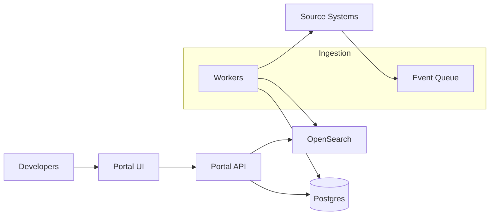

```markdown
---
title: "Developer Portal"
category: "IoT & Edge"
difficulty: "Medium"
tags: [developer-experience, service-catalog, ownership, scorecards, documentation, search, governance]
---

## Overview

This system is an internal developer portal that answers three questions with high trust: **what services exist**, **who owns them**, and **how healthy/operable they are**. It provides a searchable catalog of services (including edge-deployed components), links canonical documentation/runbooks, and computes operational scorecards with evidence.

The key insight is to make the catalog **declarative and repo-native** (metadata lives next to code), and make scorecards **explainable** (every score has provenance and “why” attached). The portal becomes a *read model* over many sources, but the *source of truth* for “what is this service?” remains a versioned file in Git, not a UI form that rots.

## What Makes This Hard

Naive implementations fail by turning the portal into a wiki: engineers fill in forms once, then reality drifts. Ownership changes, services split/merge, edge deployments multiply, and the catalog becomes untrusted—at which point adoption collapses.

The trap is scorecards without evidence. If a service gets a “72/100” but nobody can see exactly which signals contributed (and how fresh they are), teams optimize for the number, not the underlying reliability work—or they ignore it entirely.

## Requirements

### Functional Requirements
- Service registration via a **repo file** (`catalog-info.yaml`), validated in CI.
- Ownership as a **stable identity** (team IDs from the corporate directory), not free-text.
- Documentation links resolve to canonical sources (runbooks, on-call, dashboards, SLOs) and are **auditable**.
- Scorecards computed from multiple signals, each with **freshness, evidence, and override policy** (break-glass with expiry).
- Search across services, owners, tags, and docs titles with fast latency.
- Permissioning: hide sensitive services/docs from unauthorized users, without creating “shadow catalogs”.

### Scale Targets
- 5,000 services, 1,000 teams, 50,000 repos (large org with many edge variants).
- 2,000 daily active users, peak 150 QPS reads (people + bots during incidents).
- Ingestion: 50–200 events/sec (repo pushes, deploys, on-call changes).
- Scorecards: full recompute daily (<30 min), incremental updates within 5 minutes of relevant events.

## Key Design Decisions

- **Declarative catalog in Git**
  - Chose: `catalog-info.yaml` (Backstage-style) per service repo; validated by CI and a central schema.
  - Rejected: UI-only registration.
  - Why: versioned, reviewable, naturally updated with code changes; CI prevents drift from entering the system.

- **Postgres as system-of-record + OpenSearch for search**
  - Chose: Postgres for entities, relationships, score snapshots, and evidence pointers; OpenSearch for full-text and faceting.
  - Rejected: graph database as primary store.
  - Why: relational constraints and transactions matter for trust; search is a read-optimization, not the truth.

- **Event-driven ingestion with idempotent workers**
  - Chose: a durable queue + workers; “pull” connectors for slow APIs; strict idempotency keys.
  - Rejected: cron-only polling everywhere.
  - Why: near-real-time updates for ownership/on-call/deploys without hammering upstream systems.

## Architecture



### Components

- **Portal UI**: fast navigation, consistent UX; no write paths except approved overrides (with expiry).
- **Portal API**: authoritative read API; enforces permissions; merges entity data + latest scores + evidence links.
- **Postgres**: canonical store for entities (service/team/system), edges (dependencies/ownership), score runs, and evidence metadata.
- **OpenSearch**: search index for service names, tags, owners, docs titles; rebuilt from Postgres to recover cleanly.
- **Event Queue**: buffers spikes (mass deploys, incident drills) and decouples from upstream outages.
- **Workers**: connectors + score evaluators; idempotent processing; writes only through well-defined upserts.
- **Source Systems**: Git hosting, CI, Kubernetes/edge orchestrators, on-call (PagerDuty), monitoring (Prometheus/Grafana), incident system, directory (Okta/LDAP).

## Deep Dive: Keeping The Catalog Accurate (Without Becoming The Data Police)

Accuracy comes from **closing the loop at the point of change**:

1. **Repo-native declaration**
   - Each service repo contains `catalog-info.yaml` with:
     - immutable `service_id`
     - `owner_team_id` (directory-backed)
     - tier/criticality
     - runtime targets (cloud clusters, edge fleets)
     - required links (runbook, on-call, dashboards, SLO)
   - The portal never treats UI edits as primary truth; UI can only propose PRs against the repo.

2. **CI as the gatekeeper**
   - A shared schema is versioned centrally. CI validates:
     - schema compliance
     - `owner_team_id` exists and is active
     - required links reachable (or explicitly exempted with reason)
     - dependency references resolve to known services
   - Result: the catalog can be strict without being bureaucratic, because enforcement happens in normal code review.

3. **Drift detection for runtime reality**
   - Workers ingest deploy inventories from Kubernetes and edge orchestrators.
   - If runtime sees a deployed workload with no registered `service_id`, it creates a “ghost service” record:
     - visible to platform/on-call only
     - assigned to the repo/org inferred from build metadata
     - escalated via Slack/Jira with a single action: add `catalog-info.yaml`
   - This prevents the common failure where “unknown” edge workloads accumulate silently.

4. **Scorecards as explainable evaluations**
   - Each score is a set of rules with:
     - inputs (signals), freshness thresholds, and weights
     - outputs plus *evidence* (URLs, metric queries, incident IDs, CI checks)
   - Scores are stored as snapshots with the exact rule version used. When rules change, historical scores remain interpretable.

This combination makes the portal trustworthy: the catalog reflects code, and the system detects reality that code forgot.

## Trade-offs

| Optimized For | Sacrificed |
|--------------|------------|
| Trustworthy, up-to-date catalog | Some upfront CI friction |
| Explainable scorecards | Fewer “clever” composite metrics |
| Simple data model (Postgres truth) | Less natural graph querying |
| Event-driven freshness | Running ingestion workers/queue |

## Failure Modes

- **Git webhooks or CI events stop (catalog becomes stale)**
  - Happens: new services/ownership changes don’t appear.
  - Detect: lag metrics (`last_event_age`), mismatch between repo default branch head and ingested commit.
  - Recover: fall back to targeted polling of changed repos; backfill by scanning org repos and re-ingesting `catalog-info.yaml`.

- **Upstream API rate limits (on-call/monitoring data partial)**
  - Happens: scorecards show missing evidence or stale signals.
  - Detect: per-connector error budgets + freshness violations surfaced in the portal as “signal stale” (not silent zeros).
  - Recover: connector-side caching, adaptive backoff, and “last known good” with explicit staleness banner.

- **Bad scoring rule rollout (false failures across many services)**
  - Happens: teams lose trust quickly.
  - Detect: anomaly detection on score distribution shifts per tier; canary rule evaluation on a sampled cohort.
  - Recover: versioned rules + instant rollback; freeze score publication while recomputing from last good ruleset.

## What I'd Do Differently At...

- **10x scale:** partition Postgres tables by `service_id` hash for write-heavy score snapshots; run multiple worker pools per connector; add a CDN for static docs rendering.
- **100x scale:** split the data plane: keep entity truth in Postgres but move evidence blobs and large histories to object storage + columnar analytics; introduce per-domain ingestion services (deploy inventory, incidents, monitoring) with clear contracts to avoid one giant worker codebase.

## Operational Notes

- Treat the portal as an incident tool: prioritize read-path SLOs and graceful degradation (search down still allows direct service pages from Postgres).
- “Stale” must be first-class UI state; never replace missing data with zeros.
- Keep a single, well-documented backfill playbook: reindex search from Postgres, and re-ingest catalog files by org/repo prefix to recover from event loss.
- Enforce overrides with expiry and audit logs; the fastest way to destroy trust is “someone changed my score in the UI and it stayed that way forever”.
```