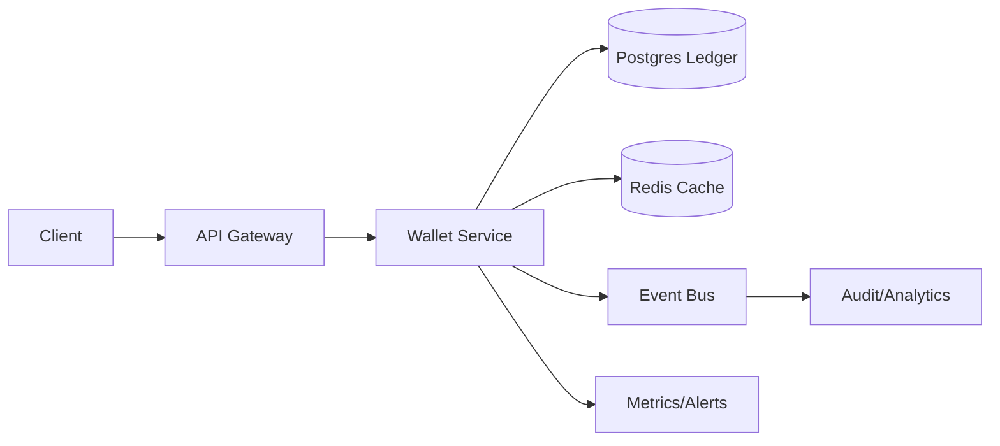

```markdown
---
title: "Digital Wallet"
category: "Commerce & Fintech"
difficulty: "Hard"
tags: ["ledger", "payments", "consistency", "audit", "double-entry", "idempotency"]
---

## Overview

This system is a **digital wallet ledger**: it tracks user balances, supports peer-to-peer transfers, prevents double-spends, and produces an audit trail you can defend months later. The core of the design is an **immutable, double-entry journal** as the source of truth, with balances treated as a **derived view**.

The key insight is to stop treating “balance” as a mutable number you update and instead treat every movement of money as an append-only fact. A transfer is one atomic transaction that writes **two entries** (debit + credit) plus a transfer record keyed by an idempotency token. This makes correctness legible: if the journal is right, everything else is repairable.

## What Makes This Hard

Naive implementations store `balance` in a row and do `balance -= amount` / `balance += amount`. Under retries, races, partial failures, or multi-region replication lag, you get phantom credits, double debits, or negative balances. The trap is assuming “exactly once” at the API layer; in reality, clients retry, networks partition, and handlers crash mid-flight.

The hard subproblem is **atomicity + idempotency + invariants**: ensuring each logical transfer applies once (even under retries) and never violates constraints (e.g., no negative available balance), while still being operationally debuggable and auditable.

## Requirements

### Functional Requirements
- **Strong consistency per wallet**: a user must not be able to spend the same funds twice.
- **Idempotent transfers**: the same client request retried N times results in exactly one transfer.
- **Immutable audit trail**: reconstruct balances and explain any balance at any time.
- **Queryable history**: list transactions with stable ordering and pagination.
- **Operational correctness**: detect and recover from partial failures without manual SQL surgery.

### Scale Targets
- **10M wallets**, **1K transfers/sec peak**, **99.9% < 200ms** for write API.
- Ledger retention: **7+ years** of entries (audit/compliance), implying **billions of rows** over time.
- Read traffic: **10–50x writes** (apps poll balances/feeds), so reads must be cheap and cacheable.
Why these matter: the ledger must stay correct under concurrency today, and stay operable when tables are huge tomorrow.

## Key Design Decisions

- **We chose:** Double-entry, append-only ledger in **Postgres** with transactional enforcement.
  - **Rejected:** Updating a mutable `balances` table as the source of truth.
  - **Why:** Immutability + double-entry makes correctness provable and recovery/reconciliation feasible.

- **We chose:** **Idempotency keys + transfer state** stored in the same database transaction as ledger writes.
  - **Rejected:** Best-effort dedupe in Redis or “exactly-once” messaging promises.
  - **Why:** Only the database transaction can atomically couple “did we apply?” with “what did we write?”

- **We chose:** Balances as a **materialized projection** (table updated transactionally) plus cache for reads.
  - **Rejected:** Computing balances by summing the journal for every read.
  - **Why:** Journals grow without bound; reads must remain O(1) while keeping the journal authoritative.

## Architecture



### Components

- **API Gateway**: authentication, rate limits, request IDs; keeps abuse from becoming “ledger load”.
- **Wallet Service**: the only writer; owns transfer semantics, idempotency, and invariants.
- **Postgres Ledger**: source of truth (transfers + journal + balance projection) with strict transactions.
- **Redis Cache**: accelerates hot balance reads and recent activity; never a source of truth.
- **Event Bus**: downstream side effects (notifications, analytics) via an outbox pattern from Postgres.
- **Audit/Analytics**: immutable copies/aggregations for compliance reporting and offline reconciliation.
- **Metrics/Alerts**: invariant monitoring (e.g., negative balances, projection drift, lag).

## Deep Dive: Double-Spend Prevention Under Retries

A correct transfer needs three properties simultaneously:

1) **Atomicity**: debit and credit must happen together, or not at all.  
2) **Isolation**: concurrent debits must not both “see” the same available funds.  
3) **Idempotency**: retries must not create additional debits/credits.

### Data model (conceptual)
- `transfers(id, from_wallet_id, to_wallet_id, amount, currency, idempotency_key, status, created_at)`
  - Unique constraint on `(from_wallet_id, idempotency_key)` (or globally unique per client).
- `ledger_entries(id, wallet_id, transfer_id, direction, amount, currency, created_at)`
  - `direction` is `DEBIT` or `CREDIT`. Entries are immutable.
- `wallet_balances(wallet_id, available, pending, updated_at)`
  - A projection updated in the same transaction (or rebuilt from the journal if needed).

### Write path (single DB transaction)
1. **Upsert transfer by idempotency key**:
   - If it already exists and is `COMPLETED`, return its result.
   - If it exists but is `PENDING`, return “in progress” (or block briefly).
   - Else insert `PENDING`.

2. **Lock the spending wallet**:
   - `SELECT ... FROM wallet_balances WHERE wallet_id = ? FOR UPDATE` (row lock), or a Postgres advisory lock keyed by wallet id.
   - This ensures competing spends serialize.

3. **Enforce funds invariant**:
   - Check `available >= amount` inside the transaction; reject if insufficient.
   - Update projection: `available -= amount` for sender; `available += amount` for receiver (receiver row can be locked too to keep ordering deterministic).

4. **Append journal entries**:
   - Insert one `DEBIT` entry for sender, one `CREDIT` entry for receiver, both referencing `transfer_id`.

5. **Mark transfer complete** and commit.

### Why this actually prevents double-spend
- The **row lock** ensures only one transaction can decrement `available` for a wallet at a time.
- The **check happens under the same lock** as the decrement, so two concurrent requests can’t both pass the check.
- The **idempotency key** makes retries land on the same `transfer_id`; the unique constraint turns “retry storms” into safe reads.

### “Exactly once” downstream without lying to yourself
Use the **transactional outbox**: in the same DB transaction, write an `outbox_events` row (keyed by `transfer_id`). A separate publisher reads and publishes to the event bus with dedupe. This way, the ledger commit is the only point of truth; events are “at least once” but idempotent.

## Trade-offs

| Optimized For | Sacrificed |
|--------------|------------|
| Correctness & auditability | Cross-region active-active writes |
| Simple operations (one primary store) | Some write throughput ceiling |
| Debuggable failures (replayable journal) | More schema/discipline than “balance row” |

## Failure Modes

- **Client retries / gateway timeouts**
  - **What happens:** the same transfer request is submitted multiple times.
  - **Detect:** repeated idempotency key hits; elevated 409/200-with-same-transfer metrics.
  - **Recover:** return existing `transfer_id` result; no duplicate ledger entries due to uniqueness + transactional coupling.

- **Service crash mid-transfer**
  - **What happens:** request handler dies after inserting `PENDING` but before completion.
  - **Detect:** `PENDING` transfers older than a threshold.
  - **Recover:** background reaper either completes (if journal present) or marks failed and releases; idempotency allows safe retry.

- **Projection drift (balances table wrong)**
  - **What happens:** bug or manual fix makes `wallet_balances` inconsistent with the journal.
  - **Detect:** periodic reconciliation job comparing projection vs. sum of entries per wallet (sampled + full for suspicious wallets).
  - **Recover:** rebuild projection from ledger entries for affected wallets (or full rebuild off-hours); journal remains authoritative.

## What I'd Do Differently At...

- **10x scale:**
  - Partition `ledger_entries` by time (monthly) and keep hot indexes small.
  - Add read replicas for history queries; keep writes on a single primary.
  - Introduce per-wallet sharding by routing wallets to Postgres clusters (still single-writer per wallet).

- **100x scale:**
  - Move to a horizontally scalable strongly consistent store for the ledger (e.g., Spanner/Calvin-style DB) or explicit wallet-sharded Postgres fleets with strict routing.
  - Redesign history queries around precomputed timelines and archive tiers; raw journal becomes cold storage with occasional audits.

## Operational Notes

- **Invariant dashboards:** count of negative available balances (must be zero), PENDING transfer age percentiles, projection-vs-journal mismatch rate.
- **Schema hygiene:** append-only tables need partitioning + disciplined indexing; avoid “index everything” because write latency is a product feature here.
- **Backups and point-in-time restore:** the journal is the business; practice restores and validate by rebuilding projections from the journal.
- **Support tooling:** a “transfer explain” view that shows transfer row + both ledger entries + balance deltas is worth its weight in gold on-call.
```