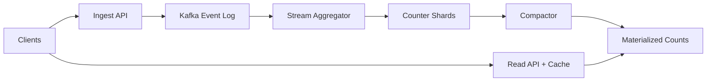

```markdown
---
title: "Distributed Counter Service"
category: "Social & Discovery"
difficulty: "Hard"
tags: ["counters", "event-sourcing", "kafka", "kafka-streams", "sharded-counters", "eventual-consistency"]
---

## Overview

This system provides **Likes** and **Views** counts for content at massive scale where naive “`UPDATE counters SET n = n + 1`” designs collapse under hot-key write contention. The core insight: **never directly increment a hot counter**. Instead, accept writes as an **append-only event log**, then **aggregate asynchronously into sharded counters** and periodically compact into a fast “materialized count” store for reads.

The second insight is what keeps likes accurate without distributed transactions: treat likes as a **state machine** keyed by `(user_id, item_id)` and only emit a counter delta when the state actually changes. That makes retries, duplicates, and out-of-order delivery survivable while staying operationally boring: Kafka + a stream processor + a sharded counter store + a read-optimized materialized store.

## What Makes This Hard

Naive implementations get trapped by two failure modes:

1. **Hot key contention**: a viral item can receive tens of thousands of increments per second; a single row/key becomes the bottleneck (lock contention in SQL, partition hot-spotting in NoSQL, CPU thrash in Redis).
2. **“Accurate eventually” is harder than it sounds**: if you accept at-least-once writes (you should), then retries and duplicates will silently inflate counts unless your pipeline is **idempotent end-to-end**. Likes are especially tricky because they toggle (`like`/`unlike`) and correctness depends on *state transitions*, not raw event volume.

## Requirements

### Functional Requirements
- Record `view(item_id, actor_id?, device_id?, ts)` and return per-item view counts (eventually consistent).
- Record `like(item_id, user_id)` and `unlike(item_id, user_id)` and return per-item like counts (eventually consistent but **aggregation-accurate**: no double-counting from retries).
- Provide counts at two granularities:
  - **Serving count**: “good enough” freshness for UI (seconds–minutes).
  - **Auditable count**: eventually converges and can be recomputed from the log.
- Support backfills/recomputes (bug fix, schema change) without taking the system down.

### Scale Targets
Assume a large social feed product:
- 50M DAU, peak concurrency 5M.
- Views: 50B/day ⇒ ~580k events/s average, **5–10M events/s peak** (feed swipes are spiky).
- Likes: 500M/day ⇒ ~6k/s average, **50–100k/s peak** (still hot on viral items).
- Read QPS: 1–5M/s peak (every feed render requests counts).
Why these numbers matter: the write path must handle multi-million EPS without hot keys, and the read path must be cheap enough to serve counts without touching the write-heavy stores.

## Key Design Decisions

- **Choose: Event log first, counters later**
  - Rejected: direct counter increments in OLTP DB / single Redis key per item
  - Why: append-only scales linearly; aggregation becomes controllable and replayable

- **Choose: Likes are derived from per-(user,item) state transitions**
  - Rejected: “just increment on like endpoint success” (breaks on retries) and “dedupe by request id” (fails on unlike/like toggles)
  - Why: accuracy comes from “state changed?” not “event received?”

- **Choose: Sharded counters + periodic compaction**
  - Rejected: single authoritative counter key
  - Why: striping removes hot partitions; compaction makes reads fast and cheap

## Architecture



### Components

- **Ingest API**
  - Validates/authenticates, assigns `event_id`, and writes to Kafka.
  - Does *not* touch counters synchronously; it stays fast under spikes.

- **Kafka Event Log**
  - System of record for writes (especially for views where you want replay/backfill).
  - Partitioning:
    - Likes topic keyed by `(user_id, item_id)` (to preserve per-user-item ordering).
    - Views topic keyed by `item_id` (to spread load; ordering doesn’t matter for views).

- **Stream Aggregator (Kafka Streams)**
  - Likes: maintains a KTable-like state `(user_id,item_id) -> {liked|unliked}` and emits a `+1/-1` delta only on state change.
  - Views: batches counts per `(item_id, time_bucket)` and emits periodic deltas (reduces write amplification).

- **Counter Shards**
  - A striped counter store keyed by `(item_id, shard_id)` storing integer deltas.
  - Stripe factor (e.g., 64–1024 shards per item) prevents a viral item from being a single hot key.

- **Compactor**
  - Periodically sums shards into a single “serving count” per item (and per time bucket if needed).
  - Also the place to enforce monotonicity guarantees for views (never go backwards) even when late data arrives.

- **Materialized Counts**
  - Read-optimized store for `(item_id -> counts)` (likes, views, optional per-window).
  - Optimized for high QPS and small objects.

- **Read API + Cache**
  - Reads from Materialized Counts, with aggressive caching (CDN/edge + in-service cache).
  - Returns slightly stale counts by design; UI can optimistically update.

## Deep Dive: Accurate Likes Under Retries (The Hardest Part)

The hardest part is ensuring likes are **correct** while the pipeline is **at-least-once**. The key is to make the counter update depend on a deterministic state transition.

### 1) Model likes as a state machine
Each `(user_id, item_id)` has a state: `LIKED` or `UNLIKED`. Incoming events are commands: `LIKE` and `UNLIKE`.

Transition table:
- `UNLIKED + LIKE -> LIKED` emits delta `+1`
- `LIKED + LIKE -> LIKED` emits delta `0` (duplicate/retry)
- `LIKED + UNLIKE -> UNLIKED` emits delta `-1`
- `UNLIKED + UNLIKE -> UNLIKED` emits delta `0` (duplicate/retry)

This single table is the difference between “eventually consistent” and “eventually wrong”.

### 2) Preserve ordering where it matters
You don’t need global ordering; you need **per-(user,item)** ordering so that rapid toggles don’t interleave incorrectly. Keying the likes topic by `(user_id,item_id)` ensures all commands for that pair land in the same partition, so Kafka Streams processes them sequentially.

### 3) Make stream processing idempotent by construction
Kafka Streams’ state store (backed by changelog topics) lets you:
- Reprocess from the log after crashes.
- Restore state deterministically.
- Emit the same deltas for the same sequence of commands.

Even with duplicates in the input, the state machine collapses them to zero-delta transitions.

### 4) Deal with counter shard writes safely
Counter shard updates must tolerate duplicates from downstream retries. Two practical options:
- **Best (simple + robust):** only the stream aggregator writes shards, and it uses **exactly-once processing** (Kafka transactions + Streams EOS). Then shard writes are effectively once-per-transition.
- **If you can’t use EOS:** include `(user_id,item_id,sequence)` in the shard update and have the shard store reject replays (more complex; avoid unless forced).

This is where most teams either over-engineer (distributed transactions) or under-engineer (silently wrong counts). The state-transition approach avoids both.

## Trade-offs

| Optimized For | Sacrificed |
|--------------|------------|
| Massive write throughput under contention | Strict read-after-write consistency |
| Accurate likes despite retries/duplicates | More moving parts than single DB table |
| Replay/backfill and auditability | Higher storage cost (event log) |
| Cheap, cacheable reads | Counts can lag during outages/lag |

## Failure Modes

- **Stream lag (counts “freeze” or get stale)**
  - Detect: consumer lag alarms per partition, freshness SLO (last_compaction_ts)
  - Recover: scale stream app, throttle ingest if needed, prioritize compactor, replay from Kafka once stable

- **Hot item overload (one item dominates traffic)**
  - Detect: shard write skew, per-item traffic top-N, shard key distribution metrics
  - Recover: increase stripe factor for that item class; enable tighter batching for views; shed view events (views are usually best-effort)

- **Silent drift (bug or mis-partitioning causes wrong counts)**
  - Detect: periodic reconciliation job recomputes counts from Kafka for a sampled set of items and compares to materialized counts
  - Recover: fix code, backfill by replaying from Kafka into a new materialized store, then cut over

## What I'd Do Differently At...

- **10x scale:** introduce tiered storage for the event log (keep “hot” days on fast disks), push more batching for views, and move compaction to a continuous incremental process to keep materialized counts fresher.
- **100x scale:** split views into two products: (1) real-time approximate for UI and (2) analytics-grade in a columnar store; also go multi-region with local ingest + async merge (likes remain stateful and region-affinitized by `(user,item)`).

## Operational Notes

- Treat Kafka lag and “last updated timestamp” as first-class SLOs; stale counts are a user-visible outage.
- Keep stripe factor configurable and measurable; you want the ability to widen shards for a small set of hot items without migrating everything.
- Reconciliation isn’t optional: the whole point of an event log is that you can prove correctness and recover from mistakes.
- Likes and views have different correctness bars; don’t force views to pay the cost of like-grade idempotency.
```