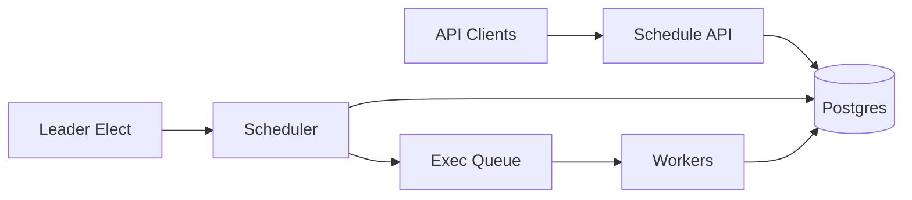

```markdown
---
title: "Distributed Cron"
category: "IoT & Edge"
difficulty: "Hard"
tags: ["scheduler", "leader-election", "idempotency", "leases", "postgres", "queues"]
---

## Overview

Distributed Cron is a periodic task runner where *scheduling decisions are durable* and *execution is decoupled*. The elegant idea is to treat “a cron fire” as a first-class, persisted object (`job_id + scheduled_time`), not a transient timer event in memory. Once a fire is recorded, any worker can execute it; if the leader dies, a new leader can deterministically reconstruct what should have fired and continue.

Naive designs put the schedule in the leader’s RAM and push directly to workers. That fails in the only moment that matters: leader crash near a tick causes either missed runs (no durable record) or duplicate runs (retry without idempotency). This design makes the leader replaceable by making the schedule itself the source of truth.

## What Makes This Hard

The trap is assuming “cron is just timers.” In a distributed system, *time is adversarial*: clock skew, GC pauses, partitions, and failover all land exactly on boundaries (e.g., `*/5 * * * *`). If “the tick” isn’t written somewhere durable with a unique identity, you cannot both (a) recover missed runs and (b) avoid duplicates after failover.

The second trap is mixing concerns: the same component both decides *what should run* and *runs it*. That couples correctness to leader uptime. The correct split is: (1) a scheduler that only mints durable run records, and (2) workers that execute run records with idempotency.

## Requirements

### Functional Requirements
- Support cron-like schedules (minute granularity is enough for IoT control loops; sub-minute is a separate product).
- Guarantee **no missed scheduled executions** even if the leader crashes at any moment.
- Bound duplicates to “at-least-once,” with a deterministic dedupe key so downstream side effects can be made idempotent.
- Provide a backlog/catch-up mechanism after downtime (with explicit policy: skip vs. catch up vs. cap).
- Multi-tenant fairness: one noisy tenant must not starve others during catch-up storms.

### Scale Targets
- 100k active schedules (common in IoT fleets: per-device jobs + fleet jobs).
- Peak 50k “fires” per minute during aligned cron boundaries (the scary case is `0 * * * *`).
- P99 schedule-to-enqueue latency < 2s under normal conditions; during catch-up, correctness beats latency.
- 30 days of run history retained for debugging and audit (operators will demand it after an incident).

## Key Design Decisions

- **We chose: Postgres as the scheduling source of truth (jobs + runs)**
  - **Rejected:** in-memory timers with “best effort” replay
  - **Why:** a unique constraint on `(job_id, scheduled_at)` turns duplicates into a non-event and makes catch-up deterministic.

- **We chose: lease-based leader election (etcd/Consul) for a single scheduler active at a time**
  - **Rejected:** “let all schedulers race” without coordination
  - **Why:** leader election keeps load predictable and simplifies backpressure; correctness still comes from the database, not from the leader.

- **We chose: queue for execution (Kafka/SQS/RabbitMQ) with idempotent workers**
  - **Rejected:** synchronous “scheduler calls worker” RPC
  - **Why:** the queue absorbs bursts at cron boundaries and isolates scheduling correctness from execution capacity.

## Architecture



### Components

- **Schedule API**
  - Creates/updates jobs (cron expression, timezone, payload, catch-up policy, concurrency limits).
  - Stores only durable intent; no timers live here.

- **Postgres**
  - `jobs` table: schedule definition + `next_fire_at` cursor.
  - `runs` table: immutable “this should execute” records with unique `(job_id, scheduled_at)`.
  - Earns its place because it provides the *atomicity* and *uniqueness* that make failover safe.

- **Leader Election (etcd/Consul)**
  - Issues a short TTL lease to the active scheduler.
  - Used for load control, not correctness.

- **Scheduler**
  - Mints `runs` records for due jobs and enqueues them.
  - On startup (or after leadership change), performs catch-up by scanning for due/missed fires.

- **Execution Queue**
  - Buffers spikes and lets workers scale independently.
  - Carries `run_id` (or `(job_id, scheduled_at)`), never “just run job X now.”

- **Workers**
  - Execute run records and write outcomes (`started_at`, `finished_at`, `status`, `attempt`).
  - Must be idempotent by `run_id`; if a run is delivered twice, the second attempt becomes a no-op or a retry with safe side effects.

## Deep Dive: Leader Crash Without Missing a Tick

The scheduler’s only job is to turn “time has passed” into durable run rows. The key is that a run is identified deterministically: `(job_id, scheduled_at)`. That lets a new leader safely recreate anything the old leader *might* have been doing.

**Data model (essential fields):**
- `jobs(id, cron, timezone, next_fire_at, catchup_policy, max_inflight, tenant_id, updated_at, ...)`
- `runs(id, job_id, scheduled_at, status, attempt, enqueued_at, started_at, finished_at, last_error, ...)`
- Unique index: `UNIQUE(job_id, scheduled_at)`

**Scheduling loop (single leader, but crash-safe):**
1. Select due jobs: `WHERE next_fire_at <= now()` ordered by `next_fire_at` with a limit (prevents runaway catch-up).
2. For each job, compute a bounded set of fire times to mint:
   - `fire_times = all ticks from next_fire_at up to floor(now, 1m)` capped by policy (e.g., max 60 fires per iteration).
   - This makes downtime recovery explicit instead of accidental.
3. Insert runs using `INSERT ... ON CONFLICT DO NOTHING` on `(job_id, scheduled_at)`.
   - If the old leader inserted some runs before crashing, the new leader simply sees conflicts and moves on.
4. Enqueue runs using an outbox pattern:
   - Write to `run_outbox(run_id, ...)` in the same transaction as the run insert.
   - A separate “outbox publisher” reliably publishes to the queue and marks outbox rows as sent.
   - This avoids the worst failure: run inserted but never enqueued (or enqueued without a run row).

**Why this survives leader death cleanly:**
- If the leader dies before inserting runs: the new leader computes the same `fire_times` and inserts them.
- If it dies after inserting but before enqueue: outbox publisher (or new leader) publishes pending outbox rows.
- If it dies after enqueue but before marking sent: duplicates hit the queue; workers dedupe by `run_id`.
- If the leader’s clock is wrong: `scheduled_at` is computed using DB time (`SELECT now()`) and rounded consistently, so leadership change doesn’t change what “now” means.

The non-obvious lesson: *you don’t need exactly-once delivery; you need exactly-once identity.* Once every intended execution has a unique durable ID, the rest becomes standard at-least-once engineering.

## Trade-offs

| Optimized For | Sacrificed |
|--------------|------------|
| No missed executions on leader crash | True exactly-once side effects (requires idempotency) |
| Simple operations (Postgres + queue + etcd) | Ultra-high tick precision (minute-level default) |
| Deterministic catch-up | Unbounded backlog without explicit caps/policy |

## Failure Modes

- **Leader dies during a cron boundary spike**
  - **What happens:** some runs are inserted, some not; some are queued, some not.
  - **Detect:** gap between `runs` and `jobs.next_fire_at`, outbox backlog, queue lag.
  - **Recover:** new leader re-mints missing runs via deterministic scan; outbox publisher drains pending rows; workers dedupe.

- **Queue outage**
  - **What happens:** runs exist durably but don’t get delivered to workers.
  - **Detect:** growing outbox table, `runs.status='pending'` age, alert on publisher errors.
  - **Recover:** keep minting runs (bounded); resume publishing when queue returns; optionally pause minting if backlog threatens DB.

- **Database slow/unavailable**
  - **What happens:** scheduling correctness is blocked; you cannot safely mint new runs.
  - **Detect:** scheduler transaction latency, connection errors, replica lag (if using read replicas incorrectly).
  - **Recover:** fail closed (stop minting); once DB recovers, scheduler catch-up replays deterministically.

## What I'd Do Differently At...

- **10x scale:**
  - Partition `runs` by time (daily) and keep hot indexes small.
  - Add per-tenant rate limits and a priority queue for “fresh ticks” vs. “catch-up ticks.”

- **100x scale:**
  - Move scheduling state to a purpose-built durable store for high write rates (still keeping deterministic run IDs), and shard schedulers by `tenant_id` or `job_id` range to avoid a single leader bottleneck.
  - Replace “scan due jobs” with a timing wheel or bucketed index to reduce DB pressure at boundaries.

## Operational Notes

- Use DB time for scheduling decisions; don’t trust node clocks.
- Keep leader lease TTL short (e.g., 10–30s) and renew frequently; correctness comes from runs/outbox, not from long-lived leadership.
- Make catch-up policy explicit per job: `skip`, `catch_up`, or `catch_up_capped(N)`; otherwise downtime turns into a surprise traffic storm.
- Track three lags separately: `scheduler_lag` (now - next_fire_at), `outbox_lag`, and `worker_lag` (pending run age). They point to different bottlenecks.
```