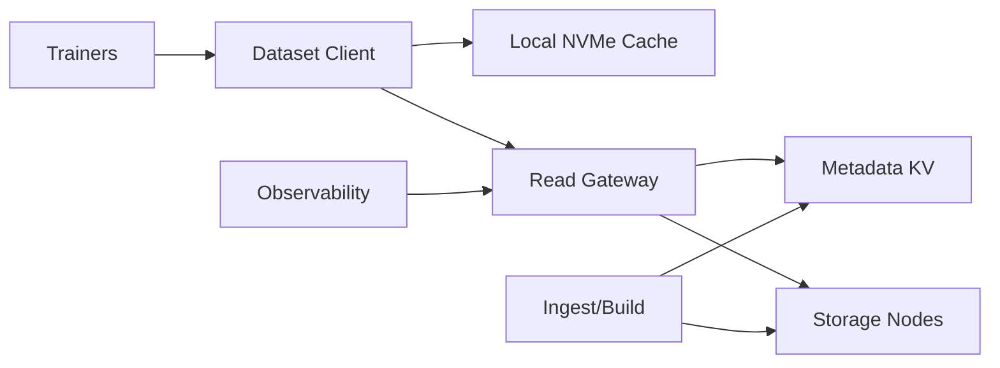

```markdown
---
title: "Distributed File System for AI/ML"
category: "Storage & Data Platforms"
difficulty: "Hard"
tags: [storage, ml, distributed-systems, caching, metadata, throughput]
---

## Overview

This system is a **read-optimized dataset store** for distributed training: it delivers extremely high aggregate throughput and predictable tail latency under massive fan-out, while intentionally **not** chasing full POSIX semantics. The core idea is simple: **make datasets immutable snapshots**, store the bytes as **large, content-addressed shards**, and push the “filesystem” intelligence into a **client library** that does aggressive prefetching and local caching.

The elegance comes from refusing to fight the workload. Training reads are parallel, repeated, and mostly sequential *within an epoch* once you decide the sampling plan. So we design around (1) **fast range reads of big objects**, (2) **cheap metadata lookups**, and (3) **making the common case “read the next N MB” extremely cheap**.

## What Makes This Hard

Naive “distributed POSIX filesystem” attempts fail in two places:

1. **Tail latency amplification.** Training jobs do huge fan-out reads; a single slow storage node stalls a step and wastes thousands of GPU-seconds. Average throughput is irrelevant if p99.9 is bad.
2. **The small-file trap.** ML datasets are often “millions of tiny files.” Per-file metadata and random reads destroy performance and melt the metadata service.
3. **Hotspot dynamics.** Shuffling, retries, and synchronized epochs create thundering herds on the same data regions unless placement, caching, and admission control are designed together.

## Requirements

### Functional Requirements
- **Immutable dataset snapshots** with strong reproducibility: “train on snapshot X” always resolves to identical bytes.
- **High-throughput parallel reads**: many workers reading different parts concurrently.
- **Efficient sample access**: retrieve sample `id` or `(shard, offset)` without per-sample metadata RPCs.
- **Fast job startup**: avoid “minutes of warmup” even at large cluster sizes.
- **Multi-tenant isolation**: one job cannot collapse tail latency for all others.

### Scale Targets
- **Dataset size:** 1 PB stored, 10k snapshots retained (most share chunks via dedupe).
- **Concurrency:** 20k training workers reading concurrently.
- **Throughput:** 2 TB/s aggregate read across the fleet (e.g., 2 GB/s * 1k workers; bounded by NIC + SSD).
- **Latency:** p99.9 range-read < 50 ms for 4–16 MB reads (so a straggler doesn’t gate a training step).
- **Metadata QPS:** < 1 metadata RPC per 1 GB read per worker (manifests + local indices keep metadata cold).

## Key Design Decisions

- **We chose immutable snapshots + content-addressed shards.**
  - Rejected: mutable files with POSIX-like semantics.
  - Why: immutability makes caching safe, enables dedupe, and eliminates consistency edge cases that don’t buy training performance.

- **We chose “pack the dataset” (shards + index), not “store millions of files.”**
  - Rejected: per-sample objects / per-file metadata scaling.
  - Why: the unit of IO must match SSD/network economics; shard-level IO is predictable and cacheable.

- **We chose a smart client library (prefetch + local NVMe cache) over a complex storage backend.**
  - Rejected: building a custom distributed cache tier inside the storage cluster.
  - Why: the client is closest to the training loop, can anticipate access, and avoids an extra hop in the hot path.

## Architecture



### Components

- **Dataset Client**
  - Owns the read plan (per-worker shard assignment), prefetch, decompression, and fallback behavior.
  - Maintains a small local index to translate “sample i” to `(shard, offset, length)` without RPC per sample.

- **Local NVMe Cache**
  - Read-through cache keyed by `(chunk_hash, byte_range)` with checksum verification.
  - Critical for repeated epochs and for smoothing tail latency spikes.

- **Read Gateway**
  - Stateless front door that authenticates, enforces per-job rate limits, and issues **hedged reads** when p99.9 is at risk.
  - Collapses connection management and makes storage nodes simpler.

- **Metadata KV**
  - Stores snapshot manifests and shard-to-placement maps.
  - Small, strongly consistent, boring: a replicated KV (e.g., etcd) with strict size limits per key and versioned manifests.

- **Storage Nodes**
  - Store shards as immutable blobs on SSD (plus optional erasure coding).
  - Serve range reads; no directory semantics, no renames, no locks.

- **Ingest/Build**
  - Builds shards (e.g., 512 MB–2 GB), writes content-addressed objects, produces per-shard indices and snapshot manifests.
  - Performs validation (checksums, schema, compression) once so reads stay fast.

- **Observability**
  - Tracks per-job p99.9, cache hit ratio, hotspot skew, shard error rates, and effective throughput per GPU.

## Deep Dive: Tail Latency Under Massive Fan-out

The hardest part is preventing a single slow read from stalling an entire synchronous training step. The system attacks this at three layers: **layout**, **client behavior**, and **admission control**.

**1) Layout: make reads predictable**
- Shards are large and internally sequential. Each shard contains many samples plus an index. Reads become “fetch next 8–16 MB” instead of “open 10k tiny files.”
- Placement uses **placement groups** (consistent hashing over shard IDs) so load spreads evenly and rebalancing is mechanical.
- Replication factor is chosen for latency, not durability theater: **RF=3** for hot tiers so the client has genuine choices when a node is slow.

**2) Client behavior: hide stragglers**
- The client reads in **MB-scale ranges** and keeps a prefetch window sized to cover “one training step worth of data + jitter.”
- It uses **hedged reads**: if a read hasn’t started delivering bytes by a tight threshold (derived from rolling p95), it issues the same range to a second replica and takes the first to complete. This converts long-tail delays into a modest bandwidth tax.
- Cache keys are content-addressed; corruption is detected by checksum and self-healed by refetching from another replica.

**3) Admission control: stop one job from ruining everyone**
- The gateway enforces a per-job token bucket for outstanding bytes and in-flight requests. This keeps queueing inside the system bounded.
- Hotspot detection (skew in shard access) triggers **automatic shard pinning** to additional replicas or temporary “burst replication” for a snapshot during a big run.
- When the system is saturated, it fails *fast and explicit*: the client gets backpressure signals and reduces prefetch concurrency rather than piling on retries that amplify load.

The non-obvious lesson: in ML storage, **the scheduler and the storage are coupled**. If you can’t control concurrency and straggler behavior at the client boundary, the backend will oscillate under synchronized workloads.

## Trade-offs

| Optimized For | Sacrificed |
|--------------|------------|
| High aggregate read throughput | Full POSIX compatibility |
| Predictable p99.9 under fan-out | Fine-grained mutable writes |
| Reproducible snapshots | “Latest” view semantics |
| Operational simplicity (stateless gateway) | Some complexity in client library |
| Cheap metadata at scale | Per-file ergonomics (millions of paths) |

## Failure Modes

- **Metadata KV outage**
  - What happens: new jobs can’t resolve snapshot manifests; ongoing reads continue (clients already have manifests cached).
  - Detect: gateway manifest fetch errors, elevated job start failures.
  - Recover: restore quorum; keep manifests small and cached; distribute manifests with the training job as a bootstrap artifact.

- **Hot shard / hotspot collapse**
  - What happens: one placement group saturates; tail latency spikes and steps stall.
  - Detect: shard-level QPS skew, p99.9 read latency localized to a replica set.
  - Recover: burst replicate hot shards, shift placement group ownership, enforce stricter per-job concurrency at the gateway.

- **Silent corruption on a storage node**
  - What happens: bad bytes poison training or crash decoders.
  - Detect: checksum mismatch on read (content-addressed verification).
  - Recover: refetch from another replica, mark replica unhealthy, scrub shards in background and rebuild from good copies.

## What I'd Do Differently At...

- **10x scale:** move from RF=3 everywhere to **tiered storage** (hot SSD + warm HDD/object) with snapshot-aware pinning; add more aggressive manifest distribution and regional read-locality.
- **100x scale:** split the metadata plane into **(a) snapshot catalog** and **(b) placement map service** with independent scaling; introduce **erasure coding** for cold shards and keep a smaller replicated hot set for latency.

## Operational Notes

- The top three dashboards are: **p99.9 range-read latency**, **cache hit ratio (per job)**, and **hotspot skew (top placement groups)**.
- Watch for “helpful” retry storms: if clients retry on timeouts without budget, they create load that makes the timeout permanent. Enforce retry budgets in the client.
- Most incidents come from synchronized behavior (job restarts, epoch boundaries). Stagger job start, jitter prefetch windows, and cap in-flight bytes per worker.
```