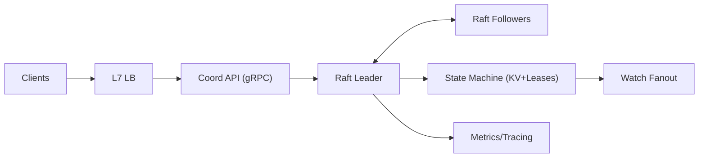

```markdown
---
title: "Distributed Lock Service"
category: "Foundational Infrastructure"
difficulty: "Hard"
tags: ["coordination", "distributed-systems", "raft", "leases", "fencing-tokens"]
---

## Overview

This system is a small, strongly-consistent coordination service for distributed locks and lightweight metadata—purpose-built around **leases**, **fencing tokens**, and **client failure detection**. The key idea is to treat “lock ownership” as nothing more than “a replicated fact attached to a lease”, and to make every externally-visible ownership change (acquire/release/expire) a **single linearizable write** through a consensus leader.

The elegance comes from keeping the surface area narrow: one consensus group, one keyspace, one correctness model (linearizability for lock state), and one way to recover from ambiguity (lease expiry + fencing). Leases answer “who still has the lock?”, fencing answers “who gets to act?”, and failure detection becomes “who can keep renewing through quorum?”.

## What Makes This Hard

Naive lock services confuse **liveness** with **safety**. They detect dead clients via heartbeats, but miss the real problem: in partitions or slow networks, *two clients can both believe they own the lock*. If the protected system accepts requests from both, you get split-brain writes, corrupted state, and bugs that only appear under partial failure.

The trap is thinking that “the lock service says I own it” is enough. It isn’t. You need a **monotonic fencing token** that downstream systems can validate, so that even if a former owner is still running (or resumes after a pause), its actions are rejected.

## Requirements

### Functional Requirements
- **Linearizable lock acquisition and release**: exactly one owner at a time in the committed log.
- **Leases**: lock ownership is bound to a lease; if the lease expires, the lock is automatically released.
- **Fencing tokens**: each successful acquisition yields a strictly increasing token per lock key; clients must present it to the protected resource.
- **Client failure detection**: server-side expiry via missed renewals; client-side self-fencing when it cannot renew.
- **Watch/notify** for lock availability to avoid polling storms.

### Scale Targets
- **Cluster size**: 3 nodes (Raft), tolerate 1 failure; 5 nodes when you optimize for read availability and maintenance windows.
- **Clients**: 10k concurrent clients, 50k active leases.
- **Locks**: 1–5 million lock keys (sparse, not all active).
- **Write QPS**: 2k–5k (acquire/release/renew dominate), p99 commit latency < 50ms intra-region.
- **Watchers**: up to 100k concurrent watches (the real memory pressure), with bounded fanout per hot key.

These numbers force you to care about: (1) commit latency and write amplification, and (2) watch scalability without turning “one lock release” into “100k wakeups”.

## Key Design Decisions

- **What we chose:** Raft-based single-writer replication (one leader) with a simple KV + lock API.
  - **What we rejected:** gossip-based ownership, multi-leader writes, or “best-effort” locks.
  - **Why:** locks are small but correctness is binary; linearizable writes are the simplest way to be right.

- **What we chose:** Leases are server-authoritative TTLs on a monotonic clock, renewed only through the current leader.
  - **What we rejected:** client-side timers as truth, follower-accepted renewals, or “extend-on-read”.
  - **Why:** it removes clock-sync assumptions and ensures all lease decisions flow through one serialization point.

- **What we chose:** Fencing tokens are per-lock monotonically increasing integers stored in the replicated state and issued on acquisition.
  - **What we rejected:** “lock ID is enough”, timestamps, or relying on lease expiry alone.
  - **Why:** fencing is the only practical defense against clients that are alive but unsafe (GC pauses, partitions, scheduler stalls).

## Architecture



### Components

- **Coord API (gRPC)**: the only public interface; all mutating calls route to the leader (followers proxy).
- **Raft Leader / Followers**: replicate a log of state transitions; leader is the single serialization point for leases and tokens.
- **State Machine (KV+Leases)**: applies committed log entries; maintains lock ownership, lease records, and token counters.
- **Watch Fanout**: turns committed state changes into notifications; designed to be bounded and backpressured.
- **Metrics/Tracing**: p99 commit latency, leader churn, log size, watch backlog—these are the truth in production.

## Deep Dive: Fencing Tokens (The Hardest Part)

Fencing tokens solve the “zombie owner” problem: a client can lose the ability to safely coordinate (partition, long GC pause) yet continue issuing writes to the protected system. A lease alone doesn’t stop it, because the client can’t reliably know when it became unsafe, and downstream systems often can’t query the lock service on every operation.

**Token model**
- Each lock key `K` maintains a **token counter** `T[K]` in replicated state.
- On successful acquisition of `K`, the leader commits:
  1) `T[K] = T[K] + 1`
  2) `Owner[K] = (lease_id, holder_id, token=T[K])`
- The API returns `(lease_id, token)` to the client.

**Downstream enforcement**
- Every write to the protected resource must include `(K, token)`.
- The protected resource stores `MaxToken[K]` and rejects any request with `token < MaxToken[K]`.
- On accept, it updates `MaxToken[K] = token` (or uses a compare-and-set if it’s replicated).

This turns coordination into a one-way safety gate: even if an old owner keeps running, its token is stale and it cannot cause damage. You’ve moved correctness to the place that matters: the system being protected.

**Edge cases that break teams**
- **Leader change during acquire**: the client may see a timeout. It must treat the attempt as “unknown” and retry; duplicate acquires are safe because token issuance is serialized in the log.
- **Client pause**: if renewals stop, the lease expires server-side. The client must self-fence by refusing to use the lock if it cannot renew within a bounded window.
- **Hot lock**: on a single key, fairness and wakeups matter more than raw throughput; you optimize watch behavior, not Raft.

## Trade-offs

| Optimized For | Sacrificed |
|--------------|------------|
| Strong correctness (linearizable ownership) | Cross-region latency for writes |
| Simple mental model (leader decides) | Single-consensus-group write ceiling |
| Safety under partial failure (fencing) | Requires downstream token enforcement |
| Operational predictability | Some availability during quorum loss |

## Failure Modes

- **Network partition (client ↔ quorum)**
  - **What happens:** client can’t renew; server expires lease and releases locks; client may still be running.
  - **Detect:** renew RPC failures / keepalive acks stop; server emits lease-expiry counters.
  - **Recover:** client self-fences immediately (stop acting), then reacquires; downstream rejects stale-token writes.

- **Leader crash during high churn**
  - **What happens:** brief unavailability for writes; some clients see timeouts and retry.
  - **Detect:** leader election events, commit latency spike, increased retry rate.
  - **Recover:** new leader resumes; idempotent acquire via “unknown result → retry” rule; watches replay from committed index.

- **Watch overload on hot keys**
  - **What happens:** release triggers a notification storm, starving commits and increasing tail latency.
  - **Detect:** watch queue depth, per-key watcher counts, notification lag.
  - **Recover:** enforce per-key watcher limits, add backpressure (drop/compact watch events to “latest state”), and encourage FIFO locking (watch predecessor, not the lock).

## What I'd Do Differently At...

- **10x scale:** shard by key prefix into multiple Raft groups (each with its own leader) and keep leases local to a shard; clients map lock key → shard deterministically.
- **100x scale:** redesign watches as a separate, horizontally-scaled notification plane fed by committed indices, and split “lease/lock writes” from “read-heavy metadata” (different consistency tiers).

## Operational Notes

- **Lease safety rule:** if a client can’t renew and confirm within `TTL/2`, it must assume it no longer owns the lock and self-fence.
- **Time handling:** base lease expiry on the leader’s monotonic clock; never trust wall-clock time for correctness.
- **Snapshots/compaction:** required to cap log growth; watchers must anchor to a committed index and recover via snapshot + subsequent log.
- **SLO dashboards:** commit p99, election rate, pending proposals, expired leases, watch lag, and per-key contention are the five graphs that predict incidents.
```