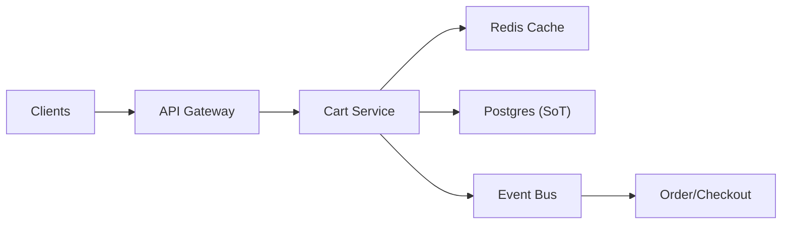

```markdown
---
title: "Distributed Shopping Cart"
category: "Commerce & Fintech"
difficulty: "Hard"
tags: ["shopping-cart", "concurrency", "idempotency", "postgres", "redis", "outbox", "event-driven"]
---

## Overview

This system provides a cross-device shopping cart that remains available through node failures and supports concurrent edits from multiple devices, while producing a consistent cart snapshot for checkout. The core idea is to treat the cart as a stream of **idempotent, replayable operations** (not “a blob of state”), and to make checkout consume a **pinned snapshot** rather than “whatever the cart is right now”.

Most of the system is intentionally boring: stateless API, Postgres as the source of truth, Redis for hot reads. The elegance comes from two choices: (1) **operation log + deterministic reduction** to make multi-device merges predictable, and (2) **checkout snapshot + outbox** so payment/inventory flows don’t depend on fragile distributed transactions.

## What Makes This Hard

Naive carts store “the current JSON cart” and overwrite it on each update. That fails in two ways:
1) **Lost updates across devices**: phone removes an item while laptop increments quantity; the last write silently wins and you ship the wrong thing.
2) **Checkout inconsistency**: pricing, availability, promos, and cart contents can change mid-checkout; without an explicit snapshot boundary, you can’t explain to users (or finance) what was purchased.

The trap is trying to fix this with stronger consistency everywhere. You don’t need it. You need **strong consistency at one seam only**: creating the checkout snapshot.

## Requirements

### Functional Requirements
- Cross-device persistence: any authenticated device sees the same cart “eventually”, without user-visible corruption.
- Concurrent edits: updates from multiple devices merge predictably; no silent drops.
- Idempotent writes: retries (mobile, flaky networks) must not duplicate line items or double-apply increments.
- Eventual checkout consistency: checkout uses a stable snapshot of cart items, quantities, and computed pricing inputs.
- Failure survival: stateless nodes can die without losing cart progress.

### Scale Targets
- 10M daily active users; 2M concurrently active carts at peak (promotions).
- Read-heavy: 150k RPS reads (cart fetch for header/mini-cart), p99 < 60ms.
- Write rate: 20k RPS updates (add/remove/set qty), p99 < 150ms.
- Average cart: 12 line items; bursty “add to cart” spikes 10x during campaigns.
Why these matter: carts are a classic **hot read** workload with sporadic write bursts; caching is mandatory, but correctness must live in the database layer.

## Key Design Decisions

- **We chose: operation-based cart model (append-only) with deterministic reduction**
  - **Rejected:** storing a single mutable JSON cart and doing “last write wins”
  - **Why:** operations are naturally idempotent, replayable, and mergeable; reduction gives a single canonical state while preserving intent for conflict resolution.

- **We chose: optimistic concurrency via cart version + server-side rebase**
  - **Rejected:** pessimistic locks per cart
  - **Why:** locks collapse under mobile latency and retries; optimistic concurrency keeps throughput high and lets us implement predictable merge rules.

- **We chose: checkout snapshot + transactional outbox**
  - **Rejected:** distributed transaction across cart + inventory + pricing + payment
  - **Why:** the snapshot boundary is the only place that needs strong guarantees; outbox makes downstream workflows reliable without coupling availability.

## Architecture



### Components

- **API Gateway**
  - AuthN/AuthZ, rate limiting, request shaping. Keeps the cart service focused on correctness.

- **Cart Service**
  - Stateless. Implements operation validation, idempotency, optimistic concurrency, reduction to current state, and cache management.

- **Postgres (Source of Truth)**
  - Stores cart metadata, operation log, and a materialized “current cart” read model. Provides durability, replication, and transactional snapshot creation.

- **Redis Cache**
  - Hot path for “get cart”. Cache entries are versioned; invalidation is driven by successful writes (write-through/update-on-write).

- **Event Bus**
  - Carries cart-updated events (for analytics/personalization) and, critically, outbox-driven events for checkout workflows.

- **Order/Checkout**
  - Creates an immutable checkout snapshot (order draft) from the cart, then drives pricing/inventory/payment as a workflow that can retry safely.

## Deep Dive: Concurrent Cross-Device Updates (Without Losing Intent)

**Data model (core tables):**
- `carts(cart_id, user_id, status, version, updated_at, expires_at)`
- `cart_ops(cart_id, op_id, base_version, op_type, sku, delta_qty, client_ts, device_id, idempotency_key, created_at)`
- `cart_items(cart_id, sku, qty, item_version, updated_at)` (materialized read model)

**1) Make every write an idempotent operation**
Clients send operations with an `idempotency_key` (UUID) and a stable `op_id` (or reuse the idempotency key). The service enforces `UNIQUE(cart_id, idempotency_key)` so retries become no-ops that return the already-computed result.

Prefer **delta operations** (`delta_qty = +1/-1`) over “set quantity” because deltas compose cleanly across devices. If the UI needs “set qty”, the client still sends it as `delta = desired - observed` along with the `base_version` it observed.

**2) Optimistic concurrency with rebase**
Each cart has a monotonically increasing `version`. A write includes `base_version`.
- If `base_version == carts.version`: accept quickly; apply op; increment version.
- If `base_version < carts.version`: we do not reject. We **rebase**:
  - Append the op anyway (it’s intent), but compute the resulting state by reducing ops from `base_version+1..current` plus the new op.
  - If the op becomes a no-op (e.g., decrement on an already-removed item), we still store it (audit) but it doesn’t change the materialized state.
This avoids “your cart update failed” UX while preventing silent overwrites.

**3) Deterministic reduction rules**
Reduction is simple and explicit:
- Quantity per SKU is `max(0, sum(delta_qty over ops))`.
- Remove is represented as `delta_qty = -∞` is tempting but dangerous; instead model remove as “set to zero” by emitting `delta = -current_qty` based on observed state/version. If stale, rebase will compute a correct delta against the latest quantity.
- Tie-breaking is never time-based for correctness. We rely on versioned rebasing rather than wall clocks.

**4) Materialize for fast reads**
On each accepted op transaction, update `cart_items` (single-row upsert per SKU) and bump `carts.version`. Reads hit:
- Redis: `cart:{cart_id}:{version}` payload, or `cart:{cart_id}` with embedded version.
- Fallback: `cart_items` in Postgres, which is already reduced.

This isolates the “interesting” logic to the write path; reads stay boring and fast.

**5) Checkout snapshot boundary**
Checkout calls `POST /carts/{id}/checkout`:
- In a single DB transaction: read current reduced items, validate non-empty, create `checkout_snapshots(snapshot_id, cart_id, cart_version, items_json, created_at)`, and write an outbox event `CheckoutSnapshotCreated(snapshot_id)`.
- The checkout workflow uses `snapshot_id` forever; the cart can continue evolving without affecting the in-flight order draft.

This is the seam where consistency becomes non-negotiable.

## Trade-offs

| Optimized For | Sacrificed |
|--------------|------------|
| Correct merges under concurrency | Slightly more complex write path |
| High read throughput | Some write amplification (ops + materialization) |
| Reliable checkout boundary | Checkout reflects a point-in-time cart, not “live” cart |

## Failure Modes

- **Redis outage or mass eviction**
  - **What happens:** read latency increases; DB handles reads.
  - **Detect:** cache hit rate drops; DB read QPS spikes.
  - **Recover:** keep TTLs modest, protect DB with read replicas (or connection limits), and allow partial degradation (e.g., mini-cart can be stale) while core cart fetch stays correct.

- **Primary DB failover**
  - **What happens:** brief write unavailability; risk of client retries.
  - **Detect:** elevated transaction failures, failover alerts.
  - **Recover:** idempotency keys prevent duplicate ops; clients retry with exponential backoff; service returns the cart state after retry.

- **Event bus lag / outbox backlog**
  - **What happens:** checkout workflows and analytics become delayed, but cart reads/writes remain correct.
  - **Detect:** outbox table growth, consumer lag metrics.
  - **Recover:** scale consumers; outbox sweeper retries; snapshot creation remains the source of truth for checkout even if downstream is slow.

## What I'd Do Differently At...

- **10x scale:**
  - Partition Postgres by `cart_id` hash (or migrate `cart_ops` to a partitioned table) and move reads aggressively to Redis with request coalescing for hot carts.
  - Add a lightweight “cart summary” cache (count + subtotal estimate) to reduce full cart fetch frequency.

- **100x scale:**
  - Move the cart source of truth from Postgres to DynamoDB (or another horizontally scaled KV) using the same operation-log semantics.
  - Keep the **checkout snapshot** in a transactional store (Postgres) because finance-grade auditability and constraints matter more than raw scale at that seam.

## Operational Notes

- Cart expiry is a product lever and an ops lever: set `expires_at` and run a reaper job; keep ops for audit only as long as needed.
- Hot keys happen (influencer products): protect Postgres with connection pooling and protect Redis with per-key request coalescing.
- Monitor “merge pressure”: rate of stale `base_version` writes. It’s the leading indicator of multi-device concurrency and a predictor of customer-visible weirdness.
- Keep the reduction logic a pure function and version it; it’s business-critical and must be testable and replayable for incident forensics.
```