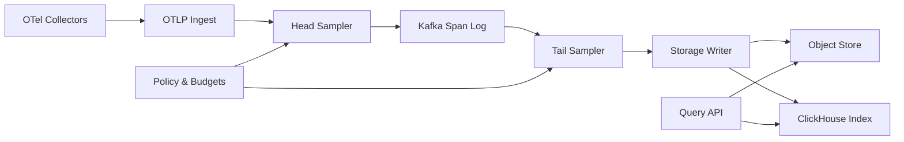

```markdown
---
title: "Distributed Tracing System"
category: "Observability & Reliability"
difficulty: "Hard"
tags: ["distributed-tracing", "opentelemetry", "sampling", "tail-sampling", "cost-control", "kafka", "clickhouse", "object-storage"]
---

## Overview

This system is an OpenTelemetry (OTLP) backend that ingests spans, makes sampling decisions (head-based and tail-based), and stores traces for fast search and reliable retrieval—while enforcing hard cost controls per tenant and per service.

The key insight: **treat sampling as a budgeted decisioning problem, not a boolean filter**. Head sampling is your cheap “front door” to keep the system upright; tail sampling is your “quality layer” that spends budget where it buys the most debugging value (errors, high latency, rare paths). The elegant design is a **hybrid pipeline**: always apply a lightweight head gate at ingest, then do tail decisions asynchronously off a span log with bounded memory and explicit late-span behavior.

Everything else is boring on purpose: OTLP ingest + Kafka as the span bus, a tail-sampling cluster that consumes spans and emits keep/drop decisions, and storage split into **cheap immutable blob storage** for trace bodies and a **columnar index** for fast search.

## What Makes This Hard

Naive tail sampling assumes you can “wait for the full trace,” but at scale you can’t: traces are long-lived, spans arrive out of order, and some never arrive. If you buffer too long, you blow memory; if you buffer too short, you miss the very spans that would have changed the decision (errors that occur late, slow child spans, retries).

The second trap is cost control. If you let teams “turn on tail sampling for everything,” the backend becomes a shared tragedy-of-the-commons: one noisy service (or one tenant) drives Kafka lag, hot partitions, and storage bills. Cost controls must be **enforced at ingest** (hard caps) and **encoded into the sampling policy** (soft budgets with predictable behavior).

## Requirements

### Functional Requirements

- Ingest OTLP spans from collectors with multi-tenant isolation (authn/authz, per-tenant config).
- Support **head-based sampling** (probabilistic, rate-limited, attribute-based) with deterministic decisions per trace.
- Support **tail-based sampling** based on observed properties (error present, latency percentile, specific routes, rare attributes).
- Ensure consistent trace decisions: either you keep a trace (most spans) or you drop it; minimize “partial traces” and label them when unavoidable.
- Enforce cost controls:
  - per-tenant ingestion ceilings (bytes/sec, spans/sec)
  - per-tenant retained trace budget (kept spans/sec, kept bytes/day)
  - per-service fairness inside a tenant
- Provide search and retrieval:
  - query by service, operation, time range, duration, status, tags
  - fetch full trace by trace ID
- Provide auditability:
  - explain *why* a trace was kept/dropped (policy + budget + rule hit)

### Scale Targets

Assume a mid-large SaaS observability backend:

- 5,000 tenants
- 200,000 active services (long tail), ~20,000 “hot” services
- Ingest: 2M spans/sec sustained, 10M spans/sec burst (deploy events, incidents)
- Average span size: 500B–1.5KB (attributes-heavy), so 1–10 GB/min burst ingress
- Retention:
  - indexed search: 7 days
  - raw trace bodies: 14–30 days (cheap storage)
- Query: 2k QPS search, 10k QPS trace-by-id (on-call spikes)

These numbers matter because they force: (1) Kafka for burst absorption, (2) bounded-memory tail sampling, (3) storage that separates “search index” from “raw payload.”

## Key Design Decisions

- **Hybrid sampling (head gate + tail refinement)**
  - Chose: head-based sampling at ingest to cap worst-case load, then tail sampling on a subset stream for quality.
  - Rejected: pure tail sampling for all traffic.
  - Why: pure tail requires buffering the full firehose and collapses under burst; a head gate makes capacity predictable.

- **Kafka as the span log (the system’s spine)**
  - Chose: write spans to Kafka immediately; all downstream (tail sampling, storage, metrics) consumes from it.
  - Rejected: direct ingest-to-storage with synchronous tail decisions.
  - Why: Kafka is the shock absorber and replay mechanism; it turns “real-time ingest” into “stream processing with backpressure.”

- **Two-tier storage: object store for bodies + columnar DB for search**
  - Chose: write trace bodies as compressed chunks to S3/GCS-compatible storage; write searchable fields to ClickHouse.
  - Rejected: putting everything into one general-purpose database.
  - Why: tracing payload is huge and cheap to store immutably; search needs fast scans/aggregations with tight indexing.

## Architecture



### Components

- **OTLP Ingest**
  - Terminates gRPC/HTTP OTLP, authenticates tenant, normalizes resource/service identity, and performs early rejects (bad payloads, missing tenant).
  - Earns its place by being the single choke-point for *hard* cost controls and consistent identity.

- **Head Sampler**
  - Makes fast, deterministic decisions per trace ID using tenant policy + budgets.
  - Primary job is not “quality,” it’s “keep the system alive”: enforce tenant ceilings and prevent burst-induced collapse.

- **Kafka Span Log**
  - Durable buffer and decoupling point; partitions by `(tenant_id, trace_id hash)` to keep per-trace ordering *mostly* local and make tail aggregation feasible.
  - Enables replay for backfills and policy changes (within retention).

- **Tail Sampler**
  - Consumes spans, buffers by trace for a bounded window, computes features (error present, duration estimate, route, rarity), then decides keep/drop within tenant budgets.
  - Emits a decision plus a “reason code” for explainability.

- **Storage Writer**
  - Writes kept trace bodies to object storage in time-bucketed, tenant-partitioned blocks.
  - Writes search index rows (trace summary + selected span tags) to ClickHouse for low-latency queries.

- **Object Store**
  - Cheap, scalable retention of full trace payloads; retrieval by trace ID uses an index pointer from ClickHouse.

- **ClickHouse Index**
  - Stores trace-level summaries (start time, duration, service set, error flag) and a curated tag set for search.
  - Also stores sampling decision metadata for audits (“kept because error+budget class=gold”).

- **Policy & Budgets Service**
  - Central policy store (Postgres-backed) and a fast distribution layer (in-memory caches) for sampling rules and per-tenant budgets.
  - Budgeting is explicit and enforced: token buckets per tenant and per service tier.

- **Query API**
  - Provides search and trace retrieval; merges ClickHouse search with object-store fetch.
  - Responsible for presenting partial traces clearly and surfacing decision reasons.

## Deep Dive: Tail Sampling With Bounded Memory And Predictable Cost

The hardest part is making tail decisions without pretending you’ll ever have “the whole trace.” The tail sampler operates like a stream processor with three constraints: **bounded memory**, **bounded decision latency**, and **bounded tenant spend**.

**1) Partitioning and trace affinity**
Spans are keyed to Kafka by `(tenant_id, trace_id hash)` so most spans for a trace land in the same partition, maximizing locality. This reduces cross-node coordination: a single tail-sampler instance can usually decide for a trace without RPC fan-out. You still accept that some traces will fragment (multi-collector paths, retries, rare key skew); you handle that with “partial trace” semantics rather than heroic distributed joins.

**2) The trace buffer is a timed cache, not a database**
For each active trace, the sampler keeps a compact state:
- start timestamp (min observed)
- latest timestamp (max observed)
- flags: error_seen, force_keep_hint (from head sampling hints), sampled_parent
- incremental duration estimate (max-min)
- top-K attributes needed for rules (route, service, status code), capped to avoid cardinality blowups
- a small span reservoir (optional) for writing a minimally useful partial trace if decision must be made early

Eviction is controlled by a **decision window** (e.g., 5–15s) plus a **hard cap on active traces**. When under pressure, the window shrinks and the policy degrades gracefully (favor errors, then latency, then baseline).

**3) Decisions are budgeted, tiered, and monotonic**
Tail sampling is “monotonic”: once a trace is marked keep, you never flip it to drop. This avoids oscillations when late spans arrive. Budgeting is implemented with token buckets:
- **Tenant budget**: tokens represent “kept bytes” or “kept spans.”
- **Service fairness**: a sub-budget per service (or per service tier) prevents one hot endpoint from consuming the tenant’s entire allotment.
- **Priority classes**: rules map traces into classes (P0 error, P1 slow, P2 baseline). Tokens are reserved by class so baseline traffic can’t starve incident traffic.

Decision logic:
- If `error_seen`: keep if tenant P0 tokens available; otherwise keep a minimal summary and emit “budget_exhausted_error” (visible to operators).
- Else if `duration > threshold` (threshold can be dynamic, e.g., p99 per service): keep if P1 tokens available.
- Else: keep by probabilistic baseline governed by remaining P2 tokens.

**4) Late spans: explicit policy, not wishful thinking**
Late spans are inevitable. You pick a stance:
- If trace already kept: accept late spans for a limited “late acceptance window” (e.g., +30s) and append to the trace block if the storage format supports it; otherwise store them as a “late fragment” linked to the trace ID.
- If trace dropped: do not resurrect it except for a narrow set of overrides (e.g., error span arrives late and tenant has an emergency override enabled). Resurrections are rare and clearly labeled because they break predictability.

This makes on-call life saner: tail sampling becomes explainable and stable under load.

## Trade-offs

| Optimized For | Sacrificed |
|--------------|------------|
| Predictable cost and stability under burst | Perfectly complete traces in all cases |
| High-value trace retention (errors/slow/rare) | Simplicity of “one sampling mode” |
| Fast search with cheap retention | Single-store elegance (everything in one DB) |
| Tenant isolation and fairness | Some throughput overhead for budgeting/accounting |

## Failure Modes

- **Kafka lag spikes (downstream slow or burst ingest)**
  - What happens: tail decisions arrive late; buffers grow; storage delay increases.
  - Detect: consumer lag, tail sampler memory pressure, decision latency SLO.
  - Recover: shrink tail decision window, tighten head gate, shed low-priority classes (P2), scale tail sampler consumers.

- **Tail sampler overload / OOM risk**
  - What happens: active trace set exceeds memory; eviction increases; more partial traces.
  - Detect: active trace count, eviction rate, GC/memory high-water marks, partial-trace ratio.
  - Recover: apply backpressure by lowering ingest keep rate, reduce attribute capture, enforce stricter per-service fairness, autoscale consumers.

- **Object store or ClickHouse degradation**
  - What happens: search or retrieval degrades; ingest should continue (Kafka absorbs).
  - Detect: write error rates, query latency, backlog in storage-writer consumer group.
  - Recover: keep ingesting into Kafka, throttle tail keep decisions if storage backlog grows, replay from Kafka when storage recovers.

## What I'd Do Differently At...

- **10x scale:**
  - Move tail sampling to a more explicit stream engine model (still Kafka-based) with clearer state management and autoscaling.
  - Introduce per-tenant “burst credits” so brief incidents don’t immediately clamp sampling.

- **100x scale:**
  - Re-architect storage layout to reduce hot-spotting and retrieval fan-out (more aggressive trace chunking, tiered indexes, possibly dedicated trace store like Tempo-style block compaction).
  - Split Kafka by tenant tier (enterprise vs long-tail) to isolate noisy neighbors at the infrastructure level.

## Operational Notes

- Sampling changes are production changes: roll out policies gradually and monitor kept-by-class ratios and budget burn rates.
- Track three golden signals per tenant: ingest rate, kept rate, and budget exhaustion events; budget exhaustion should page *product owners*, not just infra.
- “Partial trace” is a first-class state surfaced in UI and APIs; hiding it creates false confidence during incidents.
- Keep a small always-on baseline (e.g., 0.1–1%) even when budgets are tight; it’s your canary for unknown unknowns.
```