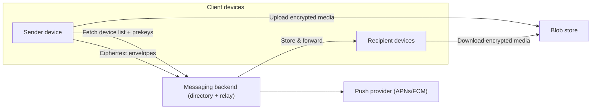

```markdown
---
title: "End-to-End Encrypted Messaging (Signal-style) Key Management & Multi-Device"
category: "Real-Time & Media"
difficulty: "Hard"
tags: ["e2ee", "signal", "x3dh", "double-ratchet", "multi-device", "forward-secrecy", "post-compromise-security", "key-transparency"]
---

## Overview

This is an end-to-end encrypted messaging platform where the server only does two things: (1) publish the public key material needed to start sessions, and (2) store-and-forward ciphertext to device mailboxes. All cryptography and conversation state live on devices.

Multi-device is treated as multiple cryptographic endpoints, not “sync.” Each device is its own endpoint with its own sessions; “sync” is just sending the same messages to all of a user’s active devices (including your own).

The hard parts are (1) asynchronous session setup (X3DH + Double Ratchet), and (2) device lifecycle (add/remove/revoke) that stays correct even when devices are offline.

## What Makes This Hard

Naive E2EE implementations get trapped by one of two mistakes:

1. **They treat a user as a single keypair.** Multi-device then becomes “copy private keys around,” which destroys forward secrecy and turns every device compromise into a total account compromise.

2. **They bolt “sync” onto the side.** Teams build a parallel system to replicate state/history, then discover they’ve reintroduced a trusted server (or an implicit shared key) that breaks the security model.

The subtle trap: with multi-device + forward secrecy, a newly added device *should not* automatically decrypt past traffic (otherwise you’re effectively back to long-lived shared keys). If product requirements demand history on new devices, you need an explicit encrypted-backup story—trying to “just sync keys” quietly demolishes the threat model.

## Requirements

### Functional Requirements

- **Asynchronous secure session setup:** Send a message to an offline recipient device without prior interaction.
- **Forward secrecy + post-compromise security:** Past messages stay safe if a device key leaks later; recovery after compromise via ratcheting.
- **Multi-device per user:** Each user has up to ~5 devices; messages reach all active devices reliably.
- **Device lifecycle with user control:** Adding a device requires approval from an existing device; removing a device stops future delivery to it.
- **Group messaging support:** Efficient fanout without per-recipient O(n) overhead for large groups (use sender keys).

### Scale Targets

- **50M DAU**, **10M peak concurrent**, **1B messages/day** (plan for **200k msg/s peak**).
- **P95 end-to-end delivery < 300ms** for online recipients; **minutes** acceptable for offline (push + store-and-forward).
- **Device count:** median 2, P99 5 → per-message per-user encryption overhead stays bounded and predictable.
- **Key directory QPS:** mostly on first contact / new device / broken sessions; avoid per-message lookups via long-lived sessions.

## Key Design Decisions

- **We choose:** Signal-style **X3DH (prekeys) + Double Ratchet** per *device-to-device* session.
  - **We reject:** A single “user session key” shared across devices.
  - **Why:** It preserves forward secrecy and compartmentalizes compromise to one device/session.

- **We choose:** **An account root key that signs device certificates**, and **device add requires an existing approved device or the recovery key**.
  - **We reject:** Server-minted devices (email/SMS-only).
  - **Why:** The server can store the directory, but it cannot invent device keys.
  - **Where it lives:** Only on designated admin device(s) and as an offline recovery key; regular devices don’t carry it.

- **We choose:** **“Sync by fanout”**: every outbound message is also encrypted to the sender’s other active devices.
  - **We reject:** A separate sync service or shared account-wide decryption key.
  - **Why:** It keeps the system conceptually single-path: everything is just messages, with the same security properties.

## Architecture



### Components

- **Client devices**
  - **Why it exists:** All confidentiality and session state must live on devices for E2EE to mean anything.
  - Holds long-term keys, per-session ratchet state, and performs all cryptography.
  - Encrypts separately to each recipient device (and to the sender’s other devices for multi-device sync).

- **Messaging backend (key directory + relay)**
  - **Why it exists:** Offline messaging needs a public-key directory and a durable mailbox; combining them keeps correctness simple.
  - Stores: account identity public keys, device certificates, and device prekey bundles.
  - Keeps an append-only, per-account change log with a monotonic `directory_version` to prevent rollback and support auditing.
  - Stores ciphertext envelopes in per-device mailboxes and supports retries/backpressure.
  - Enforces device revocation on both `send` (stop enqueuing) and `fetch` (stop downloading), and purges a revoked mailbox.

- **Blob store**
  - **Why it exists:** Attachments are big; object storage is the simplest durable store.
  - Stores encrypted attachments; decryption keys travel inside message ciphertext.

- **Push provider (APNs/FCM)**
  - **Why it exists:** Devices sleep; push is the simplest wake-up mechanism.
  - Wakes devices to fetch their mailbox; carries no plaintext.

## Deep Dive: Multi-Device Key Management Without Losing Forward Secrecy

### 1) Key hierarchy: account root vs device identity

Each account has a long-lived **Account Root Key (ARK)** used to bind devices. Each device has its own **Device Identity Key (DIK)** used for sessions. A device’s public key is bound to the account by a **Device Certificate**:

- `DeviceCert = Sign_ARK( device_id, device_pubkey, created_at, expires_at )`

This achieves two things:
- Contacts can verify “this device truly belongs to that user” without trusting the server.
- Compromising a non-admin device does not give you the ARK (and should not automatically allow enrolling new devices).

### 2) Device enrollment that the server cannot forge

**Add device flow (minimal, practical):**
1. New device generates `DIK_new` locally and shows `DIK_new_pub` (QR + nonce).
2. An existing approved **admin device** confirms user intent and signs `DeviceCert_new = Sign_ARK(...)`.
3. Backend stores the new certificate and marks the device active.
4. New device becomes usable only after it fetches the certificate and validates it client-side.

An **admin device** is a device that holds the ARK (the first device is an admin device by default).

Without an approved admin device (or the recovery key/ARK), the server can’t create a valid device certificate.

**Recovery (lost all devices):**
- The user keeps a recovery key offline. Using it rotates to a new ARK and enrolls a new first device.
- Contacts treat an ARK rotation as an explicit identity change (like a safety-number change).

**Revocation (remove device):**
- Backend immediately marks the device revoked, stops accepting mailbox fetch for it, and purges its queued ciphertext.
- Backend drops any envelopes addressed to revoked devices; senders stop encrypting to it once they refresh the device list.

### 3) Asynchronous session setup per recipient device (X3DH)

Each device publishes a **prekey bundle**:
- Account root public key `ARK_pub` (per account)
- Device identity public key `DIK_pub` + `DeviceCert` (binds `DIK_pub` to `ARK_pub`)
- Signed prekey `SPK_pub` + `Sig_DIK(SPK_pub)` (rotated weekly)
- A set of one-time prekeys `OPK_pub[i]` (consumed once)

**Session initiation (sender → recipient device):**
- Sender fetches recipient’s *device list* (cert-verified) and a prekey bundle for each device.
- For each device, sender runs X3DH to derive a shared secret and seeds a Double Ratchet session.
- First message includes the necessary X3DH handshake material (Signal “prekey message” style).

**Why this stays simple:** sessions are long-lived; directory lookups happen on first contact, new device, or session repair.

### 4) Multi-device “synchronization” by treating your own devices as recipients

When Alice sends a message to Bob, Alice’s sending device also encrypts the message to **Alice’s other devices** (the same way it encrypts to Bob’s devices). Practically:
- Per recipient device session → ratchet → encrypt ciphertext envelope.
- The relay fanouts to each device mailbox.

This yields:
- All online devices converge on the same visible history without sharing long-lived decryption keys.
- Forward secrecy remains intact because every device uses its own ratcheted sessions.

**Non-obvious consequence (intentional):** a newly added device does *not* automatically decrypt old history. If history-on-new-device is required, add an explicit **encrypted backup** feature (client-encrypted archive with a user-held recovery key), rather than smuggling “history keys” through the server.

### 5) Groups: sender keys, not quadratic encryption

For group chats, use Signal-style **Sender Keys**:
- Each sender establishes pairwise sessions once with each member device to distribute a per-sender symmetric key.
- Subsequent group messages are encrypted once with the sender key (plus a small per-group header), avoiding per-message O(n) encryption.

When a new device is added, members send sender-key distribution to that device the next time they speak in the group.

Membership change rotates sender keys (removing a device means it stops getting future sender-key updates).

## Trade-offs

| Optimized For | Sacrificed |
|--------------|------------|
| Strong confidentiality with minimal server trust | New devices don’t get old history by default |
| Clean device compromise boundaries | More ciphertext fanout (per-device) |
| Practical offline messaging | Prekey hygiene and mailbox reliability become operationally critical |
| Key tampering detectability | Strongest guarantees require user verification (pinning/safety numbers) |

## Failure Modes

- **Prekey exhaustion (recipient device runs out of OPKs)**
  - **What happens:** New sessions fall back to signed prekey only; worse UX under load, and less “one-time” hardness against replay/metadata correlation.
  - **Detect:** Key directory metrics on OPK inventory per device; alert when below threshold.
  - **Recover:** Clients replenish OPKs proactively; backend rate-limits prekey bundle fetches and avoids “consume OPK on fetch” behavior.

- **Ratchet state divergence (out-of-order, replay, or multi-device restore bugs)**
  - **What happens:** Decrypt failures, “missing message” gaps, or permanent conversation breakage.
  - **Detect:** Client-side decrypt failure telemetry (counts only, no content), per-version regression monitoring.
  - **Recover:** Automatic session repair: on sustained failures, trigger a new X3DH session (new prekey message) while keeping old session state briefly to handle late messages.

- **Backend key directory misbehaves (bad deploy or compromise)**
  - **What happens:** Wrong device list / key changes lead to new sessions with attacker-controlled keys.
  - **Detect:** Clients pin `ARK_pub` and require explicit user verification for ARK changes.
  - **Recover:** Treat ARK rotations as visible events; block silent ARK changes, and require re-verification when they occur.

- **Backend down for minutes**
  - **What happens:** No store-and-forward; new session setup also fails.
  - **Detect:** Standard availability monitoring.
  - **Recover:** Clients keep composing and queue locally; when backend returns, send using existing sessions if available, otherwise start X3DH then deliver.

- **Removed device still fetches queued messages**
  - **What happens:** Revoked device downloads ciphertext that was queued before removal.
  - **Detect:** Audit events on device revocation and mailbox fetch attempts.
  - **Recover:** Enforce revocation at mailbox fetch; on removal, revoke auth and purge queued ciphertext for that device.

- **Compromised existing device adds a spyware device**
  - **What happens:** If an admin device is compromised, it can approve new devices.
  - **Detect:** User-visible “new device added” notifications on all remaining devices.
  - **Recover:** Immediate device removal and ARK rotation via recovery key if the admin device is lost.

## What We Removed

- Separate **key directory**, **message relay**, and **push gateway** services (merged into one backend; push uses APNs/FCM directly).
- A standalone **key transparency/witness** system (kept to pinning/verification plus a simple per-account change log).
- **Relay-enforced device epochs** and “re-encrypt on mismatch” hot-path coupling (revocation is enforced at the backend, independent of sender cache).
- Scale-only machinery (Kafka/Pulsar sharding plans, MLS migration path) that doesn’t change the core security model.

## Operational Notes

- Track and alert on: OPK inventory, prekey fetch latency, decrypt-failure rates by client version, mailbox queue depth, and device add/remove events.
- Rate-limit directory reads to reduce enumeration and OPK burn abuse; return identical-shaped errors.
- Never log key material; treat client crash dumps as sensitive (ratchet state can leak metadata even without plaintext).
- Make device removal *fast*: revoke mailbox access immediately and purge queued ciphertext for that device.
```
