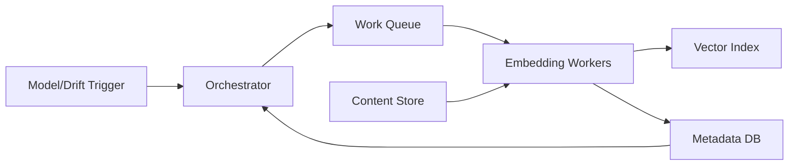

```markdown
---
title: "Embedding Pipeline"
category: "AI/ML Infrastructure"
difficulty: "Hard"
tags: ["embeddings", "backfill", "model-versioning", "pipelines", "vector-db", "idempotency"]
---

## Overview

This system backfills and continuously refreshes vector embeddings for millions of documents as embedding models are versioned or drift is detected. The core idea is to treat “embedding” as a deterministic, versioned *build artifact*—like compiled binaries—so the pipeline is about **reproducible builds + safe cutovers**, not ad-hoc reprocessing.

Elegance comes from separating two concerns that teams often conflate: (1) *producing* embeddings reliably at high throughput, and (2) *activating* a new embedding version safely. We build embeddings into a **shadow namespace** keyed by `(doc_id, model_version, content_hash)`, verify coverage/quality, then flip an **alias** (or “active version” pointer) to cut over atomically.

Everything else is deliberately boring: Postgres for orchestration state, an at-least-once queue for work distribution, object storage for document snapshots, and a vector index that supports versioned collections plus aliasing.

## What Makes This Hard

Naive pipelines try to “just re-embed everything” and overwrite vectors in place. That fails in three ways:

1. **Correctness under retries:** at-least-once delivery + flaky model endpoints produce duplicates, partial writes, and silent corruption unless every step is idempotent and auditable.
2. **Safe activation:** overwriting in place creates a mixed-index state (old + new vectors) that breaks ranking consistency and makes regressions impossible to roll back cleanly.
3. **Cost and time control:** backfills are bursty; without quotas, batching, and checkpoints, you either melt the model serving stack or pay peak capacity for hours you don’t need.

The trap: teams focus on worker autoscaling and ignore *lineage* (which input produced which vector) and *cutover semantics* (when a version becomes “real”).

## Requirements

### Functional Requirements
- Re-embed documents when either the **model_version** changes or the document’s **embedding-relevant content** changes.
- Support **backfill** (millions of docs) and **continuous updates** (ongoing writes/edits/deletes).
- Provide **idempotent processing**: retries must not create duplicate/incorrect vectors.
- Enable **safe cutover** to a new model_version with rollback.
- Keep **full provenance**: for any vector, record model_version, content_hash, timestamp, and embedding parameters.
- Handle deletes: remove (or tombstone) vectors for deleted documents consistently.

### Scale Targets
- Corpus: **10M documents** (order of magnitude “millions”).
- Average embedding payload: **1536 dims**, stored as float16 → ~3 KB/vector plus index overhead.
- Backfill SLO: **24 hours** for a full re-embed after a model release.
  - Requires ~116 embeddings/sec sustained (10,000,000 / 86,400).
  - Design for **500 embeddings/sec** to absorb retries, skew, and throttling.
- Continuous updates: **100 doc updates/sec peak**, with p99 time-to-fresh-embedding **< 5 minutes**.

These numbers matter because they force: (a) queue-based smoothing, (b) strict idempotency, and (c) a cutover mechanism that doesn’t require rewriting “active” in place.

## Key Design Decisions

- **Decision 1: Versioned, content-addressed embeddings**
  - Chose: store embeddings by `(doc_id, model_version, content_hash)` and record lineage in Postgres.
  - Rejected: overwriting a single “current embedding” row/vector in place.
  - Why: this makes embedding generation a pure function, enabling safe retries, dedupe, auditing, and rollback.

- **Decision 2: Shadow build + atomic activation**
  - Chose: write new vectors into a per-version namespace (index/collection) and activate via alias (or “active_model_version” pointer).
  - Rejected: gradual in-place replacement of vectors in the active index.
  - Why: avoids mixed-version ranking, enables canary evaluation, and allows instant rollback.

- **Decision 3: Boring orchestration with DB + queue**
  - Chose: Postgres for job/state/provenance and an at-least-once queue (e.g., SQS/PubSub) for distribution.
  - Rejected: a bespoke distributed scheduler or exactly-once streaming for the whole pipeline.
  - Why: the hard part is correctness semantics; Postgres transactions + idempotency keys solve it without complexity theater.

## Architecture



### Components

- `Orchestrator`
  - Creates backfill runs for `(model_version, corpus_scope)`, computes candidate docs, and enqueues work with strict dedupe keys.
  - Earns its place by owning *run-level invariants*: coverage, throttling, and cutover readiness.

- `Metadata DB` (Postgres)
  - Tables for documents (or references), embedding runs, tasks, attempts, and produced artifacts.
  - The source of truth for “what should exist” and “what exists,” enabling repair and audits.

- `Work Queue`
  - At-least-once delivery of tasks keyed by `(doc_id, model_version, content_hash)`.
  - Absorbs spikes and decouples throughput from orchestrator and workers.

- `Content Store`
  - Immutable-ish snapshots (or stable references) of embedding-relevant text at a specific revision.
  - Prevents the “document changed mid-run” class of heisenbugs.

- `Embedding Workers`
  - Stateless, horizontally scalable; fetch content, compute embedding, write artifact + metadata idempotently.
  - Own batching and rate limiting to protect model serving.

- `Vector Index`
  - Stores vectors in per-version collections with aliasing (e.g., `embeddings_v2025_01` plus alias `embeddings_active`).
  - Supports atomic cutover by repointing the alias.

## Deep Dive: Idempotent Backfill + Safe Cutover

The hardest part is guaranteeing that a massive backfill produces a *complete, internally consistent* embedding set for a model_version, despite retries, partial failures, and changing documents—then activating it without serving a mixed state.

### 1) Make the work item a pure function
Define the embedding job unit as:

`EmbeddingTask = (doc_id, model_version, content_hash, content_ref)`

- `content_hash` is computed from the exact text/features that affect the embedding (post-normalization).
- If the document changes, it produces a new `content_hash`, and therefore a new task. Old tasks become harmless.

This eliminates ambiguity: workers never ask “what’s the latest text?” during a backfill; they embed *the referenced snapshot*.

### 2) Enforce idempotency at the database boundary
Workers do two writes:
1. Upsert provenance into Postgres:
   - Unique constraint on `(doc_id, model_version, content_hash)`.
   - Record `status=complete`, `embedding_uri` (optional), `vector_index_ref`, `attempt_count`, timestamps.
2. Upsert the vector into the versioned vector index:
   - Use a deterministic vector ID like `"{doc_id}:{content_hash}"` within the `model_version` collection.

Order matters. The safe pattern is:
- Write vector (idempotent upsert).
- Then mark the artifact row complete in Postgres in a transaction that also records the vector ID.
If the worker crashes after writing the vector but before DB commit, the task retries and performs the same upsert—no duplication, and the DB eventually reflects reality.

### 3) Run-level completeness checks and cutover gates
The orchestrator tracks a backfill run with:
- `target_set_size`: number of docs in scope at run start (by snapshotting a doc_id list or a stable query + watermark).
- `completed_count`: count of distinct `(doc_id, model_version, content_hash)` completed.
- Error budget: allowed permanent failures (e.g., corrupted docs) with explicit exclusions.

Cutover gate:
- Coverage >= 99.9% (or agreed threshold) and no “systemic” error class above a small rate (e.g., model timeouts).
- Optional offline eval metrics computed on a canary set (stored alongside the run).

Activation:
- Flip the vector index alias from `embeddings_active -> embeddings_v_old` to `-> embeddings_v_new`.
- Update a single `active_model_version` record (used by writers and debuggability).

Rollback is the same operation in reverse: repoint the alias.

## Trade-offs

| Optimized For | Sacrificed |
|--------------|------------|
| Correctness under retries | Some extra storage for multiple versions |
| Atomic cutover + rollback | More moving parts than in-place overwrite |
| Auditable provenance | Slightly higher write amplification |
| Operational simplicity | Not “streaming-pure” end-to-end |

## Failure Modes

- **Model endpoint degradation (timeouts / throttling)**
  - What happens: queue depth grows; workers spend cycles retrying; backfill misses SLO.
  - Detect: sustained p95/p99 embedding latency + rising queue age; per-model error rate dashboards.
  - Recover: orchestrator applies global rate limit; workers switch to larger batches; pause non-critical backfills; resume from checkpoints.

- **Partial truth mismatch (vector written, metadata missing)**
  - What happens: vectors exist but aren’t counted toward run completeness, blocking cutover.
  - Detect: reconciliation job compares vector index IDs vs Postgres artifacts for a run.
  - Recover: repair task replays missing metadata rows by re-upserting idempotently; no need to recompute embeddings.

- **Poison documents (bad encoding / extreme size / malformed content)**
  - What happens: hot-loop retries waste capacity; run never reaches completion.
  - Detect: high retry count for the same `(doc_id, content_hash)`; DLQ volume.
  - Recover: route to DLQ after N attempts; mark as excluded with reason; keep exclusions explicit so coverage math stays honest.

## What I'd Do Differently At...

- **10x scale:** move large backfills to dedicated GPU pools with aggressive batching; shard the vector index by tenant/topic; store embeddings as float16 with PQ/IVF tuning to control index cost.
- **100x scale:** replace DB-driven orchestration loops with a streaming changelog (Kafka) for continuous updates, keep Postgres for provenance but move task state to a scalable state store; multi-region active-active with region-local embedding and async replication of versioned indices.

## Operational Notes

- Backfills are production events: treat each `model_version` as a release with a runbook, dashboards, and a hard rollback button (alias flip).
- Keep `content_hash` stable: normalize text deterministically (whitespace, HTML stripping rules, language-specific quirks) or you’ll create artificial churn.
- Always separate “build” from “activate”: serving mixed versions is the fastest way to ship a ranking regression you can’t explain.
- Reconciliation is mandatory: a cheap periodic job that repairs DB↔index drift prevents week-long “why is coverage stuck at 99.7%” incidents.
```