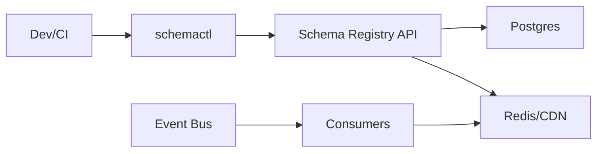

```markdown
---
title: "Event Schema Registry"
category: "Strategic Problems"
difficulty: "Hard"
tags: ["schemas", "governance", "ci-cd", "avro", "protobuf", "compatibility"]
---

## Overview

An Event Schema Registry is a governance system that treats event schemas as a shared contract, not a local implementation detail. Teams publish versioned Avro/Protobuf schemas, and every change is automatically checked against explicit compatibility rules before it can ship. The registry becomes the single source of truth for “what events mean”, while CI/CD becomes the enforcement point.

The key insight is to separate **schema storage** from **schema policy**. Storage is boring (immutable versions, simple reads). Policy is the hard part (what counts as compatible, per subject, per environment, per team). By making policy explicit, testable, and auditable, you prevent the two classic failures: (1) teams shipping breaking changes because “it worked locally”, and (2) governance becoming a human bottleneck that teams route around.

This design optimizes for a small platform team: a simple registry service + a CLI/plugin that runs in CI, with a minimal review workflow and strong auditability.

## What Makes This Hard

Naive registries store schemas and expose an API, then hope teams “do the right thing”. The trap is that breakage is usually **cross-team and delayed**: a producer deploys a seemingly harmless change, and a consumer fails days later when it reads a new field shape, enum value, or union branch.

The second trap is assuming “compatibility” is a single global rule. In practice, compatibility is contextual:
- A topic’s contract differs between raw ingestion events vs curated domain events.
- Dev/staging needs faster iteration; prod needs strict guarantees.
- Avro and Protobuf evolve differently (defaults vs field numbers/reserved ranges).

The third trap is operational: when the registry becomes a dependency of CI/CD, an outage can halt deploys. You need a design that fails safe (no silent breaking changes) without turning a transient incident into a company-wide stop-the-world event.

## Requirements

### Functional Requirements
- Enforce schema compatibility rules (backward/forward/full/none) per **subject** (topic + record/message) during CI/CD, with deterministic pass/fail.
- Support Avro and Protobuf with correct, type-aware evolution semantics (not text diffs).
- Immutable schema versioning with provenance (who/what/when), plus an auditable policy change history.
- Fine-grained authorization: teams can evolve schemas in their namespace; cross-namespace changes require explicit ownership.
- A “break-glass” path for emergencies that is visible, time-bounded, and leaves an audit trail.

### Scale Targets
- **Schemas:** 10,000 subjects total (multi-team, multi-env), average 30 versions each → 300k versions stored.
- **Change rate:** 1,000 schema publish attempts/day; CI compatibility checks on every PR and deploy.
- **Read traffic:** 2,000 QPS peak for consumers fetching latest compatible schema (cached heavily).
- **Latency:** CI check < 2s p95 (including auth + policy evaluation + compatibility computation); runtime fetch < 50ms p95 from cache.

These targets drive two choices: store versions immutably (cheap writes, easy audit) and make reads cacheable (most systems read far more than they write).

## Key Design Decisions

- **Decision 1: Compatibility is enforced in CI via a registry-backed check**
  - What we chose: a `schemactl` CLI (and CI action) that runs `check` and `publish` against the registry, failing builds on violations.
  - What we rejected: “best effort” checks in a post-deploy job or a runtime-only guard.
  - Why: breaking changes must be stopped before merge/deploy; runtime guards detect too late and create partial outages.

- **Decision 2: Policy is a first-class, versioned object**
  - What we chose: per-subject policy (compat mode, allowed transformations, ownership, environments) stored and versioned in the registry (with GitOps support).
  - What we rejected: a single global compatibility mode, or rules embedded in CI scripts per repo.
  - Why: teams need clear, stable rules; centralizing policy avoids drift and makes changes reviewable.

- **Decision 3: Use a boring storage core + strong caching**
  - What we chose: Postgres for metadata + schema blobs, object storage for large artifacts if needed, and a CDN/Redis cache for hot reads.
  - What we rejected: building on a distributed KV store as the primary system of record.
  - Why: the registry is governance-heavy, not write-heavy; Postgres gives transactions, constraints, and audit queries without operational heroics.

## Architecture



### Components

- **`schemactl` (CLI + CI integration)**: Computes canonical schema fingerprints, calls `check` (no side effects) and `publish` (creates new version). It prints actionable diffs (“field `x` removed”, “enum value added without default”) and links to policy docs.
- **Schema Registry API**: The policy enforcement point. Owns subject namespaces, versioning, compatibility evaluation, and audit logging. Exposes read APIs for runtime clients.
- **Postgres**: Source of truth for subjects, versions, policies, ownership, and audit events. Enforces immutability (no updates to schema payloads), and guarantees consistent reads for CI decisions.
- **Redis/CDN cache**: Serves hot reads (`latest`, `latestCompatible`, `byFingerprint`) and shields Postgres from consumer bursts.
- **Consumers (runtime client)**: Fetch schemas by ID/fingerprint and cache locally with TTL. They do not publish; they only read.
- **Event Bus (Kafka/PubSub)**: Not governed by this system, but it’s the blast radius. The registry’s job is to prevent contract drift on it.

## Deep Dive: Compatibility Enforcement in CI/CD

The hardest part is making “compatible” mean the same thing for every team, every language, and every pipeline—without turning schema evolution into a ceremony.

**1) Canonicalization + fingerprinting (stop arguing about whitespace).**  
The CLI compiles schemas into a canonical form:
- Avro: parse to AST, normalize names/namespaces, sort JSON object keys where allowed, and compute a canonical string for fingerprinting.
- Protobuf: compile to a descriptor set, normalize ordering, and fingerprint the descriptor graph (including imports and options that affect wire compatibility).

This fingerprint becomes the immutable identity of a schema payload. It prevents duplicates, makes caching trivial, and lets CI reliably answer “have we seen this exact schema before?”

**2) Subject naming and ownership (compatibility only makes sense within a contract).**  
A subject is the unit of evolution: `env/topic/message` (or `topic:record` for Avro, `package.Message` for Protobuf) with an explicit owner team. CI fails fast if a repo attempts to publish to a subject it does not own. That one rule eliminates most governance drama.

**3) Compatibility evaluation is type-aware and policy-driven.**  
For each publish attempt, the registry:
- Loads the subject policy: compatibility mode (backward/forward/full/none), allowed break-glass, and environment constraints.
- Chooses the comparison baseline: usually “latest in prod”, not “latest in repo”, so a stale branch can’t accidentally publish an incompatible change.
- Evaluates evolution semantics:
  - **Avro**: field removal is breaking unless consumers are tolerant and defaults exist; changing field type is breaking; adding a field requires a default (or union with `null` + default) to maintain backward compatibility.
  - **Protobuf**: field numbers define compatibility; renames are safe; reusing a field number is breaking; deletions require `reserved` numbers/names to prevent accidental reuse; changing scalar types is breaking unless wire-compatible (and explicitly allowed by policy, usually not).
- Produces a concrete, human-readable report and a machine-readable result (for CI annotations).

**4) CI workflow that teams can live with.**
- On PR: `schemactl check` runs and comments on the PR with exact violations and the policy that triggered them.
- On merge to main: `schemactl publish --dry-run` runs to ensure the merge base is still compatible with current prod head.
- On deploy: `schemactl publish --env=prod` creates the new immutable version and returns the new schema ID(s) for embedding in artifacts.

**5) Break-glass that doesn’t rot the culture.**  
Break-glass requires:
- A ticket/reference, a reason, an expiration, and an approver distinct from the author.
- Automatic alerts to consumers subscribed to that subject.
- Forced “compatibility reset” mechanics: the new version becomes a new major contract line (e.g., new subject or explicit incompatible epoch), so consumers opt in intentionally.

## Trade-offs

| Optimized For | Sacrificed |
|--------------|------------|
| Preventing breaking changes before deploy | Some developer friction on schema edits |
| Explicit, auditable governance | Less “move fast” flexibility in prod |
| Simple operations (Postgres + cache) | Not the absolute lowest possible latency |
| Deterministic CI decisions | Extra work to maintain correct semantic checkers |

## Failure Modes

- **Registry outage during CI**
  - What happens: builds can’t validate/publish schemas; deploys stall.
  - Detection: CI step failures + registry health alerts.
  - Recovery: serve `check` from a read-only cache of `{subject, baselineVersion, schemaPayload}` for a short TTL; disallow `publish` without registry write availability to avoid silent drift.

- **Policy misconfiguration blocks legitimate changes**
  - What happens: teams are stuck; pressure builds to bypass governance.
  - Detection: spike in failed checks for the same subject/policy version; support tickets.
  - Recovery: policy is versioned and rollbackable; add a `policy test` endpoint and require policy changes to run against a fixture suite of known evolutions before activation.

- **Cache serves stale “latest”**
  - What happens: consumers fetch an older schema; CI compares against wrong baseline if it used cache incorrectly.
  - Detection: mismatch between cache key version and Postgres version; audit anomalies.
  - Recovery: CI paths read from Postgres (strong consistency); runtime reads are cacheable. Cache keys include `{subject, version}` and `latest` uses short TTL + soft refresh.

## What I'd Do Differently At...

- **10x scale:** Move hot reads fully behind a CDN with immutable IDs (`byFingerprint`, `byId`), keep Postgres for writes and policy, and add regional read replicas for latency.
- **100x scale:** Split metadata and payload storage: Postgres for metadata/audit, object storage for payloads, and a dedicated compatibility worker pool with a queue for heavy checks (large Protobuf graphs, many imports). Also introduce “contract epochs” to manage deliberate incompatibilities without subject sprawl.

## Operational Notes

- Treat Postgres as the control plane: daily backups, point-in-time recovery, and strict immutability constraints on schema versions.
- Keep CI checks strongly consistent and cache runtime reads aggressively; mixing those two concerns is how teams ship breakage during incidents.
- Make ownership and policy visible: a `schemactl explain subject` command that prints owner, mode, baseline, and last break-glass events prevents most escalation loops.
- Emit high-signal alerts: break-glass use, sudden spikes in incompatibility failures, and subjects with rapidly growing versions (often a sign of uncontrolled experimentation).
```