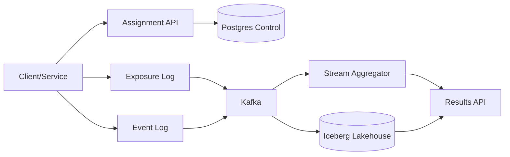

```markdown
---
title: "Experimentation (A/B) Platform"
category: "AI/ML Infrastructure"
difficulty: "Hard"
tags: ["experimentation", "ab-testing", "metrics", "statistics", "streaming", "data-platform"]
---

## Overview

This system provides three things that must stay consistent with each other under real-world messiness: (1) randomized assignment that is stable across time and services, (2) metric computation that correctly attributes outcomes to exposures, and (3) significance testing that teams can trust without becoming statisticians.

The key insight is to treat **exposure** as the atomic fact of experimentation. Everything flows from an immutable exposure log: assignment is deterministic and reproducible, metrics are joined to exposures with explicit attribution windows, and statistical tests run on exposure-scoped aggregates. This avoids the two classic failures: “we shipped a hash function change and invalidated every experiment” and “we computed metrics from raw events and accidentally measured a biased subset.”

The design is intentionally boring elsewhere: Postgres for control-plane, Kafka for event transport, a streaming job for near-real-time aggregates, and a lakehouse table format (Iceberg) for backfills and correctness. The platform earns its complexity only where it prevents subtle, expensive mistakes.

## What Makes This Hard

Naive implementations confuse *assignment* with *measurement*. They assign users in one place, log events somewhere else, and later try to infer who saw what. That fails as soon as you have retries, caching, client-side rendering, ad blockers, delayed conversions, cross-device identity, or “exposure” that is not a single request.

The trap most teams hit is **silent bias**: metrics that look stable but are computed from a non-random slice (missing exposures, logging gaps, late events, or experiment overlap). The platform must make bias detectable (SRM, missing exposure checks, logging coverage) and make the “right way” the default workflow.

## Requirements

### Functional Requirements
- Deterministic randomization for a chosen unit (user_id / device_id / account_id / session_id) with fixed allocation and reproducible bucketing.
- Targeting and mutual exclusion (namespaces / layers) to prevent experiment interference.
- Immutable exposure logging (who, what experiment+variant, when, context) with strong guarantees against double-counting.
- Metric computation with explicit attribution rules:
  - exposure-based joins
  - lookback windows (e.g., 7-day conversion)
  - deduping and late-arriving events handling
- Significance testing with guardrails:
  - SRM detection
  - multiple comparisons policy
  - “peeking” policy baked into the workflow (not tribal knowledge)
- Near-real-time monitoring (minutes) and authoritative batch recomputation (hours) from raw data.
- Experiment lifecycle: create, ramp, holdout, stop, archive; auditable config changes.

### Scale Targets
- **Assignment reads:** 200k RPS peak, p99 < 10 ms (driven by edge/API usage and “evaluate flags on every request” patterns).
- **Exposures:** 2B/day (a subset of requests become exposures; still massive at consumer scale).
- **Product events:** 10B/day, average 2 KB/event → ~20 TB/day uncompressed (forces streaming pre-aggregation + lakehouse compaction).
- **Concurrent experiments:** 5k active, 50k total definitions (drives control-plane ergonomics and caching strategy).
- **Freshness:** 5–10 minute monitoring lag; <6 hour correctness lag for “final” numbers (supports on-call/launch decisions without pretending real-time is free).

## Key Design Decisions

- **We chose:** Deterministic assignment via consistent hashing of `(experiment_salt, unit_id)` into a fixed bucket space (e.g., 0–9999), mapping bucket ranges to variants.
  - **We rejected:** Stateful “random pick” assignment stored per user.
  - **Why:** Deterministic hashing makes assignment reproducible, cacheable, and resilient to partial outages; stateful assignment becomes a storage hot spot and a migration nightmare.

- **We chose:** Exposure-first measurement: every analysis starts from the exposure table, not from raw events.
  - **We rejected:** Inferring exposure from downstream events (“if they clicked, they must have seen variant B”).
  - **Why:** You cannot fix selection bias after the fact; logging exposure is the only scalable way to keep randomization intact.

- **We chose:** Dual-path computation: streaming for fast aggregates, lakehouse batch for correctness/backfills, with the same metric definitions.
  - **We rejected:** Only streaming (hard to backfill) or only batch (too slow for launch decisions).
  - **Why:** Experiments require both fast feedback and the ability to re-run history when identity logic or late events change.

## Architecture



### Components

- **Assignment API**
  - Evaluates targeting + mutual exclusion and returns variant.
  - Produces an exposure event (server-side preferred) so “assignment happened” and “exposure recorded” are causally linked.

- **Postgres Control Plane**
  - Stores experiment definitions (status, variants, allocations, salts), targeting rules, layer/namespace rules, and metric definitions.
  - Strict change control: changes are versioned; assignment uses a pinned config version per exposure.

- **Exposure Log**
  - Append-only record: `(exposure_id, timestamp, experiment_id, config_version, unit_type, unit_id_hash, variant, context)`.
  - The unit_id is stored as a stable hash (privacy + join key), and raw identifiers stay outside the analytics plane.

- **Event Log**
  - Product events (clicks, purchases, latency, errors) with consistent identity fields and event-time timestamps.
  - This is shared infrastructure; the experimentation platform imposes minimal coupling beyond identity conventions.

- **Kafka**
  - The buffer that absorbs bursts and provides replay for streaming jobs.
  - The platform relies on replayability to recover from bugs in metric logic without losing history.

- **Stream Aggregator**
  - Computes near-real-time aggregates keyed by `(experiment_id, variant, day/hour, metric)` using exposure-based joins and event-time watermarks.
  - Writes “monitoring-grade” results plus diagnostics (late event rate, join coverage).

- **Iceberg Lakehouse**
  - Stores raw exposures and events and curated derived tables (exposure sessions, identity mappings, metric-ready fact tables).
  - Enables backfills, exact recomputation, and consistent snapshots for analysis.

- **Results API**
  - Serves experiment dashboards: aggregates, confidence intervals, SRM checks, and test outcomes.
  - Enforces the platform’s statistical policy (no ad-hoc p-value fishing via UI).

## Deep Dive: Correct Metric Attribution (Without Lying to Yourself)

The hardest part is not computing averages; it’s ensuring the numbers still represent a randomized experiment after reality damages your data. The platform treats exposure as the start of truth and makes attribution explicit.

**1) Exposure is a first-class event, not a derived concept.**  
When the assignment service decides “variant=B,” it emits an exposure with a config version and a unique exposure_id. This avoids “configuration drift”: even if you later change allocations or targeting, old exposures remain analyzable under the configuration that produced them.

**2) Metrics are defined as functions over (exposure, events) with windows.**  
Every metric definition includes:
- event filter (e.g., `event_name = 'purchase'`)
- value extraction (e.g., `amount_usd`)
- attribution window (e.g., `[exposure_time, exposure_time + 7d]`)
- dedupe key (e.g., `order_id`), if applicable
- aggregation (sum, mean, percentile, rate)

This prevents the most common bug: accidentally counting outcomes that happened before exposure (reverse causality) or long after the experiment ended (post-treatment contamination).

**3) Joins are event-time, not processing-time.**  
Late events are normal (mobile offline, payment processors). The streaming path uses watermarks and emits provisional results; the batch path recomputes with the full window. The UI makes this honest: “monitoring” vs “final” numbers are different products.

**4) Identity is explicit and conservative.**  
Cross-device identity can increase power, but it also creates leakage if identity links are created after exposure. The platform pins identity resolution to a snapshot at exposure-time (or uses a conservative rule: only links established before exposure count). This is non-obvious and crucial; otherwise you “improve” conversion by joining users to their future selves.

**5) Diagnostics are mandatory, not optional.**  
For every metric, the system tracks:
- exposure count by variant
- join rate (fraction of exposures with eligible events in window)
- missing exposure rate by client/service
- SRM (sample ratio mismatch) with alert thresholds
These are the levers that tell you when your experiment is broken, even if the p-value looks exciting.

## Trade-offs

| Optimized For | Sacrificed |
|--------------|------------|
| Correctness under messy logging | Pure real-time “final” truth |
| Reproducible assignment and analysis | Flexibility to change bucketing mid-flight |
| Simple, audit-friendly control plane | Maximum expressiveness in targeting DSL |
| Backfillable metrics with explicit windows | Low-latency ad-hoc exploratory joins |

## Failure Modes

- **Assignment drift (config changes invalidate analysis)**
  - **What happens:** Variant proportions shift mid-experiment; results become uninterpretable.
  - **Detect:** Allocation change audit + exposure config_version distribution changes.
  - **Recover:** Freeze experiment configs; require creating a new experiment for changes that affect bucketing/targeting; analyze each config_version as separate epochs.

- **Silent exposure loss (biased measurement)**
  - **What happens:** Certain clients fail to log exposures; you analyze only “logged” traffic.
  - **Detect:** SRM spikes, exposure coverage dashboards by client/service, sudden drop in exposures with stable request volume.
  - **Recover:** Block experiment ramp when coverage falls below threshold; fall back to server-side exposure logging; replay buffered logs if available.

- **Late-event distortion (premature decisions)**
  - **What happens:** Early metrics look positive; later conversions arrive and reverse the effect.
  - **Detect:** Late event rate metrics, gap between monitoring and batch recompute.
  - **Recover:** Enforce decision SLAs (don’t call winners before window maturity); show “maturity curve” per metric; rely on batch truth for final calls.

## What I'd Do Differently At...

- **10x scale:** Move more computation to pre-aggregated “metric cubes” (by day, experiment, variant) and serve most queries from those; tighten identity and metric DSL to keep joins predictable.
- **100x scale:** Treat assignment as an edge capability (CDN/sidecar evaluation with signed config snapshots) and make the lakehouse the center of gravity; replace per-experiment joins with standardized derived fact tables so recomputation doesn’t become a cluster-wide tax.

## Operational Notes

- Never change the hash function or bucket space without a migration plan; it is a platform-wide breaking change.
- Make SRM a paging signal for large experiments; it catches real outages faster than “error rate” dashboards.
- Separate “monitoring” from “final” in the UI and APIs; mixing them trains teams to distrust the platform.
- Keep an explicit policy for multiple comparisons and peeking, and enforce it in the Results API—not in slide decks.
- Backfills are routine, not exceptional: version metric definitions and store derived tables by version so you can re-run history deterministically.
```