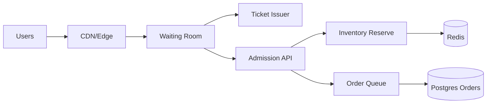

```markdown
---
title: "Flash Sale System"
category: "Commerce & Fintech"
difficulty: "Hard"
tags: ["flash-sale", "fairness", "queueing", "inventory-reservations", "backpressure"]
---

## Overview

This system sells a small amount of inventory under a traffic spike (100x normal) without melting downstream dependencies, while remaining *fair* in a way users actually perceive: “I got a stable spot in line and the rules didn’t change mid-wait.” The key insight is to treat the flash sale as a controlled admission problem, not a scaling problem: we **shape** demand with a virtual waiting room, then **issue scarce inventory reservations** at a rate the system can safely finalize.

Elegance comes from separating concerns: the **queue decides who gets a chance**; the **inventory service decides if a chance becomes a hold**; and the **order pipeline** finalizes asynchronously. Most of the stack stays boring (CDN, stateless APIs, Postgres), while we spend real design energy on the two hard pieces: fairness under retries/bots, and inventory locking under extreme contention.

## What Makes This Hard

Naive implementations let everyone hammer “Add to cart” simultaneously and then try to “just scale the database.” That fails because the bottleneck is not CPU—it's *contention*: a single SKU with 1,000 units creates a hot row/hot lock, and your retries amplify load until the system collapses.

The second trap is “first-come-first-served” that isn’t actually fair. In a spike, arrival time is dominated by client retries, mobile networks, and edge routing. Without a stable, server-issued place-in-line, you reward the best retry script, not the earliest human.

## Requirements

### Functional Requirements
- **Fair queue position**: Each user receives a stable position that doesn’t change across refreshes/retries.
- **Anti-bot fairness**: Fairness is per authenticated account (and device signals), not per IP; abusive retries don’t improve position.
- **No oversell**: Inventory cannot be sold beyond available units, even under retries and partial failures.
- **Inventory locking**: When a user is admitted, the system creates a **time-bounded reservation** (hold) that expires automatically if not purchased.
- **Idempotency end-to-end**: Retried “reserve” / “place order” calls do not create duplicate holds or orders.

### Scale Targets
- **Traffic**: 5k RPS normal → **500k RPS spike** for 10 minutes (web + mobile). This drives the need for edge caching + waiting room.
- **Inventory**: 1–50 SKUs per drop, **100–50,000 units per SKU**. Single hot SKU is the worst case.
- **Fairness granularity**: “Feels fair” means position assignment jitter < **~1s** under load; this drives a centralized monotonic ticket source.
- **Reservation window**: **2–5 minutes** hold TTL; long enough for payment, short enough to recycle inventory quickly.

## Key Design Decisions

- **We chose: Virtual waiting room with server-issued tickets**
  - Rejected: letting the main API absorb the spike and “rate limit later”
  - Why: the waiting room converts unbounded load into cheap polling and lets us admit at a controlled rate based on inventory and downstream health.

- **We chose: Atomic, time-bounded reservations using Redis + durable reconciliation in Postgres**
  - Rejected: row-level locking in Postgres on inventory rows for every attempt
  - Why: Postgres locks turn a hot SKU into a global choke point; Redis atomic scripts are built for high-contention counters, while Postgres stores the durable record of what happened.

- **We chose: Single global ordering per sale (per SKU), not multi-region fairness theater**
  - Rejected: “globally fair, multi-region, active-active queue ordering”
  - Why: true global fairness requires consensus on ordering; for flash sales, a single control-plane region gives predictable fairness and simpler operations. We scale *read* at the edge, not *decision-making* everywhere.

## Architecture



### Components

- **CDN/Edge**: Serves static sale pages and terminates TLS; aggressively caches everything that isn’t personalized to keep origin calm.
- **Waiting Room**: The only public entry during the spike; issues “join queue” and “poll status” endpoints designed to be cheap and cache-friendly.
- **Ticket Issuer**: Assigns a stable queue position once per user per sale/SKU. Backed by a monotonic counter and strict dedupe so retries don’t help.
- **Admission API**: Converts “your turn” into an attempt to reserve inventory. Enforces per-user idempotency and rate limits.
- **Inventory Reserve**: The hot-path authority for holds. Executes an atomic reserve script and returns a reservation token with TTL.
- **Redis**: Holds remaining counters and reservation keys with TTL. Built for high-write contention and fast atomic operations.
- **Order Queue**: Buffers order finalization and payment workflow so the admission tier stays stable under bursts.
- **Postgres Orders**: Durable source of truth for reservations, orders, and reconciliation/audit.

## Deep Dive: Fairness + Inventory Locking (The Real Problem)

**1) Fair queue tickets that retries can’t game**

When a user first joins, the Waiting Room calls Ticket Issuer with `(sale_id, sku_id, user_id)`. Ticket Issuer returns a signed ticket containing:
- `position` (monotonic integer)
- `issued_at`
- `user_id`, `sale_id`, `sku_id`
- `signature` (HMAC)

To make this retry-proof, Ticket Issuer must be idempotent per user:
- Store `ticket:{sale}:{sku}:{user}` → `position` with a TTL covering the sale.
- Generate `position` using `INCR position:{sale}:{sku}` only if the user has no ticket.
- Enforce a strict “one ticket per account” rule; refresh/poll uses the same ticket.

This is where fairness actually comes from: **the system chooses an ordering once** and then simply reveals progress. Clients can refresh all they want; they cannot improve position.

**2) Inventory reservations that never oversell**

On admission, Inventory Reserve runs a single Redis Lua script per SKU:
- Inputs: `sku_id`, `user_id`, `idempotency_key`
- State:
  - `remaining:{sku}` (integer)
  - `resv:{sku}:{user}` (reservation token + expiry)
  - `idem:{idempotency_key}` (cached result)

Script rules:
- If `idem` exists, return the same result (idempotency).
- If `resv` exists (user already holds), return it.
- If `remaining > 0`, decrement `remaining`, create `resv` with TTL (2–5 minutes), and return a reservation token.
- Else return “sold out.”

The reservation token is required to place an order. Order finalization writes to Postgres with a uniqueness constraint on `(sale_id, sku_id, user_id)` (and/or reservation token), so even if the queue retries, the durable system remains correct. If payment succeeds, we mark the reservation consumed; if it times out, Redis auto-expires the reservation and we recycle inventory via a small reconciler that increments `remaining` for expired holds that never became orders (bounded, observable, and safe).

## Trade-offs

| Optimized For | Sacrificed |
|--------------|------------|
| Predictable fairness users perceive | Global multi-region “perfect” fairness |
| No oversell under extreme contention | Strong consistency entirely in Postgres |
| Operational simplicity under spikes | Some eventual consistency (reconciliation loop) |
| Stable systems over peak throughput | A bit of added latency (waiting room) |

## Failure Modes

- **Redis unavailable or slow**
  - What happens: admissions can’t reserve; queue progresses but conversions fail.
  - Detect: reserve error rate/latency, Redis health, sudden drop in reservations/min.
  - Recover: stop admissions (set admission rate to zero), keep waiting room alive, fail closed on reserve, and resume gradually after Redis recovers.

- **Ticket Issuer overload**
  - What happens: users can’t join; fairness collapses if we mint tickets inconsistently.
  - Detect: join latency, error rate, counter lag.
  - Recover: cache “queue open” pages at edge, autoscale Ticket Issuer, and prioritize *idempotent reads* (existing tickets) over new joins.

- **Reservation/order mismatch (reconciliation drift)**
  - What happens: remaining count diverges from true sellable units; risk of “phantom sold out” or stuck inventory.
  - Detect: compare Postgres confirmed orders + active reservations vs starting inventory; alert on drift.
  - Recover: run a bounded reconciler to recompute `remaining` from Postgres truth and reset Redis counters for the SKU.

## What I'd Do Differently At...

- **10x scale:** Partition by SKU and run multiple Ticket Issuer shards (consistent hash by `sku_id`) to spread hot counters; move polling to edge KV for cheaper “position updates.”
- **100x scale:** Make the sale control-plane a dedicated “flash sale platform”: per-SKU isolated Redis clusters, multi-region read-only waiting room with a single-region ordering authority, and strict bot gating before ticket issuance (device attestation + risk scoring) to protect fairness.

## Operational Notes

- Track **admission rate** as a first-class control knob; tie it to `remaining` and downstream health (payment latency, order queue depth).
- Watch **queue abandonment** vs **reservation conversion**; tuning TTL and admission burst size usually matters more than raw capacity.
- Protect fairness by enforcing **one ticket per account** and throttling “join” harder than “poll.”
- Run “sold out” as a state machine: sold out means **no remaining and no reclaimable expired holds**, not “DB looks busy.”
```