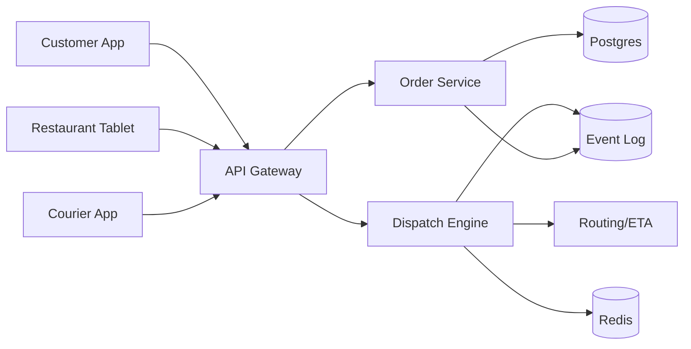

```markdown
---
title: "Food Delivery Logistics"
category: "Commerce & Fintech"
difficulty: "Hard"
tags: ["marketplace", "dispatch", "routing", "optimization", "reliability"]
---

## Overview

This system is a real-time coordination engine for a 3-sided marketplace (customers, restaurants, couriers). It accepts orders, tracks restaurant prep and courier locations, and continuously decides *who should deliver what, when*—including batching multiple orders into one courier route—while meeting SLAs and keeping the marketplace “fair enough” to stay healthy.

The key insight: treat dispatch as a **streaming optimization problem** with **tight time windows and imperfect information**, not as “pick nearest courier.” The elegant design is a two-stage engine: (1) aggressively narrow to plausible candidates using geo/time indexing, then (2) run a fast scoring/assignment loop that’s stable under churn and degrades gracefully when data is stale.

Everything else is intentionally boring: Postgres as system of record, Redis for ephemeral state, a durable event log for replay, and a stateless dispatch service that can be restarted without losing correctness.

## What Makes This Hard

Naive implementations fail in two traps:

1. **Churn + time windows**: courier GPS updates, accept/decline, restaurant delays, and traffic changes mean the “best” assignment changes every few seconds. If you recompute globally, you thrash; if you don’t, you miss SLAs.
2. **Batching is a VRP**: the moment you allow “pick up 2, drop off 2,” you’re in vehicle routing with time windows (NP-hard). Teams either overbuild (research project) or underbuild (batching destroys on-time rate).

The win is not perfect optimality; it’s **stable, explainable near-optimal decisions** at low latency, with explicit guardrails (SLAs, max detour, fairness, and cancellation cost).

## Requirements

### Functional Requirements
- Create and update orders through states: placed → confirmed → prepping → ready → picked up → delivered/canceled.
- Assign couriers to orders with **offers** (must handle decline/timeouts) and prevent double-assign.
- Support **batching** (2–3 orders) with constraints: same restaurant or nearby pickups, bounded detour, per-order SLA.
- Continuous ETA and route updates for customer + courier, driven by traffic and restaurant readiness.
- Marketplace health controls: courier utilization, fairness (avoid starving regions/couriers), restaurant load shedding.
- Auditability: explain “why this courier” for ops, disputes, and tuning.

### Scale Targets
- **Metro peak orders**: 50k orders/hour (~14/s) in a large city; bursts 5–10x at meal spikes → design for **150/s** order events.
- **Courier updates**: 30k concurrent couriers reporting every 2s → **15k location updates/s** (dominant write volume).
- **Dispatch latency**: p95 < **200ms** from “ready”/“order placed” event to offer creation; p99 < 1s during spikes.
- **Correctness**: no double-assign; at-least-once events tolerated; idempotent state transitions.

## Key Design Decisions

- **Dispatch via streaming heuristic optimizer (two-stage)**
  - Chose: candidate generation + fast assignment loop (local search / greedy with backtracking), rerun on relevant events.
  - Rejected: exact VRPTW solvers online; “nearest courier” only.
  - Why: exact solvers don’t converge under churn; nearest-only kills batching and SLA adherence.

- **Postgres as source of truth, Redis as ephemeral real-time state**
  - Chose: Postgres for orders/offers/audit; Redis for courier location, availability, hot indexes, locks.
  - Rejected: “everything in Redis,” or a bespoke state store.
  - Why: you need durability and queryability for disputes and ops; Redis keeps the hot loop fast.

- **Durable event log for replay + decoupling**
  - Chose: Kafka (or equivalent) for order/restaurant/courier events; dispatch emits offers as events.
  - Rejected: point-to-point RPC fanout as the backbone.
  - Why: replay is essential for debugging, simulation, and safe algorithm changes; the bus absorbs spikes.

## Architecture



### Components

- `API Gateway`: auth, rate limits, request shaping; protects the dispatch loop from client chaos.
- `Order Service`: owns order lifecycle and invariants (idempotent transitions, payments hooks, cancellation rules); writes to Postgres and emits events.
- `Dispatch Engine`: stateless workers consuming events, maintaining ephemeral state in Redis, producing offers and assignments; the only “smart” service.
- `Routing/ETA`: calls a routing engine (OSRM/GraphHopper + traffic provider) and exposes consistent ETA primitives to dispatch and user-facing surfaces.
- `Redis`: courier state (location, availability, capacity), geo/time indexes, short-lived locks, and offer dedupe.
- `Event Log`: durable stream for all state changes; enables replay, backfills, and shadow runs.
- `Postgres`: system of record for orders, offers, assignments, courier shifts, audits; supports ops queries and reconciliation.

## Deep Dive: The Hardest Part — Real-Time Batching + Stable Assignment

### Model the world as constraints, not guesses
Each order has:
- time windows: latest pickup, latest drop-off (derived from promised SLA)
- prep readiness distribution (restaurant-provided + learned bias)
- cancellation/late penalty (customer experience + refund cost)

Each courier has:
- current location + heading uncertainty (GPS jitter)
- capacity (max concurrent orders), current route commitments
- acceptance behavior (historical accept rate, current “busy” signals)

Batching is allowed only if it respects **guardrails**:
- max additional drive time per existing order (e.g., +6 minutes)
- max pickup spread (e.g., pickups within 800m or same restaurant)
- hard deadline feasibility under optimistic *and* pessimistic prep/traffic estimates

### Two-stage dispatch loop (the core elegance)
1. **Candidate generation (cheap, broad, safe)**
   - Maintain couriers in Redis by geo bucket (H3/geohash) and availability.
   - For an event (order ready/placed, courier freed, delay update), fetch top-K couriers in expanding rings (e.g., K=50–150).
   - Generate batch candidates by combining:
     - same-restaurant ready orders within a short time window
     - nearby pickups with compatible deadlines
   - Discard anything that fails fast feasibility checks (time window bounds, capacity, max detour).

2. **Scoring + assignment (fast, stable, explainable)**
   - Compute a score for each (courier, route plan) option:
     - on-time probability (dominant term)
     - incremental cost (drive time, idle time)
     - marketplace health (fairness/utilization smoothing)
     - churn penalty (avoid reassigning unless materially better)
   - Solve a *small* assignment problem per local region/event batch:
     - greedy with backtracking or min-cost matching on the filtered set
     - enforce “stickiness”: don’t revoke an offer already accepted; don’t reshuffle committed routes
   - Emit an **Offer** with a TTL (e.g., 20s) and a cryptographic idempotency key.

This is how you get batching benefits without turning dispatch into a global optimizer that thrashes.

### Handling uncertainty without overfitting
- Use **pessimistic bounds** to protect SLAs (late is expensive), but allow controlled risk when the marketplace is tight (few couriers).
- Treat restaurant prep times as a calibrated distribution; don’t trust a single “ready in 5 min.”
- Use a simple “confidence” measure: if location or prep signals are stale, reduce batching aggressiveness automatically.

### Concurrency and correctness (where most teams bleed)
- Offers are the concurrency boundary:
  - One active offer per courier per “slot” (capacity unit), enforced via Redis atomic set with TTL.
  - Accept/decline is written to Postgres with a unique constraint on `(order_id)` assignment to prevent double-assign.
- Events are at-least-once:
  - Every state mutation is idempotent via `(entity_id, version)` or idempotency keys.
- Reconciliation job:
  - Periodically compare Redis ephemeral state vs Postgres truth; heal stuck offers and orphaned assignments.

## Trade-offs

| Optimized For | Sacrificed |
|--------------|------------|
| SLA reliability under churn | Globally optimal routes |
| Simple, restartable dispatch workers | Rich in-memory global state |
| Fast iteration on heuristics (replay/shadow) | “Perfect” mathematical optimality |
| Explainable decisions and guardrails | Maximum batching rate at all costs |

## Failure Modes

- **Stale courier locations (GPS drop / backgrounded app)**
  - Happens: dispatch offers to “ghost” couriers; acceptance drops; SLAs slip.
  - Detect: location age > threshold, sudden accept-rate collapse by cohort.
  - Recover: mark courier as low-confidence, exclude from batching, require heartbeat; fall back to conservative nearest-available.

- **Offer storms / thrash during spikes**
  - Happens: too many re-computes; couriers get spammed; acceptance falls.
  - Detect: offers per order/courier rises; high revoke/reissue rates; p95 dispatch latency climbs.
  - Recover: introduce stickiness penalty, rate-limit reoffers, coalesce events (debounce), and temporarily disable multi-order batching.

- **Split-brain assignments (duplicate offers accepted)**
  - Happens: retries + races create multiple “winners.”
  - Detect: unique constraint violations, mismatch between courier app state and Postgres assignment.
  - Recover: Postgres enforces single assignment; loser offer invalidated; courier app receives authoritative correction + compensation flow.

## What I'd Do Differently At...

- **10x scale:**
  - Partition dispatch by city zones with consistent hashing; isolate hotspots.
  - Precompute travel-time matrices per zone for short hops; reduce routing calls.
  - Add shadow dispatch to evaluate new scoring safely from replay.

- **100x scale:**
  - Move from “event-triggered recompute” to **continuous per-zone optimization ticks** with bounded work.
  - Introduce a dedicated, scalable state store for real-time geo queries (still keep Postgres as record).
  - Make routing/ETA a first-class platform with caching, map updates, and strict SLOs; it becomes a top cost center.

## Operational Notes

- Dispatch must have a **kill switch** to disable batching and revert to conservative single-order assignment in <1 minute.
- Keep a **replay pipeline** (from event log) to reproduce incidents and tune scoring offline; it’s the fastest path to real reliability gains.
- Watch the leading indicators: offer spam rate, accept-rate by cohort, lateness at pickup vs drop-off (distinguishes restaurant vs routing issues).
- On-call playbook should include “drain a zone” (stop new offers, let in-flight finish) and “freeze reassignments” during incidents.
```