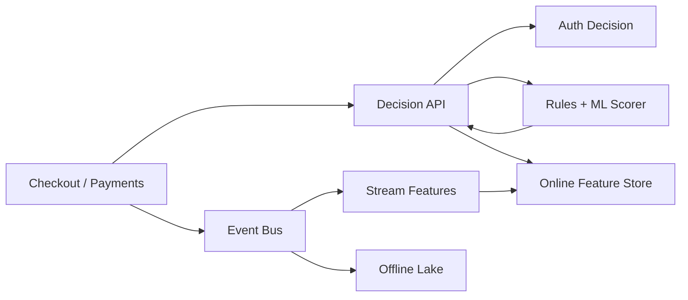

```markdown
---
title: "Fraud Detection Pipeline"
category: "Commerce & Fintech"
difficulty: "Hard"
tags: [fraud, streaming, ml, rules, kafka, flink, feature-store, risk]
---

## Overview

This system scores transactions in real time (authorize/deny/challenge) by combining three signals: streaming behavioral features (velocity, patterns, device graph), deterministic rules (known bad, policy constraints), and ML inference (generalization + subtle correlations). The elegant insight is to treat “risk scoring” as a *pure function over an immutable event plus a versioned feature snapshot*, not as a tangle of microservices doing ad-hoc reads and writes.

Most fraud platforms fail because they blur online decisioning with offline analytics: they compute features one way for training and another way for serving, then spend months chasing “model drift” that’s actually feature skew. This design makes one streaming pipeline the source of truth for features, then serves them with a low-latency online store and strict versioning.

## What Makes This Hard

Naive implementations look up “a few things from the DB” at auth time and bolt on a model call. That works until:
- traffic spikes cause cache misses and DB thundering herds, blowing latency budgets
- out-of-order events (retries, delayed device signals, chargebacks) corrupt “velocity” features
- training data uses different time windows / joins than production, so the model learns on signals it won’t have at decision time
- rule changes and model changes are deployed independently, making incidents impossible to attribute

The trap: fraud is adversarial and non-stationary. The hardest part isn’t picking Kafka vs Kinesis; it’s building *replayable, versioned, auditable decisioning* without turning the system into component soup.

## Requirements

### Functional Requirements
- Real-time decisioning on the transaction path with deterministic, explainable outputs (“why was this blocked?”).
- Streaming feature computation with event-time semantics (late/out-of-order tolerated) and low-latency online serving.
- Hybrid scoring: rules first (fast, safety rails), ML second (rank risk), with a consistent final policy layer.
- Feedback ingestion (chargebacks, manual reviews, customer disputes) and linkage back to the original decision for training and evaluation.
- Safe experimentation: shadow models, canary rules, and ability to replay historical traffic through a new model/ruleset.

### Scale Targets
- **Peak auth throughput:** 5k tx/s (regional bursty traffic); **sustained:** 1k tx/s.
- **Latency budget:** p99 **< 80ms** end-to-end decisioning; p99.9 **< 150ms** (fraud is useless if it slows checkout).
- **Feature freshness:** streaming features visible online within **< 1s** of event ingestion.
- **History horizon:** 180 days of feature/backfill capability (fraud investigations and model iteration demand replay).
- **Availability:** 99.95% on decision path; degrade safely (prefer “step-up/challenge” over “approve”).

## Key Design Decisions

- **We chose:** One streaming pipeline to compute *both* online features and offline training snapshots (same definitions, same windows).
  - **Rejected:** Separate “online features in Redis” and “offline features in Spark” owned by different teams.
  - **Why:** Feature skew is the silent killer; a single definition pipeline makes the model’s inputs real and replayable.

- **We chose:** At-least-once streaming with idempotent writes keyed by `transaction_id` + `feature_set_version`.
  - **Rejected:** Chasing end-to-end exactly-once across every sink.
  - **Why:** Exactly-once complexity rarely pays off here; idempotency + audit logs handle duplicates while keeping ops sane.

- **We chose:** A single low-latency **Decision Service** that composes (1) feature fetch, (2) rules eval, (3) model inference, (4) policy output.
  - **Rejected:** Separate “rules service”, “model service”, “policy service” on the hot path.
  - **Why:** Fraud latency is dominated by network hops; fewer hops also makes incident attribution and rollbacks clean.

## Architecture



### Components

- **Decision API**
  - Synchronous entry point on the payment path. Enforces strict timeouts, idempotency keys, and returns `approve/deny/challenge` + explanation payload.

- **Online Feature Store (Redis Cluster)**
  - Serves sub-10ms reads of hot features (velocity counters, device/user aggregates). Redis earns its place because it’s predictable under load and easy to shard by entity key.

- **Rules + ML Scorer**
  - Runs in one service/process boundary to avoid extra hops. Rules are compiled/validated configs with strict versioning; ML inference runs via an embedded runtime (e.g., ONNX Runtime) to keep p99 stable.

- **Event Bus (Kafka)**
  - Immutable log of transactions + signals (device telemetry, login events, shipping changes, 3DS outcomes). Kafka earns its place because replay is a first-class requirement, not a debugging trick.

- **Stream Features (Flink)**
  - Computes event-time windowed features with watermarking and late-event handling. Outputs to Redis (online) and to the lake (offline) using the same transformations.

- **Offline Lake (S3 + Parquet + Metastore)**
  - Stores raw events, feature snapshots, and labeled outcomes for training/evaluation. It exists to make replay, audits, and model iteration cheap.

## Deep Dive: Feature Freshness Without Feature Skew

The core contract is: **a decision is made using a feature snapshot that can be reconstructed.** We do that by versioning *feature definitions* and making the streaming job the only writer of those features.

1) **Event-time semantics, not processing-time hacks**  
Velocity and “recent behavior” are fraud-critical and fragile. The Flink job computes features using event timestamps with watermarks (e.g., 2 minutes). Late events update aggregates, but the decision path does not retroactively change decisions; instead, late updates flow into subsequent decisions and into evaluation.

2) **Online/offline parity through “feature sets”**  
Every feature belongs to a `feature_set_version` (e.g., `v37`). The same Flink code writes:
- **Online:** entity-keyed Redis hashes like `user:{id}:v37`, `device:{id}:v37`
- **Offline:** per-transaction feature rows keyed by `transaction_id`, including the exact `v37` values used/available at decision time  
Training reads only those offline rows, not a separate ad-hoc join. This prevents the classic “training saw future data” leakage (e.g., using a chargeback that happened days later).

3) **Decision-time consistency and fallbacks**  
Decision API fetches a bounded set of keys (user/device/card/merchant). If a key is missing (cold start or Redis partial outage), the scorer explicitly substitutes defaults and emits a “feature_missing” signal that the model is trained to handle. When the feature store is unhealthy, the system degrades to conservative rules + step-up rather than timing out checkout.

## Trade-offs

| Optimized For | Sacrificed |
|--------------|------------|
| Low, predictable p99 latency | Some model complexity (no multi-hop ensembles) |
| Replayability + auditability | Higher storage and stricter version discipline |
| Feature parity (less skew) | Less flexibility for ad-hoc offline joins |
| Operational simplicity | Not chasing end-to-end exactly-once |

## Failure Modes

- **Kafka lag / consumer slowdown**
  - **What happens:** online features get stale; model still runs but loses recent velocity signals.
  - **Detect:** watermark delay, consumer lag, Redis write rate drop, sudden approval-rate shifts.
  - **Recover:** autoscale Flink, shed non-critical input topics, temporarily bias policy toward “challenge” for high-risk segments.

- **Online feature store partial outage**
  - **What happens:** feature fetch timeouts threaten checkout latency.
  - **Detect:** Redis p99, error rates, connection churn.
  - **Recover:** strict client timeouts + circuit breaker; fall back to cached “last-known-good” small feature subset in-process; shift to rule-heavy conservative decisions.

- **Bad model/rules release**
  - **What happens:** sudden spike in false positives (revenue loss) or false negatives (fraud loss).
  - **Detect:** canary metrics by version, approval/deny deltas by segment, post-auth chargeback leading indicators.
  - **Recover:** instant rollback by version pin; keep “shadow” scoring running to validate the fix before re-rollout.

## What I'd Do Differently At...

- **10x scale:** split Redis by entity domain (user/device/card) with independent autoscaling; move heavy features to approximate sketches (e.g., HLL) where exactness doesn’t matter; introduce regional Kafka + regional decisioning to keep latency local.
- **100x scale:** re-architect around multi-region active-active with strict data locality; replace single Redis with a tiered feature store (in-memory hot tier + durable KV like DynamoDB/Bigtable); formalize a feature registry with automated lineage + backfill pipelines to keep iteration speed.

## Operational Notes

- Treat every decision as an append-only record: `transaction_id`, `decision`, `rule_version`, `model_version`, `feature_set_version`, and a compact explanation payload.
- Make replay a product feature: “re-score last week with model v42” should be a standard job, not a heroic incident script.
- Monitor *decision distribution* (approve/deny/challenge) by merchant, BIN, country, device family—fraud and bugs both show up as distribution shifts.
- Keep strict timeouts (e.g., 20ms feature fetch, 25ms inference, 10ms rules) and fail closed to “challenge” rather than timing out checkout.
```