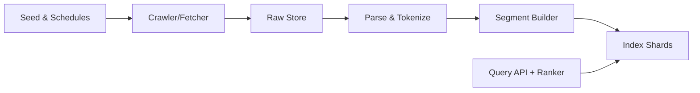

```markdown
---
title: "General Purpose Search Engine"
category: "Social & Discovery"
difficulty: "Hard"
tags: ["search", "indexing", "ranking", "crawling", "information-retrieval"]
---

## Overview

This system crawls a large document corpus, turns raw content into an inverted index, and serves queries with low latency. The core idea is simple: write everything as **immutable artifacts** (raw fetches + index segments), and publish indexes via **versioned manifests**. Correctness comes from replaying deterministic transforms and swapping generations, not from in-place mutation.

The “system” is five things: crawl, store, build segments, serve shards, and a thin query layer that enforces budgets and degrades cleanly.

## What Makes This Hard

Indexing breaks when identity shifts: redirects change, canonical tags lie, the same URL serves different bytes, and duplicates silently multiply your index. Serving breaks under gray failures: one slow shard can dominate tail latency unless you enforce deadlines and return best-effort results.

Ranking is mostly discipline: cheap retrieval first, then only bounded extra work on a small candidate set.

## Requirements

### Functional Requirements
- **Canonical document identity**: handle redirects, canonical tags, and content-based dedup so rank signals accumulate on the right entity.
- **Incremental updates**: re-crawls must update the index without full rebuilds; deletions and “gone” pages must decay out predictably.
- **Spam resistance (baseline)**: prevent obvious keyword stuffing, doorway pages, and duplicate farms from dominating.
- **Explainability hooks**: for any served result, produce a minimal “why” trace (top terms/features), or on-call cannot debug relevance.

### Scale Targets
- **Corpus**: 10B documents stored; 1B “active” (served) after dedup and quality filters.
- **Freshness**: 1% of corpus re-crawled daily (10M docs/day); hot set refreshed hourly.
- **Index size**: ~5–20% of raw text size (depends on fields, positions, and stored snippets).
- **Query load**: 50k QPS peak, p95 < 200ms end-to-end; top-200 candidate set reranked within ~30ms budget.

These numbers force: (1) sharded index with local SSD, (2) asynchronous indexing with replay, (3) two-stage retrieval.

## Key Design Decisions

- **Chose: immutable, segment-based inverted index**
  - Rejected: in-place per-document updates in a mutable global index
  - Why: segments make indexing deterministic and recoverable; the only “mutation” is publishing a new manifest.

- **Chose: object storage as the log and artifact store**
  - Rejected: a separate “sacred” streaming log as a hard dependency
  - Why: appending fetch metadata and writing segments to the same durable store keeps replay, backfills, and recovery simple.

- **Chose: DocID as a stable routing key**
  - Rejected: deletes/updates that require cross-shard coordination
  - Why: every version, delete, and alias decision must land on the same shard deterministically.

- **Chose: retrieve fast, rerank bounded**
  - Rejected: spending “smart” compute on the full corpus
  - Why: stage-1 is cheap recall; stage-2 is a small, time-boxed rerank over top-K.

## Architecture



### Components

- **Seed & Schedules**: crawl policy (freshness tiers, host politeness, per-host budgets). If this is wrong, everything else is wasted.
- **Crawler/Fetcher**: fetches with strict HTTP hygiene and emits only artifacts + metadata (redirect chain, status, content-type, fetch time).
- **Raw Store (object storage)**: stores immutable fetch artifacts and the append-only “what was fetched” records. This is the only source for replay/backfills.
- **Parse & Tokenize**: deterministic extraction (canonicalization, boilerplate removal, fields, normalization). This is where identity and dedup decisions happen.
- **Segment Builder**: writes immutable index segments + delete bitmaps and publishes versioned manifests.
- **Index Shards**: hosts a set of segments on local SSD and answers lexical queries fast; replicas exist to survive shard loss and to hedge gray failures.
- **Query API + Ranker**: budget-enforced fan-out + aggregation, plus a bounded rerank over a small candidate set; returns “why” traces.

## Deep Dive: Document Identity, Updates, and Dedup (The Hardest Part)

The core problem: “a document” is not a URL, but updates and deletes must be routable without cross-shard coordination. Keep identity minimal and deterministic:
1. **DocID**: stable routing key derived from a normalized canonical URL candidate. Canonical tags and redirects are signals, not authority.
2. **ContentID**: hash of normalized extracted content (used for exact dedup and change detection).

Pipeline behavior:
- Parse/tokenize emits `(DocID, ContentID, fields, fetch_metadata)`.
- If the same `DocID` arrives with a new `ContentID`, it is an **update**: write a new version into a new segment and mark the previous version deleted via a **delete bitmap** keyed by `DocID`.
- If `ContentID` matches an existing doc on the same shard, treat it as an **exact duplicate** and keep one indexed copy; store the canonical URL you intend to serve as the display URL.

Sharding invariant:
- The same `DocID` must always map to the same shard across time. That single rule keeps updates, deletes, and duplicates from turning into coordination work.

Finally, lifecycle:
- “Gone” pages (404/410) are treated as tombstones that trigger deletes; tombstones expire after a policy window to handle transient outages.
- Segment merges physically drop deleted docs and stale aliases, preventing the index from becoming a graveyard.

## Trade-offs

| Optimized For | Sacrificed |
|--------------|------------|
| Replayable, recoverable indexing | Extra storage for raw artifacts and segments |
| Simple operations | Less “real-time” indexing than a dedicated streaming pipeline |
| Stable routing for updates/deletes | Some mis-grouping when canonical signals are wrong |
| Bounded tail latency | Partial results and degraded ranking during incidents |

## Failure Modes

- **Pipeline lag → stale results**
  - Detect: “freshness age” SLO per tier, backlog size in Raw Store manifests
  - Recover: shed low-priority crawl tiers, increase indexer workers, replay from Raw Store after fixes

- **Object storage degraded/unavailable → indexing pauses**
  - Detect: elevated write/read error rate and latency to Raw Store
  - Recover: keep serving from last published index generation; crawler buffers locally up to a hard limit, then backpressures and pauses lower tiers

- **Query traffic spike → overload**
  - Detect: QPS jump, CPU saturation, rising in-flight queries, p95/p99 breach
  - Recover: admission control, reduce `K`, skip rerank, and prefer partial best-effort results over timeouts

- **Slow shard / partition → tail latency**
  - Detect: per-shard deadlines exceeded, rising “skipped shard” rate, p95/p99 inflation
  - Recover: enforce per-shard timeouts, hedge to replica, and return best-effort top-K with a degraded flag instead of stalling the whole query

- **Bad canonicalization/dedup deploy → relevance collapse**
  - Detect: spike in `DocID` churn, sudden change in unique DocIDs indexed, large shifts in update/delete rates
  - Recover: rollback parse/tokenize version, republish prior manifest, and replay affected tiers from Raw Store

## What We Removed

- **Separate ingest log service**: the fetch log is stored alongside raw artifacts in object storage; replay/backfills read from there.
- **Online near-duplicate detection**: exact dedup only in the online indexing path.
- **Standalone ranking service**: ranking lives inside the Query API as a bounded post-processing step.
- **Extra distribution/control-plane components**: shard nodes pull versioned manifests + segments from object storage and switch generations atomically.

## Operational Notes

- Treat the **Raw Store as sacred**: every rebuild is “replay deterministic transforms,” not “restore state.”
- Publish via **versioned manifests**: write segments + delete bitmaps first, then publish a new manifest; shards only switch once everything is present and checksummed.
- Maintain explicit **degradation ladders**: reduce `K`, skip rerank, and return partial results before you miss p95.
- Keep parse/tokenize changes **versioned and gated**: block rollout if `DocID` churn spikes; rollback is republishing the prior manifest.
```
