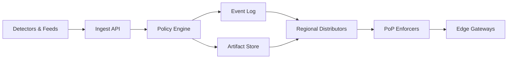

```markdown
---
title: "Global Blacklisting System"
category: "Strategic Problems"
difficulty: "Hard"
tags: ["abuse", "security", "global-distribution", "streaming", "control-plane"]
---

## Overview

This system propagates abuse signals (IP ranges, domains, ASN fingerprints) globally in seconds and enforces them at the edge with a deterministic, auditable policy. The key insight is to **treat “block decisions” as a globally replicated event stream with signed, versioned artifacts**, not as “a database everyone queries.” Edge enforcement becomes a local read (in-memory) with predictable latency, while distribution is an engineering problem with clear invariants.

The elegance comes from separating concerns: **a small, strongly consistent control plane** that decides *what* to block, and **a fast, eventually consistent data plane** that decides *whether this request matches a current block artifact*. This keeps the hard parts (safety, correctness, poisoning resistance, rollback) in one place, and keeps the hot path boring.

## What Makes This Hard

Naive implementations die in three traps:

1. **“Global DB lookup” trap:** querying a central store (or even a multi-region database) on every request makes enforcement brittle, expensive, and too slow under attack—exactly when you need it most.
2. **“Fast push without safety” trap:** pushing rules instantly without cryptographic authenticity and rollback turns the system into a self-inflicted outage machine (one bad rule blocks the world).
3. **“Rules don’t scale on the hot path” trap:** large, frequently changing lists turn into CPU cache misses, lock contention, and garbage collection pauses unless you build an artifact optimized for lookups and incremental updates.

## Requirements

### Functional Requirements
- Ingest abuse signals from internal detectors and trusted external feeds, with provenance and confidence.
- Produce **globally consistent policy artifacts** (what is blocked) with an audit trail and reversible changes.
- Propagate policy updates to all enforcement points within seconds.
- Enforce blocks on the request path with minimal latency overhead.
- Support emergency actions: “block now”, “undo now”, and “quarantine suspicious feed.”

### Scale Targets
- **Enforcement throughput:** 10M req/s globally (edge/CDN scale). The design must add <1ms p99 overhead per request.
- **Rule volume:** up to 5M IPs / 500k CIDRs + 2M domains (realistic if you ingest noisy feeds). Lookups must remain O(1)-ish in practice.
- **Update rate:** bursts of 10k updates/s during attacks. Propagation **p99 < 5s** end-to-end (decision → enforced globally).
- **Regions/PoPs:** 20 regions, 200 PoPs. Distribution must tolerate partitions and still converge quickly.

## Key Design Decisions

- **Decision:** Use an append-only event log + signed policy artifacts.
  - **Chose:** Kafka (or equivalent durable log) as the distribution spine; artifacts are versioned and signed.
  - **Rejected:** “Update a DB row and poll” and “push configs via ad-hoc RPC.”
  - **Why:** The log gives ordering, replay, backpressure, and an audit trail. Signed artifacts let the edge trust updates even during partial compromise.

- **Decision:** Enforce from compiled artifacts, not from raw rule lists.
  - **Chose:** A two-tier structure: (1) compact probabilistic prefilter (Bloom/Xor filter) + (2) exact set for positives (hash set / radix trie for CIDRs).
  - **Rejected:** Linear scans, regex-heavy matching, and per-request remote checks.
  - **Why:** Most traffic is not abusive; a prefilter keeps CPU predictable. Exact sets keep false positives at zero where it matters (final decision).

- **Decision:** Roll out globally via “version gates” with canary + instant rollback.
  - **Chose:** Every artifact has a monotonically increasing version; PoPs apply only if signature verifies and version advances; rollback is “publish new version that removes rule(s).”
  - **Rejected:** Mutable config blobs without versioning and “delete the bad rule everywhere.”
  - **Why:** Under stress, you need one lever: publish version N+1. Rollback becomes the same mechanism as rollout.

## Architecture



### Components

- **Ingest API**
  - Normalizes signals, attaches provenance, enforces quotas per source, and rejects malformed/poisonous input (e.g., “block 0.0.0.0/0” without elevated approval).

- **Policy Engine**
  - The “brain”: deduplicates, scores, applies allowlists, and decides which signals graduate into the active blacklist. Writes every decision as an immutable event.

- **Event Log**
  - The propagation backbone. Consumers can replay from offsets to recover instantly after outages, and ordering is explicit.

- **Artifact Store**
  - Stores the compiled, signed artifacts (full snapshot + deltas). This is what PoPs fetch on cold start or when they fall behind.

- **Regional Distributors**
  - Maintain long-lived connections to PoPs, push deltas immediately, and serve snapshots locally to avoid cross-ocean fetches.

- **PoP Enforcers**
  - Turn artifacts into a hot in-memory structure and expose a tiny “isBlocked(subject)” interface to the gateways.

- **Edge Gateways**
  - Apply the decision at L7 (HTTP Host / SNI) and L4 (source IP/CIDR), with strict timeouts and fail-closed/fail-open behavior chosen per risk class.

## Deep Dive: Propagation in Seconds Without Global Self-DoS

The hardest part is not “getting updates to the edge.” It’s doing it **fast, safely, and under attack**.

**1) Make the edge trustless and deterministic.**  
PoPs never “evaluate policy.” They only verify signatures and apply artifacts. The Policy Engine signs every artifact with an offline-protected key (or HSM-backed). PoPs accept artifacts only if:
- signature verifies against a pinned public key,
- `version` strictly increases,
- artifact metadata matches their environment (prod vs staging),
- and the artifact passes sanity checks (size bounds, CIDR count bounds, domain count bounds).

This blocks the two nightmare scenarios: a compromised distributor pushing garbage, and accidental bad deploys without a clean rollback path.

**2) Use snapshots + deltas with bounded catch-up.**  
Deltas keep steady-state fast (kilobytes per second), but partitions happen. Every N versions (or every M minutes), the Policy Engine emits a **snapshot artifact**. PoPs that are behind more than a threshold stop applying deltas and fetch the latest snapshot from the regional distributor. This prevents “replay storms” when a PoP reconnects after a long outage.

**3) Optimize the hot path for cache, not algorithms.**  
For IPs/CIDRs:
- Store CIDRs in a compressed radix trie (or a well-tested library) for exact matching.
- Store individual IPs in a flat hash set.
For domains:
- Normalize to punycode, lowercase, and store **reversed labels** (e.g., `com.example`) in a trie for suffix matching when blocking subdomains.
Prefilter:
- A Bloom/Xor filter rejects obvious non-members cheaply.
- Every “maybe” is checked against the exact structure to keep false positives from actually blocking.

**4) Rollouts are gated, not simultaneous.**  
The distributor does a fixed rollout order: 1% PoPs → 10% → 100%, with automated health checks (block-hit rate deltas, error rates, customer allowlist exceptions). Emergency mode overrides gating (for real attacks), but the same versioned mechanism still applies, so rollback is one publish.

## Trade-offs

| Optimized For | Sacrificed |
|--------------|------------|
| Seconds-level global propagation | Strong global read-after-write everywhere |
| Safe rollouts + instant rollback | More moving parts than “one DB table” |
| Predictable hot-path latency | Slightly higher memory footprint at PoPs |
| Auditability and provenance | More rigor in ingest and policy changes |

## Failure Modes

- **Bad rule blocks legitimate traffic**
  - **What happens:** sudden drop in requests for specific customers/regions; spike in blocks.
  - **Detect:** anomaly detection on block rate per customer/ASN/region; “top newly-blocked” dashboards keyed by artifact version.
  - **Recover:** publish version N+1 removing the rule; distributors push immediately; PoPs apply within seconds.

- **Partition: PoPs lose connectivity to distributors**
  - **What happens:** PoPs stop receiving updates; enforcement becomes stale.
  - **Detect:** PoP reports “current artifact version” heartbeat; alert on version lag SLO breach.
  - **Recover:** PoPs continue enforcing last-known-good; on reconnect they fetch latest snapshot (not replaying hours of deltas).

- **Poisoned feed attempts to inject massive blocks**
  - **What happens:** ingest flood or “block the internet” payloads.
  - **Detect:** per-source quotas, schema validation, and policy sanity checks (e.g., max CIDR size, max affected traffic estimate).
  - **Recover:** automatically quarantine the source, require human approval to re-enable, and publish a corrective version if anything slipped through.

## What I'd Do Differently At...

- **10x scale:** Move more enforcement into kernel/sidecar primitives (eBPF/XDP for L4 IP blocking) while keeping the same signed artifact format; add per-customer policy overlays without forking the global stream.
- **100x scale:** Split the policy stream into shards by subject type and hash (IPs/domains) to reduce fanout pressure; introduce dedicated “attack-mode” artifacts with ultra-short TTLs to avoid unbounded growth during sustained campaigns.

## Operational Notes

- Treat the artifact `version` as the primary on-call metric; everything else is secondary.
- Keep a “break glass” path: publish an empty/allow-only artifact signed by a separate emergency key with strict access controls.
- Maintain a global allowlist (customer IPs, critical partners, internal health checks) enforced *before* blacklist matching.
- Always log decisions with `{artifact_version, matched_rule_id, provenance}` sampled at the edge; it’s the difference between “we think it works” and “we can prove what happened.”
```