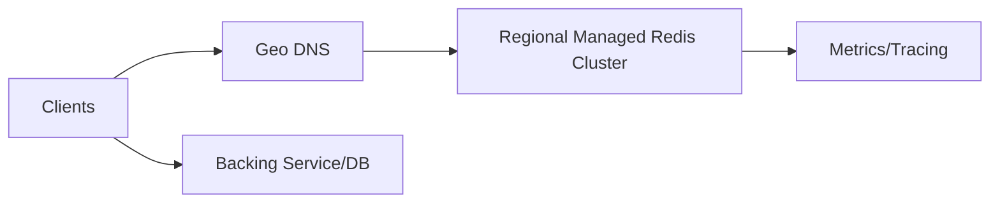

```markdown
---
title: "Global Distributed Cache"
category: "Storage & Data Platforms"
difficulty: "Hard"
tags: ["cache", "distributed-systems", "consistent-hashing", "eviction", "hot-keys", "stampede-protection", "multi-region"]
---

## Overview

This system is a global, single-hostname cache that behaves like a fast local cache in every region. It is intentionally simple: **each region runs an independent, managed Redis Cluster**, and **the miss path is serialized per key** so cache misses can’t synchronize into a backing-store outage.

Routing is “correct enough” by delegation: clients connect to the managed cluster endpoint and follow Redis Cluster redirections. Cached values are allowed to be regional and slightly stale; correctness is enforced where it matters—**only one requester at a time is allowed to recompute a missing/stale key** via short leases and soft/hard TTL.

## What Makes This Hard

Naive designs die on the miss path. Teams build a fast GET/SET store, then a traffic spike turns “cache miss” into “everyone recomputes,” detonating the database and causing cascading failure. The trap: **even a 1% miss rate at high QPS is an outage if misses synchronize** (TTL boundaries, deploys, regional failover, cold starts).

The second trap is making the cache itself into a database. If you build your own shard map, replication, and eviction engine, you inherit all the failure modes. This design avoids that: it uses a proven data plane and keeps the custom surface area in the miss-path contract.

## Requirements

### Functional Requirements
- **Multi-region endpoint**: clients use one hostname; requests land in the nearest healthy region.
- **Regional cache cluster**: each region is independent; no cross-region replication in the cache.
- **Stampede protection**: leases + soft/hard TTL so only one recompute happens per key at a time.
- **Negative caching**: cache “not found” briefly to stop repeated misses.
- **Operational basics**: metrics for hit/miss/stale/lease contention and safe rollouts of client changes.

### Scale Targets
- **Reads**: 2M QPS global steady, 10M QPS burst (peak-to-avg 5x during incidents/deploys).
- **Writes**: 50k QPS (write-through + cache invalidations dominate, not raw sets).
- **Key cardinality**: 500M keys active/day, skewed (top 0.1% keys account for 50% of reads).
- **Object size**: median 300B, p99 8KB, max 1MB (hard cap).
- **Latency**: p99 GET < 3ms in-region; cross-region is failure-only behavior.
These numbers matter because they force stampede-proof misses and stable behavior during cold cache events.

## Key Design Decisions

- **Decision 1: Regional cache, no cross-region data**
  - **Chose**: independent regional clusters; on failover a region recomputes locally.
  - **Rejected**: global replication and global invalidation streams as part of the cache.
  - **Why**: a cache stays reliable by staying regional; cross-region coherence belongs in the application’s data model, not in the cache hot path.

- **Decision 2: Managed Redis data plane (no custom control plane)**
  - **Chose**: Redis Cluster provided as a managed service; clients are cluster-aware and follow redirections.
  - **Rejected**: a custom shard map (Raft) and custom in-memory storage/replication.
  - **Why**: this removes the largest correctness surface area while preserving predictable routing via consistent hashing (cluster slots).

- **Decision 3: Stampede protection with leases + stale-while-revalidate**
  - **Chose**: a per-key **lease** on miss/refresh plus **soft TTL** and **hard TTL**.
  - **Rejected**: “fail open” dogpiles and background refresh daemons.
  - **Why**: the cache itself becomes the single serialization point for recompute without adding another service.

## Architecture



### Components

- **Geo DNS**
  - Justification: the only thing “global” here is routing to the nearest healthy region.

- **Regional Managed Redis Cluster**
  - Justification: provides sharding, memory management/eviction, and node failover without a custom control plane.
  - Stores both cached values and short-lived lease keys; leases and values are kept on the same hash slot via key naming so atomic operations work on Redis Cluster.

- **Backing Service/DB**
  - Not part of the cache product, but the cache is explicitly designed to protect it under bursty miss traffic.

- **Metrics/Tracing**
  - Justification: without visibility into miss reasons and lease contention, you can’t tell if the cache is helping or hurting.

## Deep Dive: Stampede-Proof Miss Path (Leases + Soft TTL)

The cache uses two expirations per entry (stored as metadata on the value; Redis key expiry enforces the hard TTL):
- **Soft TTL**: after this, the value is *stale but serveable*.
- **Hard TTL**: after this, the value is *not serveable*.

To keep Lua operations single-slot on Redis Cluster, each logical key `k` uses a hash tag:
- Value key: `v:{k}`
- Lease key: `l:{k}`

On `GET(k)` the cache executes an atomic operation:

1. **Fresh hit (now < softTTL)**  
   Return value.

2. **Stale hit (softTTL ≤ now < hardTTL)**  
   Return stale value immediately and optionally grant a refresh lease:
   - If no lease exists, create `l:{k}` with a short TTL (e.g., 1–2s) and return a **lease token**.
   - Otherwise return stale without a token. Only token holders recompute.

3. **Hard miss (now ≥ hardTTL or absent)**  
   - If no lease exists, grant a lease token to exactly one requester.
   - Everyone else retries with bounded backoff until either the value appears or the lease expires. Only lease holders are allowed to hit the backing store.

The fill path is `SET(k, value, hardTTL, softTTL, token)`:
- The write is accepted only if `token` matches the current `l:{k}` value.
- The cache stores `{value, soft_until}` at `v:{k}` and sets the Redis key expiry to `hardTTL`.
- The cache clears `l:{k}`.

Lease holder failure is handled by time: if a client dies mid-refresh, the lease expires quickly and the next retry becomes the lease holder.

This solves the real failure mode: synchronized expirations. Soft TTL ensures most traffic stays served even during refresh storms; leases ensure only one recompute happens; bounded waiting ensures the cache doesn’t become an unbounded queue.

Two pragmatic details that matter:
- **Negative caching**: cache “not found” with a short TTL (e.g., 5–30s) under lease control to prevent hammering for missing keys.
- **Hot key shedding**: if a key is frequently stale-hit, the cache enforces a minimum refresh interval and serves stale without granting a new lease during that cooldown.

## Trade-offs

| Optimized For | Sacrificed |
|--------------|------------|
| Protecting backing systems under bursts | Strong global consistency of cached values |
| Minimal correctness surface area | Fine-grained bespoke sharding/control-plane behavior |
| Predictable in-region latency | Cold-cache behavior during regional failover |
| Safe refresh under load | Slightly stale reads within grace windows |

What We Removed:
- A custom shard-map control plane (Raft) and custom cache-node replication logic
- A gateway tier dedicated to routing/shard-map distribution
- Cross-region replication and global invalidation streams inside the cache
- “Key updated” wakeups; retries are bounded and jittered

## Failure Modes

- **Redis node loss / failover**
  - **What happens**: brief error spike and elevated misses for affected hash slots.
  - **Detection**: Redis client error rates + `MOVED/ASK` redirections and reconnect spikes.
  - **Recovery**: managed failover restores availability; clients retry; leases are short so refresh serialization resumes quickly.

- **Backing DB is down**
  - **What happens**: stale is served until hard TTL; lease holders fail refresh.
  - **Detection**: origin error rate + rising stale-served rate + lease churn.
  - **Recovery**: on refresh failure, the lease holder extends the hard TTL for the existing value (stale-if-error) up to a configured max-stale limit; no new value is written.

- **Regional outage / DNS failover**
  - **What happens**: traffic shifts to another region; cache becomes cold and miss rate spikes.
  - **Detection**: regional health checks fail + elevated client retries; global hit rate collapses.
  - **Recovery**: per-key leases bound recompute to one in-flight refresh per key; negative caching and item-size caps keep cold-start load from exploding; clients enforce a maximum number of concurrent origin fetches per process.

- **Clients can’t reach Redis**
  - **What happens**: requests fall back to the backing store and latency spikes.
  - **Detection**: connection errors/timeouts to Redis endpoints.
  - **Recovery**: retry with jitter, fail over within-region, and rely on client-side origin concurrency limits to keep the backing store stable.

## What I'd Do Differently At...

- **10x scale:** add a small edge cache in front of the regional cache to absorb failover cold starts.
- **100x scale:** isolate “elephant keys” via a separate cache class so large objects don’t dominate eviction.

## Operational Notes

- Set explicit defaults: `max_item_size`, hard TTL caps, and mandatory TTL jitter; “synchronized expiry” is an outage plan.
- Watch: `hit_rate`, `stale_served_rate`, `lease_grant_rate`, `lease_denied_rate`, `lease_wait_time`, and origin QPS.
- Treat client rollouts as cache rollouts: canary first, then ramp, and roll back on lease contention spikes.
```
