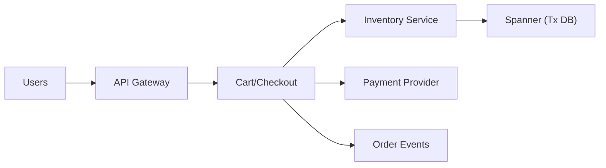

```markdown
---
title: "Global Inventory with Reservations"
category: "Strategic Problems"
difficulty: "Hard"
tags: ["inventory", "reservations", "flash-sale", "strong-consistency", "hot-keys"]
---

## Overview

This system guarantees **zero overselling** during a global, high-traffic launch while allowing users to hold items in carts for **10 minutes**. The core idea is to treat a reservation as a **lease** on inventory and make the write path **strongly consistent**, even if that means accepting slightly higher latency for reserve/checkout operations.

The elegant trick is to avoid “reservation cleanup jobs” (which inevitably drift and cause under-selling). Instead, we model reservations as **time-bucketed holds** so expiration becomes a pure function of time: when the 10-minute window passes, the held quantity simply stops counting against availability—no sweeper required, no stuck inventory.

Everything else stays boring: a small Inventory service, a transactional database with global consistency, and a Checkout service that converts valid leases into sales with idempotent writes.

## What Makes This Hard

Naive designs use a single “available_count” and decrement it on add-to-cart, then increment it with a TTL job on expiration. Under load, that job lags or fails, and inventory gets “stuck” reserved, causing **massive under-selling** (the silent killer in launches). Teams often don’t notice until after the drop.

The other trap is **hot keys**: one SKU can receive a huge fraction of traffic. Even a perfect transaction becomes a bottleneck if every reservation contends on the same row/partition.

## Requirements

### Functional Requirements
- Guarantee **zero overselling** globally for each SKU.
- Support **10-minute cart holds** (reservations) with deterministic expiration.
- Allow checkout to **atomically** convert reservations into sales (and fail cleanly if expired).
- Provide idempotency for reserve/checkout to handle retries and flaky clients.

### Scale Targets
- Peak reserve (add-to-cart) traffic: **100k RPS global** during first minutes of launch.
- Hot SKU concentration: up to **50% of traffic on one SKU** (worst-case “drop” behavior).
- Reservation duration: **10 minutes**, so the system must tolerate **millions of concurrent active holds** without cleanup lag becoming correctness risk.
- SLO: reserve/checkout **p99 < 300ms** globally (writes are allowed to be slower than reads).

## Key Design Decisions

- **Strong consistency for the write path**
  - Chosen: one transactional, globally consistent database for reservations + inventory writes (Google Spanner).
  - Rejected: multi-region async replication with “best effort reconciliation”.
  - Why: oversell is a correctness bug, not an availability trade; global serializable transactions are the simplest defensible guarantee.

- **Time-bucketed reservations (no sweeper)**
  - Chosen: per-SKU “ring buffer” of minute buckets for reserved quantity; active reservations are the sum of buckets in the last 10 minutes.
  - Rejected: TTL rows + background job to release inventory.
  - Why: expiration becomes *automatic* as time advances; correctness no longer depends on a cleanup job’s timeliness.

- **Hot SKU sharding (“stripes”)**
  - Chosen: split each hot SKU into `N` independent inventory stripes, each with its own reservation buckets; reserve picks a stripe and retries.
  - Rejected: a single row/counter per SKU.
  - Why: removes single-row write contention and scales linearly with stripes while preserving strict no-oversell.

## Architecture



### Components

- `API Gateway`: terminates TLS, enforces rate limits per IP/user, and applies a launch-mode “fairness” policy (reject abusive retry storms).
- `Cart/Checkout`: owns cart state and checkout orchestration; never invents inventory truth.
- `Inventory Service`: the only writer for inventory and reservations; enforces invariants with database transactions.
- `Spanner (Tx DB)`: source of truth for inventory totals, sold counts, reservation buckets, and reservation records.
- `Payment Provider`: external payment authorization/capture; integrated with idempotency keys.
- `Order Events`: append-only stream for downstream systems (email, fulfillment, analytics) without coupling them to checkout latency.

## Deep Dive: Time-Bucketed Reservations + Hot-Key Sharding

### Data model (per SKU stripe)
We store inventory per `(sku_id, stripe_id)`:

- `inventory_stripe`
  - `sku_id`, `stripe_id`
  - `total_units`
  - `sold_units`
  - `buckets[0..9]`: each bucket has `{epoch_minute, reserved_units}`

- `reservation`
  - `reservation_id` (idempotency key scoped to user+cart action)
  - `sku_id`, `stripe_id`, `qty`
  - `expires_at` (derived from DB time)
  - `status` = `ACTIVE | CONSUMED | EXPIRED`

### Reserve flow (single SKU, qty=1..k)
Within a serializable transaction:
1. Read DB time (`now_minute`) and compute `expiry_minute = now_minute + 10`.
2. Select a stripe (random for load distribution). Lock that `inventory_stripe` row.
3. Lazily reset the target bucket if `bucket.epoch_minute != expiry_minute` (set `reserved_units=0`, update `epoch_minute`).
4. Compute `active_reserved = sum(reserved_units for buckets with epoch_minute in [now_minute, now_minute+9])`.
5. `available = total_units - sold_units - active_reserved`. If `available < qty`, abort and retry another stripe (bounded attempts).
6. Increment the expiry bucket’s `reserved_units += qty`.
7. Insert `reservation` as `ACTIVE` with `expires_at = now + 10min`.

Why this works:
- Expiration requires no decrement. When `now_minute` advances, older buckets fall out of the `[now, now+9]` window and stop counting.
- The only mutable state is a constant-sized set of buckets, so “cleanup lag” cannot accumulate.

### Checkout flow (convert reservation to sale)
Within a serializable transaction:
1. `SELECT reservation FOR UPDATE`. If `status != ACTIVE`, return idempotent result.
2. If `expires_at <= now`, set `status=EXPIRED` and fail checkout (no inventory mutation needed).
3. Lock the referenced `inventory_stripe` row.
4. Decrement the reservation’s expiry bucket by `qty` (after lazily resetting if epoch mismatch, which should only happen if the reservation is already expired; we reject earlier).
5. Increment `sold_units += qty`.
6. Set reservation `status=CONSUMED`.
7. Proceed to payment capture (or authorize-before and capture-after depending on business rules), using an idempotency key tied to the order.

The invariant is simple: within each stripe, `sold_units + active_reserved <= total_units` is maintained by a single transaction boundary.

## Trade-offs

| Optimized For | Sacrificed |
|--------------|------------|
| Correctness (zero oversell) | Higher write latency (global tx) |
| Deterministic expiration (no sweeper) | Some under-selling within the 10-minute hold window |
| Flash-sale scalability (striped hot keys) | Slightly more complex reserve retry logic |

## Failure Modes

- **DB region degradation / high contention**
  - What happens: reserve/checkout p99 spikes; retries amplify load.
  - Detect: increased transaction aborts, lock wait time, hotspot metrics on `(sku_id, stripe_id)`.
  - Recover: increase stripe count for hot SKUs, enable stricter gateway rate limits, temporarily reduce max cart hold creations per user/min.

- **Payment succeeds but inventory conversion fails**
  - What happens: customer charged without guaranteed allocation if payment is captured too early.
  - Detect: mismatch between captured payments and consumed reservations.
  - Recover: enforce ordering: consume reservation in DB first, then capture payment with idempotency; if capture fails, release by marking reservation `ACTIVE` again only if still unexpired (otherwise refund).

- **Client retry storms (mobile networks, bots)**
  - What happens: duplicate reserve/checkout attempts.
  - Detect: high duplicate idempotency-key hit rate; sharp rise in 429/503 at gateway.
  - Recover: strict idempotency on `reservation_id` and `order_id`, gateway throttles, and per-user concurrency caps for reserve/checkout endpoints.

## What I'd Do Differently At...

- **10x scale:** increase stripe count on hot SKUs (and pre-split totals), add per-region edge caching for browse traffic, and enforce launch-mode backpressure (queue/deny) at the gateway instead of letting retries hit the DB.
- **100x scale:** move to a dedicated “inventory allocator” that pre-issues reservation tokens (cryptographically signed, short-lived) per stripe to absorb DB writes, with the DB as the final authority only at checkout.

## Operational Notes

- Use **database time** for `now` and `epoch_minute` to avoid clock skew bugs.
- Monitor: transaction abort rate, lock wait, stripe skew, reservation creation rate, checkout conversion rate, and “expired at checkout” rate (a UX signal).
- Keep stripe totals immutable during the launch window; treat restocks as a controlled admin operation with explicit auditing.
- Runbooks should start with: “Is this a hot SKU hotspot?” before chasing generic DB performance.
```