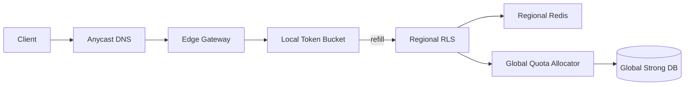

```markdown
---
title: "Global Rate Limiter"
category: "Foundational Infrastructure"
difficulty: "Hard"
tags: [rate-limiting, edge, distributed-systems, quota-leasing, reliability]
---

## Overview

This system enforces per user/IP/API key rate limits globally across many regions without putting a round-trip to a central coordinator on the critical path. The key insight is to split the design into a **fast local data plane** (decide in-region, in-memory) and a **slow global control plane** (allocate quota occasionally, strongly consistent), connected by **time-bounded quota leases**.

Most “global” limiters fail because they chase perfect global synchronization and accidentally build a distributed lock in front of every request. This design accepts a *bounded* amount of global inaccuracy (strictly limited overshoot) to achieve consistently low latency and low coordination overhead.

## What Makes This Hard

Naive designs either (a) centralize the counter (correct, but high latency + single bottleneck) or (b) replicate counters asynchronously (fast, but easy to exceed limits massively during bursts or regional failover). The trap is that “low coordination” and “global correctness” are in tension: you don’t get both without carefully bounding the error.

The other trap is hot keys. A single abused API key can drive contention at the storage layer even if your average case looks fine. The design must make “one key at 50k RPS” boring.

## Requirements

### Functional Requirements
- Enforce **global** limits per identity (API key/user/IP) with **bounded overshoot**, not “best effort”.
- Support **hierarchical limits** (e.g., per API key AND per IP AND per endpoint class); decision is the minimum remaining budget across applicable policies.
- Keep request-path overhead low: **no cross-region dependency** for the common case.
- Provide deterministic operator controls: per-key overrides, emergency blocks, and “shadow mode” rollout (measure-only).
- Produce audit-grade telemetry: allow/deny counts, remaining quota, lease refill rates, and top offenders.

### Scale Targets
- Global traffic: **1M RPS** sustained, **5M RPS** peak (why: edge systems must absorb product launches and abuse spikes).
- Regions: **30–60** active regions (why: any design that assumes “a few” breaks when expansion happens).
- Identities: **10M** provisioned, **200k** active/minute (why: memory + eviction dominates).
- Added latency budget: **p99 < 2ms** at the gateway (why: rate limiting must not become the tail).
- Global coordination budget: **< 0.5%** of requests cause a control-plane call (why: keeps the global allocator small and stable).

## Key Design Decisions

- **We chose:** Quota leasing per identity from a strongly consistent global allocator to regions  
  **We rejected:** A single global counter hit on every request  
  **Why:** Leasing keeps the request path local while bounding global overshoot by construction.

- **We chose:** Enforce at the edge with in-memory token buckets backed by a regional quota cache (Redis)  
  **We rejected:** Enforce only in a regional service hop for every request  
  **Why:** The gateway already touches every request; doing the last micro-decision there removes an entire network hop.

- **We chose:** Shard the global allocator by identity hash in a strongly consistent store (Spanner/CockroachDB)  
  **We rejected:** “Eventually consistent” multi-master counters  
  **Why:** The allocator is the only place that must be correct; making that one component strongly consistent simplifies everything else.

## Architecture



### Components

- **Edge Gateway**
  - Owns the request decision point (allow/deny) and attaches rate-limit headers.
  - Keeps per-identity in-memory buckets for hot paths; avoids network for the common case.

- **Local Token Bucket**
  - Implements token bucket per identity (and per policy dimension if needed).
  - Decrements locally; when low, asks for more tokens (a refill), not permission per request.

- **Regional RLS (Rate Limit Service)**
  - The “regional brain”: hands out tokens to gateways from a regional pool and absorbs bursts.
  - Aggregates multiple gateways, smoothing refill storms and centralizing policy evaluation.

- **Regional Redis**
  - Stores regional leased balances and short-lived coordination state (per-identity regional remaining).
  - Keeps refill cheap and local; Redis latency is predictable within a region.

- **Global Quota Allocator**
  - Grants time-bounded leases by atomically decrementing global remaining budget for an identity.
  - Sharded by `hash(identity)` to scale horizontally and avoid hot partitions.

- **Global Strong DB**
  - Stores authoritative per-identity rate policies and the allocator’s global “remaining” state for the current refill period.
  - Strong consistency is used here to make overshoot bounds defensible.

## Deep Dive: Quota Leasing (The Hardest Part)

The allocator doesn’t answer “is this request allowed?” It answers “how many tokens may this region spend locally before asking again?” That one reframing removes the need for per-request global coordination.

**Lease mechanics**
- Each identity has a token bucket defined by `(rate, burst)`.
- The allocator maintains the global bucket state and hands out **leases**: `(tokens, expiry)`.
- A region spends from its lease locally (Redis + gateway memory). When the regional lease drops below a threshold, it requests another lease.

**Bounding overshoot**
Overshoot happens when multiple regions hold unspent leases and the identity suddenly concentrates traffic in one region. We bound it explicitly:

- Let `L` be the maximum lease size the allocator grants for an identity.
- Let `R` be the number of regions that can hold an active lease concurrently.
- Worst-case global overshoot is bounded by `R * L` (plus a small in-flight margin).

So we pick `L` with intent:
- Default: `L = clamp(rate * 2s, 50, 5000)` tokens
- Refill when remaining < 20% of `L`
- Add ±10% jitter to refill timing to avoid synchronized thundering herds

This keeps coordination low (leases cover seconds of traffic) while limiting abuse blast radius (a leaked key cannot exceed the global limit by more than a known bound).

**Handling hot keys without melting the allocator**
Hot identities refill frequently. Two tactics keep it boring:
1. **Adaptive leases:** increase `L` for identities that refill repeatedly from the same region (reduces allocator QPS), but cap `L` so overshoot stays bounded.
2. **Single-flight per identity per region:** the regional RLS deduplicates concurrent refill requests so 1,000 gateways don’t stampede the allocator.

**Failover and expiry**
Leases have expiries. If a region dies holding tokens, those tokens are “lost” until expiry; this intentionally biases toward *under-utilization* over *over-limit*. In practice, it’s the right trade: users prefer occasional extra throttling during outages over letting abuse through.

## Trade-offs

| Optimized For | Sacrificed |
|--------------|------------|
| Low latency (local decisions) | Perfect global precision at millisecond granularity |
| Predictable, bounded error | Some quota under-utilization on regional failure |
| Simple request path | More complexity in control-plane lease logic |

## Failure Modes

- **Global allocator outage**
  - **What happens:** Regions cannot obtain new leases; local buckets drain.
  - **Detect:** Lease refill failures spike; regional remaining trends to zero.
  - **Recover:** Gateways continue using remaining leased tokens; once exhausted, enforce throttling (deny) rather than unbounded allow. Restore allocator; leases resume.

- **Regional Redis degradation**
  - **What happens:** Regional pooling becomes slow; gateways fall back to in-memory only and refill less efficiently.
  - **Detect:** Redis latency/timeout alarms; RLS refill latency increases.
  - **Recover:** Gateways use a small in-memory “emergency budget” per identity (e.g., 1–2 seconds worth) to smooth transient failures; sustained issues trigger stricter throttling until Redis recovers.

- **Identity hotspot / abuse spike**
  - **What happens:** A single key drives high refill rates and pressure on one shard.
  - **Detect:** Top-identity dashboards show refill QPS and denies; allocator shard skew metrics.
  - **Recover:** Automatic lease size adaptation + per-identity circuit breaker (hard cap) and operator kill switch; shard by identity hash prevents broader impact.

## What I'd Do Differently At...

- **10x scale:** Move more decision logic into the gateway (WASM/Lua filter), keep RLS as a lightweight refill/coordinator, and aggressively tune lease sizing to keep allocator QPS flat.
- **100x scale:** Add a second-level hierarchy: allocate leases to *regional clusters* (not individual regions) and subdivide locally. This reduces `R` in the overshoot bound and keeps global allocator state smaller and less contended.

## Operational Notes

- Tune `L` (lease size) per policy tier; overshoot bounds are only real if lease caps are real.
- Track “refill rate per identity” as an early abuse signal; it’s more actionable than raw RPS.
- Roll out new policies in **shadow mode** first; compare predicted denies vs actual traffic before enforcing.
- Keep TTL-based eviction on gateway buckets; cardinality spikes otherwise become a memory incident, not a rate-limit incident.
```