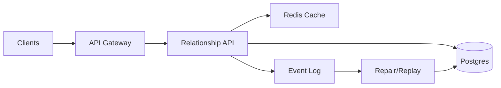

```markdown
---
title: "Graph Relationship Service"
category: "Social & Discovery"
difficulty: "Hard"
tags: ["social-graph", "relationships", "caching", "postgres", "redis", "pagination"]
---

## Overview

This service stores and serves social relationships (follow/friend/block) with fast bi-directional lookups: “who I follow” and “who follows me”, plus common derived queries like “does A follow B?” and “mutual connections”. Reads dominate, so the system is designed to make reads cheap and predictable while keeping writes correct and operationally boring.

The key insight is to treat relationship lists as *versioned snapshots* per user. Instead of trying to perfectly invalidate caches (which becomes a distributed systems tax), every write bumps a small per-user version number. Cache keys include that version, so “invalidation” becomes a constant-time metadata write and stale entries age out naturally. This yields strong-enough freshness with dramatically simpler caching behavior under heavy read load.

Everything else uses proven building blocks: Postgres for correctness and transactional writes, Redis for low-latency caching, and an append-only event stream for audit/replay and asynchronous repair.

## What Makes This Hard

Naive implementations get trapped by cache invalidation and consistency between forward and reverse indexes. If you cache adjacency lists and try to delete/update the “right” keys on every follow/unfollow, you either miss cases (stale edges) or create hot keys and thundering herds (everyone refills at once).

The second trap is assuming “two writes” is easy: you need `following(A)` and `followers(B)` to agree, even under retries, partial failures, and deploys. Most teams either over-rotate into exotic graph databases or under-build consistency and spend months debugging ghost followers.

## Requirements

### Functional Requirements
- Create/remove directed edges: `FOLLOW`, and optional `BLOCK` (block must override follow semantics).
- Bi-directional reads:
  - List `following(user)` (paginated, stable ordering).
  - List `followers(user)` (paginated, stable ordering).
- Point queries:
  - `isFollowing(a, b)`, `isBlocked(a, b)` in single-digit ms when cached.
- Derived query:
  - `mutualFollowing(a, b)` (intersection) with sane performance for typical users.
- Idempotent writes (clients retry; backend must not duplicate edges).
- Near-real-time freshness target (not necessarily linearizable reads).

### Scale Targets
- Users: 50M registered, 10M DAU.
- Edges: ~5B follows (avg 500/user, long tail to 10M+ for celebrities).
- Traffic (peak): 200k read RPS, 5k write RPS.
- Latency: p99 reads 50ms (cached), 200ms (cold); writes p99 150ms.
Why this matters: the long tail (celebs) breaks “cache entire list” and drives pagination + partial caching; read peak forces stampede control.

## Key Design Decisions

- **Decision 1: Store two materialized indexes (forward + reverse)**
  - Chose: `following_by_src` and `followers_by_dst` tables, written transactionally.
  - Rejected: single table with two huge secondary indexes (index bloat, harder ops at large scale).
  - Why: predictable query plans, smaller hot indexes, and explicit control over pagination order.

- **Decision 2: Versioned snapshot caching (no explicit invalidation)**
  - Chose: per-user version counters; cache keys include version (`following:{u}:v{n}`).
  - Rejected: delete-on-write cache invalidation (misses, races, hot-key churn).
  - Why: turns correctness into a small, atomic metadata update; stale caches become harmless.

- **Decision 3: Keep mutuals as an online intersection, not precomputed**
  - Chose: intersect two sorted ID lists (usually small) and cap work for extreme degrees.
  - Rejected: precomputing mutuals for everyone (explodes write amplification and storage).
  - Why: mutuals are a read-time concern for most products; optimize for the common case.

## Architecture



### Components

- **Relationship API**
  - Owns read/write semantics, idempotency, pagination, and cache strategy.
  - Earns its place by being the single point where “correct enough + fast” is enforced consistently.

- **Postgres**
  - Source of truth with transactions to keep forward/reverse indexes consistent.
  - Partitioned and indexed to serve ordered adjacency queries efficiently.

- **Redis Cache**
  - Serves hot adjacency pages, counts, and point lookups.
  - Uses versioned keys to avoid brittle invalidation logic.

- **Event Log**
  - Append-only stream of relationship mutations (follow/unfollow/block).
  - Enables audit, replay, and asynchronous repair without coupling the write path to background work.

- **Repair/Replay Worker**
  - Rebuilds caches, checks forward/reverse consistency, and replays from the log after incidents.

## Deep Dive: Versioned Adjacency Caching (The Hardest Part)

**Problem:** adjacency lists are large, frequently read, and frequently mutated. Traditional invalidation (“delete following:A and followers:B”) fails under retries, out-of-order events, and partial failures. It also creates stampedes: a popular user’s follower list expires and thousands of requests hammer the database.

**Approach: per-user versions**
- Maintain small counters:
  - `ver:following:{user}` and `ver:followers:{user}` (integers).
- Cache keys include the version:
  - `following:{user}:v{ver}` → first page (IDs + next cursor), plus optional metadata (count).
  - Same for followers.

**Write path**
1. Transaction in Postgres:
   - Upsert edge into `following_by_src`.
   - Upsert edge into `followers_by_dst`.
2. Bump versions (can be in Redis; durable source can be Postgres if you need stronger guarantees):
   - `INCR ver:following:{src}`
   - `INCR ver:followers:{dst}`
3. Emit event to the log for audit/repair.

No cache deletes. Old keys are now unreachable because readers compute the new key using the new version.

**Read path**
1. Fetch current version(s) for the user (cheap):
   - `GET ver:following:{u}`.
2. Read `following:{u}:v{ver}` from Redis.
3. On miss, fill from Postgres with keyset pagination (`(created_at, dst_id)` cursor), then `SETEX` the cache entry.

**Stampede control**
- Use a short-lived singleflight lock per key (`lock:following:{u}:v{ver}`).
- If lock is taken, serve:
  - a stale-but-recent previous version if available (bounded staleness), or
  - a minimal response (e.g., empty + retry hint) for extreme hot keys.

**Why this is elegant**
- Correctness shifts from “did we delete the right cache keys?” to “did we bump the right version?”, which is drastically easier to reason about and monitor.
- It fails safely: worst case you serve a slightly stale snapshot until TTL; you don’t serve corrupted mixed states.

## Trade-offs

| Optimized For | Sacrificed |
|--------------|------------|
| Operational simplicity | Some cache memory waste (old versions until TTL) |
| Fast bi-directional reads | 2x write amplification (forward + reverse) |
| Predictable caching behavior | Slight staleness (bounded by version propagation/TTL) |
| Small-team operability | Not a full graph traversal engine |

## Failure Modes

- **Redis outage or elevated latency**
  - What happens: read p99 jumps; Postgres becomes the bottleneck.
  - Detect: cache hit rate drop, DB QPS spike, p99 alarms.
  - Recover: degrade to caching only counts/first page, shed celebrity-list traffic, add read replicas, restore Redis.

- **Forward/reverse divergence (partial write, bug, or manual fix)**
  - What happens: “A follows B” but B’s followers missing (or vice versa).
  - Detect: periodic reconciliation sampling; invariant checks on events.
  - Recover: replay event log into a repair job that rewrites both indexes idempotently; alert on divergence rate.

- **Hot key / celebrity follower list stampede**
  - What happens: many concurrent cache misses hammer Postgres.
  - Detect: high lock contention, repeated misses for same user, DB spikes correlated to a user ID.
  - Recover: singleflight locks + serve-stale; cache only first N pages; introduce async cache warming for top users.

## What I'd Do Differently At...

- **10x scale:** move Postgres to sharded-by-user (or Citus) for write scaling; keep the same API + versioned caching model.
- **100x scale:** replace Postgres adjacency storage with a wide-column store optimized for huge fanout (e.g., Scylla/Cassandra) and keep Postgres only for metadata; introduce tiered storage and stricter celebrity handling (e.g., dedicated partitions and pre-warmed caches).

## Operational Notes

- Monitor invariants, not just latency: divergence rate between `following_by_src` and `followers_by_dst` is the canary.
- Keep pagination stable: use keyset pagination with a deterministic ordering (e.g., `created_at DESC, dst_id DESC`) to avoid duplicates/skips under concurrent writes.
- Cap expensive operations: mutuals should have a work limit (e.g., only compute if both degrees < threshold; otherwise return partial with “too large” signal or require filters).
- Treat versions as critical metadata: alert on version fetch failures; if version store is down, fall back to conservative behavior (serve from DB, no caching).
```