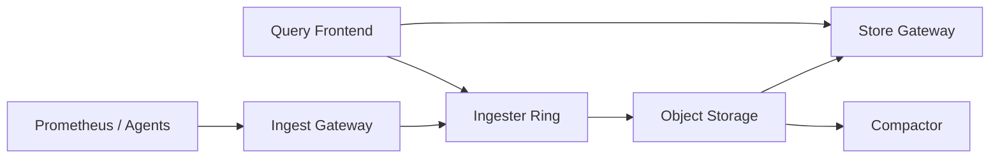

```markdown
---
title: "High-Cardinality Metrics Pipeline"
category: "Observability & Reliability"
difficulty: "Hard"
tags: ["metrics", "tsdb", "prometheus", "cortex", "multitenancy", "object-storage", "cardinality", "indexing", "query-engine"]
---

## Overview

This system ingests Prometheus-style metrics at very high volume, survives sudden cardinality explosions, and supports fast queries over long retention. The key insight is to **treat “high-cardinality” as a product constraint, not a scaling surprise**: you enforce strict, explicit budgets at the edge and at ingest, then design storage/query around immutable TSDB blocks in cheap object storage.

Elegance comes from a hard separation of concerns: **ingesters are only responsible for the hot, mutable window** (fast writes, recent reads, durability via WAL), while **long-term data is immutable blocks** in object storage queried through cacheable, horizontally scalable gateways. Everything else is boring glue: consistent hashing, rate limits, object storage, and a small number of background jobs.

## What Makes This Hard

Naive designs die in two ways:

1. **Cardinality explosion masquerades as “just more traffic.”** But it’s not. It blows up *memory* (active series), *index size*, and *query fanout* nonlinearly. If you don’t enforce budgets early, you end up with a cluster-wide brownout where even “healthy” tenants can’t query.

2. **Long-term queries tempt you into a centralized index/database.** A single “series index DB” becomes your scaling ceiling and your pager magnet. The trap is coupling queryability to a monolith that must be strongly consistent under write load.

## Requirements

### Functional Requirements
- **Prometheus remote_write-compatible ingest** with per-tenant isolation.
- **Cardinality controls**: per-tenant series limits, label allow/deny lists, and hard rejection with clear reasons.
- **Fast queries for recent data** and acceptable latency for long-range queries (hours–months).
- **Long-term retention** (months to years) on inexpensive storage.
- **Safe multi-tenant query execution**: no query can destabilize the cluster.

### Scale Targets
- Ingest: **10M samples/sec** sustained, **50M samples/sec** bursts (flash release + autoscaling lag).
- Active series: **200M global**, with **hard per-tenant caps** (e.g., 1–10M depending on plan).
- Retention: **13 months** raw at 10–15s resolution for “gold” tenants; **downsampled** for cheaper tiers.
- Queries: **p95 < 2s** for last 15m; **p95 < 8s** for 30d; concurrency in the low thousands.

These numbers matter because the bottleneck shifts: *writes* are bandwidth + memory (active series), while *queries* are CPU + index scan + object GET amplification.

## Key Design Decisions

- **Decision 1: Immutable TSDB blocks in object storage as the source of truth**
  - Chose: Periodic cutover from ingester head to **TSDB blocks** uploaded to **S3/GCS**.
  - Rejected: Keeping long-term data in a distributed database (Cassandra/Bigtable) as the primary store.
  - Why: Object storage gives cheap durability and scaling; immutable blocks make caching and compaction tractable and operationally calm.

- **Decision 2: Enforce cardinality budgets at ingest, not “best-effort”**
  - Chose: **Per-tenant limits** (active series, label lengths, sample rate) + **write-time validation** + edge relabeling guidance.
  - Rejected: Let everything in, “deal with it later” via compaction/downsampling.
  - Why: Once high-cardinality hits memory and index, it’s already an outage. Rejecting early is kinder than failing later.

- **Decision 3: Query protection via sharding + bounded execution**
  - Chose: Query frontend that **splits by time/range**, enforces **max series / max bytes / max execution time**, and uses results caching.
  - Rejected: A single stateless query API that forwards raw PromQL to backends.
  - Why: PromQL is expressive enough to become a denial-of-service vector; the system must make “expensive” queries safe by construction.

## Architecture



### Components

- `Prometheus / Agents`
  - Scrape locally; use remote_write with backoff. This keeps scrape failures local and makes the central system purely “receive + serve”.

- `Ingest Gateway`
  - Auth, tenant routing, rate limiting, and *first line* cardinality guardrails. It rejects obviously bad writes before they allocate ingester memory.

- `Ingester Ring`
  - Consistent-hash sharding by tenant+series fingerprint; replicates to N ingesters; WAL-backed. Serves recent reads without touching object storage.

- `Object Storage`
  - Durable home for immutable TSDB blocks. The only “database” you truly trust long-term.

- `Store Gateway`
  - Index-aware reader over object storage; aggressively caches index and hot chunk ranges. Horizontally scalable and restart-friendly.

- `Query Frontend`
  - Splits/shards queries, enforces budgets, caches results, and merges partials. This is where you keep PromQL powerful without letting it be dangerous.

- `Compactor`
  - Compacts small blocks into larger ones, applies retention, and optionally downsampling. Without it, object storage costs and query fanout spiral.

## Deep Dive: Cardinality Explosions (and How to Survive Them)

The hardest part is that cardinality is a *memory and index* problem before it’s a throughput problem. If a tenant suddenly starts emitting `user_id` as a label, you don’t just get “more samples”—you get an unbounded number of new series, each requiring head state, postings, and query fanout.

**1) Make cardinality a budgeted resource (per tenant, per metric family).**  
Track *active series* per tenant in ingesters (in-memory set keyed by series fingerprint, with TTL based on recent samples). Enforce hard caps:
- `max_active_series_per_tenant`
- `max_series_per_metric_name` (stops one metric from consuming the whole budget)
- label count/length limits and reject known-bad label keys

When a new series would exceed budget, reject with a precise error that includes the offending labelset hash and the metric name. This converts “mysterious outage” into “actionable contract violation”.

**2) Reject cheaply, before allocating expensive structures.**  
Do not accept-and-then-evict. The ingestion pipeline should parse, validate, and fingerprint first; only then touch head state. Use a small, bounded “new series admission” structure per tenant (e.g., token-bucket for new series/sec) so explosions are throttled even below the hard cap. This prevents churn from turning into CPU death.

**3) Protect reads too: expensive queries are just another cardinality vector.**  
Even with perfect ingest controls, queries like `sum by (pod) (rate(http_requests_total[30d]))` can fan out disastrously. The query frontend enforces:
- max time range (or mandatory step increases)
- max series scanned (estimated from index/postings cardinality)
- max bytes fetched from store gateways
- query splitting (e.g., 30d => 30x 1d subqueries), with caching per shard

The non-obvious benefit: once queries are sharded and cached, the system becomes stable under load because repeated dashboards stop recomputing the world.

## Trade-offs

| Optimized For | Sacrificed |
|--------------|------------|
| Predictable cluster stability under cardinality spikes | “Accept all data” convenience |
| Cheap, durable long-term storage | Slightly higher query complexity (block + gateway) |
| Horizontal scalability of both write and read paths | More moving parts than single-node Prometheus |

## Failure Modes

- **Ingester crashes / rolling restarts**
  - What happens: recent samples risk loss; queries for the last minutes can become partial.
  - Detect: WAL replay time, replication quorum misses, increased remote_write retries.
  - Recover: WAL replay + replication (N=3) so one node loss is survivable; query frontend tolerates partials only for explicitly-configured tenants.

- **Object storage degradation (slow or erroring GET/LIST)**
  - What happens: long-range queries slow; compaction backlog grows.
  - Detect: store gateway GET latency, 5xx rates, compactor queue age.
  - Recover: serve recent queries from ingesters; cache index/chunks; apply query budgets and shed long-range load first.

- **Cardinality incident from a tenant**
  - What happens: without controls, global memory pressure and cascading failures.
  - Detect: surge in “new series admitted/sec”, tenant active series approaching cap, query fanout anomalies.
  - Recover: hard reject new series for that tenant; keep existing series serving; provide top offending metrics/labels to remediate quickly.

## What I'd Do Differently At...

- **10x scale:** move to dedicated **query scheduler + worker pool** to smooth query bursts, increase store-gateway caching tiers (RAM + SSD), and tighten per-tenant SLAs with separate rings for “noisy” tenants.
- **100x scale:** introduce **hierarchical storage** (tiered blocks, aggressive downsampling), global index acceleration (e.g., per-block bloom filters / partitioned postings caches), and potentially regionalize ingest + query with federation to avoid cross-region object-store hot spots.

## Operational Notes

- Cardinality limits are your primary “circuit breaker”; keep them visible, versioned, and tied to tenant plans.
- Watch **WAL replay time** like a hawk; it defines recovery time and dictates safe ingester memory sizing.
- Compaction lag is silent debt: measure “oldest un-compacted block age” and page before dashboards get slow.
- Treat query budgets as SLO enforcement, not annoyance; without them, one bad dashboard becomes an incident.
```