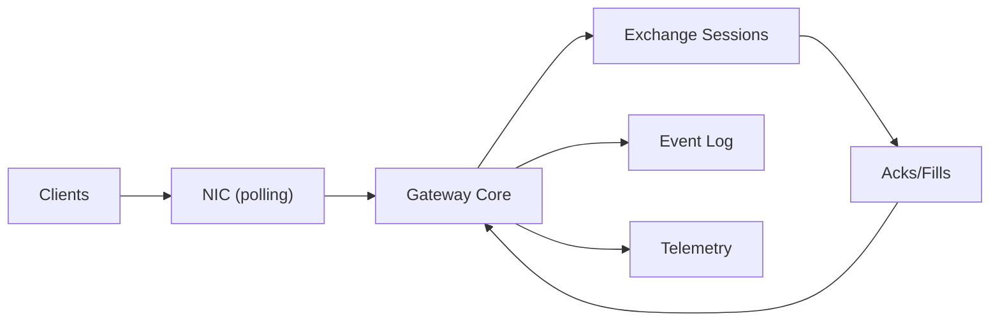

```markdown
---
title: "High-Frequency Trading Gateway"
category: "Commerce & Fintech"
difficulty: "Hard"
tags: ["hft", "low-latency", "determinism", "risk", "networking"]
---

## Overview

This gateway accepts client orders, runs constant-time pre-trade risk, assigns a strictly increasing `gw_seq`, and routes to exchange sessions with microsecond-class latency. The hot path is a **single-writer event loop**: bounded work per message, no locks, no allocations, no synchronous I/O. Determinism comes from `gw_seq` ordering plus cache-resident risk counters; correctness under loss/reconnect comes from idempotency tables and explicit session state machines.

## What Makes This Hard

Microsecond latency fails on coordination: RPCs, locks, interrupts, and hidden queues. Correctness fails on reconnects: resends, duplicates, late fills, and “accepted before dedupe is ready.”

## Requirements

### Functional Requirements
- **Deterministic sequencing:** every inbound message gets `gw_seq`; all state transitions follow that order.
- **Constant-time risk:** O(1) arithmetic over cache-resident counters; bounded branches; no scans/locks/allocations.
- **Idempotent retries:** `(session, clOrdId)` maps to one internal `order_key`; duplicates are lookup + no-op.
- **Session correctness:** venue/client sequence handling, resend, and reconnect without blocking the core.
- **Audit + restart:** an append-only decision log is written off-path and replayed on restart before trading resumes.

### Scale Targets
- **Latency (gateway internal):** median 3–5µs, p99 < 20µs from NIC receive → outbound send (excluding exchange wire latency). This forces polling, preallocation, and single-writer design.
- **Throughput:** 200k orders/sec sustained per instance, 1M/sec burst for <1s without collapse. This drives ring-buffer sizing, backpressure, and bounded work.
- **Concurrency:** up to 1,000 client sessions per instance, but only a small subset “hot” at any time; design optimizes for hot-set cache locality.
- **Availability:** 99.9%+ (seconds/month) is acceptable if it avoids adding synchronous replication to the hot path; correctness beats uptime during instability.

## Key Design Decisions

- **Single-threaded event loop per gateway shard**
  - One core runs decode → risk → route → encode and owns all mutable state for a shard.
  - Determinism is local: one writer, one `gw_seq`, one state machine per order/session.

- **Kernel-bypass / polling NIC path**
  - User-space RX/TX with busy polling and CPU isolation to remove scheduler/interrupt jitter.

- **One canonical order identity**
  - On accept, assign `order_key` and persist it in the in-memory order table.
  - The only external idempotency index is `(session, clOrdId) -> order_key`.

- **Mechanically bounded work**
  - The loop enforces fixed budgets per tick (fills/cancels first; new orders next; resends last).
  - If any bounded buffer is near full (TX ring, session rings, log ring), new orders are rejected with `GW_BACKPRESSURE`.

- **Explicit durability semantics**
  - The core enqueues a fixed-size “decision record” to the log ring before sending; the disk writer drains it asynchronously.
  - On restart, the gateway stays `NO_TRADE` until replay + session resync completes.

- **Versioned config + fail-closed activation**
  - Config is loaded as an immutable snapshot, validated (invariants, bounds), and atomically swapped at a `gw_seq` boundary.

## Architecture



### Components

- `NIC (polling)`: Stable, low-jitter ingress/egress event stream; without it p99 becomes scheduler variance.
- `Gateway Core`: Single-writer loop that assigns `gw_seq`, runs risk, owns the order table, and emits outbound messages; without it determinism collapses.
- `Exchange Sessions`: Non-blocking per-venue protocol state (logon/seq/resend/heartbeat); without it reconnect correctness collapses.
- `Event Log`: Local append-only segments of fixed-size decision records (checksummed); without it restart reconstruction is guesswork.
- `Telemetry`: Tail latency + drop/backpressure counters; without it operators fly blind and correctness degrades under jitter.

## Deep Dive: Deterministic Risk Checks Under Microsecond Latency

Every inbound message becomes `(gw_seq, type, payload)`. The core processes events strictly in `gw_seq` order and is the only writer of:
- Risk counters in fixed arrays indexed by preassigned IDs (`account_id`, `symbol_id`).
- The order table keyed by `order_key`, with `(session, clOrdId) -> order_key` as the idempotency index.

Risk stays constant-time by using **reservations**:
- Accept: add worst-case reservation to `open_*` and `notional_exposure`.
- Fill: move reservation to realized position; shrink remaining reservation.
- Cancel/Reject: release reservation.

Reconnect correctness stays bounded by treating resends as input with a hard budget:
- Always process fills/cancels first, then new orders, then resends.
- Duplicates (client retries, exchange repeats) are no-ops after table lookup.

Restart is a gated mode:
- `NO_TRADE`: reject new/replace; keep sessions alive; rebuild state.
- Replay the durable event log into memory, then resync each exchange session from its last persisted sequence.
- Switch to `TRADE` only when idempotency tables and session state are ready.

## Trade-offs

| Optimized For | Sacrificed |
|--------------|------------|
| Deterministic behavior | Horizontal elasticity |
| Microsecond tail latency | Synchronous HA replication |
| Simple correctness model (single writer) | Multi-core utilization per shard |
| Constant-time risk | Expressive, ad-hoc risk rules |
| Fast accept/send | “Accepted means durable” semantics |

## Failure Modes

- **Event log writer slows (disk hiccup / disk-full)**
  - Detect: log ring occupancy and writer lag.
  - Recover: reject new orders with `GW_BACKPRESSURE`; keep cancels enabled; if disk-full, force `NO_TRADE` until space is restored.

- **Exchange one-way trouble (TX fails but RX alive, or vice versa)**
  - Detect: TX ring saturation with no outbound progress, or heartbeats/acks stop while RX still receives.
  - Recover: fail closed for the affected venue: stop sending new orders, reject routes to that venue, and resync session before reopening.

- **Restart during retry storm**
  - Detect: any restart event triggers `NO_TRADE`.
  - Recover: reject new/replace until replay + resync completes; duplicates remain safe because idempotency tables are rebuilt before `TRADE`.

- **Bad config activation**
  - Detect: snapshot validation fails or post-activation invariants trip (e.g., collars inverted, limits negative).
  - Recover: atomic rollback to previous snapshot; if invariants trip on the hot path, activate kill-switch for affected scope.

- **Burst + intermittently unwritable venue**
  - Detect: per-venue “writable” false rate and per-venue queue occupancy.
  - Recover: apply per-venue budgets and fail routes to the clogged venue early; keep the core bounded and deterministic.

## What We Removed

- `Reconciler` as a standing service: replay is a single command used during `NO_TRADE` warmup and incident response.
- Pluggable “event log sinks”: the log is one local, append-only segment format with checksums and fixed-size records.
- Multiple idempotency indexes: one `(session, clOrdId) -> order_key` mapping plus the `order_key` table.
- Narrative resend “throttling”: resends are just another input class with a fixed per-tick budget.

## Operational Notes

- Pin the gateway core to an isolated CPU set; disable C-states, fix CPU frequency, and keep NUMA locality consistent (NIC + core on same socket).
- Monitor **tail latency + drops**, not averages: p99/p999, RX/TX ring occupancy, sequence gaps, resend counts, and backpressure rejects.
- Treat “backpressure rejects” as a controlled safety valve; if they appear, you’re protecting determinism—scale by adding shards, not by adding queues.
- Keep a one-command warmup runbook: replay event log, resync sessions from last persisted seq, then flip `NO_TRADE -> TRADE`.
```
