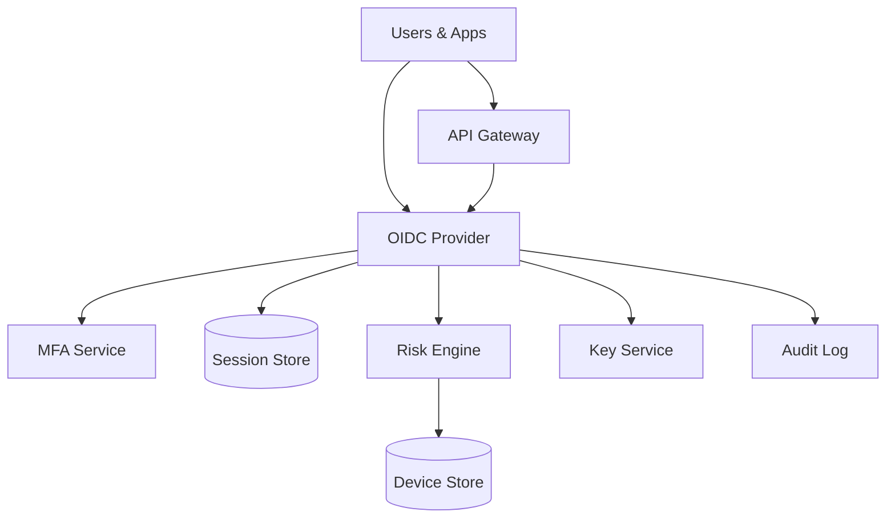

```markdown
---
title: "Identity Provider (OAuth2/OIDC)"
category: "Security & Access Control"
difficulty: "Hard"
tags: [security, oauth2, oidc, sso, mfa, sessions, revocation, device-trust]
---

## Overview

This system is a centralized Identity Provider (IdP) that issues OAuth2 tokens and OIDC ID tokens for first-party apps and internal services, supports SSO across apps, enforces MFA (including phishing-resistant WebAuthn), computes device trust/risk, and provides fast session revocation.

The key insight is to **make revocation enforcement happen at a small number of choke points** (API gateway / edge auth proxy) instead of trying to make every microservice “revocation-aware”. We keep services boring and stateless: they validate JWTs, while the gateway performs a cached, low-latency session check against a strongly consistent “session truth” store.

The second insight is to treat “device trust scoring” as **a policy input, not a synchronous ML dependency**. The login path reads a precomputed device risk posture and decides “no MFA / step-up / block”; model updates and feature aggregation happen asynchronously so auth remains predictable under load.

## What Makes This Hard

Naive designs issue long-lived JWT access tokens and then discover the trap: **JWTs are not revocable** without adding online checks everywhere (which teams avoid because it’s latency and reliability risk). The result is either security theater (“logout” that doesn’t work) or operational pain (“every request calls introspection”).

The second trap is MFA and device risk bolted on as add-ons. If “risk scoring” is a live call to a fragile service, your availability becomes “risk service availability”, and auth outages become company-wide outages. The right shape is: fast policy decisions from durable state, with async learning.

## Requirements

### Functional Requirements
- **OIDC SSO** for web and native apps: Authorization Code + PKCE, OIDC discovery, `jwks_uri`, `userinfo`, standard claims.
- **MFA**: TOTP for baseline, **WebAuthn** as default for privileged users/admin actions; step-up MFA based on device risk and sensitive scopes.
- **Device trust scoring**: per-device posture (new device, known device, recently re-verified), and per-login risk (IP/geo velocity/ASN reputation).
- **Session management**: view active sessions, per-session revoke, revoke-all, admin kill-session; propagation within seconds.
- **Token lifecycle**: refresh tokens, rotation, reuse detection; key rotation for signing keys; back-channel logout for select relying parties.
- **Auditability**: immutable security audit log for logins, MFA changes, device enrollments, revocations, token anomalies.

### Scale Targets
- **10M users**, **200 internal apps**, **50 external integrations** (OIDC clients).
- **Login**: 2k RPS sustained, 10k RPS peak (company-wide “Monday morning”).
- **Authenticated API traffic**: 200k RPS at the edge; revocation check must add **<5ms p99** at the gateway (with caching).
- **Revocation propagation**: **<10s** to be “effective everywhere that matters” (gateway choke points).
- These numbers force a design where: services stay stateless; session checks are cached; the durable store is write-optimized with predictable reads.

## Key Design Decisions

- **Choke-point enforcement of revocation**
  - **Chosen:** Edge auth proxy / API gateway performs session status checks and caches them; backend services mostly verify JWT signatures and claims.
  - **Rejected:** Every service calling introspection; long-lived JWTs with “logout best effort”.
  - **Why:** Centralizes complexity, keeps microservices boring, and makes revocation real without turning every request into a distributed dependency graph.

- **Short-lived JWT access tokens + session-bound refresh tokens**
  - **Chosen:** Access tokens are JWTs (5 minutes) with `sid` (session id) and `iat`; refresh tokens are opaque, rotated, and bound to a session/device.
  - **Rejected:** Opaque access tokens for everything; long-lived JWT access tokens.
  - **Why:** JWTs keep internal verification fast; short TTL bounds damage if revocation checks are temporarily degraded; refresh token rotation gives strong compromise detection.

- **Risk scoring as durable posture + simple real-time rules**
  - **Chosen:** Store a device posture score and a “last verified” state; real-time login uses deterministic rules (geo velocity, impossible travel, new device) plus posture to decide step-up.
  - **Rejected:** Online ML inference in the critical auth path.
  - **Why:** Auth must be the most reliable system in the company; learning can be eventual, policy enforcement cannot.

## Architecture



### Components

- **OIDC Provider**: Implements OAuth2/OIDC endpoints (`/authorize`, `/token`, discovery, JWKS). Owns policy decisions (MFA, step-up, session issuance).
- **API Gateway (Edge Auth Proxy)**: Validates JWT signature + basic claims, then performs a cached session-status check keyed by `sid` for revocation enforcement at scale.
- **Session Store (Postgres)**: Source of truth for sessions, refresh token families, revocation timestamps, and “revoke all sessions” user version. Strong consistency matters here.
- **MFA Service**: WebAuthn ceremony handling, TOTP verification, recovery codes, and enrollment flows. Kept separate to isolate sensitive credential operations and rate limits.
- **Risk Engine**: Maintains device posture and login risk signals; exposes a simple “policy input” API to IdP (low-cardinality results, not raw features).
- **Device Store (Redis + Postgres)**: Fast lookup for device keys/posture (Redis) backed by durable records (Postgres). Includes device public keys for signed challenges.
- **Key Service**: Manages signing keys (KMS-backed), JWKS publication, rotation, and emergency key revocation.
- **Audit Log**: Append-only stream (e.g., Kafka topic + immutable storage) for security events; powers investigations and alerting.

## Deep Dive: Session Revocation That Actually Works

The hard part is making “revoke session now” true across a large fleet without turning every request into a database call.

**1) Model sessions explicitly and bind tokens to them.**  
On successful auth, the IdP creates a `session` record with `session_id (sid)`, `user_id`, `client_id`, `device_id`, `created_at`, `revoked_at null`, and `mfa_level`. Access tokens include `sid`, `sub`, `aud`, `iat`, and a compact `mfa` claim. Refresh tokens are opaque and map to a refresh token family tied to `sid` with rotation state.

**2) Enforce revocation at the gateway, not everywhere.**  
The gateway verifies JWT signature and then checks “is this session still valid?” via a low-latency lookup:
- Key: `sid`
- Value: `revoked_at` (or a boolean “active”) plus an optional “user revoke-all version”
- Cache: in-memory LRU with a short TTL (e.g., 5–15s) and negative caching

This concentrates the online dependency in one tier you already operate as critical infrastructure. Services behind the gateway receive a JWT that’s already revocation-checked and can remain stateless.

**3) Bound the blast radius when checks degrade.**  
If the session check path is impaired:
- The gateway continues to accept tokens only if they are **very fresh** (e.g., `iat` within 60 seconds) and the signature validates.
- Longer-lived requests fail closed for privileged scopes and fail open only for low-risk endpoints if your business requires it.
This is an explicit trade: availability vs security, decided per-route, not by accident.

**4) Make revoke-all cheap and reliable.**  
Per-user “revoke all” becomes a single write: increment `user_session_version` (or set `user_revoked_after`). Tokens carry `sv` (session version) or `iat`, and the gateway compares against cached user state. This avoids scanning sessions and makes incident response fast.

**5) Refresh token rotation is your compromise detector.**  
Every refresh:
- Rotates refresh token (single-use).
- Marks the previous token as spent.
- If a spent token is seen again, revoke the entire session immediately (classic refresh token reuse detection).
This turns token theft into a noisy, containable event.

## Trade-offs

| Optimized For | Sacrificed |
|--------------|------------|
| Real revocation in seconds | Some online dependency at the gateway |
| Simple microservices | More responsibility in edge tier |
| Predictable auth reliability | No “fancy” online ML in login path |
| Fast internal verification (JWT) | Access tokens are short-lived (more refreshes) |

## Failure Modes

- **Session store degradation (Postgres latency/outage)**
  - **Impact:** Revocation checks can’t be confirmed; refresh/token operations fail.
  - **Detect:** Gateway error budget burn, session-check p99 spikes, refresh failure rate, DB saturation signals.
  - **Recover:** Read replicas for non-critical reads, aggressive gateway caching, controlled “fresh-token only” mode, prioritize `/token` and revocation writes, shed low-priority traffic.

- **Key compromise or signing mis-issuance**
  - **Impact:** Attackers mint valid JWTs; catastrophic if not contained.
  - **Detect:** Audit anomalies, key access alerts from KMS, unusual `kid` usage, sudden token validation success from unexpected issuers.
  - **Recover:** Immediate key rotation, revoke `kid` in JWKS, force re-auth by bumping user/session version globally for impacted tenants, invalidate refresh token families.

- **Risk engine outage or stale posture**
  - **Impact:** Step-up decisions degrade; either too permissive or too strict.
  - **Detect:** Risk API error rate, posture update lag, divergence between expected and actual MFA prompts.
  - **Recover:** Fall back to conservative deterministic rules (new device → step-up), keep posture last-known-good with expiry, throttle enrollment changes until restored.

## What I'd Do Differently At...

- **10x scale:** Move session-status distribution to a dedicated, globally replicated cache layer (e.g., Redis Cluster per region) with write-through from Postgres; add regional IdP frontends with local session-check caches.
- **100x scale:** Split “edge session validation” into a purpose-built, globally distributed token validation service with regional quorum reads; consider reference tokens for high-risk scopes and keep JWT only for low-risk internal calls.

## Operational Notes

- Keep access tokens **short-lived** and refresh tokens **rotating**; most “revocation” bugs disappear when TTLs are sane.
- Rate-limit `/authorize`, `/token`, MFA endpoints separately; lockouts must be per-user and per-IP with clear operator overrides.
- JWKS caching must respect `kid` rotation; publish overlap keys before cutting over; monitor “unknown kid” as a paging signal.
- Treat device enrollment and recovery code generation as privileged operations: require recent WebAuthn or step-up MFA.
- Audit log is not optional: make it easy to answer “who logged in from where with what device and what MFA” in one query.
```