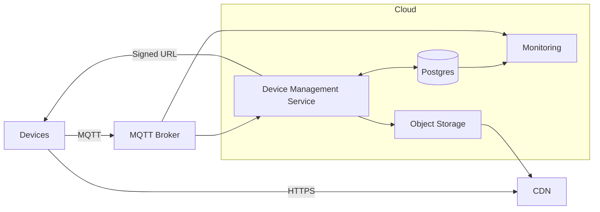

```markdown
---
title: "IoT Device Management"
category: "IoT & Edge"
difficulty: "Hard"
tags: ["iot", "edge", "ota", "provisioning", "observability", "security"]
---

## Overview

This system manages millions of intermittently connected devices: secure provisioning, OTA firmware rollouts, and heartbeat-based health monitoring. The core idea is **two planes**: a small, strongly consistent **control plane** (identity, desired state, campaigns) and a scalable **data plane** (device connectivity + firmware bytes). Devices converge to a **desired state** (firmware + config) with idempotent operations so retries and long offline windows are normal.

The design keeps the data plane boring: MQTT is the long-lived control channel, and firmware bytes move over HTTP via a CDN. Health is tracked as **state transitions** (online/offline changes, OTA state changes), not as raw heartbeat logs.

## What Makes This Hard

The failure mode at fleet scale is self-inflicted load: reconnect storms, update fanout, and per-heartbeat writes. OTA is also a safety problem: power loss mid-flash, broken storage, and clock skew are routine. Winning means keeping the control plane correct and small, and making the device side responsible for safe rollback.

## Requirements

### Functional Requirements
- Secure device identity (per-device credentials), enrollment, and credential rotation.
- Provisioning flows for factory onboarding and field replacement without manual per-device steps.
- OTA campaigns: cohort targeting, staged rollout, pause/rollback, and per-device progress tracking.
- Heartbeat ingestion and “online/offline/degraded” status with alerting and fleet-level dashboards.
- Auditability: who changed desired firmware/config, when, and impact.

### Scale Targets
- **Fleet size:** 5 million active devices.
- **Connectivity:** long-lived MQTT sessions for most devices; reconnect storms after outages.
- **OTA:** 20 MB firmware typical; campaign to 1 million devices in 6 hours → ~925 MB/sec aggregate egress (CDN-scaled).
- **Control plane QPS:** low (CRUD + campaigns), correctness-critical (audited, strongly consistent).

## Key Design Decisions

- **Device model: desired state + reported state**
  - Why: offline/retry is normal; fleet health is measured by convergence.

- **Delivery semantics: retain desired state, not commands**
  - Why: a device that was offline simply reconnects and receives the latest desired state; no “missed update intent” class of bugs.

- **Firmware bytes over CDN, never over MQTT**
  - Why: range requests, caching, and massive egress are content distribution problems.

- **Online/offline from debounced connectivity signals**
  - Why: store `last_seen_at` and online/offline transitions, not raw heartbeat rows.

- **Bounded per-device campaign state in Postgres**
  - Why: keep only `(device_id, campaign_id, last_state, last_seq, updated_at, error_code)` for correctness and scale.

## Minimal Architecture



### Components

- **MQTT Broker**
  - Justification: the only practical control channel for constrained devices (NAT-friendly, long-lived sessions) with mTLS auth and topic ACLs.

- **Device Management Service**
  - Justification: the single control-plane service that owns identity, desired state, campaigns, signed firmware URLs, and ingestion of device-reported OTA state.

- **Postgres**
  - Justification: the correctness-critical source of truth for identity, desired state, cohorts, campaigns, bounded per-device campaign state, and audit history.

- **Object Storage + CDN**
  - Justification: immutable firmware artifacts with global distribution and egress scaling; integrity is enforced by hash + signature.

- **Monitoring**
  - Justification: alerts and dashboards from broker saturation, campaign convergence, and state transitions (not raw message volume).

## Deep Dive: OTA Rollouts That Don’t Brick Fleets

OTA stays safe by keeping the backend policy-driven and keeping the device responsible for “don’t brick.”

**1) Firmware is immutable content.**  
Artifacts are identified by hash and signed. Devices verify signature + hash before staging.

**2) Devices pull, backend paces.**  
The service updates desired state for a cohort and (optionally) sends a lightweight “state changed” notification. Devices download via HTTP from the CDN using range requests and backoff.

**3) Progress is a contract, but bounded.**  
Devices publish coarse state transitions (`downloaded`, `staged`, `boot_ok`, `rollback`) with `(campaign_id, seq)`. The service stores only the latest valid state per device and updates campaign aggregates.

**4) Rollback is device-side (A/B slots).**  
Devices self-test and mark `boot_ok`. If not marked, the bootloader falls back automatically.

**5) Pause/rollback is freshness-aware.**  
Auto pause/rollback triggers only on canary regression with minimum sample sizes and recent data; stale reporting never triggers rollback decisions.

## Trade-offs

| Optimized For | Sacrificed |
|--------------|------------|
| Small-team operability (few moving parts) | Replayable event log and deep forensics at full fidelity |
| Correct control plane (Postgres, bounded state) | Rich, ad-hoc fleet analytics at huge scale |
| CDN-based distribution | Peer-to-peer edge distribution complexity |
| “Desired state” semantics | Per-device imperative control interactivity |

## Failure Modes

- **Postgres down for 5 minutes**
  - What happens: operator writes stop; campaigns cannot advance.
  - Detect: database health + service error rate.
  - Recover: devices keep running last desired state; service stops issuing changes and fails fast for operator actions; resume from Postgres once available.

- **Reconnect storm + broker saturation**
  - What happens: connect/auth spikes; publish floods.
  - Detect: connection rate, auth failures, inflight queues, dropped publishes.
  - Recover: device backoff + jitter; broker connection/publish limits; shed non-critical telemetry topics; prioritize control topics.

- **Network partition between broker and service**
  - What happens: devices stay connected, but reporting/changes are delayed.
  - Detect: broker-to-service delivery latency and service consumer backlog.
  - Recover: campaigns pause issuing changes; no auto rollback on delayed data; devices continue converging to last known desired state.

- **Bad firmware release causing boot loops**
  - What happens: `boot_ok` rate drops; rollbacks rise; online population shifts.
  - Detect: canary cohort convergence regression and rollback events.
  - Recover: pause the campaign; revert desired firmware for affected cohorts; quarantine the artifact hash; rely on A/B fallback.

- **Bad config / accidental cohort selection**
  - What happens: blast radius is larger than intended.
  - Detect: mandatory dry-run preview (counts by region/model) and policy-enforced canary.
  - Recover: global concurrency cap; approval for large cohorts; immediate revert of desired state for impacted cohorts.

- **Compromised device credentials**
  - What happens: unauthorized publishes and connection storms.
  - Detect: per-device publish violations and rate spikes.
  - Recover: short-lived certs + rotation; per-device topic ACLs; revoke device IDs/credentials; enforce broker-side rate limits.

- **CDN/origin degradation**
  - What happens: downloads fail or slow; devices retry.
  - Detect: CDN 4xx/5xx, download failure transitions, long download durations.
  - Recover: throttle device retries; extend URL TTL carefully; keep broker/control plane isolated so “bytes problems” don’t become “control plane outage.”

## What We Removed

- Kafka + stream processing for heartbeats (replaced by debounced `last_seen_at` + online/offline transitions).
- ClickHouse time-series analytics (replaced by campaign aggregates and transition-driven dashboards from Postgres).
- Separate OTA Orchestrator service (merged into a single Device Management Service).
- Per-heartbeat OLTP writes and raw telemetry retention (replaced by coarse transitions and bounded state).
- “Auto rollback on any spike” logic (replaced by canary-only, freshness-aware triggers).

## Operational Notes

- Use MQTT QoS 1 for desired-state notifications and OTA acks; QoS 0 for non-critical telemetry.
- Publish desired state as a retained message per device (or per cohort topic with device-side filtering); devices always reconcile on reconnect.
- Bound broker offline queues; prefer “latest desired state” over storing a backlog of commands.
- Enforce backpressure: rate limits per device/tenant, max inflight QoS1, and explicit load-shed mode that preserves control topics.
- Make device messages idempotent with `(campaign_id, seq)` and store only the latest valid state per device.
- Keep artifact promotion strict: only signed, scanned, and staged artifacts can be referenced by desired state.
```
