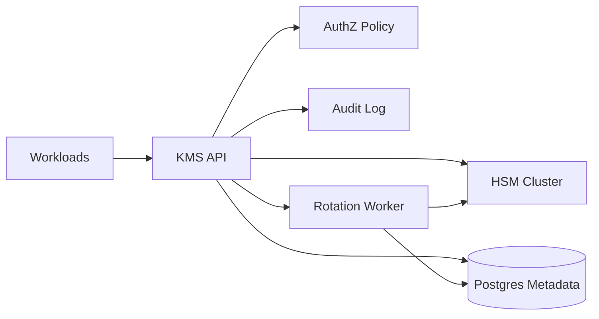

```markdown
---
title: "Key Management System (KMS)"
category: "Security & Access Control"
difficulty: "Hard"
tags: ["security", "kms", "hsm", "envelope-encryption", "key-rotation", "audit", "compliance"]
---

## Overview

This KMS generates and manages cryptographic keys with **hardware-backed root protection**, **versioned rotation**, and **high-integrity auditability**. The elegant core is a strict split between two planes: an **HSM-backed key-wrapping control plane** and a **high-throughput data plane that never asks the HSM to encrypt your data**—it only asks the HSM to protect the keys that encrypt your data.

The key insight: treat “encryption” as **envelope encryption**. Applications encrypt payloads locally with fast symmetric DEKs, while the KMS/HSM protects CMKs that **wrap/unwrap** those DEKs. This keeps performance predictable, makes rotation a metadata problem, and confines the blast radius of compromise.

## What Makes This Hard

Naive KMS designs fail in two places:

1. **They turn the HSM into the data plane.** If every Encrypt/Decrypt streams bytes through the KMS/HSM, you inherit HSM throughput limits, latency spikes, and operational fragility. Teams then add caches or shortcuts that quietly violate security boundaries.
2. **They treat rotation as “replace the key.”** Real systems have ciphertext produced across months/years; rotation must preserve decryptability, support gradual migration, and produce forensics-grade audit trails without turning every service into a crypto expert.

## Requirements

### Functional Requirements
- **CMK lifecycle**: create, disable, schedule deletion, rotate (new version), aliasing (stable key names).
- **Envelope encryption primitives**:
  - `GenerateDataKey`: return plaintext DEK + DEK wrapped under CMK.
  - `DecryptDataKey`: unwrap wrapped DEK under an allowed CMK version.
  - `ReEncrypt`: unwrap under old CMK version and rewrap under new version (no plaintext DEK leaves the service).
- **Hardware-backed storage**: CMK private material never leaves HSM in plaintext; all CMK wrap/unwrap performed inside HSM.
- **Strong authorization**: per-key policy for operations (`GenerateDataKey`, `DecryptDataKey`, `ReEncrypt`, admin actions).
- **Audit**: append-only, tamper-evident log of every key operation and admin change.
- **Multi-AZ availability**: tolerate AZ loss without losing keys or violating policy enforcement.

### Scale Targets
- **Key inventory**: 50k CMKs, average 5 versions each (rotation history + overlap).
- **Traffic**: 3k RPS steady, 15k RPS peak for `GenerateDataKey`/`DecryptDataKey` (driven by storage/object encryption, session token sealing, etc.).
- **Latency**: p99 < 25ms for data-key ops (HSM op dominates; target 5–10ms HSM + network + auth).
- **Audit throughput**: 20k events/sec peak, with end-to-end durability < 2s.
These numbers matter because HSMs scale differently than stateless services: you size for **HSM ops/sec**, not CPU.

## Key Design Decisions

- **We chose envelope encryption with DEKs generated per object/record**
  - Rejected: encrypting application payloads inside KMS
  - Why: keeps HSM out of the data plane, makes throughput linear with stateless API replicas, and confines HSM usage to wrap/unwrap.

- **We chose versioned CMKs with “primary version” and backward decrypt**
  - Rejected: “rotation replaces key” semantics
  - Why: rotation becomes a safe pointer flip for new writes while old ciphertext remains decryptable; migration becomes a controlled background process.

- **We chose a deliberately small policy model (ABAC-lite), not a general-purpose policy language**
  - Rejected: embedding a full DSL that on-call must debug
  - Why: KMS authorization must be explainable under incident pressure; limited expressiveness yields reliable reasoning and fewer bypasses.

## Architecture



### Components

- **KMS API**: stateless gRPC/HTTP service that validates requests, enforces policy, calls HSM, and emits audit events. Statelessness is what lets you scale the service normally.
- **AuthZ Policy**: per-key policies stored with the key (and cached in-memory). Policy evaluation uses request identity (mTLS SPIFFE ID or OIDC subject), action, environment (prod/dev), and key tags.
- **HSM Cluster**: holds CMK material and performs wrap/unwrap/sign operations. Multi-AZ HSMs with quorum-backed key creation (dual control).
- **Postgres Metadata**: source of truth for key aliases, versions, state machine, policies, and idempotency tokens. Postgres earns its place because consistency matters more than horizontal scale here.
- **Audit Log**: append-only event stream persisted to WORM-capable storage (e.g., object lock) for tamper resistance; indexed for search but anchored by immutable storage.
- **Rotation Worker**: asynchronous jobs for scheduled rotation, rewrap campaigns, and key state transitions; keeps the API fast and predictable.

## Deep Dive: Rotation Without Breaking Decrypt

The hard part is making rotation **operationally boring**. The trick is to define a key as an *identity* (alias) with *versions*, and make ciphertext reference the alias + version used to wrap the DEK.

**State model**
- Key alias (e.g., `payments/pii`) points to a **primary version** for new encryptions.
- Each version has state: `Enabled`, `Disabled`, `PendingDeletion`.
- `DecryptDataKey` accepts any `Enabled` version; `GenerateDataKey` uses only the primary `Enabled` version.

**Rotation flow**
1. Create new key version inside the HSM; store version metadata in Postgres.
2. Atomically flip alias primary to the new version (single transaction).
3. From that point forward, all new writes use the new version automatically—no client coordination.
4. Old ciphertext continues to decrypt because old versions remain `Enabled` for a defined overlap window (e.g., 90 days).

**Rewrapping (optional but often required)**
- When you want to retire old versions, you run a background **rewrap campaign**:
  - The client (or a batch job) submits wrapped DEKs (or references) to `ReEncrypt`.
  - KMS unwraps the DEK under old version inside HSM boundaries and immediately rewraps under the primary version.
  - KMS never returns plaintext DEKs for `ReEncrypt`; it returns only the rewrapped DEK blob.
- This is the subtle win: rotation does not require bulk data re-encryption. You rewrap keys, not terabytes.

**Guardrails**
- Idempotency tokens on write APIs prevent duplicate versions and double-rotation during retries.
- Dual-control for destructive actions (disable/delete) via approval workflow integrated with IAM.
- A “break-glass” role exists but is noisy: every use pages security and produces high-severity audit events.

## Trade-offs

| Optimized For | Sacrificed |
|--------------|------------|
| Security boundaries (HSM stays authoritative) | Some latency per key operation |
| Simple, explainable rotation | Less flexible policy expressiveness |
| Strong consistency for key state | Postgres becomes a critical dependency |
| Audit integrity & forensics | Higher storage/processing cost for logs |

## Failure Modes

- **HSM partial outage (one AZ)**
  - Happens: elevated latency / errors for wrap/unwrap, some keys unavailable if capacity drops.
  - Detect: HSM op error rate, queue depth for rotation jobs, p99 latency spikes.
  - Recover: fail over to healthy AZ HSMs, shed non-essential ops (pause rewrap), keep decrypt prioritized via per-op rate limits.

- **Postgres unavailable**
  - Happens: cannot resolve aliases/policies/version states; KMS must fail closed.
  - Detect: DB health checks + transaction error rate; sudden increase in 5xx.
  - Recover: automatic failover (managed HA), read replicas don’t help for correctness; keep a small in-memory cache for *metadata reads* but never for bypassing state transitions.

- **Audit pipeline degradation**
  - Happens: risk of losing forensic visibility; compliance impact.
  - Detect: audit enqueue failures, lag to durable store, missing sequence gaps.
  - Recover: API continues only if audit is durably accepted (local WAL/spool). If durable audit can’t be guaranteed, KMS rejects requests rather than operating “silently.”

## What I'd Do Differently At...

- **10x scale:** introduce regional shards of KMS API + HSM capacity; add client-side DEK caching with strict TTL and key-usage limits to cut steady-state RPS without weakening security posture.
- **100x scale:** move to multi-region active-active with regional CMKs and deterministic routing; redesign audit indexing separately from immutable storage; implement per-tenant isolation at the HSM partition level.

## Operational Notes

- Treat **HSM ops/sec** as your real capacity metric; everything else is secondary.
- Use **per-operation rate limits** so `ReEncrypt` can’t starve `DecryptDataKey` during incidents.
- Key state changes must be **transactional** (alias flip + version enablement) and always audited.
- Run regular drills: restore from backups, HSM AZ loss, and “compromised workload identity” scenarios (prove authZ stops it).
```