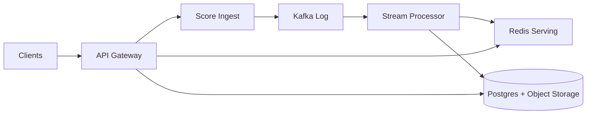

```markdown
---
title: "Leaderboard System"
category: "Real-Time & Media"
difficulty: "Hard"
tags: ["leaderboards", "streaming", "redis", "kafka", "top-k", "time-windows"]
---

## Overview

This system ingests a firehose of score updates and serves low-latency leaderboard queries (top N, “my rank”, and “around me”) across multiple time windows (daily/weekly) for millions of players. The key insight is to **separate durability from ordering**: treat score updates as an append-only event log (durable, replayable), and treat the leaderboard itself as a **materialized, disposable view** optimized for reads.

The elegant move is to avoid the classic “one giant sorted set per leaderboard” trap. A single global ordered structure becomes a hot key and collapses under write load. Instead, we use a **two-tier leaderboard**: (1) sharded per-partition orderings for fast writes, and (2) a small, global “winner set” that stays exact for the only part that actually needs exactness (top K). Everyone else gets an accurate score plus a rank that is either computed on demand (cheap enough at moderate scale) or returned as a percentile with tight error bounds.

## What Makes This Hard

Naive designs pick Redis ZSETs per leaderboard window and call it done. It works—until it doesn’t:
- **Hot key problem:** Redis Cluster shards by key, not within a key. A single ZSET for “Global Weekly” concentrates write load onto one primary.
- **Windowing is stateful:** daily/weekly boundaries create spikes (rollover, TTL, cache warming) and correctness edge cases (late events, clock skew).
- **Ranking isn’t just sorting:** clients want “my rank” and “around me”, which forces either expensive global ordering or some form of approximation/secondary index.
- **You must survive replays:** duplicates, retries, and backfills are normal; a leaderboard must be correct under replay, not just under happy-path.

## Requirements

### Functional Requirements
- Accept score updates with idempotency (at-least-once delivery is assumed).
- Support multiple windows: daily and weekly (aligned to UTC boundaries).
- Serve queries:
  - Top N (typically N ≤ 1000)
  - “My rank/score”
  - “Around me” (±k neighbors)
- Support multiple leaderboards (e.g., game mode, region, playlist), each independently queryable.
- Provide predictable semantics on updates: last-write-wins or max-score-wins per window (choose one and enforce it consistently).

### Scale Targets
- **Players:** 20M daily actives, 2M peak concurrent.
- **Write rate:** 200k score updates/sec peak (bursty during events).
- **Read rate:** 50k leaderboard queries/sec peak (top N heavily cached).
- **Latency SLO:** p95 reads < 50ms, p95 writes < 100ms (end-to-end ingest to visible).
- **Windows:** daily + weekly; retention of finalized leaderboards for 90 days (audit + player support).

## Key Design Decisions

- **Choose an append-only event log as source of truth**
  - Chosen: Kafka (or equivalent) as the durable stream of score events.
  - Rejected: “Redis is the source of truth” (fast but fragile), direct writes to a DB (hard to scale and replay).
  - Why: replayability turns outages and bugs into recoverable incidents, not data loss.

- **Use a two-tier leaderboard: sharded exact + global exact top-K**
  - Chosen: per-shard ordered sets + a compact global top-K set per leaderboard window.
  - Rejected: one global sorted set per leaderboard window.
  - Why: it removes the hot key while keeping the only globally-sensitive part (the top) exact and cheap.

- **Be explicit about rank semantics**
  - Chosen: exact ranks for top-K and for “around me” via targeted computation; percentile (quantile-based) rank for the long tail when exact rank is too costly.
  - Rejected: “exact rank for everyone, always” (cost explodes with write rate and window count).
  - Why: players care about winning and local competition; nobody needs an exact integer rank at position 8,432,119 in real time.

## Architecture



### Components

- `API Gateway`
  - Terminates auth, applies rate limits, normalizes requests, and routes reads/writes.
  - Earns its place by centralizing abuse controls (leaderboards attract bots).

- `Score Ingest`
  - Validates events, assigns a canonical window (daily/weekly), attaches an idempotency key, and publishes to Kafka.
  - Keeps writes fast by doing minimal synchronous work.

- `Kafka Log`
  - Source of truth for score changes; enables replay, backfills, and exactly-once *effects* via idempotent processing.
  - Partitioned by `(leaderboard_id, player_id)` to preserve per-player ordering.

- `Stream Processor` (Flink/Kafka Streams)
  - Materializes leaderboards into serving stores.
  - Maintains:
    - Per-shard ordered state (exact within shard)
    - Global top-K (exact globally)
    - Quantile sketches per leaderboard window (for percentile ranks)
  - Also writes periodic snapshots/compactions to durable storage.

- `Redis Serving`
  - Low-latency read store:
    - Global top-K per leaderboard window (small, hot)
    - Per-shard structures for “around me” and score lookups
  - Treated as disposable: can be rebuilt from Kafka + snapshots.

- `Postgres + Object Storage`
  - Postgres: leaderboard definitions, window schedules, configuration, and audit metadata.
  - Object storage: immutable snapshots of finalized leaderboards and periodic checkpoints for faster rebuilds.

## Deep Dive: The Hardest Part — Ranking Under High Write Load (Without a Hot Key)

The real enemy is the *single ordered structure*. If every update touches the same global sorted set, you’ve built a contention magnet. Even if a single Redis node can handle impressive ops/sec, it becomes your scaling ceiling and your on-call nightmare.

### The two-tier approach

1) **Sharded exact state (write-optimized)**
- Partition events by `shard = hash(player_id) % S`.
- For each `(leaderboard_id, window_id, shard)` maintain an ordered structure keyed by player:
  - Store `score` (and tie-breaker like `last_update_ts` or `player_id` for deterministic order).
- Writes hit only one shard key, spreading load across the cluster.

2) **Global exact top-K (small and stable)**
- Maintain a separate global structure per `(leaderboard_id, window_id)` holding only the top K players (e.g., K=10,000).
- Each shard periodically emits its top M (M slightly > K/S) to the processor, which merges into the global top-K.
- Updates that affect a top-K candidate are handled promptly (push-based), while ordinary updates don’t thrash a global key.

This preserves what players and product teams actually care about:
- The top is exact and fast.
- Everyone’s score is correct.
- “My rank” is meaningful:
  - If you’re in top-K: exact rank via global top-K.
  - Otherwise: return percentile rank from a quantile sketch, plus “around me” computed within shard + adjusted with the percentile band.

### Windowing without correctness drama

- Define windows by **event-time** with a small allowed lateness (e.g., 2 minutes) to absorb clock skew and network jitter.
- The ingest service stamps `window_id` based on server-received time unless the domain truly needs client event-time (most games do not; client clocks are hostile).
- Keep only two active windows per leaderboard in hot stores (current daily, current weekly) and finalize older windows into immutable snapshots.

### Idempotency and replays

- Every score event includes `(player_id, leaderboard_id, window_id, seq)` or a strong event UUID plus a monotonic per-player version.
- Stream processor applies updates with last-write-wins (or max-score-wins) and persists the per-player version in state.
- If Kafka replays an hour of traffic, the leaderboard converges to the same result—no “double counting”.

## Trade-offs

| Optimized For | Sacrificed |
|--------------|------------|
| High write throughput without hot keys | Exact real-time rank for the long tail |
| Fast, cacheable top-N reads | More complex query semantics (“exact top-K, percentile otherwise”) |
| Replayability and recoverability | Operational cost of a stream processor |

## Failure Modes

- **Redis partial outage / key eviction**
  - What happens: top-N endpoints degrade or return stale data; “my rank” may fall back to percentile-only.
  - Detect: error rate + latency on Redis ops, sudden drop in cardinality, eviction metrics.
  - Recover: rebuild Redis from latest checkpoint + Kafka replay; keep serving from snapshots for finalized windows.

- **Stream processor lag (backpressure)**
  - What happens: writes are accepted but become visible late; leaderboards appear “stuck”.
  - Detect: consumer lag per partition, end-to-end “event to visible” histogram.
  - Recover: autoscale processors, shed non-critical computations first (e.g., reduce top-K merge frequency), then catch up; Kafka retains the truth.

- **Window boundary spike (midnight UTC)**
  - What happens: cache misses, stampede on new window keys, sudden increase in writes due to rollover logic.
  - Detect: QPS and latency spikes correlated with window creation; increased Redis CPU on specific keys.
  - Recover: pre-create window keys, warm top-N caches, stagger shard merge schedules, and snapshot + finalize asynchronously.

## What I'd Do Differently At...

- **10x scale:**
  - Increase shard count and make top-K merging incremental (push only when a shard’s local top changes materially).
  - Move “around me” to a dedicated service that can tolerate slightly higher latency and do smarter merges.

- **100x scale:**
  - Stop pretending “rank” is a single number for everyone.
  - Make percentile/tier the primary UX, keep exact ranks only for top tiers, and store full ordering only in offline systems (ClickHouse/BigQuery) for analytics and dispute resolution.

## Operational Notes

- Keep leaderboards configurable: `(leaderboard_id, window_policy, tie_breaker, K)` in Postgres; changes should version, not mutate in place.
- Treat Redis as a cache with teeth: alarms on eviction, maxmemory, and per-key hot spotting; avoid single-key designs by policy.
- Make correctness debuggable: store raw events (Kafka retention) + periodic immutable snapshots so support can explain outcomes.
- Instrument “visible freshness” as a first-class metric: players notice staleness more than they notice 10ms latency.
```