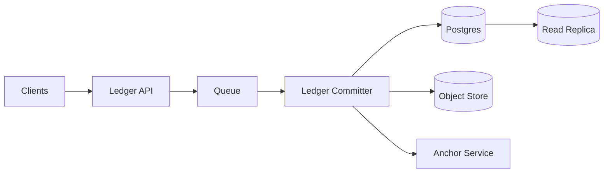

```markdown
---
title: "Ledger Database"
category: "Storage & Data Platforms"
difficulty: "Hard"
tags: [ledger, banking, double-entry, append-only, cryptographic-audit, postgres]
---

## Overview

This system is a banking ledger: an immutable, append-only record of economic events with **double-entry accounting enforcement** and **cryptographic verification** that the history hasn’t been tampered with. The design’s core idea is to separate *accepting intents* (highly parallel, user-facing) from *committing canonical ledger history* (strictly ordered, auditable). That split keeps the hard parts small and provable.

The elegant move is a **ledger committer** that serializes entries into **hash-linked blocks** (Merkle tree per block + chained block headers) and stores the canonical history in Postgres. Everything else is deliberately boring: Postgres for integrity, a queue to absorb spikes, and object storage to publish proofs efficiently.

## What Makes This Hard

Naive implementations fall into two traps:

1. **“Append-only table” ≠ immutable ledger.** If multiple writers can insert rows concurrently without a canonical order, you can’t build a single verifiable history—at best you get a bag of events. And if anyone can update/delete (or even run unsafe migrations), “immutable” becomes a social promise, not a property.

2. **Double-entry invariants under concurrency are subtle.** “Balance can’t go negative” and “sum(postings)=0” must hold *transactionally* and *forever*, even with retries, partial failures, and backfills. If you allow edits, you’ll eventually violate auditability (or spend your life reconciling).

## Requirements

### Functional Requirements

- Record **journal entries** (business events) as **multiple postings** across accounts such that, per currency, the postings net to zero.
- Prevent mutation: no updates/deletes; corrections are **reversals** (new entries).
- Provide efficient reads for:
  - Account balance as-of time `T`
  - Journal entry lookup by id / external reference
  - Audit export (time-ordered)
- Cryptographic verification:
  - Prove an entry was included in the canonical ledger (inclusion proof)
  - Detect any deletion, insertion, or modification in history
- Idempotent writes (client retries must not duplicate entries).

### Scale Targets

Assume a mid-sized fintech / bank ledger shard:

- **Peak write rate:** 2,000 journal entries/s (typical spikes around payroll/settlement windows)
- **Average write rate:** 200 entries/s
- **Entry size:** ~6 postings average (fees, cash, receivable, etc.)
- **Retention:** 7+ years; ~3B postings over time
- **Read:** 10k balance reads/s (apps, risk checks), with heavy tail at end-of-day

These numbers force: (1) batching for proofs, (2) partitioning for storage and vacuum behavior, and (3) a read model for fast balances without re-summing years of postings.

## Key Design Decisions

- **Canonical ordering via a dedicated committer**
  - Chose: a single logical writer per ledger shard (“sequencer/committer”) that assigns order and builds proofs.
  - Rejected: letting every API node append directly and “sort by timestamp”.
  - Why: cryptographic history needs a single authoritative order; distributed total order is the hard part—contain it.

- **Postgres as the source of truth**
  - Chose: Postgres with strict constraints, partitioned append-only tables, and minimal write surface (stored procedures).
  - Rejected: event stores / NoSQL as the primary ledger.
  - Why: double-entry integrity is a relational constraint problem; Postgres gives transactional guarantees and enforceable invariants.

- **Merkle-per-block + hash-chained headers**
  - Chose: batch entries into blocks (e.g., 1s or N entries), compute Merkle root, chain block headers.
  - Rejected: per-row hash chain only.
  - Why: per-row chaining makes proofs expensive and slow to verify at scale; Merkle blocks give compact inclusion proofs.

## Architecture



### Components

- **Ledger API**
  - Accepts “entry intents” (idempotency key + postings + metadata), validates shape, and enqueues.
  - Earns its place by being stateless and horizontally scalable; it never decides canonical order.

- **Queue**
  - Buffers bursts and protects Postgres from peak sizing.
  - Enables backpressure explicitly (reject/enqueue) instead of implicitly (DB timeouts).

- **Ledger Committer**
  - The small, high-assurance core: dequeues, dedupes, assigns sequence, writes atomically, builds blocks and proofs.
  - Holds the signing key in KMS/HSM and signs block headers (so proofs can be verified without trusting the database).

- **Postgres**
  - Stores canonical ledger data: accounts, journal entries, postings, block headers.
  - Enforces double-entry and immutability at the database boundary.

- **Object Store**
  - Publishes block artifacts (Merkle trees / inclusion proof data) cheaply and durably.
  - Keeps Postgres hot for transactional work, not large proof payload distribution.

- **Anchor Service**
  - Periodically anchors block header hashes to an external tamper-evident system (e.g., a public blockchain tx hash, a transparency log, or an RFC3161 TSA).
  - Makes “DB admin rewrote history” detectable by anyone with prior anchors.

- **Read Replica**
  - Serves balance queries, exports, and analytics without risking write latency.

## Deep Dive: Canonical, Verifiable Append-Only History

The hardest part is not “hash some rows”—it’s preventing forks and proving a *single* history exists.

### Data model (conceptual)

- `journal_entries(entry_id, ledger_id, client_request_id, occurred_at, committed_at, seq_no, payload_hash, block_id, ...)`
- `postings(entry_id, account_id, currency, amount_minor, ...)`
- `blocks(block_id, ledger_id, first_seq, last_seq, merkle_root, prev_block_hash, block_hash, signer_key_id, signature, anchored_at, ...)`

Key properties:

1. **Double-entry correctness is local to an entry** (sum of postings per currency must be zero).
2. **Immutability is global** (no updates/deletes; corrections are new entries).
3. **Verifiability is block-based**:
   - Each entry has a leaf hash `H(entry_canonical_bytes)`
   - Leaves are combined into a Merkle tree; root stored in `blocks`
   - Block header hash includes `prev_block_hash`, chaining blocks into a single history
   - The committer signs each block header (`signature = Sign(block_hash)`)

### How we prevent forks (the subtle failure)

If two writers can both decide “the previous block is X” and append concurrently, you can create two valid-looking chains—later reconciliation becomes political, not cryptographic.

We prevent this by making “append next block” a serialized operation per `ledger_id`:

- The committer holds a **per-ledger advisory lock** (or uses a `ledger_heads` row updated with `SELECT ... FOR UPDATE`) while it:
  1. Reads current head (`prev_block_hash`, `next_seq`)
  2. Assigns `seq_no` to a batch of queued intents
  3. Inserts `journal_entries` + `postings` (single DB transaction)
  4. Builds Merkle root for those entries
  5. Inserts `blocks` row referencing `prev_block_hash`
  6. Advances head to the new block

If the committer crashes mid-transaction, Postgres rolls back; no partial history exists. If it crashes after commit but before publishing proofs, the block is still canonical; publishing is retried idempotently using `block_id`.

### Inclusion proofs (what auditors actually need)

To prove entry `E` is in the ledger:

- Fetch the block header containing `E`:
  - `block_hash`, `merkle_root`, `prev_block_hash`, `signature`, and anchor reference (if available)
- Fetch the Merkle path for `E` (siblings along the tree)
- Verifier recomputes:
  - `leaf = H(entry_canonical_bytes)`
  - `root = Merkle(leaf, path)`
  - Confirm `root == merkle_root`
  - Confirm `VerifySignature(block_hash, signature, signer_pubkey)`
  - Optionally confirm `block_hash` is included in an anchor chain they already observed

This gives a crisp guarantee: *either the entry is exactly what you claim and was committed, or verification fails.*

### Double-entry enforcement (database-level, not application-level)

Within the same transaction that inserts an entry and its postings:

- Enforce that, per `entry_id` and `currency`, `SUM(amount_minor) = 0` using a **DEFERRABLE constraint trigger** (checked at commit).
- Prevent multi-currency mixing mistakes by requiring currency on postings and grouping enforcement by currency.
- Store `amount_minor` as integer (minor units) to avoid floating-point errors.

Application bugs do not get to “accidentally” create money; the database refuses the commit.

## Trade-offs

| Optimized For | Sacrificed |
|--------------|------------|
| Auditability and provable history | Single-writer per shard throughput ceiling |
| Strong accounting invariants | Flexibility to “edit” mistakes |
| Simple operational story (Postgres) | Some write latency (batching into blocks) |
| Clear blast radius (shard by ledger) | Cross-ledger atomicity (must model explicitly) |

## Failure Modes

- **Committer crash or deploy during peak**
  - Happens: queue grows; writes pause briefly.
  - Detect: queue lag, “last committed block age”, commit rate drops.
  - Recover: restart committer; it resumes from the queue and DB head (idempotent by `client_request_id`).

- **Primary DB failover / replication lag**
  - Happens: brief write unavailability; reads from replica may be stale.
  - Detect: replication lag metrics; elevated write errors.
  - Recover: promote standby; committer reconnects and continues. Reads requiring “as-of-now” must hit primary or use `read-your-writes` tokens.

- **Proof publication/anchoring outage**
  - Happens: blocks commit but anchors lag; auditors can still verify signatures, but external anchoring is delayed.
  - Detect: “unanchored blocks count/age”.
  - Recover: backfill anchoring from block table; anchoring is append-only and idempotent.

## What I’d Do Differently At...

- **10x scale:**
  - Shard by `ledger_id` (or tenant) and run one committer per shard.
  - Add a materialized balance table updated by the committer (still derived from postings) to make balance reads O(1).

- **100x scale:**
  - Move from “one Postgres per shard” to a fleet with automated re-sharding and strict operational guardrails.
  - Consider a log-structured storage engine for postings + a separate relational store for reference data, but keep the **committer + block proof model** unchanged (that’s the real asset).

## Operational Notes

- Revoke `UPDATE/DELETE` on ledger tables; only allow inserts via stored procedures executed by the committer role.
- Partition `postings` and `journal_entries` by time (and/or ledger shard) to keep indexes/vacuum manageable.
- Run a continuous verifier job that:
  - Recomputes block hashes/roots from stored entries
  - Confirms signature validity
  - Alerts on any mismatch (treat as a security incident)
- Backups must be immutable (WORM/object-lock) and tested with restore drills; the threat model includes “privileged operator made a mistake.”
```