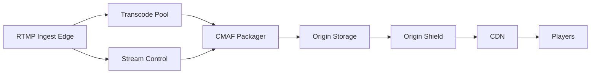

```markdown
---
title: "Live Video Streaming"
category: "Real-Time & Media"
difficulty: "Hard"
tags: ["video", "streaming", "rtmp", "ll-hls", "dash", "cmaf", "transcoding", "cdn", "dvr"]
---

## Overview

This system is a Twitch-like live platform that ingests RTMP, transcodes into a bitrate ladder, delivers at low latency via LL-HLS (and DASH for broader compatibility), and supports DVR playback without a separate “recording system”.

The key insight is to **make one canonical media timeline** per stream—**CMAF fMP4 fragments** with strictly controlled timestamps and segment boundaries—and then treat *live* and *DVR* as different views over the same append-only timeline. Live playback is a sliding window over the newest fragments; DVR is the same manifest model with a longer retained window. When you do this, “DVR” stops being a feature and becomes retention policy plus playlist generation.

Everything else stays boring: stateless ingest edges, autoscaled transcode workers, object storage as origin-of-record, CDN for egress, and a small control plane for stream state and manifests.

## What Makes This Hard

Naive designs fail in two places:

1. **Latency vs. stability**: teams chase “low latency” by shrinking segments without controlling GOP alignment, encoder buffering, and manifest update cadence. The result is rebuffering, playlist churn, and player stalls—especially during bitrate switches.
2. **DVR correctness**: “record the stream” sounds easy until you need seekable playback across rendition switches, encoder restarts, and discontinuities. If you don’t own the timeline (timestamps, sequence numbers, discontinuity markers), your DVR becomes a pile of partially playable files.

The trap is treating ingest, transcoding, packaging, and DVR as separate problems. They are one problem: producing a clean, monotonic media timeline.

## Requirements

### Functional Requirements
- RTMP ingest with per-stream authentication and immediate rejection on invalid keys.
- Transcoding ladder (e.g., 1080p/60 → 720p/60 → 480p/30 → 360p/30 → 160p) with consistent segment boundaries across renditions.
- Low-latency playback: glass-to-glass target ~3–5s on capable players (LL-HLS), graceful fallback to standard HLS/DASH.
- DVR: seek back in the last *N* hours (e.g., 6h) while the stream is live; after stream ends, publish VOD from the same artifacts.
- Fast stream start: first playable frames within ~1–2s after ingest begins (excluding player join latency).
- Multi-CDN support and origin shielding to avoid melting the origin on hot streams.

### Scale Targets
- **Concurrent live streams:** 10,000 (drives ingest and transcode fleet sizing).
- **Average ingest bitrate:** 6 Mbps per stream (1080p60 creators); peak 12 Mbps.
- **Ladder outputs:** 5 renditions, average 10 Mbps total per stream output (drives compute and storage writes).
- **Concurrent viewers:** 200,000 average, 1,000,000 peak events (drives CDN egress and manifest QPS).
- **Segmenting:** 2s segments, LL-HLS parts at 200–500ms (drives playlist update rate and cache behavior).
- **DVR retention:** 6 hours hot retention (drives object storage footprint and index size).
  - Rough storage: 10,000 streams * 10 Mbps * 6h ≈ 270 TB raw media (before lifecycle tiering/compaction).

## Key Design Decisions

- **Canonical format: CMAF fMP4 for everything**
  - Chose: CMAF fragments (fMP4) as the single media representation; generate LL-HLS and DASH manifests over it.
  - Rejected: separate TS-based HLS pipeline plus a different MP4/VOD pipeline.
  - Why: one timeline means one set of discontinuity rules, one DVR story, and consistent ABR switching.

- **Timeline owned by the packager, not the transcoders**
  - Chose: transcoders emit elementary outputs into a packager that assigns segment/part boundaries and sequence numbers.
  - Rejected: letting each transcoder segment independently.
  - Why: independent segmentation guarantees drift between renditions; drift guarantees broken ABR and broken DVR.

- **Object storage as origin-of-record, CDN as the “read path”**
  - Chose: write fragments/manifests to object storage; serve through an origin shield and CDN with aggressive caching.
  - Rejected: serving directly from packagers or keeping DVR in a database.
  - Why: object storage gives durable, cheap append-only retention; CDN absorbs read load and spikes.

## Architecture



### Components

- **RTMP Ingest Edge**
  - Terminates RTMP, authenticates stream keys, enforces basic limits (bitrate caps, connection count), and forwards the input to the transcode pool.
  - Stateless by design; horizontal scale and fast failover matter more than “smart” routing.

- **Stream Control**
  - The small brains of the system: stream lifecycle (live/ended), current encoder health, and the authoritative “stream timeline state” (sequence numbers, discontinuities, active renditions).
  - Stores minimal state in a strongly consistent store (e.g., Postgres) plus a fast cache (Redis) for hot reads.

- **Transcode Pool**
  - Autoscaled workers (GPU where it pays off) that normalize inputs (frame rate, keyframe cadence) and output rendition bitstreams to the packager.
  - Optimizes for predictable output: fixed GOP, aligned keyframes, bounded encoder latency.

- **CMAF Packager**
  - Accepts rendition bitstreams and produces CMAF fragments + LL-HLS/DASH manifests.
  - Owns: segment/part boundaries, timestamp continuity, discontinuity signaling, and “sliding window” logic for live playlists.

- **Origin Storage**
  - Object storage bucket structure per stream/rendition (immutable fragments, mutable manifests).
  - Lifecycle policies implement DVR and VOD retention without custom cleanup jobs.

- **Origin Shield**
  - A cache/proxy tier in front of object storage to collapse hot reads (especially manifests) and protect storage from stampedes.

- **CDN**
  - Primary egress path with tuned caching for manifests (short TTL + stale-while-revalidate) and long caching for immutable fragments.

- **Players**
  - LL-HLS capable clients use parts; others use standard HLS/DASH with slightly higher latency.

## Deep Dive: The Hardest Part
### A Single, Correct Timeline (Low-Latency + DVR + ABR)

The system succeeds or fails on one invariant: **all renditions share the same segment boundaries and timeline semantics**. That means every rendition must cut segments on the same wall-clock cadence *and* on keyframes. The transcoders enforce a fixed GOP (e.g., 2s GOP for 2s segments; or 1s GOP with 2s segments) and insert IDR frames exactly on boundaries. This is not a “nice to have”: without aligned IDRs, players cannot switch bitrates cleanly, and DVR seeks land on non-decodable frames.

Low latency is achieved with LL-HLS parts over CMAF: the packager emits parts as soon as it has decodable media, publishes an updated manifest on a tight cadence, and relies on HTTP chunked transfer + CDN support to keep propagation fast. The non-obvious part is resisting the urge to update manifests “as fast as possible”. Instead, the packager publishes manifests on a fixed rhythm (e.g., every part or every two parts) and uses stable playlist structure to keep CDN caching effective. You want *predictable churn*, not maximum churn.

DVR falls out naturally if fragments are immutable and sequence numbers are monotonic. The packager maintains two windows:
- **Live window**: last ~30–60s in the live playlist (keeps join fast and limits manifest size).
- **DVR window**: last 6h addressable via a DVR playlist (or via dated playlists), backed by the same fragments in object storage.

Encoder restarts and network blips introduce discontinuities. The packager, driven by Stream Control, inserts explicit discontinuity markers and resets decode timestamps in a controlled way. The rule is simple: **a discontinuity becomes a first-class event in the timeline**, not an accident the player discovers. This makes both live playback recovery and DVR seeks reliable.

## Trade-offs

| Optimized For | Sacrificed |
|--------------|------------|
| Simple, unified media pipeline (CMAF everywhere) | Slightly more demanding packager correctness |
| Low-latency without fragile tricks | Lowest-possible latency (<2s) in all environments |
| DVR as retention + manifests (no separate recorder) | Per-stream manifest logic becomes critical-path |
| CDN-friendly behavior (predictable manifest churn) | Real-time per-viewer personalization at the edge |

## Failure Modes

- **Transcoder worker dies mid-stream**
  - What happens: one or more renditions stop producing parts; ABR may downshift or stall if the top rendition disappears.
  - Detect: missing-part alarms (per rendition), packager input timeout, rising player rebuffer rate.
  - Recover: Stream Control marks rendition unhealthy; packager drops it from the master playlist; autoscaler replaces worker; rendition reappears with a discontinuity boundary.

- **Packager falls behind (CPU/IO pressure)**
  - What happens: manifests lag; latency climbs; eventually parts arrive too late for LL-HLS pacing.
  - Detect: packager queue depth, “part publish delay” SLO, manifest age at CDN.
  - Recover: shed load by reducing part frequency (temporarily), scale packagers horizontally, and pin hot streams to dedicated packager capacity.

- **Origin storage or shield degraded**
  - What happens: CDN cache misses become slow; manifests time out; viewers fail to join or see stalls on refresh.
  - Detect: 5xx/timeout rates at shield, CDN origin latency, manifest fetch failure rate.
  - Recover: fail over to secondary bucket/region for new writes, serve stale manifests (stale-while-revalidate), and prioritize manifest availability over fragment backfill.

## What I'd Do Differently At...

- **10x scale:**
  - Move to multi-region ingest + active-active packaging for the hottest streams, and standardize on origin shielding per region to keep object storage reads flat.
  - Add automated “hot stream isolation”: dedicated packager shards and stricter per-stream resource caps.

- **100x scale:**
  - Rearchitect packaging/origin around a specialized media storage layer (still HTTP-addressable) to reduce object-store request overhead and manifest amplification.
  - Treat manifests as a high-QPS product: push-based distribution or edge-compute generated manifests for live windows, with object storage as long-term DVR record.

## Operational Notes

- Time sync matters: enforce NTP across ingest, transcode, and packaging; timeline bugs often start as clock drift.
- Encoder settings are an SRE concern: fixed GOP/IDR cadence, capped lookahead, and bounded VBV buffer prevent “mystery latency”.
- Monitor what users feel: join time, live latency (player-reported), rebuffer ratio, and rendition switch failure rate beat CPU graphs.
- Manifests are the hottest objects: design caching, TTLs, and update cadence so the CDN helps you instead of fighting you.
```