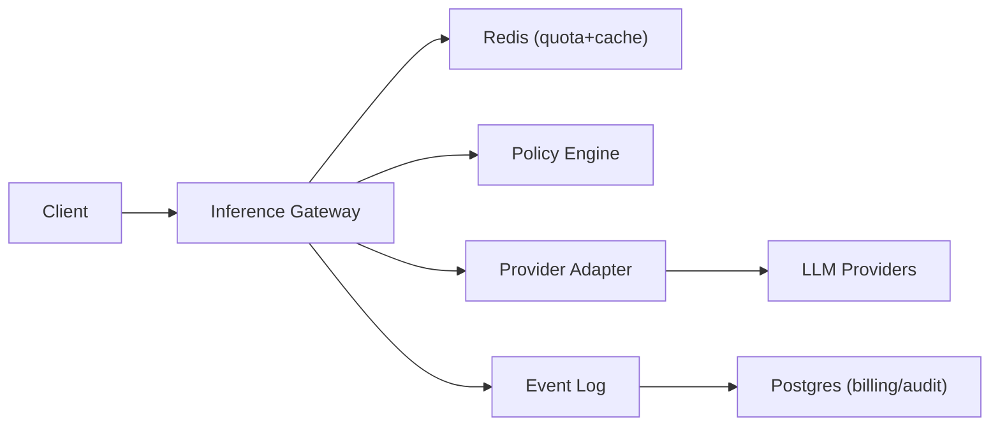

```markdown
---
title: "LLM Inference Gateway"
category: "AI/ML Infrastructure"
difficulty: "Advanced"
tags: ["llm", "gateway", "streaming", "caching", "quotas", "moderation", "observability"]
---

## Overview

This system is a gateway that sits between product traffic and one or more LLM providers. It standardizes APIs, streams tokens to clients, enforces cost and safety policies, and opportunistically serves responses from a prompt cache. The goal is to make LLM usage feel like a reliable internal platform primitive: predictable cost, predictable latency, and predictable governance.

The key insight is to treat *tokens as the unit of admission control* and to make streaming a first-class citizen. Naive gateways bolt quotas, caching, and moderation on the side; this design makes them part of the request lifecycle with explicit “reserve → stream → settle” accounting, and with moderation that can safely interrupt a stream without corrupting downstream state.

Everything else stays boring: stateless gateway instances, Redis for hot-path state (rate limits, reservations, cache), Postgres for durable billing/audit, and a simple async log pipeline for analytics.

## What Makes This Hard

Naive implementations get trapped by three interacting realities:

1. **Streaming breaks “request/response” assumptions.** You need to start sending tokens before you know total cost, before post-moderation is possible, and while clients may disconnect mid-stream.
2. **Caching is only useful if it is correct.** “Same prompt” is not a string match; model, params, tools, safety settings, and even system prompts must be in the cache key or you will serve the wrong answer.
3. **Quotas must be enforceable under retries and partial failures.** Providers time out, clients retry, and streams drop. If you don’t make accounting idempotent, you either leak spend (undercharge) or block legitimate traffic (overcharge).

## Requirements

### Functional Requirements
- Normalize a single API surface (chat/completions + tool calls) over multiple providers.
- Token streaming to clients (SSE) with low added latency (<50ms p50 gateway overhead).
- Prompt/result caching with correctness guarantees (no cross-tenant leakage; no param mismatch).
- Cost quotas:
  - Per API key: RPM/TPM limits.
  - Per org/project: daily token budget and dollar budget.
  - Hard fail on budget exhaustion (no “best effort” overspend).
- Safety moderation:
  - Pre-moderation on user input (block before calling providers).
  - Streaming-time moderation on output (interrupt stream on policy violation).
  - Durable audit log of decisions and rationale.
- Idempotency across retries (client retries and gateway/provider retries).

### Scale Targets
- **Traffic:** 1,000 RPS steady, 3,000 RPS burst (product launches).
- **Tokens:** avg 800 prompt tokens + 1,200 completion tokens → ~2,000 tokens/request.
  - Steady: ~2M tokens/sec at 1,000 RPS is unrealistic for most orgs; the real pressure is burstiness and concurrency. Design for **150k tokens/sec** sustained with headroom and backpressure.
- **Latency:** added gateway overhead p50 < 50ms, p95 < 150ms (excluding provider time).
- **Cache:** 20% hit rate is meaningful; higher hit rates happen in agent/tool loops and repetitive workflows.
- These numbers matter because Redis hot-path ops must stay O(1) and because quota checks must not add extra network round-trips per streamed token.

## Key Design Decisions

- **Decision: Token reservation + settlement (two-phase accounting)**
  - Chose: Reserve estimated worst-case tokens up front; stream; settle with actual usage; release unused reservation.
  - Rejected: Charge only after completion (allows budget overshoot during bursts) and charge per streamed token (too chatty and fragile).
  - Why: This is the simplest model that prevents overspend while keeping streaming fast.

- **Decision: Exact-match canonical cache keys + in-flight request coalescing**
  - Chose: Canonicalize the full normalized request (model+params+tools+system+messages) and hash it; cache only after finalization; coalesce identical in-flight requests.
  - Rejected: “Semantic cache” by embeddings as the default path.
  - Why: Correctness beats cleverness. Exact-match gives deterministic behavior and is easy to debug; coalescing captures much of the benefit without serving “close enough” answers.

- **Decision: Output moderation that can cut a stream**
  - Chose: Pre-moderate inputs; run a lightweight streaming classifier on the output; if triggered, terminate the provider stream, send a policy error frame, and settle accounting.
  - Rejected: Only post-moderation after full output (too late) and only regex rules (too brittle).
  - Why: The gateway must be able to stop harmful output mid-flight without leaving quotas, cache, or audits inconsistent.

## Architecture



### Components

- **Inference Gateway**
  - Stateless service handling auth, normalization, SSE streaming, and orchestration of cache/quota/policy checks.
  - Earns its place by being the only component on the critical path that understands “reserve → stream → settle”.

- **Redis (quota+cache)**
  - Hot-path state: rate limits, token reservations, idempotency keys, cache entries, and in-flight coalescing.
  - Earns its place because these operations must be single-digit milliseconds and atomic.

- **Policy Engine**
  - Single responsibility: decide allow/block/transform for prompts and streamed outputs; emits structured reasons.
  - Earns its place by isolating governance logic so gateway code stays small and auditable.

- **Provider Adapter**
  - Translates normalized requests to provider-specific APIs; normalizes provider events into a single stream format; enforces provider timeouts/retries.
  - Earns its place because provider quirks otherwise leak into every client.

- **LLM Providers**
  - External dependencies; treated as unreliable and variable-latency.

- **Event Log**
  - Append-only stream of decisions (quota, moderation, cache hit/miss, provider latency) for debugging and billing.
  - Earns its place by decoupling analytics from the online path.

- **Postgres (billing/audit)**
  - Durable ledger of finalized usage, policy decisions, and admin configuration.
  - Earns its place because money and governance require strong consistency and clear history.

## Deep Dive: Token Quotas Under Streaming (Reserve → Stream → Settle)

The hardest part is enforcing spend limits *before* you know the final token usage, while still streaming tokens immediately. The gateway uses a two-phase model:

1. **Reserve (admission control)**
   - Canonicalize request and compute an *estimated token cost*:
     - `prompt_tokens_est` from a tokenizer library compatible with the target model family.
     - `completion_tokens_max` from `max_tokens` (or a configured cap if the client omits it).
   - Compute `reserve_tokens = prompt_tokens_est + completion_tokens_max`.
   - Atomically in Redis:
     - Check RPM/TPM windows for the API key.
     - Check daily remaining token and dollar budgets for org/project.
     - If allowed, increment “reserved_tokens_today” and store a reservation record keyed by `request_id` (idempotency key).
   - If the client retries with the same idempotency key, return the prior decision and do not double-reserve.

2. **Stream (low overhead, failure-safe)**
   - Start provider stream immediately after reservation.
   - The gateway never performs per-token Redis writes. It maintains local counters for streamed output size and runs moderation on a sliding window buffer.
   - If the client disconnects, the gateway cancels the provider request and proceeds to settlement; cancellations still cost tokens and must be accounted for.

3. **Settle (finalize truth)**
   - At stream end (normal end, cancellation, moderation stop, or provider error), finalize usage:
     - Prefer provider-reported `usage` if available.
     - Otherwise compute best-effort from token counts (and mark as “estimated” in the ledger).
   - Atomically in Redis:
     - Convert reservation to final usage: decrement reserved, increment consumed.
     - Record terminal state for `request_id` so retries return a consistent outcome.
   - Emit a billing event and write a durable ledger row in Postgres asynchronously. Redis is the enforcer; Postgres is the source of truth for reconciliation.

This model is non-obvious but crucial: it prevents overspend during bursts without turning the stream into a distributed transaction. The elegance is that the online path needs only *two* Redis atomic operations per request (reserve + settle), regardless of output length.

## Trade-offs

| Optimized For | Sacrificed |
|--------------|------------|
| Hard spend caps under burst traffic | Occasional over-reservation (temporary headroom consumed) |
| Low-latency streaming | Fine-grained per-token quota precision |
| Cache correctness and debuggability | Semantic cache hit rate |
| Simple operations (Redis + Postgres) | Global “exactly-once” billing across all failures |

## Failure Modes

- **Redis outage or high latency**
  - What happens: Admission control and cache become unavailable; gateway risks either blocking all traffic or allowing unbounded spend.
  - Detect: Redis latency/error SLOs; sudden drop in cache hit rate; spike in “quota check failed” errors.
  - Recover: Fail closed for paid/budgeted orgs (protect money); fail open only for explicitly whitelisted internal/testing keys with a strict global circuit breaker. Restore by promoting Redis replica / switching to a hot standby.

- **Provider stream stalls or flakes mid-response**
  - What happens: Clients hang; retries risk double-charging; partial outputs may be cached incorrectly.
  - Detect: Provider p95 latency, stream “no token for N seconds” watchdog, elevated retry rates.
  - Recover: Gateway enforces a token-stall timeout; cancels provider call; settles with observed usage; never writes cache unless stream finalized successfully.

- **Moderation false positive cuts valid streams**
  - What happens: User experience breaks and support load spikes.
  - Detect: Rate of moderation stops per policy/version; sampled transcripts for review (with PII controls).
  - Recover: Versioned policy rollout with canaries; fast rollback; store decision reasons and classifier scores for postmortems; allow per-org overrides with explicit audit trails.

## What I'd Do Differently At...

- **10x scale:** Split Redis into dedicated clusters (quota/idempotency vs cache), add shard-aware routing in the gateway, and move Policy Engine to its own autoscaled service with strict latency budgets and cached model weights.
- **100x scale:** Introduce a dedicated high-throughput cache tier (SSD-backed) with cache-aware routing and stronger coalescing (fanout to many subscribers), and move from “best-effort usage estimation” to provider-side metering + signed usage receipts for reconciliation.

## Operational Notes

- Cache keys must include: tenant/org, model, temperature/top_p, tool schemas, system prompt, message list, and safety mode; missing any of these creates silent correctness bugs.
- Idempotency is mandatory: require `Idempotency-Key` for non-trivial requests; store terminal outcome for a bounded TTL to control Redis growth.
- Log redaction: never store raw prompts by default; store hashes + selective samples behind an explicit allowlist and retention policy.
- Backpressure: enforce max concurrent streams per API key/org to avoid “slow client” resource exhaustion; shed load before the gateway becomes the bottleneck.
- Runbooks should start with: Redis health, provider health, moderation policy version, and reservation/settlement mismatch dashboards.
```