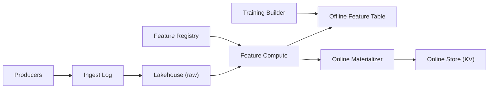

```markdown
---
title: "ML Feature Store"
category: "AI/ML Infrastructure"
difficulty: "Hard"
tags: ["feature-store", "point-in-time", "data-leakage", "streaming", "lakehouse", "ml-platform"]
---

## Overview

A feature store is a contract: “given an entity key and a timestamp, return the feature values that were known at that time.” Most teams build two systems (offline for training, online for inference) and then spend years debugging why models behave differently in production. The elegant design is to treat the offline store as the source of truth and make the online store a *projection* of it, driven by the same feature definitions and the same event-time semantics.

The key insight is to stop thinking of features as “columns” and instead store them as *time-versioned facts* keyed by `(entity_id, feature_name, event_time)` with a strict “as-of” read rule. Point-in-time correctness then becomes a deterministic query pattern (as-of join) plus operational controls for late data and backfills, instead of a pile of ad-hoc exceptions.

## What Makes This Hard

Naive implementations leak data by joining labels with “latest features” (or by computing aggregates using wall-clock time), accidentally using information that arrived after the prediction moment. The trap is subtle: even if your feature values are correct, your *join* is wrong unless it respects the observation timestamp for each training example.

The second trap is online/offline skew: teams compute online features with bespoke code paths “for latency” while offline features use Spark/SQL. These diverge quickly (null handling, time zones, window boundaries, late events), and you ship a model trained on data it will never see at inference.

## Requirements

### Functional Requirements
- Serve online features by `(entity_id, feature_set)` with p95 single-digit milliseconds.
- Generate training datasets with point-in-time correctness: for each training row at time `t`, use only feature values with `event_time <= t`.
- Support feature versioning and safe evolution (schema, transformation changes) without silently changing training data.
- Handle late-arriving events and backfills without violating point-in-time semantics.
- Enforce a single definition of each feature across offline and online serving.

### Scale Targets
- **Entities:** 100M distinct entity IDs (users, items, accounts).
- **Features:** 5k total features, 100–300 used per model.
- **Online QPS:** 50k reads/sec peak; 95% of requests are multi-feature fetches for a single entity.
- **Freshness:** P99 feature staleness under 60s for “online-critical” features.
- **Offline training joins:** 1–10B training rows/day with 50–200 features joined per row.
These numbers matter because they force (1) storage to be append-friendly and time-travel capable, (2) online reads to be key-value shaped, and (3) training joins to avoid exploding shuffle costs.

## Key Design Decisions

- **What we chose:** Store features as time-versioned facts in a lakehouse table (Iceberg/Delta) and build training datasets via deterministic as-of joins against an explicit “training spine” (entity, label_time).
  - **Rejected:** Storing only the latest value per entity in offline tables and relying on snapshots.
  - **Why:** Point-in-time correctness is about the *observation timestamp per row*, not about “yesterday’s snapshot.”

- **What we chose:** Online store is a projection updated from the same feature definitions (streaming materialization), not a parallel feature computation path.
  - **Rejected:** Separate online feature code “optimized for latency.”
  - **Why:** Eliminating skew is cheaper than debugging skew, and streaming materialization gives low latency without semantic drift.

- **What we chose:** A first-class Feature Registry in Postgres that records feature contracts (keys, event_time, TTL, freshness SLA, lineage, versions) and gates deployments.
  - **Rejected:** Feature definitions scattered across notebooks and pipelines.
  - **Why:** The registry becomes the enforcement point for correctness rules and safe evolution.

## Architecture



### Components

- **Ingest Log (Kafka/PubSub):** One durable path for event ingestion with ordering per key and replay for backfills.
- **Lakehouse (raw) (Iceberg/Delta on object storage):** Immutable event history with time travel; this is what lets you recompute features correctly after late data or logic changes.
- **Feature Registry (Postgres):** Stores the feature contract: entity keys, event_time field, allowed lateness, TTL, transformation version, and serving eligibility; blocks changes that would break point-in-time assumptions.
- **Feature Compute (Spark / Structured Streaming):** Executes feature definitions into time-versioned feature facts; batch for large backfills, streaming for freshness.
- **Offline Feature Table (Iceberg/Delta):** The canonical, append-only representation of features: `(entity_id, feature_name, event_time, value, ingestion_time, version)`.
- **Online Materializer:** Consumes computed feature facts and maintains the latest serving snapshot per entity/feature, including TTL/freshness metadata.
- **Online Store (Redis Cluster / DynamoDB / Cassandra):** Key-value reads optimized for inference latency: `entity_id -> {feature_name: (value, event_time, version)}`.
- **Training Builder:** Creates datasets by joining a training spine with offline feature facts using strict as-of semantics.

## Deep Dive: Point-in-Time Correctness (As-Of Joins Without Leakage)

The system enforces a single rule: **a training example at observation time `t` may only use feature values with `event_time <= t`.** Everything else is implementation detail.

1) **Build a training spine first.**  
For each label (or training event), emit `(entity_id, label, label_time)` into a spine table. This table is the ground truth of “when we are pretending to make the prediction.” Without an explicit spine, teams accidentally join on ingestion time, partition date, or “latest,” and leakage becomes inevitable.

2) **Store features as facts, not snapshots.**  
Each feature write is an immutable fact with `event_time` (when it became true in the world) and `ingestion_time` (when it arrived). Online serving uses “latest by event_time,” but offline training uses “latest by event_time constrained by label_time.” Keeping both timestamps lets you:
- detect late data (`ingestion_time - event_time`),
- re-materialize safely,
- and audit why a training row changed after a backfill.

3) **Implement the join as a deterministic “last observation carried forward” query.**  
For each feature, select the max `event_time` per `(entity_id, label_time)` such that `event_time <= label_time`, then join the corresponding value. In practice, you do this efficiently by:
- partitioning offline feature tables by `feature_name` and bucketing by `entity_id`,
- using range filters on `event_time`,
- and performing per-feature as-of joins in a controlled plan (not a giant wide shuffle).

4) **Late events are handled by policy, not improvisation.**  
Every feature has an **allowed lateness** in the registry. Streaming materialization updates the online store immediately, but offline training datasets are generated against a *declared cutoff* (e.g., “train as of T with lateness L”). If late data arrives within L, you accept that training data for the same label_time changes and you retrain; if it arrives beyond L, you log it as an SLA violation and exclude it from training to preserve reproducibility.

5) **Reproducibility is a first-class output.**  
Training dataset generation records:
- feature definition versions,
- source table snapshot IDs (Iceberg/Delta),
- and the cutoff time/lateness policy.
You can rebuild *exactly* the same dataset later, which is how you debug performance regressions without superstition.

## Trade-offs

| Optimized For | Sacrificed |
|--------------|------------|
| Correctness and auditability (no leakage) | Some query complexity in training joins |
| Online/offline semantic consistency | Slightly higher infra cost (materialization + lakehouse) |
| Reproducible backfills and retraining | Feature changes require disciplined versioning |

## Failure Modes

- **Online store staleness (materializer lag):** Inference uses older features, accuracy drops.
  - **Detect:** Per-feature freshness metrics (`now - last_event_time`) and consumer lag alarms.
  - **Recover:** Replay from log offsets; temporarily fall back to conservative defaults for stale features; page the owning team via registry ownership.

- **Silent leakage via incorrect join logic:** Training data looks “too good,” model fails in production.
  - **Detect:** Automated leakage checks: compare offline “as-of” features vs “latest” features on a sample; alert on large deltas and suspicious AUC jumps.
  - **Recover:** Block training jobs that don’t use spine-based as-of joins; require registry-approved join templates.

- **Backfill or schema evolution changes meaning:** Historical training data shifts without intent.
  - **Detect:** Dataset diffing keyed by `(entity_id, label_time)` and feature distribution drift after backfills.
  - **Recover:** Version features immutably; keep old versions serving-capable until models migrate; enforce deprecation windows.

## What I'd Do Differently At...

- **10x scale:** Move offline joins to precomputed “feature packs” for common model groups to reduce repeated as-of work; add entity-based clustering and more aggressive bucketing to cut shuffle.
- **100x scale:** Split the offline feature table into domain-specific tables with independent SLAs; move online store to a tiered architecture (hot Redis + warm persistent KV) and introduce request-time feature composition limits to control worst-case fanout.

## Operational Notes

- Track three SLOs per feature: **freshness**, **completeness** (missing rate), and **lateness** (ingestion_time - event_time); page on freshness for online-critical features.
- Make feature ownership explicit in the registry; on-call needs a human to wake up, not a generic “data platform” queue.
- Treat materialization as stateful software: exactly-once is achieved by idempotent writes keyed by `(entity_id, feature_name, event_time, version)` and by storing the last applied offset/checkpoint.
- Run canary inference requests that fetch features and validate invariants (non-null, ranges, monotonic timestamps) before deploying new feature definitions.
```