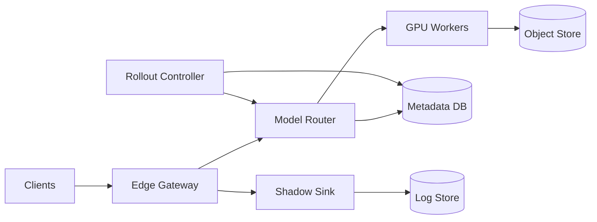

```markdown
---
title: "Model Serving Platform"
category: "AI/ML Infrastructure"
difficulty: "Hard"
tags: ["model-serving", "gpus", "scheduling", "rollouts", "multi-tenancy", "latency"]
---

## Overview

This system hosts **thousands of ML models** behind a single, stable API while keeping GPU utilization high and rollouts safe. The key insight is to **separate “serving identity” (a model + version) from “GPU residency” (what’s currently loaded on a node)**. Most platforms bind these together, then pay for it in cold starts, noisy neighbors, and rollouts that are either risky or slow.

The design uses a **small control plane** (metadata, rollout orchestration, quota) and a **boring, reliable data plane** (Envoy → model routers → Triton-based workers). GPUs are treated as a scarce cluster resource with explicit **SLO tiers** and **admission control**, not as an autoscaling afterthought.

The result: safe shadow deployments, predictable scheduling under contention, and cold starts that don’t trigger a “load storm” that takes down the fleet.

## What Makes This Hard

Naive implementations get trapped by three coupled problems:

1. **Cold starts are nonlinear.** Loading weights, building CUDA kernels, and warming caches creates bursty GPU/CPU/IO demand. Under load, the platform thrashes: requests queue up, more replicas spawn, and everything gets slower.
2. **GPU scheduling is multi-dimensional.** It’s not just “a GPU”; it’s memory, compute, model size, batch shape, and interference. Bin-packing without guardrails produces noisy neighbors and tail-latency spikes.
3. **Shadow deployments are easy to route but hard to trust.** You need deterministic sampling, feature parity, and output comparison at scale without polluting prod latency or exposing sensitive payloads.

## Requirements

### Functional Requirements
- Host **10k+ models** with versioning, provenance, and controlled rollout.
- Support **real-time inference** (sync) and **batch/async inference** (queued).
- Provide **shadow deployments** (full request mirroring, zero user impact) and **canary** (partial user impact with rollback).
- Enforce **multi-tenant quotas** (GPU, CPU, memory, QPS) and isolation boundaries.
- Collect **model-level telemetry** (latency, GPU memory, OOMs, error rates) and produce rollback signals.

### Scale Targets
- **Models:** 10,000 total; **500 active/day**; **50 hot concurrently** (typical long-tail).
- **Traffic:** 20k RPS peak platform-wide; hot models 2k RPS each; long-tail ≤1 RPS.
- **Latency SLOs:** p95 < 150ms for “hot tier”; p95 < 400ms for “warm tier”; “cold tier” allows first-hit up to 2–5s.
- **Rollouts:** up to 200 deployments/day; shadow for 30 minutes with statistical confidence gates.
- **GPU fleet:** 200–2,000 GPUs with mixed SKUs; target **>70% utilization** on hot tier while meeting p95.

Why these numbers matter: long-tail + strict tail latency creates the classic conflict—keeping everything warm is too expensive, but loading on demand melts the fleet without orchestration.

## Key Design Decisions

- **We chose:** Triton Inference Server as the primary runtime, managed by Kubernetes + KServe APIs.
  - **Rejected:** a custom per-framework server fleet.
  - **Why:** Triton gives proven batching, multiple backends, and stable operational semantics; KServe gives a standard CRD surface and rollout hooks.

- **We chose:** Explicit SLO tiers with admission control (Hot/Warm/Cold) plus a warm-pool of “empty” GPU workers.
  - **Rejected:** pure HPA/autoscaling based on latency.
  - **Why:** scaling reacts too late for model load time; admission control prevents load storms and preserves tail latency for paid tiers.

- **We chose:** Deterministic shadowing at the edge (request hash sampling) + async diff pipeline.
  - **Rejected:** in-worker mirroring and synchronous comparisons.
  - **Why:** edge mirroring is uniform and observable; async diffs keep prod latency clean and avoids coupling to model runtime behavior.

## Architecture



### Components

- **Edge Gateway (Envoy):** AuthN/Z, request normalization, deterministic sampling for shadow/canary, and routing headers. Earns its place because rollout safety and shadowing must be consistent across all models.
- **Model Router:** Low-latency lookup from (model, version, tenant, tier) → worker pool, with backpressure and queueing policy. This is where SLO tiers become enforceable behavior.
- **GPU Workers (Triton):** Long-lived processes that dynamically load/unload models. They expose uniform gRPC/HTTP inference and export GPU telemetry.
- **Object Store (S3/GCS/MinIO):** Source of truth for model artifacts (weights, tokenizer, config), stored content-addressed for deduplication and integrity.
- **Metadata DB (Postgres):** Model registry metadata, rollout state machines, quotas, audit trail. Postgres is the right “boring” choice for correctness and operability.
- **Rollout Controller:** Orchestrates canary/shadow, promotes versions, triggers warmups, and enforces policy gates (error/latency/diff drift).
- **Shadow Sink + Log Store:** Accepts mirrored requests (payloads or hashed features), stores outputs and metadata for offline diffing and dashboards.

## Deep Dive: Cold Starts Without Melting the Fleet

The hard part is not “loading a model”; it’s preventing **synchronized loading** across replicas and nodes while traffic is already waiting. The platform solves this with three mechanisms that work together:

1. **Content-addressed artifacts + node-local cache**
   - Every model version resolves to immutable artifact digests (e.g., `sha256:...`).
   - GPU nodes run a small **model-cache daemon** that downloads artifacts to local NVMe and exposes “present/not present” to the scheduler.
   - This turns “load model” from “hit S3 under duress” into “read local disk” for steady-state and makes prefetch predictable.

2. **Warm pool of GPU workers + two-phase activation**
   - Keep a small number of **idle Triton workers** per GPU SKU (hot spare capacity).
   - When a model needs to serve, the router requests activation:
     1) **Prefetch** artifacts to node cache (IO phase).
     2) **Load + warm** in Triton (GPU/CPU phase) with concurrency limits per node.
   - Only after warmup does the router shift traffic. This prevents user traffic from being the warmup driver.

3. **Admission control with per-tier guarantees**
   - The router enforces a maximum number of concurrent model activations per cluster and per node (e.g., “2 loads/GPU node at once”).
   - Cold-tier requests queue (with explicit timeouts) rather than triggering replica explosion.
   - Hot-tier capacity is protected via reserved GPU slices (MIG partitions or dedicated node pools), so cold starts cannot steal the GPUs needed for tail latency.

Non-obvious edge case: **cold-start storms from retries.** The gateway tags retries with an idempotency key; the router deduplicates activations per (model, version) and returns queued promises instead of initiating multiple loads. This single change eliminates a common “thundering herd” failure mode.

## Trade-offs

| Optimized For | Sacrificed |
|--------------|------------|
| Tail latency for hot traffic | Always-warm for long tail |
| High GPU utilization with guardrails | Maximum simplicity (more policy) |
| Safe rollouts with trustworthy shadowing | Some extra infra for diffing/logging |

## Failure Modes

- **GPU OOM / bad model version**
  - **What happens:** Triton worker crashes or ejects model; p95 spikes; errors rise.
  - **Detect:** GPU memory telemetry + error-rate SLO burn + crashloop alerts per model version.
  - **Recover:** Automatic rollback to last-good version; quarantine the artifact digest; block promotion until manual override.

- **Cold-start load storm**
  - **What happens:** Many models activated concurrently; S3 and CPU saturate; hot traffic degrades.
  - **Detect:** Spike in activation queue depth, node cache misses, and artifact download bandwidth.
  - **Recover:** Admission controller clamps activations; router de-prioritizes cold tier; rollout controller pauses new deploys; prefetch runs at controlled rate.

- **Metadata/registry outage (Postgres)**
  - **What happens:** New deployments and policy changes stall; routing must continue.
  - **Detect:** DB health + elevated router cache misses.
  - **Recover:** Router runs on cached routing tables with TTL; deploy pipeline halts safely; failover Postgres (managed HA or Patroni).

## What I'd Do Differently At...

- **10x scale:**
  - Split fleets by tier (hot/warm/cold) with dedicated GPU pools and stricter quotas.
  - Add artifact prefetch forecasting from access logs to keep warm tier efficient.

- **100x scale:**
  - Introduce a dedicated **global scheduler** for GPU placement (beyond Kubernetes primitives) that optimizes for model co-location and interference.
  - Move shadow diffing to privacy-preserving feature representations (token hashes / embeddings) to control log volume and sensitivity.

## Operational Notes

- On-call cares about three dashboards: **activation queue depth**, **GPU memory headroom**, and **per-model error/latency burn**. These predict incidents earlier than aggregate RPS.
- Treat “model load” as a first-class SLO with budgets; cap concurrent loads per node to protect hot traffic.
- Enforce tenant quotas at the router (QPS + concurrency) and at the cluster (GPU slices/node pools) so abuse can’t bypass a single layer.
- Rollouts are policy-driven: promote only when shadow diff drift + error rate + tail latency gates pass for a fixed window.
```