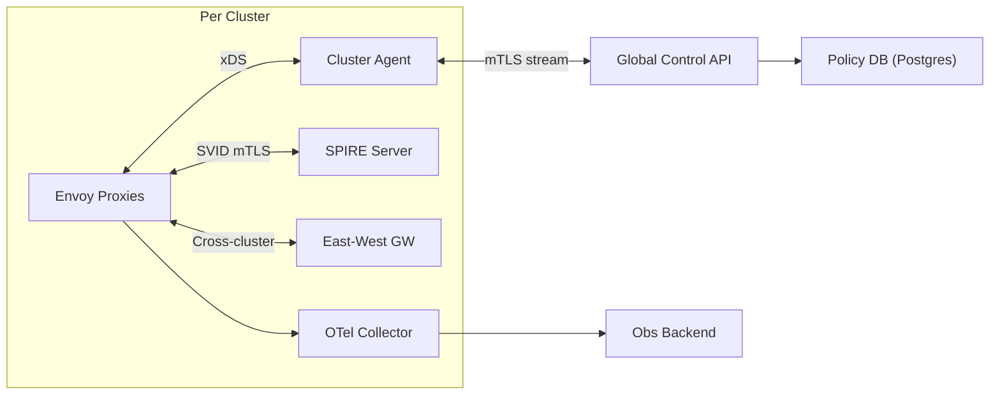

```markdown
---
title: "Multi-Cluster Service Mesh"
category: "Strategic Problems"
difficulty: "Hard"
tags: ["service-mesh", "mTLS", "hybrid-cloud", "control-plane", "envoy", "spiffe", "progressive-delivery", "observability"]
---

## Overview

This system is a **global control plane** that enforces **workload identity (mTLS)**, **traffic shifting**, and **mesh observability** across many Kubernetes clusters spanning on‑prem and public cloud. The elegant move is to **separate global intent from local actuation**: the global plane stores policy and desired state; each cluster runs a small **agent** that converts that intent into local mesh configuration and certificates. That keeps the data plane fast and local, while letting you manage the fleet centrally.

The key insight: in hybrid environments, the problem is not “how to do mTLS” or “how to do canary.” The real problem is **trust and convergence under partition**—clusters will be partially disconnected, clocks drift, firewalls block inbound control traffic, and you still need identity, policy, and rollouts to behave predictably. A pull-based, per-cluster agent model gives you safe failure behavior: if the global plane disappears, clusters keep routing and rotating certs; you lose central changes, not production traffic.

Use boring tech for everything except the genuinely hard bit (identity + trust distribution). Build the data plane on **Envoy** and standard APIs (**xDS**, **OpenTelemetry**). Build identity on **SPIFFE/SPIRE** with a CA hierarchy that supports rotation without fleet-wide outages.

## What Makes This Hard

Naive multi-cluster meshes fail in three predictable ways:

1. **They centralize the wrong things.** Central xDS for every proxy turns the control plane into a global latency and blast-radius amplifier. A bad deploy in one region becomes a global outage.
2. **They treat trust as a static root CA.** In reality you must rotate roots, bridge clouds, and survive partitions. “One root everywhere forever” becomes a time bomb.
3. **They mix “configuration distribution” with “policy meaning.”** Shipping raw proxy configs to clusters makes rollbacks and auditing impossible. You want a stable, high-level intent model and deterministic compilation to low-level configs.

The trap: teams spend months on feature breadth (L7 policies, retries, fancy dashboards) and still ship an unreliable system because identity and convergence weren’t designed for real-world partitions.

## Requirements

### Functional Requirements
- **Workload identity across clusters** using stable identities (not IPs, not node names) with automated cert issuance and rotation.
- **mTLS by default** with explicit, auditable exceptions (break-glass) and staged rollout support (per namespace/service).
- **Traffic shifting** (canary, blue/green, weighted routing) across *versions* and optionally across *clusters*, with bounded blast radius and rapid rollback.
- **Hybrid connectivity** where clusters have **outbound-only** access to the global control plane (no inbound firewall pinholes required).
- **Unified observability**: consistent service graph, golden signals, traces/metrics/logs correlation via standard propagation.
- **Policy auditability**: “who changed what, when, and what did it compile to” with reproducible rollbacks.

### Scale Targets
- **Clusters:** 50 initially, design to 200 (hybrid orgs sprawl quickly).
- **Services:** 2,000; **workloads:** 100k pods peak (drives cert issuance and xDS fanout).
- **Policy changes:** 500/day with bursts during incidents (must converge in minutes, not hours).
- **Cert lifetime:** 24h; **rotation:** every 12h (forces automation; limits blast radius of key compromise).
- **Control plane availability:** global plane 99.9% is fine because clusters degrade safely; per-cluster actuation must be 99.99%.

## Key Design Decisions

- **Choose:** Pull-based **per-cluster agent** that maintains a long-lived outbound mTLS stream to the global control plane and applies config locally.  
  **Reject:** Central xDS serving every proxy directly.  
  **Why:** Minimizes blast radius, works with one-way firewalls, keeps latency low, and lets clusters operate during global-plane outages.

- **Choose:** **SPIFFE/SPIRE** with an **intermediate CA per cluster** and a managed trust bundle distribution mechanism.  
  **Reject:** One static root CA shared by everything and manual cert provisioning.  
  **Why:** You get strong workload identity, automated rotation, and safe root rotation with overlap—without “all clusters must be online now” requirements.

- **Choose:** “Intent → compilation” model: store **high-level policy** (authz, routing, telemetry) and compile deterministically to Envoy xDS + cluster resources.  
  **Reject:** Treating Envoy config as the API.  
  **Why:** Enables audit, diff, rollback, and sane UX. Proxy configs are an implementation detail.

## Architecture



### Components

- **Global Control API**
  - Owns the *intent API*: service identity rules, authz policies, routing policies, telemetry standards.
  - Compiles intent into per-cluster “desired state” snapshots (versioned) and serves them to agents.
  - Issues signed “control plane artifacts” so clusters can verify provenance even if the network is hostile.

- **Policy DB (Postgres)**
  - Single source of truth for intent, history, and compiled artifact hashes.
  - Postgres is the right choice: strong consistency for policy, rich querying for audit, and simple operations.

- **Cluster Agent**
  - The actuator and safety boundary.
  - Maintains outbound mTLS to global API, pulls desired state, validates signatures, and applies changes locally.
  - Provides local caching and last-known-good rollback; if the stream dies, it freezes config rather than thrashing.

- **SPIRE Server (per cluster)**
  - Issues short-lived SVID certificates to workloads (via node/workload attestation).
  - Holds the cluster’s intermediate CA and participates in trust bundle updates (for cross-cluster validation).

- **Envoy Proxies (data plane)**
  - Enforces mTLS, routing, and telemetry uniformly.
  - Receives configuration via xDS from the cluster agent (or a local xDS service it manages).

- **East-West Gateway**
  - Terminates and originates cross-cluster traffic with mTLS and policy enforcement.
  - Reduces the number of trust edges: clusters trust gateways and identities, not random pod IPs.

- **OTel Collector (per cluster)**
  - Normalizes telemetry (sampling, enrichment, consistent resource attributes).
  - Buffers during WAN issues and exports to the central backend.

- **Observability Backend**
  - Central place for fleet-wide dashboards and traces; the control plane also uses it to detect rollout regressions.

## Deep Dive: Trust, Identity, and Rotation (The Hardest Part)

The hard problem is not minting certificates; it’s **rotating trust without breaking the fleet** while clusters are intermittently offline. The design uses a **CA hierarchy**:

- **Global Root CA** (rarely rotated; stored in HSM/KMS; used only to sign intermediates)
- **Per-Cluster Intermediate CA** (rotated on a schedule; used to sign workload SVIDs)
- **Workload SVIDs** (short-lived; rotated automatically)

Each workload gets a **SPIFFE ID** (e.g., `spiffe://mesh.example/ns/payments/sa/checkout`) derived from Kubernetes identity, not network location. Envoy uses SVIDs for mTLS and authenticates peers by SPIFFE ID, enabling policy like “payments/checkout can call inventory/read”.

**Trust distribution** is explicit and versioned: the global control plane publishes a **Trust Bundle** containing acceptable roots/intermediates for the mesh. The bundle supports **overlap windows** (old+new) so rotation is safe. The cluster agent pulls the bundle, verifies a control-plane signature, and updates local SPIRE/Envoy trust stores.

Rotation choreography that survives partitions:
1. Publish bundle vNext containing **old root + new root**, keep old active.
2. Roll new intermediates per cluster (clusters do this independently when online).
3. After a measured window (days), publish bundle dropping the old root.
4. Clusters that missed the window fail closed *only for cross-cluster calls*, not intra-cluster, because their intermediate and workload SVIDs remain valid locally. Operationally, this is acceptable and visible.

This is where most teams get caught: they rotate a root like it’s a config change. It’s not—it's a **distributed migration** with correctness requirements under partial connectivity. Versioned bundles + overlap windows + local autonomy make it predictable.

## Trade-offs

| Optimized For | Sacrificed |
|--------------|------------|
| Partition tolerance and small blast radius | Immediate global config convergence |
| Strong identity + safe rotation | Some operational complexity around CA lifecycle |
| Auditability via intent compilation | Lower-level tweak flexibility for proxy nerd knobs |
| Outbound-only connectivity model | Harder “push” workflows; everything becomes pull/stream |

## Failure Modes

- **Global control plane outage**
  - **What happens:** No new policy/routing changes propagate; existing traffic continues.
  - **Detect:** Agent stream disconnect alarms; control plane SLO burn alerts.
  - **Recover:** Restore API; agents resync from last acknowledged desired-state version; no proxy restarts required.

- **Trust bundle mismatch during rotation**
  - **What happens:** Cross-cluster mTLS handshakes fail between “old-trust” and “new-trust” clusters.
  - **Detect:** Spike in gateway mTLS failures segmented by SPIFFE trust domain / bundle version.
  - **Recover:** Reintroduce overlap bundle (old+new) immediately; then re-run rotation with longer windows and per-cluster readiness checks.

- **Bad routing policy (canary misfire)**
  - **What happens:** A canary receives too much traffic or violates SLOs.
  - **Detect:** Automated rollout guardrails trip from OTel metrics (latency/error budget) scoped to canary labels.
  - **Recover:** Agent applies last-known-good compiled artifact; traffic weights snap back without redeploying apps.

## What I'd Do Differently At...

- **10x scale:** Introduce regional control-plane frontends (same API, cached compiled artifacts) to reduce WAN dependency and speed up convergence; keep per-cluster actuation unchanged.
- **100x scale:** Split the intent model into isolated “tenants” (org/team) with strict quota and compilation isolation; move compilation to a dedicated build pipeline with artifact promotion (staging → prod) because “one global policy store” becomes an organizational bottleneck.

## Operational Notes

- Treat trust rotation as a **release train** with dashboards: bundle versions by cluster, intermediate age, SVID issuance rate, and cross-cluster handshake error rate.
- Require **deterministic compilation** and store compiled artifact digests in Postgres; on-call needs “diff intent → diff artifact → diff runtime” in minutes.
- Default to **fail-closed for authz**, but keep an audited, time-bounded break-glass policy path; incidents happen and you want controlled recovery, not ad-hoc kubectl edits.
- Keep the agent small and boring: it is the safety boundary. Complexity belongs in the compiler and policy model, not in per-node runtime logic.
```