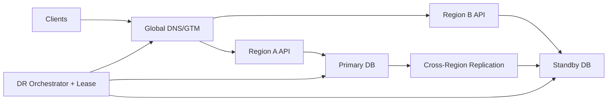

```markdown
---
title: "Multi-Region Disaster Recovery"
category: "Observability & Reliability"
difficulty: "Advanced"
tags: ["disaster-recovery", "multi-region", "failover", "dns", "rto", "rpo", "replication", "reliability"]
---

## Overview

This design defines an automated, multi-region disaster recovery (DR) strategy for a tier-1 service with clear, testable RTO/RPO targets, bounded replication lag, and push-button (or fully automatic) traffic cutover. The core idea is to keep the system *logically single-primary for writes* (to avoid split-brain and “two truths” recovery) while keeping the standby region *warm enough* that failover is operationally boring.

The elegant move is separating **data-plane failover** (clients go to the other region) from **authority-plane decisions** (who is allowed to be primary). Most DR failures aren’t because teams can’t spin up servers; they’re because they can’t prove which region is safe to accept writes. So we make “write authority” a fenced, auditable lease, and we only cut traffic after that lease is transferred.

## What Makes This Hard

Naive DR assumes “region down” is a crisp boolean. In reality, you get gray failures: partial network partitions, dependency outages, and brownouts where health checks flap. If you fail over aggressively you risk **split-brain writes**; if you fail over conservatively you miss RTO.

The second trap is thinking DNS cutover is instantaneous. DNS is probabilistic: TTLs are ignored, resolvers cache aggressively, and clients reuse long-lived connections. The design must tolerate a period where both regions receive traffic, without corrupting state, and must provide strong operator visibility into “how much traffic is still stuck.”

## Requirements

### Functional Requirements
- **Bounded data loss:** Explicit RPO with enforcement (not a wish); alerting when replication lag threatens it.
- **Automated, fenced promotion:** Standby becomes primary with a single source of truth for “who can accept writes.”
- **Deterministic cutover:** DNS/GTM automation plus safeguards for long-lived connections and cached resolvers.
- **Safe degraded modes:** Ability to serve reads (and ideally idempotent writes) during gray failures without creating divergence.
- **Auditability:** Every failover decision is logged with evidence (health signals, lag, lease transfer, operator identity).
- **Regular drills:** Game days are part of the system; DR that isn’t exercised is not real.

### Scale Targets
Concrete targets (tier-1, but buildable by a small team):
- **Traffic:** 50k RPS peak, 10k RPS sustained; requests are mostly stateless reads with some writes.
- **Writes:** 1k write tx/s peak; average tx commit latency target < 50ms in-region.
- **Data:** 10 TB primary dataset; 7-day point-in-time recovery retained.
- **RPO:** 30 seconds (measured as “committed on primary but not yet durable on standby”).
- **RTO:** 5 minutes for regional loss (time from detection to majority of traffic served from standby).
- **Replication lag SLO:** p99 lag < 5s in steady state; page at > 20s; block auto-failover if > 30s unless explicitly overridden.
Why these numbers matter: they force (1) async cross-region replication with disciplined lag management, (2) DNS cutover plus connection handling, and (3) an operator experience that can make a correct decision under time pressure.

## Key Design Decisions

- **What we chose:** **Active-passive (warm standby)** with **single-writer** semantics; standby serves reads (optional) but never accepts writes until promoted.
  - **What we rejected:** Active-active multi-writer with conflict resolution.
  - **Why:** Multi-writer systems are operationally expensive and fail in the exact moments DR is needed. Single-writer keeps recovery intellectually and operationally tractable.

- **What we chose:** **Fenced write authority** via a **distributed lease** (an external quorum) that gates “primary eligibility.”
  - **What we rejected:** “If region A unhealthy, region B promotes itself.”
  - **Why:** Health signals lie during partitions. A lease gives you a hard invariant: at most one region can be primary, even when the network is weird.

- **What we chose:** **DNS/GTM cutover automation with low TTL + health checks + staged weights**, backed by application-level safeguards.
  - **What we rejected:** Assuming TTL=30s means cutover completes in 30s.
  - **Why:** DNS is not a control plane. We treat it as a *hint* and build for overlap, retries, and sticky clients.

## Architecture



### Components

- `Global DNS/GTM`: Routes clients to the active region. Supports health-checked records and weighted/staged cutover.
- `Region A API` / `Region B API`: Stateless service tier with identical deploys and config. Must be safe under “both regions receive some traffic.”
- `Primary DB`: Single writer. Chosen as the *only* place where writes commit during normal operation.
- `Standby DB`: Warm replica continuously applying changes. Pre-provisioned capacity to take full traffic on promotion.
- `Cross-Region Replication`: Asynchronous physical/logical replication depending on datastore (boring choice: managed Postgres-compatible global replication if available).
- `DR Orchestrator + Lease`: Small control plane that (1) evaluates health/lag, (2) acquires/releases write-authority lease, (3) promotes standby, (4) triggers DNS/GTM changes, and (5) records an audit trail.

## Deep Dive: Fenced Failover Without Split-Brain

The hardest part is ensuring **only one region can accept writes**, even when the failure is a network partition rather than a clean outage. The mechanism is a **write-authority lease** stored in a quorum system that is *not co-resident with either region’s fate* (e.g., a 3-AZ quorum spanning a third “witness” footprint, or a managed strongly consistent store with cross-zone quorum). The API tier requires a valid lease token to enable write paths; without it, the region is read-only.

Failover sequence (automated, but operator-visible):
1. **Detect**: Region A health drops below threshold *and* client error rate breaches SLO *and* dependency health corroborates (to avoid single-signal flaps).
2. **Fence**: Orchestrator attempts to **revoke/expire Region A lease** (or waits for TTL expiry) and then **acquires lease for Region B**. If it cannot obtain the lease, it does *not* promote—this is your split-brain circuit breaker.
3. **Assess RPO**: Check standby replication lag. If lag > RPO budget, automatic failover stops and raises an explicit “you are choosing data loss” decision for an operator.
4. **Promote**: Promote standby DB to primary, reconfigure API in Region B as writer, and ensure Region A (if reachable) is forced read-only by lease failure (not by best-effort config pushes).
5. **Cut traffic**: Update DNS/GTM to shift traffic to Region B using staged weighting (e.g., 10% → 50% → 100%) while watching error rate, saturation, and tail latency.
6. **Drain stragglers**: Because some clients will keep talking to Region A, Region A must respond with a deterministic redirect/error that triggers retries toward Region B (e.g., HTTP 307 to a regional hostname, or a 503 with `Retry-After`), and must never accept writes without a lease.

Two subtle edge cases we handle explicitly:
- **Old primary comes back**: It still cannot write because it lacks the lease. It must either serve reads or refuse traffic until rejoined as standby.
- **Dual traffic during cutover**: Reads are fine; writes must be routed (or retried) to the lease-holding region. If clients can’t be taught, enforce at the server: “no lease, no write.”

## Trade-offs

| Optimized For | Sacrificed |
|--------------|------------|
| Predictable recovery under stress | Slightly higher steady-state cost (warm standby) |
| Simple correctness model (single writer) | Cross-region write latency (no active-active writes) |
| Fast, automated failover | Some DNS stickiness and overlap period complexity |

## Failure Modes

- **Gray failure triggers premature failover**
  - *What happens:* Health checks flap; orchestration tries to move traffic.
  - *Detect:* Divergence between internal SLOs and external probes; lease acquisition failures; rising “read-only” responses in both regions.
  - *Recover:* Require multi-signal quorum for failover; implement cooldown timers; ensure lease blocks split-brain even if traffic shifts.

- **Replication lag exceeds RPO**
  - *What happens:* Promoting standby loses recent commits.
  - *Detect:* Replication lag metric and “transactions behind” counters; paging thresholds tied to RPO budget.
  - *Recover:* Block automatic promotion when lag > RPO; provide an explicit “accept data loss” override with a measured loss estimate.

- **DNS cutover incomplete / sticky clients**
  - *What happens:* A slice of traffic keeps hitting the old region for minutes to hours.
  - *Detect:* Residual request volume and error rates in old region; regional hostname telemetry; resolver distribution metrics.
  - *Recover:* Keep old region serving read-only/redirect; shorten TTLs *ahead of time*; use staged weights and regional endpoints for critical clients.

## What I'd Do Differently At...

- **10x scale:** Move from DNS-only steering to a dedicated global traffic manager (or anycast/L7 global LB) to reduce cutover variance; add automated client retry libraries and regional endpoint discovery.
- **100x scale:** Revisit data architecture: either partition data by geography (reduce cross-region blast radius) or adopt a truly global strongly consistent datastore for the subset that must be multi-writer—accepting the cost/latency trade.

## Operational Notes

- Treat DR like a feature: run quarterly game days that include “gray failures,” not just hard region kills.
- Page on *RPO risk*, not just outages: replication lag is a tier-1 signal.
- Make the lease visible: dashboards should show “current writer,” lease TTL remaining, and last successful renewal.
- Pre-provision standby capacity and run shadow load tests; cold capacity is a hidden RTO killer.
- Document “failback” separately: it’s harder than failover. Default to staying in the new primary until you can re-seed the old region as a clean standby.
```