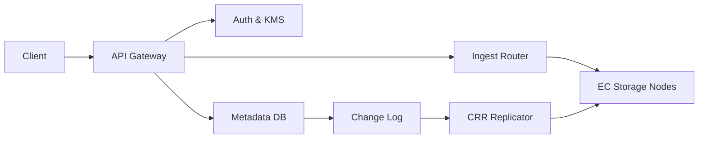

```markdown
---
title: "Multi-Tenant Object Storage"
category: "Storage & Data Platforms"
difficulty: "Hard"
tags: ["object-storage", "s3", "multi-tenant", "erasure-coding", "replication", "metadata"]
---

## Overview

This system is an S3-compatible object storage service for many tenants, supporting versioning, lifecycle rules, erasure coding (EC), and cross-region replication (CRR). The elegant idea is to treat object *data* as immutable chunks (content-addressed) and make *metadata* the source of truth: every user-visible operation is a metadata transition, while the data plane is an idempotent blob store optimized for durability and repair.

Naive designs fail by coupling metadata and data too tightly (creating distributed transactions everywhere) or by letting background jobs (lifecycle/replication/repair) mutate state in ad-hoc ways. This design instead centralizes correctness in a small, transactional metadata model plus a single ordered change log per bucket, making versioning, lifecycle, and replication all “just consumers of the same truth”.

## What Makes This Hard

The trap is **correctness under concurrency**: versioning + deletes + lifecycle + replication creates a state machine where racing writers and background workers can easily produce the wrong “latest” version, leak storage, or replicate a state that never existed atomically. The second trap is **durability without per-request coordination**: erasure coding wants wide fanout and repairs; S3 wants predictable PUT/GET semantics; multi-tenancy wants strong isolation—all while keeping the core hot path simple.

## Requirements

### Functional Requirements
- S3-compatible API surface: `PUT/GET/HEAD`, multipart upload, range reads, conditional requests, presigned URLs, bucket policies.
- Versioning: immutable versions, delete markers, restore of previous versions by removing markers.
- Lifecycle: time/tag-based transitions and expirations, applied deterministically with versioning semantics.
- Erasure coding: configurable EC profiles per storage class (e.g., `8+3`, `10+4`) with background repair.
- Cross-region replication: one-way replication policy per bucket, preserving version IDs and delete markers.
- Multi-tenancy: per-tenant isolation for auth, quotas, encryption keys, and noisy-neighbor control.

### Scale Targets
- Tenants: 10k, buckets: 200k, objects: 50B, stored data: 5 PB/region.
- Traffic: 30k req/s sustained, 200k req/s peak (LIST-heavy spikes and PUT bursts matter).
- Object size distribution: median 1–4 MB, long tail to multi-GB (drives multipart + EC stripe sizing).
- Durability: 11x9s for committed objects within a region; RPO < 15 min for replicated buckets; RTO < 1 hr for a region failover of read-only replicas.

## Key Design Decisions

- **Decision 1: Metadata is strongly consistent; data is immutable and idempotent**
  - Chose: transactional metadata store with per-bucket ordered change log; data chunks keyed by content hash.
  - Rejected: “metadata in Redis + data in blobs” eventual consistency for everything.
  - Why: versioning/lifecycle/CRR correctness is a metadata problem; immutability makes retries, repairs, and replication simple.

- **Decision 2: Single-writer buckets (home region)**
  - Chose: each bucket has a home region for all writes; other regions are read-only replicas via CRR.
  - Rejected: multi-region active-active writes to the same bucket namespace.
  - Why: active-active turns “S3-compatible” into “distributed database semantics”; single-writer preserves simple ordering, predictable version IDs, and straightforward disaster recovery.

- **Decision 3: Erasure coding at the storage-node layer with background repair**
  - Chose: EC stripes across nodes in a region; reads can be satisfied from any `k` shards; repair rebuilds missing shards lazily.
  - Rejected: EC at the application layer per request (high coordination) or pure 3x replication everywhere (cost).
  - Why: EC gives large cost savings at PB scale while keeping the API layer stateless and fast.

## Architecture



### Components

- **API Gateway**: Terminates TLS, enforces S3 auth (SigV4), applies per-tenant rate limits, routes to the correct bucket home region.
- **Auth & KMS**: Issues/validates credentials, enforces bucket policy, provides envelope encryption keys per tenant/bucket (SSE).
- **Metadata DB**: Source of truth for buckets, versions, multipart sessions, lifecycle rules, replication config, and object pointers to chunk manifests.
- **Ingest Router**: Stateless service that chunks/streams uploads into EC stripes, writes shards to storage nodes, and returns ETags once committed.
- **EC Storage Nodes**: Store shards on local disks, expose simple put/get by chunk ID + shard index, run repair and scrubbing.
- **Change Log**: Per-bucket ordered stream of committed metadata events (PUT version, delete marker, lifecycle transition, restore).
- **CRR Replicator**: Consumes change log, ensures destination region has required chunks and applies the same metadata transitions idempotently.

## Deep Dive: Atomic Versioning + Lifecycle + Replication

The hardest part is guaranteeing that every observer (GET, LIST, lifecycle worker, replicator) sees a coherent sequence of versions without distributed transactions across storage nodes and regions.

**1) A bucket is an ordered history, not a mutable record.**  
Model each bucket as an append-only sequence of *version events*. A `PUT` creates a new version row with a monotonically increasing `seq` (bucket-local) and a stable `version_id`. A `DELETE` in a versioned bucket appends a delete-marker version; it never erases history. This makes “latest” a deterministic function: highest `seq` that is not a filtered-out marker for the specific API call.

**2) Commit protocol avoids data/metadata split-brain.**  
Uploads write data first, metadata second, but metadata only points to data once it is durable:
- Client uploads (single PUT or multipart parts) to the ingest router.
- Router writes shards for each chunk to storage nodes with a temporary `upload_id` namespace.
- Router builds a manifest: list of `(chunk_hash, ec_profile, shard_locations, length, checksum)`.
- Router commits metadata in one DB transaction:
  - insert new version event referencing the manifest
  - mark previous “current pointer” (for fast HEAD/GET) to this `version_id`
  - append a change-log record with the same `seq`
- After commit, router finalizes storage: shards are re-keyed/linked from `upload_id` to `chunk_hash` (or simply marked “referenced” in node-local metadata). Any shards that never reach “referenced” are garbage-collected by age.

This yields a clean invariant: **if metadata references a manifest, required shards exist or are repairable**. Anything uploaded but not committed is reclaimable.

**3) Lifecycle and replication are consumers of the same ordered truth.**  
Lifecycle workers do not “scan and delete”; they *read the bucket stream* and schedule deterministic actions:
- Compute due actions from object timestamps/tags stored in metadata.
- When an action triggers, write a new version event (e.g., transition to a different storage class, or append an expiration delete-marker). It goes through the same commit path and produces a log event.
- Because lifecycle emits version events, CRR automatically replicates lifecycle outcomes in order, matching S3 expectations (including delete markers).

**4) Idempotency by construction.**  
Every event has `(bucket_id, seq)` and a stable `version_id`. Replication applies events exactly-once *effectively* by checking “already applied” in the destination metadata DB. Data chunk replication is keyed by `chunk_hash`, so re-sending is harmless.

## Trade-offs

| Optimized For | Sacrificed |
|--------------|------------|
| Correct versioning semantics | Active-active writes per bucket |
| Cheap PB-scale storage (EC) | Higher tail latency on degraded reads |
| Operational simplicity via immutability | More background work (repair/GC) |
| Deterministic lifecycle/CRR | Slightly slower LIST consistency model |

## Failure Modes

- **Partial upload storms (clients disconnect mid-stream)**
  - What happens: storage nodes accumulate uncommitted shards.
  - Detect: rising “staged bytes” and aged `upload_id` namespaces.
  - Recover: time-based GC for unreferenced shards; metadata TTL for stale multipart sessions.

- **Storage node loss during reads**
  - What happens: some shards unavailable; GET needs reconstruction.
  - Detect: shard fetch errors, increased “reconstruct reads” rate, EC repair backlog.
  - Recover: serve from any `k` shards; enqueue repair to rebuild missing shards onto healthy nodes; throttle repair to protect foreground latency.

- **Replication lag or destination region outage**
  - What happens: destination is stale; RPO increases.
  - Detect: consumer lag per bucket, age of last applied `seq`.
  - Recover: resume from last applied `seq`; chunk backfill driven by manifests; apply metadata events idempotently until caught up.

## What I'd Do Differently At...

- **10x scale:** shard the metadata DB by `bucket_id` more aggressively (range/tenant partitions), push LIST acceleration into a dedicated prefix index, and add per-tenant admission control tied to IO cost (bytes + EC fanout), not request count.
- **100x scale:** move metadata to a purpose-built, globally distributed transactional KV for massive keyspace and high write concurrency, and split LIST into an index service with bounded staleness guarantees (because LIST becomes the dominant metadata cost).

## Operational Notes

- EC profile tuning is a product decision: pick 1–2 profiles and enforce them; too many classes explode repair complexity.
- Run continuous scrubbing: shard checksums + manifest verification; treat silent corruption as the real enemy.
- Multi-tenant isolation needs cost-aware rate limits: a 5 GB multipart PUT is not “one request”.
- Watch three backlogs like a hawk: EC repair queue, lifecycle due-actions queue, and CRR consumer lag; they are the early warning system for durability and RPO drift.
```